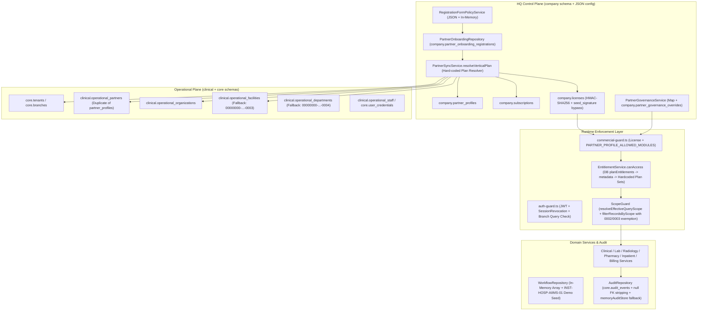

# DOC SEARCH — MASTER DEVELOPMENT BLUEPRINT ARCHITECTURE AUDIT (`STEP 2`)

**Audit Type**: `STRICT READ-ONLY ARCHITECTURE AUDIT`  
**Audit Date**: `2026-09-25`  
**Target Control Chain**: `HQ → Partner → Industry → Operating Model → Plan → Subscription → License → Entitlement → Capability → Department → Role → Permission → Feature → Workflow → Transaction → Audit`  
**Audit Mode**: `READ-ONLY` (`0` source modifications, `0` database/schema mutations, `0` configuration/route edits)

---

# 1. Executive Summary

This Step 2 Read-Only Architecture Audit evaluates the entire **DOC SEARCH** codebase against the 16-layer canonical control chain:

```text
HQ → Partner → Industry → Operating Model → Plan → Subscription → License → Entitlement → Capability → Department → Role → Permission → Feature → Workflow → Transaction → Audit
```

### Core Architectural Findings
1. **Implemented & Functional Layers (`IMPLEMENTED` / `PARTIALLY IMPLEMENTED`)**:
   - **Multi-Tenant RLS & Session Auth**: `core.tenants`, `core.users`, `withSecurityContext` PostgreSQL RLS ([`engine-rls.ts`](file:///c:/Users/alamr/OneDrive/Desktop/DOC%20SEARCH/packages/database/src/security/engine-rls.ts)), JWT validation + session revocation ([`auth-guard.ts`](file:///c:/Users/alamr/OneDrive/Desktop/DOC%20SEARCH/apps/api-gateway/src/plugins/auth-guard.ts)), and RBAC (`resource:action` via [`rbac-evaluator.ts`](file:///c:/Users/alamr/OneDrive/Desktop/DOC%20SEARCH/packages/auth/src/rbac-evaluator.ts)) are implemented and active.
   - **Commercial Subscription & License Engine**: `company.products`, `company.plans`, `company.subscriptions`, and `company.licenses` ([`packages/database/src/schema/company/index.ts`](file:///c:/Users/alamr/OneDrive/Desktop/DOC%20SEARCH/packages/database/src/schema/company/index.ts)) are backed by PostgreSQL, with temporal expiry, grace period, and HMAC-SHA256 verification ([`LicenseService.ts`](file:///c:/Users/alamr/OneDrive/Desktop/DOC%20SEARCH/apps/api-gateway/src/services/company/LicenseService.ts)).
   - **Core Clinical & Retail Pharmacy Verticals**: OPD (`ClinicalWorkflowService`), LIMS (`LabDiagnosticsService`), Radiology (`RadiologyService`), Retail Pharmacy (`PharmacyManagementService`), Inpatient (`InpatientManagementService`), and Billing (`BillingManagementService`) persist real PostgreSQL transactions.
2. **Critical Structural, Duplication & Security Gaps (`WRONG ARCHITECTURE` / `DUPLICATE` / `SECURITY RISK` / `DEPENDENCY BLOCKER`)**:
   - **Duplicate Plan Resolution Authority Corrupts `PHARMACY_WHOLESALE` Sync (`P0` / `DUPLICATE`)**: [`RegistrationFormPolicyService.ts`](file:///c:/Users/alamr/OneDrive/Desktop/DOC%20SEARCH/apps/api-gateway/src/services/core/RegistrationFormPolicyService.ts#L55-L62) and [`EntitlementService.ts`](file:///c:/Users/alamr/OneDrive/Desktop/DOC%20SEARCH/apps/api-gateway/src/services/company/EntitlementService.ts#L305-L320) recognize `PHARMACY_WHOLESALE` (`plan-pharma-wholesale-free-yr1`), but [`PartnerSyncService.resolveVerticalPlan()`](file:///c:/Users/alamr/OneDrive/Desktop/DOC%20SEARCH/apps/api-gateway/src/services/company/PartnerSyncService.ts#L27-L165) contains a duplicate hard-coded plan resolver that omits `PHARMACY_WHOLESALE` and `plan-pharma-wholesale-*`, silently falling back to `DEFAULT_PLAN_STARTER_ID` (`plan-clinic-free-yr1`, `prod-clinic`) at line 159 when syncing approved Wholesale Pharmacy partners into `company.subscriptions` and `company.licenses`.
   - **Dual-Schema Partner/Topology Split & Synthetic Placeholder UUID Fallbacks (`P0` / `WRONG ARCHITECTURE`)**: Partner identity is split between `company.partner_profiles` and `clinical.operational_partners` / `clinical.operational_organizations` / `clinical.operational_facilities`, bridged by duplicated repository helpers (`resolvePartnerAndOrg`, `resolveBranchId`, `resolveDepartmentId`, `resolveDoctorId`) in [`PharmacyManagementRepository.ts`](file:///c:/Users/alamr/OneDrive/Desktop/DOC%20SEARCH/apps/api-gateway/src/repositories/partner/PharmacyManagementRepository.ts#L45-L150), [`ClinicalWorkflowRepository.ts`](file:///c:/Users/alamr/OneDrive/Desktop/DOC%20SEARCH/apps/api-gateway/src/repositories/partner/ClinicalWorkflowRepository.ts#L55-L150), and [`LabDiagnosticsRepository.ts`](file:///c:/Users/alamr/OneDrive/Desktop/DOC%20SEARCH/apps/api-gateway/src/repositories/partner/LabDiagnosticsRepository.ts#L40-L128) that silently substitute synthetic UUIDs (`00000000-0000-4000-8000-000000000001`, `00000000-0000-4000-8000-000000000003`, `99999999-9999-4999-8999-999999999999`).
   - **Missing First-Class `Operating Model` Layer (`P1` / `MISSING`)**: There is no `operating_model` schema column or master table separating `Industry` (`PHARMACY`, `PATHOLOGY`, `HOSPITAL`) from `Operating Model` (`RETAIL_B2C`, `WHOLESALE_B2B`, `COLLECTION_SPOKE`, `REFERENCE_HUB`, `SINGLE_DOCTOR`, `POLYCLINIC`).
   - **Disconnected In-Memory `WorkflowRepository` & Demo Seed (`P0` / `MOCK/FALLBACK`)**: Relational workflow tables (`workflow_definitions`, `workflow_instances` in [`workflow-schema.ts`](file:///c:/Users/alamr/OneDrive/Desktop/DOC%20SEARCH/packages/database/src/schema/workflow-schema.ts#L3-L131)) are unused at runtime; [`WorkflowRepository`](file:///c:/Users/alamr/OneDrive/Desktop/DOC%20SEARCH/packages/database/src/repositories/workflow-repository.ts#L37-L92) uses an in-memory array pre-seeded with `INST-HOSP-AIIMS-01` (`AIIMS Super Speciality Hospital Delhi`), while domain services mutate status strings ad-hoc.
   - **Residual `POST-REM-CAP-02` & `POST-REM-CAP-03` Security Gaps (`P1` / `SECURITY RISK`)**: ID-based mutation endpoints in `LabDiagnosticsService` (`collectSpecimen`, `enterResult`, `verifyResult`, `cancelOrder`) and `RadiologyService` (`updateOrderStatus`, `scheduleAppointment`) do not call `ScopeGuard.assertRecordInScope`, `ScopeGuard` exempts `00000000-0000-4000-8000-000000000002/0003` (`isDefaultSeededFacility`), and `EntitlementService.canAccess` skips `isModuleAllowedForPartnerProfile` when DB `company.plan_entitlements` rows return a match (`L195`).

---

# 2. Audit Scope

This audit inspected all 8 monorepo workspaces and packages in read-only mode:
- **Packages**:
  - `packages/database`: `src/schema/core/*`, `src/schema/company/*`, `src/schema/clinical/*`, `src/schema/workflow-schema.ts`, `src/repositories/workflow-repository.ts`, `src/security/engine-rls.ts`, 60 SQL migrations.
  - `packages/auth`: `src/types.ts`, `src/session-context.ts`, `src/rbac-evaluator.ts`, `src/scope-guard.ts`, `src/token-service.ts`.
  - `packages/shared-core`: `src/workflow/facility-normalizer.ts`, `src/errors/*`.
  - `packages/api-contracts`: DTOs, role definitions, workflow contracts.
- **Backend (`apps/api-gateway`)**:
  - `src/plugins/auth-guard.ts`, `src/plugins/commercial-guard.ts`, `src/plugins/idempotency.ts`.
  - `src/services/company/*` (`EntitlementService.ts`, `LicenseService.ts`, `SubscriptionService.ts`, `PartnerSyncService.ts`, `PartnerGovernanceService.ts`).
  - `src/services/partner/*` (`ClinicalWorkflowService.ts`, `LabDiagnosticsService.ts`, `RadiologyService.ts`, `PharmacyManagementService.ts`, `InpatientManagementService.ts`, `BillingManagementService.ts`, `WholesaleInvoiceIngestionService.ts`, `StaffAdministrationService.ts`, `PartnerAccountService.ts`).
  - `src/repositories/company/*`, `src/repositories/partner/*`, `src/repositories/core/AuditRepository.ts`.
- **Frontend (`apps/partner-platform`, `apps/company-platform`, `apps/landing-page`)**:
  - `PartnerPlatformShell.tsx`, `partnerRolePermissions.ts`, `patient-session-tab-service.ts`, `pharmacy-offline-storage-service.ts`, `api-client.ts`, `PartnerVerificationConsole.tsx`, `FullPageRegistrationView.tsx`.

---

# 3. Repository / Architecture Inventory

| Monorepo Package / App | Primary Architectural Responsibility | Key Files Inspected |
| :--- | :--- | :--- |
| `packages/database` | Drizzle ORM schemas (`core`, `company`, `clinical`, `public`), RLS engine, seeds | `schema/company/index.ts`, `schema/clinical/index.ts`, `schema/core/index.ts`, `schema/workflow-schema.ts` |
| `packages/auth` | Session context builder, JWT verification, `RBACEvaluator`, `ScopeGuard` | `rbac-evaluator.ts`, `scope-guard.ts`, `session-context.ts` |
| `packages/shared-core` | Facility profile normalization, `PARTNER_PROFILE_ALLOWED_MODULES`, logging/errors | `workflow/facility-normalizer.ts` |
| `apps/api-gateway` | Fastify HTTP gateway, commercial/auth guards, HQ & Partner domain services/repositories | `EntitlementService.ts`, `LicenseService.ts`, `PartnerSyncService.ts`, `commercial-guard.ts` |
| `apps/partner-platform` | Partner HIS/EMR/LIMS/RIS/POS web application | `PartnerPlatformShell.tsx`, `partnerRolePermissions.ts`, `api-client.ts` |
| `apps/company-platform` | HQ Control Plane, Partner KYC/KYB Verification Queue, License & Governance Console | `PartnerVerificationConsole.tsx`, `PartnerGovernanceDrawer.tsx` |
| `apps/landing-page` | Public Partner Self-Registration & Plan Selection | `FullPageRegistrationView.tsx` |

---

# 4. Current Architecture Map



---

# 5. Proposed Architecture Map

```mermaid
flowchart TD
    HQ["1. HQ Control Plane (Single Authority)"]
    PARTNER["2. Partner (company.partner_profiles — Single Canonical Entity)"]
    INDUSTRY["3. Industry Master (DB-Driven Vertical Taxonomy)"]
    OP_MODEL["4. Operating Model (RETAIL_B2C | WHOLESALE_B2B | HUB_SPOKE | MULTI_BRANCH)"]
    PLAN["5. Plan Master (company.plans + company.plan_entitlements)"]
    SUB["6. Subscription (company.subscriptions — Temporal Contract)"]
    LIC["7. License (company.licenses — Strict HMAC-SHA256, Zero Seed Bypass)"]
    ENT["8. Entitlement (Plan ∩ License ∩ Industry ∩ Operating Model ∩ HQ Override)"]
    CAP["9. Capability (Domain Capability Registry)"]
    DEPT["10. Department (clinical.operational_departments — Provisioned from Operating Model)"]
    ROLE["11. Role (Industry × Department Scoped Roles)"]
    PERM["12. Permission (RBAC resource:action + ABAC Care-Team/ScopeGuard/Break-Glass)"]
    FEAT["13. Feature (UI + Backend Route Feature Gate)"]
    WF["14. Workflow (PostgreSQL WorkflowStateMachineService + SLA/Handoff)"]
    TX["15. Transaction (ACID DB Transaction + Idempotency + Transactional Outbox)"]
    AUD["16. Audit (Fail-Closed Hash-Chained core.audit_events inside tx)"]

    HQ --> PARTNER --> INDUSTRY --> OP_MODEL --> PLAN --> SUB --> LIC --> ENT --> CAP --> DEPT --> ROLE --> PERM --> FEAT --> WF --> TX --> AUD
```



---

# 6. Current vs Proposed Comparison

| Control Chain Link | Proposed Target Architecture | Current Implementation Reality | Architectural Alignment |
| :--- | :--- | :--- | :--- |
| **`HQ → Partner`** | Single canonical Partner table governed by HQ | Split across `company.partner_onboarding_registrations`, `company.partner_profiles`, `core.tenants`, and `clinical.operational_partners` | **`DUPLICATE` / `PARTIALLY IMPLEMENTED`** |
| **`Partner → Industry`** | Authoritative Industry foreign key / enum | Stored as strings across `partner_profiles.partnerType`, `tenants.type`, `operational_partners.partnerType`, and `metadata.facilityType` | **`DUPLICATE`** |
| **`Industry → Operating Model`** | Explicit `operating_model` governing B2B vs B2C, single vs chain | **Missing**: Inferred indirectly from plan ID (`plan-pharma-wholesale-*`) or `metadata.registrationSubCategory` | **`MISSING`** |
| **`Operating Model → Plan`** | DB-driven plan catalog filtered by `Industry × OperatingModel` | `RegistrationFormPolicyService` (`DEFAULT_PUBLIC_PLANS`), `PartnerSyncService.resolveVerticalPlan`, and `EntitlementService` maintain 3 separate hard-coded plan lists | **`HARD-CODED` / `DUPLICATE`** |
| **`Plan → Subscription → License`** | 1:1 deterministic Plan → Subscription → HMAC License | Implemented in `SubscriptionService` & `LicenseService`, but `PartnerSyncService` corrupts `PHARMACY_WHOLESALE` plan IDs to `plan-clinic-free-yr1` (`DEFAULT_PLAN_STARTER_ID`) | **`WRONG ARCHITECTURE` (`P0` Bug in Sync)** |
| **`License → Entitlement → Capability`** | Unified DB-backed intersection (`Plan ∩ License ∩ Profile`) | `EntitlementService.canAccess` skips `isModuleAllowedForPartnerProfile` when DB `plan_entitlements` rows match (`L195`) | **`PARTIALLY IMPLEMENTED` / `SECURITY RISK`** |
| **`Capability → Department → Role → Permission`** | Dynamic department & role provisioning per Operating Model | Hard-coded in `StaffAdministrationService.ts` (`PROFILE_ALLOWED_ROLES_MAP`), `facility-normalizer.ts`, and `partnerRolePermissions.ts` | **`HARD-CODED` / `DUPLICATE`** |
| **`Feature → Workflow → Transaction → Audit`** | Persistent state machine + fail-closed transactional audit | `WorkflowRepository` is in-memory (`INST-HOSP-AIIMS-01`); domain services mutate status strings directly; `AuditRepository` falls back to RAM | **`WRONG ARCHITECTURE` / `MOCK/FALLBACK`** |

---

# 7. Master Development Blueprint Gap Matrix (Matrices 1 & 2)

## Matrix 1 — Master Development Blueprint Gap Matrix (Section 27)

| Layer | Current Implementation | Evidence | Status | Architecture Gap | Security Risk | Dependency | Required Future State |
| :--- | :--- | :--- | :--- | :--- | :--- | :--- | :--- |
| **1. HQ** | `PartnerGovernanceService.ts`, `PartnerOnboardingRepository.ts`, `company.*` routes | [`PartnerGovernanceService.ts:1-150`](file:///c:/Users/alamr/OneDrive/Desktop/DOC%20SEARCH/apps/api-gateway/src/services/company/PartnerGovernanceService.ts#L1-L150) | `PARTIALLY IMPLEMENTED` | HQ governance overrides cached in RAM `Map` + DB; `DEFAULT_CORE_MODULES` hard-coded (`L80-93`) | Medium: `COMMUNICATION_FREEZE` not enforced on WhatsApp/ABDM routes | None (Root Layer) | Single DB-backed HQ policy engine enforcing all 3 kill-switches globally |
| **2. Partner** | Split across `company.partner_profiles`, `core.tenants`, `clinical.operational_partners` | [`company/index.ts:34-66`](file:///c:/Users/alamr/OneDrive/Desktop/DOC%20SEARCH/packages/database/src/schema/company/index.ts#L34-L66), [`clinical/index.ts:42-67`](file:///c:/Users/alamr/OneDrive/Desktop/DOC%20SEARCH/packages/database/src/schema/clinical/index.ts#L42-L67) | `DUPLICATE` | Dual-schema duplication bridged by `PartnerSyncService` and `00000000-...-0001` fallback UUIDs | High: Unsynced partners fall back to shared synthetic UUID `00000000-0000-4000-8000-000000000001` | Layer 1 (HQ) | Atomic onboarding topology provisioning; zero fallback UUIDs |
| **3. Industry** | Normalizer constants in `facility-normalizer.ts` & `RegistrationFormPolicyService.ts` | [`facility-normalizer.ts:40-150`](file:///c:/Users/alamr/OneDrive/Desktop/DOC%20SEARCH/packages/shared-core/src/workflow/facility-normalizer.ts#L40-L150) | `HARD-CODED` | No database `industry_master` table; industry strings duplicated across 4 files | Low (`CAP-03` fails closed to `RESTRICTED`) | Layer 2 (Partner) | Canonical `industry_master` DB table & single enum source |
| **4. Operating Model** | Inferred via `plan-pharma-wholesale-*` or `metadata.registrationSubCategory` | [`EntitlementService.ts:160-175`](file:///c:/Users/alamr/OneDrive/Desktop/DOC%20SEARCH/apps/api-gateway/src/services/company/EntitlementService.ts#L160-L175) | `MISSING` | No `operating_model` column on `partner_profiles` or `operational_partners` | Medium: Retail vs Wholesale vs Hub-Spoke relies on plan slug heuristics | Layer 3 (Industry) | Explicit `operating_model` column & validation matrix |
| **5. Plan** | `company.plans` table + 3 conflicting hard-coded plan lists in TS services | [`PartnerSyncService.ts:27-165`](file:///c:/Users/alamr/OneDrive/Desktop/DOC%20SEARCH/apps/api-gateway/src/services/company/PartnerSyncService.ts#L27-L165), [`EntitlementService.ts:292-360`](file:///c:/Users/alamr/OneDrive/Desktop/DOC%20SEARCH/apps/api-gateway/src/services/company/EntitlementService.ts#L292-L360) | `WRONG ARCHITECTURE` | `PartnerSyncService.resolveVerticalPlan` omits `PHARMACY_WHOLESALE` & overwrites plan to `plan-clinic-free-yr1` | High (`P0`): Wholesale partners receive Clinic starter plan on DB sync | Layer 4 (Operating Model) | Single DB-driven `company.plans` + `company.plan_entitlements` authority |
| **6. Subscription** | `company.subscriptions` + `SubscriptionService.ts` + `clinical.operational_subscriptions` | [`SubscriptionService.ts:47-120`](file:///c:/Users/alamr/OneDrive/Desktop/DOC%20SEARCH/apps/api-gateway/src/services/company/SubscriptionService.ts#L47-L120) | `IMPLEMENTED` | `clinical.operational_subscriptions` is an unused duplicate table of `company.subscriptions` | Low | Layer 5 (Plan) | Deprecate `clinical.operational_subscriptions`; use `company.subscriptions` exclusively |
| **7. License** | `company.licenses` + `LicenseService.ts` (HMAC-SHA256, expiry, grace period) | [`LicenseService.ts:88-150`](file:///c:/Users/alamr/OneDrive/Desktop/DOC%20SEARCH/apps/api-gateway/src/services/company/LicenseService.ts#L88-L150) | `SECURITY RISK` | `verifyLicenseSignature` (`L101-107`) accepts `'seed_signature*'` and `'SIG-PROD-2026-*'` in production | High (`P0`): Static signature prefix bypasses HMAC verification | Layer 6 (Subscription) | Remove seed signature bypass outside `NODE_ENV === 'test'` |
| **8. Entitlement** | `EntitlementService.canAccess` + `commercial-guard.ts` | [`EntitlementService.ts:59-360`](file:///c:/Users/alamr/OneDrive/Desktop/DOC%20SEARCH/apps/api-gateway/src/services/company/EntitlementService.ts#L59-L360) | `PARTIALLY IMPLEMENTED` | DB `plan_entitlements` match (`L195`) returns `true` before checking `isModuleAllowedForPartnerProfile` (`L225`) | High (`P1` `POST-REM-CAP-03`): DB entitlement row can bypass partner profile boundary | Layer 7 (License) | Enforce `isModuleAllowedForPartnerProfile` at top of `canAccess` (`< L155`) |
| **9. Capability** | Conflated with Module/Feature codes (`PHARMACY_POS`, `PATHOLOGY_LIMS`, `CLINICAL_EMR`) | [`facility-normalizer.ts:352-545`](file:///c:/Users/alamr/OneDrive/Desktop/DOC%20SEARCH/packages/shared-core/src/workflow/facility-normalizer.ts#L352-L545) | `PARTIALLY IMPLEMENTED` | AI has `capabilityRegistry` (`ai/capability-registry.ts`), but non-AI business capabilities are conflated with UI/API module codes | Low | Layer 8 (Entitlement) | Formalize `BusinessCapabilityRegistry` mapping `Capability → Modules/Features` |
| **10. Department** | `clinical.operational_departments` + repository fallback `resolveDepartmentId` | [`ClinicalWorkflowRepository.ts:113-150`](file:///c:/Users/alamr/OneDrive/Desktop/DOC%20SEARCH/apps/api-gateway/src/repositories/partner/ClinicalWorkflowRepository.ts#L113-L150) | `PARTIALLY IMPLEMENTED` | Repositories auto-create or fall back to `00000000-0000-4000-8000-000000000004` on the fly instead of onboarding provisioning | Medium: Inconsistent department IDs across services | Layer 9 (Capability) | Provision standard departments per `Industry × OperatingModel` at onboarding |
| **11. Role** | `core.roles`, `StaffAdministrationService.ts` (`PROFILE_ALLOWED_ROLES_MAP`) | [`StaffAdministrationService.ts:29-120`](file:///c:/Users/alamr/OneDrive/Desktop/DOC%20SEARCH/apps/api-gateway/src/services/partner/StaffAdministrationService.ts#L29-L120) | `HARD-CODED` | `PROFILE_ALLOWED_ROLES_MAP` & `ROLE_REQUIRED_MODULE_MAP` hard-coded; `PHARMACY_WHOLESALE` omitted from `ROLE_REQUIRED_MODULE_MAP` | Low (`CAP-02` & `CAP-06` verified working) | Layer 10 (Department) | Add `PHARMACY_WHOLESALE` roles to `ROLE_REQUIRED_MODULE_MAP` & move to DB templates |
| **12. Permission** | `RBACEvaluator` (`rbac-evaluator.ts`) + `ScopeGuard` (`scope-guard.ts`) | [`rbac-evaluator.ts:29-135`](file:///c:/Users/alamr/OneDrive/Desktop/DOC%20SEARCH/packages/auth/src/rbac-evaluator.ts#L29-L135), [`scope-guard.ts:75-228`](file:///c:/Users/alamr/OneDrive/Desktop/DOC%20SEARCH/packages/auth/src/scope-guard.ts#L75-L228) | `PARTIALLY IMPLEMENTED` | Missing `assertRecordInScope` on ID-based mutations in Lab/Radiology (`POST-REM-CAP-02`); `isDefaultSeededFacility` (`0002/0003`) bypass in `ScopeGuard`; partial Care-Team ABAC | High (`P1` `POST-REM-CAP-02`): Cross-branch ID-based mutation possible when `branchId` omitted | Layer 11 (Role) | Enforce `assertRecordInScope` on all mutations; remove `0002/0003` bypass; add Care-Team ABAC |
| **13. Feature** | `company.features` table + `requireFeatureEntitlement` + `PartnerPlatformShell.tsx` | [`commercial-guard.ts:177-184`](file:///c:/Users/alamr/OneDrive/Desktop/DOC%20SEARCH/apps/api-gateway/src/plugins/commercial-guard.ts#L177-L184) | `PARTIALLY IMPLEMENTED` | `requireFeatureEntitlement` does not invoke `enforcePartnerProfileModuleBoundary` | Medium (`POST-REM-CAP-03`) | Layer 12 (Permission) | Call `enforcePartnerProfileModuleBoundary` inside `requireFeatureEntitlement` |
| **14. Workflow** | `workflow-schema.ts` (Postgres) vs `WorkflowRepository` (In-Memory array) | [`workflow-repository.ts:37-92`](file:///c:/Users/alamr/OneDrive/Desktop/DOC%20SEARCH/packages/database/src/repositories/workflow-repository.ts#L37-L92) | `MOCK/FALLBACK` | `WorkflowRepository` is in-memory & seeds fake `INST-HOSP-AIIMS-01`; clinical services bypass workflow engine | High (`P0` Zero-State Violation & State Integrity) | Layer 13 (Feature) | Purge `INST-HOSP-AIIMS-01`; wire `WorkflowRepository` to Postgres; enforce state transitions |
| **15. Transaction** | Drizzle `withSecurityContext` transactions across 6 partner repositories; wholesale B2B order-to-cash missing | [`PharmacyManagementRepository.ts:33-150`](file:///c:/Users/alamr/OneDrive/Desktop/DOC%20SEARCH/apps/api-gateway/src/repositories/partner/PharmacyManagementRepository.ts#L33-L150) | `PARTIALLY IMPLEMENTED` | Retail POS/OPD/LIMS/RIS/IPD/Billing are DB-persisted; Wholesale B2B order-to-cash lacks dedicated tables; outbox not emitted in `tx` | Medium | Layer 14 (Workflow) | Remove fallback UUID resolvers (`0001..0004`); add Wholesale B2B tables & transactional outbox |
| **16. Audit** | `AuditRepository.ts` (`core.audit_events` + SHA-256 hash chain + `memoryAuditStore`) | [`AuditRepository.ts:49-142`](file:///c:/Users/alamr/OneDrive/Desktop/DOC%20SEARCH/apps/api-gateway/src/repositories/core/AuditRepository.ts#L49-L142) | `WRONG ARCHITECTURE` | On DB error, `AuditRepository` strips `actorId`/`branchId`/`tenantId` to `null` (`L94-120`) or falls back to RAM `memoryAuditStore` (`L124-141`) | High (`P0` Compliance Risk): Mutations can succeed with `tenantId = NULL` or RAM-only audit | Layer 15 (Transaction) | Fail-closed transactional audit (`tx` rollback on audit failure; zero `null` tenant stripping) |

---

## Matrix 2 — Implementation Location Matrix (Section 28)

| Architecture Object | Frontend | API | Service | Repository | Database | Migration | Tests | Audit | Status |
| :--- | :--- | :--- | :--- | :--- | :--- | :--- | :--- | :--- | :--- |
| **1. HQ** | `company-platform` (`PartnerVerificationConsole.tsx`, `PartnerGovernanceDrawer.tsx`) | `routes/company/*.routes.ts` | `PartnerGovernanceService.ts` | `PartnerOnboardingRepository.ts` | `company.partner_governance_overrides` | Yes (`0001`..`0060`) | `partner-onboarding-commercial-lifecycle.test.mjs` | `company.company_audit_traces` | `PARTIALLY IMPLEMENTED` |
| **2. Partner** | `PartnerAccountPlanView.tsx` | `routes/partner/account.routes.ts` | `PartnerAccountService.ts`, `PartnerSyncService.ts` | `PartnerRepository.ts` | `company.partner_profiles`, `clinical.operational_partners`, `core.tenants` | Yes | `partner-onboarding-persistence-p1.test.mjs` | `PARTNER_ONBOARDING_*` | `DUPLICATE` |
| **3. Industry** | `FullPageRegistrationView.tsx`, `partnerRolePermissions.ts` | `routes/auth.routes.ts` | `RegistrationFormPolicyService.ts`, `facility-normalizer.ts` | None (In-code constants) | Stored as `varchar` column on `partner_profiles` | Yes (Column only) | `cap01-cap07-remediation.test.mjs` | Logged in metadata | `HARD-CODED` |
| **4. Operating Model** | Partial sub-category selector in `FullPageRegistrationView.tsx` | Passed in `metadata` | Inferred in `EntitlementService.ts` | None | **Missing dedicated column/table** | **Missing** | Tested via plan ID in `post-rem-cap01-04` | None | `MISSING` |
| **5. Plan** | `FullPageRegistrationView.tsx` | `routes/company/products.routes.ts` | `RegistrationFormPolicyService.ts`, `PartnerSyncService.ts` | `ProductRepository.ts` | `company.products`, `company.plans` | Yes | `partner-onboarding-commercial-lifecycle.test.mjs` | `PLAN_*` | `WRONG ARCHITECTURE` |
| **6. Subscription** | `PartnerAccountPlanView.tsx` | `routes/company/subscriptions.routes.ts` | `SubscriptionService.ts` | `SubscriptionRepository.ts` | `company.subscriptions`, `clinical.operational_subscriptions` | Yes | `partner-onboarding-commercial-lifecycle.test.mjs` | `SUBSCRIPTION_*` | `IMPLEMENTED` |
| **7. License** | `LicenseWarningBanner.tsx` | `routes/company/licenses.routes.ts` | `LicenseService.ts` | `LicenseRepository.ts` | `company.licenses` | Yes | `p0-p1-remediation-verification.test.mjs` | `LICENSE_*` | `SECURITY RISK` |
| **8. Entitlement** | `useModuleEntitlement.ts` | `plugins/commercial-guard.ts` | `EntitlementService.ts` | `ProductRepository.getPlanEntitlements` | `company.plan_entitlements` | Yes | `post-rem-cap01-cap04-remediation.test.mjs` | Logged on denial | `PARTIALLY IMPLEMENTED` |
| **9. Capability** | `partnerRolePermissions.ts` | `commercial-guard.ts` | `facility-normalizer.ts`, `ai/capability-registry.ts` | None (In-code maps) | None (Conflated with `company.features`) | No | `cap01-cap07-remediation.test.mjs` | AI firewall logs | `PARTIALLY IMPLEMENTED` |
| **10. Department** | `OrganizationFoundationManager.tsx` | `routes/partner/staff-admin.routes.ts` | `StaffAdministrationService.ts` | `StaffAdministrationRepository.ts` | `clinical.operational_departments` | Yes | `cap01-cap07-remediation.test.mjs` | `DEPARTMENT_*` | `PARTIALLY IMPLEMENTED` |
| **11. Role** | `partnerRoleTemplates.ts` | `routes/partner/staff-admin.routes.ts` | `StaffAdministrationService.ts`, `RealAuthService.ts` | `StaffAdministrationRepository.ts` | `core.roles`, `clinical.staff_role_assignments` | Yes | `cap01-cap07-remediation.test.mjs` | `STAFF_ROLE_*` | `HARD-CODED` |
| **12. Permission** | `partnerRolePermissions.ts` | `plugins/auth-guard.ts` | `RBACEvaluator`, `ScopeGuard` | `RealAuthService.ts` | `core.roles.permissions` (`jsonb`) | Yes | `post-rem-cap01-cap04-remediation.test.mjs` | `AuditRepository` | `PARTIALLY IMPLEMENTED` |
| **13. Feature** | `PartnerPlatformShell.tsx` | `requireFeatureEntitlement` | `EntitlementService.ts` | `ProductRepository.ts` | `company.features` | Yes | `post-rem-cap01-cap04-remediation.test.mjs` | Denials logged | `PARTIALLY IMPLEMENTED` |
| **14. Workflow** | `WorkflowGovernanceConsole.tsx` | `routes/company/workflow.routes.ts` | Bespoke status updates in domain services | `WorkflowRepository.ts` (**In-Memory**) | `public.workflow_definitions`, `workflow_instances` (**Unused**) | Yes | None for DB workflow | `workflow_transition_logs` (**Unused**) | `MOCK/FALLBACK` |
| **15. Transaction** | 28 Domain Managers (`partner-platform`) | `routes/partner/*.routes.ts` | `Clinical`/`Lab`/`Rad`/`Pharm`/`IPD`/`Billing` Services | `src/repositories/partner/*.ts` | `clinical.*` tables (`patients`, `encounters`, `pharmacy_batches`, etc.) | Yes | `pharmacy-management-vertical-slice.test.mjs` | `AuditRepository` | `PARTIALLY IMPLEMENTED` |
| **16. Audit** | `ExecutiveCommandCenter.tsx`, `AuditLogsView.tsx` | `routes/company/audit.routes.ts` | Called directly by services | `AuditRepository.ts` | `core.audit_events`, `company.company_audit_traces` | Yes | Verified in onboarding tests | Self-hashed SHA-256 | `WRONG ARCHITECTURE` |

---

# 8. Source-of-Truth Analysis (Section 15)

| Object | Current Source of Truth | DB | Backend | Frontend | Duplicate Sources | Authority Correct? | Classification |
| :--- | :--- | :--- | :--- | :--- | :--- | :--- | :--- |
| **Partner** | `company.partner_profiles` + `clinical.operational_partners` + `core.tenants` | 3 Tables | `PartnerOnboardingRepository`, `PartnerSyncService` | `currentUser` session state | `partner_onboarding_registrations`, `partner_profiles`, `operational_partners`, `tenants` | **No** (Requires runtime sync + fallback UUIDs) | `MULTIPLE SOURCES` |
| **Industry** | `packages/shared-core/src/workflow/facility-normalizer.ts` | `varchar` columns | `facility-normalizer.ts`, `RegistrationFormPolicyService.ts` | `partnerRolePermissions.ts`, `FullPageRegistrationView.tsx` | 4 separate TypeScript files define allowed industries/profiles | **No** (Should be single shared constant + DB master) | `MULTIPLE SOURCES` |
| **Operating Model** | None (Inferred from Plan ID or `metadata`) | None | `EntitlementService.ts`, `WholesaleInvoiceIngestionService.ts` | `FullPageRegistrationView.tsx` | Inferred differently in `EntitlementService` vs `PartnerSyncService` | **No** | `CONFLICTING SOURCES` |
| **Plan** | `RegistrationFormPolicyService.ts` vs `PartnerSyncService.ts` vs `company.plans` | `company.plans` | `DEFAULT_PUBLIC_PLANS`, `resolveVerticalPlan`, `EntitlementService` | `FullPageRegistrationView.tsx` | `PartnerSyncService.resolveVerticalPlan` conflicts with `RegistrationFormPolicyService` on `PHARMACY_WHOLESALE` | **No (`P0` Conflict)** | `CONFLICTING SOURCES` |
| **Subscription** | `company.subscriptions` | `company.subscriptions` | `SubscriptionService.ts` | `PartnerAccountPlanView.tsx` | `clinical.operational_subscriptions` (orphan duplicate schema table) | **Yes** (`company.subscriptions` is primary) | `MULTIPLE SOURCES` |
| **License** | `company.licenses` | `company.licenses` | `LicenseService.ts` | `PartnerAccountPlanView.tsx` | Cached on `(request as any).__activeCommercialLicense` per request | **Yes** (except `seed_signature` bypass) | `SINGLE SOURCE` |
| **Entitlement** | `EntitlementService.canAccess()` | `company.plan_entitlements` + `licenses.metadata` | `EntitlementService.ts` (`accessCache` Map + hard-coded sets) | `useModuleEntitlement.ts` | DB `plan_entitlements` vs `licenses.metadata.includedModules` vs hard-coded `plan*Ids` sets in `EntitlementService.ts` | **No** (3 fallback tiers inside `canAccess`) | `MULTIPLE SOURCES` |
| **Capability** | `PARTNER_PROFILE_ALLOWED_MODULES` (`facility-normalizer.ts`) | None | `facility-normalizer.ts`, `ai/capability-registry.ts` | `partnerRolePermissions.ts` | Duplicated between `packages/shared-core/src/workflow/facility-normalizer.ts` and `apps/partner-platform/src/utils/partnerRolePermissions.ts` | **No** | `MULTIPLE SOURCES` |
| **Department** | `clinical.operational_departments` | `clinical.operational_departments` | `StaffAdministrationService.ts` | `OrganizationFoundationManager.tsx` | Repository `resolveDepartmentId()` auto-creates or falls back to `00000000-...-0004` | **Partial** | `MULTIPLE SOURCES` |
| **Role** | `core.roles` + `StaffAdministrationService.ts` | `core.roles`, `clinical.staff_role_assignments` | `StaffAdministrationService.ts`, `RealAuthService.ts` | `partnerRoleTemplates.ts`, `partnerRolePermissions.ts` | `PROFILE_ALLOWED_ROLES_MAP`, `resolveStrictPermissionsForRoles`, `partnerRolePermissions.ts` | **No** | `MULTIPLE SOURCES` |
| **Permission** | `RBACEvaluator` (`packages/auth/src/rbac-evaluator.ts`) | `core.roles.permissions` | `RealAuthService.resolveStrictPermissionsForRoles` | `partnerRolePermissions.ts` | Backend uses `resource:action` (`lab:results:validate`); Frontend uses module slugs (`clinical-investigation`) | **Partial** (Backend `RBACEvaluator` is authoritative for API) | `MULTIPLE SOURCES` |
| **Feature** | `company.features` + `EntitlementService.ts` | `company.features` | `EntitlementService.ts` | `PartnerPlatformShell.tsx` | Hard-coded feature code strings in `EntitlementService.ts` (`L160-360`) | **No** | `MULTIPLE SOURCES` |
| **Workflow** | `WorkflowRepository` (In-Memory) vs Domain Service status columns | `public.workflow_*` (Unused) | Domain Services (`Clinical`, `Lab`, `Rad`) | Domain Manager UIs | `WorkflowRepository` (RAM) vs `encounters.status` / `investigation_orders.status` / `radiology_orders.status` | **No** | `CONFLICTING SOURCES` |
| **Transaction** | `clinical.*` PostgreSQL tables | `clinical.*` | Partner Domain Services | Partner Domain Managers + `PharmacyOfflineStorageService` (IndexedDB) | IndexedDB offline queue syncs into PostgreSQL via `syncOfflineInvoices` | **Yes** (PostgreSQL is authoritative) | `SINGLE SOURCE` |
| **Audit** | `core.audit_events` + `memoryAuditStore` (RAM fallback) | `core.audit_events`, `company.company_audit_traces`, `clinical.radiology_audit_traces` | `AuditRepository.ts` | `AuditLogsView.tsx` | 3 separate audit tables + `memoryAuditStore` in-memory fallback | **No** (`memoryAuditStore` & `null` FK fallback violate single authority) | `MULTIPLE SOURCES` |

---

# 9. Dependency Analysis (Matrix 3 — Section 29)

| Dependency | Depends On | Used By | Current State | Blocking? | Reason |
| :--- | :--- | :--- | :--- | :--- | :--- |
| **1. `HQ`** | Platform Admin Auth (`SUPER_ADMIN`, `COMPANY_ADMIN`) | `Partner`, `Plan`, `License`, `Entitlement`, `Audit` | `PARTIALLY IMPLEMENTED` | No | Functional for approval and global/billing freeze |
| **2. `Partner`** | `HQ` (Onboarding Approval) | `Industry`, `Subscription`, `License`, `Department`, `Staff`, `Transaction` | `DUPLICATE` (`company` vs `clinical`) | **YES (`P0`)** | `PartnerSyncService` + repository `00000000-...` fallbacks corrupt lineage if sync lags |
| **3. `Industry`** | `Partner` | `Operating Model`, `Plan`, `Capability`, `Role` | `HARD-CODED` | No | `normalizeFacilityProfile` fails closed (`CAP-03`), though duplicated |
| **4. `Operating Model`** | `Industry` | `Plan`, `Entitlement`, `Department`, `Workflow` | `MISSING` | **YES (`P1`)** | Required to cleanly separate `PHARMACY` Retail B2C from Wholesale B2B without plan-slug hacks |
| **5. `Plan`** | `HQ`, `Industry`, `Operating Model` | `Subscription`, `License`, `Entitlement` | `WRONG ARCHITECTURE` | **YES (`P0`)** | `PartnerSyncService.resolveVerticalPlan` overwrites `PHARMACY_WHOLESALE` plans to `plan-clinic-free-yr1` |
| **6. `Subscription`** | `Partner`, `Plan` | `License` | `IMPLEMENTED` | No | `SubscriptionService` accurately calculates dates and persists to `company.subscriptions` |
| **7. `License`** | `Partner`, `Subscription`, `Plan` | `Entitlement`, `commercial-guard.ts` | `SECURITY RISK` | **YES (`P0`)** | `verifyLicenseSignature` accepts `'seed_signature*'` and `'SIG-PROD-2026-*'` in production |
| **8. `Entitlement`** | `License`, `Plan`, `Industry`, `Operating Model`, `HQ` | `Capability`, `Feature`, `commercial-guard.ts` | `PARTIALLY IMPLEMENTED` | **YES (`P1`)** | `POST-REM-CAP-03` gap: DB `plan_entitlements` match (`L195`) skips `isModuleAllowedForPartnerProfile` (`L225`) |
| **9. `Capability`** | `Entitlement`, `Industry`, `Operating Model` | `Department`, `Role`, `Feature` | `PARTIALLY IMPLEMENTED` | No | `PARTNER_PROFILE_ALLOWED_MODULES` enforces module boundaries once `POST-REM-CAP-03` is closed |
| **10. `Department`** | `Partner`, `Operating Model`, `Capability` | `Role`, `ScopeGuard`, `Workflow`, `Transaction` | `PARTIALLY IMPLEMENTED` | **YES (`P0`)** | Repositories fall back to `00000000-0000-4000-8000-000000000004` when department not provisioned |
| **11. `Role`** | `Industry`, `Operating Model`, `Department` | `Permission`, `StaffAdministrationService` | `HARD-CODED` | No | `CAP-02` & `CAP-06` enforce role boundaries and profile transitions |
| **12. `Permission`** | `Role`, `Department`, `ScopeGuard` | `Feature`, `Workflow`, `Transaction` | `PARTIALLY IMPLEMENTED` | **YES (`P1`)** | `POST-REM-CAP-02` gap: ID-based mutations in Lab/RIS omit `assertRecordInScope`; `ScopeGuard` exempts `0002/0003` |
| **13. `Feature`** | `Entitlement`, `Capability`, `Permission` | `PartnerPlatformShell.tsx`, API routes | `PARTIALLY IMPLEMENTED` | **YES (`P1`)** | `requireFeatureEntitlement` omits `enforcePartnerProfileModuleBoundary` |
| **14. `Workflow`** | `Department`, `Role`, `Permission`, `Feature` | `Transaction` | `MOCK/FALLBACK` | **YES (`P0`)** | `WorkflowRepository` is in-memory with `INST-HOSP-AIIMS-01` demo seed; domain services bypass it |
| **15. `Transaction`** | `Partner`, `Department`, `Permission`, `Workflow` | `Audit`, `Patient 360` | `PARTIALLY IMPLEMENTED` | **YES (`P1`)** | Missing Wholesale B2B order-to-cash tables; repository fallback UUIDs (`0001..0004`, `9999..9999`) |
| **16. `Audit`** | `Transaction`, `SessionContext` | `HQ`, Compliance Verification | `WRONG ARCHITECTURE` | **YES (`P0`)** | `AuditRepository` strips `tenantId` to `null` on FK error and falls back to RAM `memoryAuditStore` |

---

# 10. Database Architecture Analysis (Section 21)

Inspection of `packages/database/src/schema/core`, `company`, `clinical`, and `workflow-schema.ts` reveals a **4-schema PostgreSQL architecture** (`core`, `company`, `clinical`, `public`):

| Schema & Table(s) | Authoritative? | Foreign Keys & Constraints | Tenant Scope & RLS | Architectural Defect / Mismatch |
| :--- | :--- | :--- | :--- | :--- |
| `core.tenants`, `core.branches`, `core.users`, `core.memberships`, `core.roles` | **Yes** | PK `id` (`uuid`), `tenant_id` FKs with `ON DELETE CASCADE` | RLS enabled via `engine-rls.ts` | `core.branches` (`id`) is duplicated by `clinical.operational_facilities` (`id`), forcing `resolveBranchId` lookups. |
| `company.partner_profiles`, `company.products`, `company.plans`, `company.plan_entitlements`, `company.subscriptions`, `company.licenses` | **Yes** (Commercial) | `tenant_id -> core.tenants.id`, `product_id -> company.products.id` | `tenant_id` indexed & scoped | Missing `operating_model` column on `company.partner_profiles`. |
| `clinical.operational_partners`, `clinical.operational_organizations`, `clinical.operational_facilities`, `clinical.operational_departments`, `clinical.operational_subscriptions` | **Duplicate of `company.*` & `core.*`** | Internal FKs (`partner_id -> operational_partners.id`, `organization_id -> operational_organizations.id`) | `tenant_id` indexed & RLS-scoped | **Critical Schema Split**: Every clinical table (`patients`, `encounters`, `investigation_orders`, `pharmacy_batches`) has `NOT NULL` FKs to `operational_partners`, `operational_organizations`, and `operational_facilities` instead of `core.tenants` / `company.partner_profiles`. When `operational_*` rows are not yet created, repositories inject fake seed UUIDs (`00000000-0000-4000-8000-000000000001..0004`). |
| `public.workflow_definitions`, `workflow_versions`, `workflow_stages`, `workflow_transitions`, `workflow_instances`, `workflow_transition_logs` | **Orphan Tables** | Internal workflow FKs; **missing `tenant_id` column on `workflow_instances`!** | **No `tenant_id` or RLS on `workflow_instances`!** | [`workflow-schema.ts`](file:///c:/Users/alamr/OneDrive/Desktop/DOC%20SEARCH/packages/database/src/schema/workflow-schema.ts#L74-L89): `workflow_instances` has `organizationType`, `entityId`, `entityName`, but **no `tenant_id` column** and is completely disconnected from runtime services. |
| `core.audit_events` | **Partial** | `tenant_id -> core.tenants.id (ON DELETE SET NULL)`, `actor_id -> core.users.id (ON DELETE SET NULL)` | Nullable `tenant_id` | Because `tenant_id`, `branch_id`, and `actor_id` are nullable, `AuditRepository.ts` (`L94-120`) strips them to `null` when FK lookup fails, creating orphan audit rows invisible to tenant queries. |

---

# 11. API Architecture Analysis (Section 22)

Tracing the API execution pipeline:

```text
Frontend → Fastify API Gateway → Route Hook (requireModuleCommercialAccess / requireFeatureEntitlement) → Auth Guard (authenticate) → Permission Guard (requirePermission) → Service (ScopeGuard.resolveEffectiveQueryScope + withSecurityContext) → Repository → PostgreSQL
```

### Key API Architecture Findings:
1. **Standard Protected Route Chain (`VERIFIED` on Read/Create)**:
   - Routes in `clinical-workflow.routes.ts`, `lab-diagnostics.routes.ts`, `radiology.routes.ts`, `pharmacy-management.routes.ts`, `inpatient-management.routes.ts`, and `billing-management.routes.ts` register `fastify.addHook('preHandler', requireModuleCommercialAccess('<MODULE>'))` at the plugin level and `[authenticate, requirePermission('<resource>', '<action>')]` at the route level.
2. **Bypass Path 1 — `requireFeatureEntitlement` Omits Partner Profile Boundary (`POST-REM-CAP-03`)**:
   - Routes using `requireFeatureEntitlement('<FEATURE>')` without a parent `requireModuleCommercialAccess` hook (e.g., `ai-clinical-copilot.routes.ts:62` using `requireFeatureEntitlement('MODULE_AI_COPILOT')`) call `entitlementService.enforceFeatureAccess`, which skips `isModuleAllowedForPartnerProfile` if a DB `plan_entitlements` row matches (`EntitlementService.ts:195`).
3. **Bypass Path 2 — ID-Based Mutation Endpoints Omit Record-Level `ScopeGuard` (`POST-REM-CAP-02`)**:
   - Endpoints such as `POST /api/v1/partner/lab/orders/:id/collect-sample`, `POST /api/v1/partner/lab/orders/:id/results`, `POST /api/v1/partner/lab/orders/:id/verify`, `POST /api/v1/partner/lab/orders/:id/cancel`, and `PATCH /api/v1/partner/radiology/orders/:id/status` pass `:id` and `request.session` to `LabDiagnosticsService` / `RadiologyService`. Because the client payload does not need to include `branchId`, `auth-guard.ts` cannot compare `request.body.branchId` against `session.branchId`, and the service methods (`LabDiagnosticsService.ts:71-186`, `RadiologyService.ts:240-278`) do not call `ScopeGuard.assertRecordInScope(session, order, scope)`.

---

# 12. Frontend Architecture Analysis (Section 23)

| Control Surface | Frontend Enforcement | Backend Enforcement | Classification (`UI only / Backend only / Both / Neither`) | Gap / Assessment |
| :--- | :--- | :--- | :--- | :--- |
| **Workspace Switcher (`HOSPITAL` vs `PATHOLOGY` vs `PHARMACY` vs `CLINIC`)** | `PartnerPlatformShell.tsx` (`handleWorkspaceChange` calls `isWorkspaceAllowedForPartnerProfile`) | `commercial-guard.ts` (`enforcePartnerProfileModuleBoundary`) | **`Both`** | `CAP-01` & `POST-REM-CAP-03` enforce both UI and API (subject to `EntitlementService.ts:195` DB `plan_entitlements` fix). |
| **Sidebar Module Navigation & Route Rendering** | `PartnerPlatformShell.tsx` (`isModuleAllowedForPartnerProfile` at `L355, L997, L1009, L3641`) | `requireModuleCommercialAccess('<MODULE>')` on all 24 partner route plugins | **`Both`** | Wildcard roles (`OWNER`, `HOSPITAL_ADMIN`) cannot open out-of-profile modules in UI or API. |
| **Client Session Tabs & Offline POS Cache** | `patient-session-tab-service.ts` & `pharmacy-offline-storage-service.ts` (`docsearch:${tenantId}:${userId}:*` + logout purge) | `POST /api/v1/partner/pharmacy/offline/sync` (`authenticate` + `session.tenantId`) | **`Both`** | `POST-REM-CAP-04` verified working. |
| **Wholesale B2B vs Retail POS Counter** | Shared `PharmacyDomainManager.tsx` (renders tabs inside the same component) | `/api/v1/partner/pharmacy/wholesale/b2b-dispatch` (`PHARMACY_WHOLESALE`) vs `/api/v1/partner/pharmacy/dispense` (`PHARMACY_POS`) | **`Backend restriction only` (UI shares component)** | Backend strictly separates `PHARMACY_WHOLESALE` from `PHARMACY_POS` (`POST-REM-CAP-01`), but `PharmacyDomainManager.tsx` renders both Retail and Wholesale tabs unless gated by `useModuleEntitlement('PHARMACY_WHOLESALE')` vs `useModuleEntitlement('PHARMACY_POS')`. |

---

# 13. HQ Control-Plane Analysis (Section 24)

Inspection of [`PartnerGovernanceService.ts`](file:///c:/Users/alamr/OneDrive/Desktop/DOC%20SEARCH/apps/api-gateway/src/services/company/PartnerGovernanceService.ts#L46-L150), [`commercial-guard.ts`](file:///c:/Users/alamr/OneDrive/Desktop/DOC%20SEARCH/apps/api-gateway/src/plugins/commercial-guard.ts#L105-L128), and [`EntitlementService.ts`](file:///c:/Users/alamr/OneDrive/Desktop/DOC%20SEARCH/apps/api-gateway/src/services/company/EntitlementService.ts#L67-L84):

| HQ Kill-Switch / Control | Persistence | Backend Enforcement Point | Status | Bypass / Gap |
| :--- | :--- | :--- | :--- | :--- |
| **`GLOBAL_FREEZE` (`globalFreeze`)** | `company.partner_governance_overrides` + `overridesStore` Map | Checked in `commercial-guard.ts:106` (`isTenantFrozen`) AND `EntitlementService.canAccess:67`; revokes sessions via `sessionRevocationService` | **`IMPLEMENTED` (Real & Backend Enforced)** | None — blocks all partner commercial APIs with `403 TENANT_FROZEN_BY_HQ` while keeping `/api/v1/partner/account/*` open. |
| **`BILLING_FREEZE` (`billingFreeze`)** | `company.partner_governance_overrides` + `overridesStore` Map | Checked in `commercial-guard.ts:116` (blocks `/billing` & `/payments` URLs) AND `EntitlementService.canAccess:72` (blocks `BILLING*` and `PHARMACY*` features) | **`IMPLEMENTED` (Real & Backend Enforced)** | None. |
| **`COMMUNICATION_FREEZE` (`communicationFreeze`)** | `company.partner_governance_overrides` + `overridesStore` Map | `partnerGovernanceService.isCommunicationFrozen(tenantId)` exists in `PartnerGovernanceService.ts` | **`PARTIALLY IMPLEMENTED` (UI/DB only — Missing Route Guard)** | Neither `commercial-guard.ts` nor `abdm.routes.ts` / WhatsApp notification services check `isCommunicationFrozen(tenantId)` before sending outbound messages. |

---

# 14. Partner Architecture Analysis (Section 6.2)

- **Identity & Ownership**: Created via `POST /api/v1/auth/register-partner` (`PartnerOnboardingRepository.createRegistration`) and approved via `POST /api/v1/company/onboarding/:id/approve`.
- **Dual-Authority Defect (`F-01`)**: Upon approval, data lives in `company.partner_onboarding_registrations` and `company.partner_profiles`, while clinical repositories require rows in `clinical.operational_partners`, `clinical.operational_organizations`, and `clinical.operational_facilities`. Because `PartnerSyncService` runs asynchronously or on demand, all clinical repositories (`PharmacyManagementRepository`, `ClinicalWorkflowRepository`, `LabDiagnosticsRepository`) contain `resolvePartnerAndOrg()` and `resolveBranchId()` helpers that silently fall back to `00000000-0000-4000-8000-000000000001` (`partnerId`), `00000000-0000-4000-8000-000000000002` (`organizationId`), and `00000000-0000-4000-8000-000000000003` (`branchId`).

---

# 15. Industry Analysis (Section 6.3)

- **Supported Industries**: `HOSPITAL`, `CLINIC`, `PATHOLOGY`, `PHARMACY`, `PHARMACY_WHOLESALE`, `DIAGNOSTIC_CENTRE`, `ENTERPRISE_COMMAND`, plus fail-closed `RESTRICTED` ([`facility-normalizer.ts:1-93`](file:///c:/Users/alamr/OneDrive/Desktop/DOC%20SEARCH/packages/shared-core/src/workflow/facility-normalizer.ts#L1-L93)).
- **Architectural Status**: **`HARD-CODED` (`PARTIALLY IMPLEMENTED`)**. Industry rules are enforced in TypeScript via `PARTNER_PROFILE_ALLOWED_MODULES`, `CANONICAL_FACILITY_PROFILES`, and `PROFILE_ALLOWED_ROLES_MAP` rather than a database-driven `company.industry_master` table. Furthermore, `PHARMACY_WHOLESALE` is treated as an Industry/FacilityType in `RegistrationFormPolicyService.ts` (`L53`) and `facility-normalizer.ts` (`L415`), whereas in `CANONICAL_FACILITY_PROFILES` (`facility-normalizer.ts:77`) `PHARMACY_WHOLESALE` normalizes its `workspace` to `'PHARMACY'`, creating a conflation between **Industry** (`PHARMACY`) and **Operating Model** (`RETAIL` vs `WHOLESALE`).

---

# 16. Operating Model Analysis (Section 6.4)

- **Architectural Status**: **`MISSING` (As a Dedicated Layer)**.
- **Evidence**: Neither `company.partner_profiles` ([`company/index.ts:34-66`](file:///c:/Users/alamr/OneDrive/Desktop/DOC%20SEARCH/packages/database/src/schema/company/index.ts#L34-L66)) nor `clinical.operational_partners` ([`clinical/index.ts:42-67`](file:///c:/Users/alamr/OneDrive/Desktop/DOC%20SEARCH/packages/database/src/schema/clinical/index.ts#L42-L67)) has an `operating_model` column.
- **Impact**:
  - A Pharmacy can operate as **Retail B2C Counter (`RETAIL_B2C`)**, **Wholesale B2B Distributor (`WHOLESALE_B2B`)**, or **Hospital In-House Dispensary (`HOSPITAL_CAPTIVE`)**.
  - A Pathology Lab can operate as a **Collection Center (`SPOKE_COLLECTION`)** or **Reference Processing Lab (`HUB_REFERENCE_LAB`)**.
  - Because `Operating Model` is missing as a distinct schema entity between `Industry` and `Plan`, the codebase encodes operating models into plan IDs (`plan-pharma-wholesale-free-yr1` vs `plan-pharma-free-yr1`) or facility type strings (`PHARMACY_WHOLESALE`), which directly caused the `PartnerSyncService.resolveVerticalPlan` bug (`Finding P0-01`).

---

# 17. Plan / Subscription / License Analysis (Section 6.5–6.7)

### 1. Plan (`WRONG ARCHITECTURE` / `DUPLICATE`)
- Defined in PostgreSQL (`company.plans` in [`company/index.ts:119-150`](file:///c:/Users/alamr/OneDrive/Desktop/DOC%20SEARCH/packages/database/src/schema/company/index.ts#L119-L150)), but duplicated across three TypeScript services:
  1. [`RegistrationFormPolicyService.ts`](file:///c:/Users/alamr/OneDrive/Desktop/DOC%20SEARCH/apps/api-gateway/src/services/core/RegistrationFormPolicyService.ts#L77-L370) (`DEFAULT_PUBLIC_PLANS` — includes `plan-pharma-wholesale-free-yr1` & `plan-pharma-wholesale-annual-yr2`).
  2. [`EntitlementService.ts`](file:///c:/Users/alamr/OneDrive/Desktop/DOC%20SEARCH/apps/api-gateway/src/services/company/EntitlementService.ts#L292-L360) (`planRadioIds`, `planPathIds`, `planPharmaWholesaleIds`, `planPharmIds`, `planComboCpIds`, `planComboCrxIds`, `planClinicIds`).
  3. [`PartnerSyncService.ts`](file:///c:/Users/alamr/OneDrive/Desktop/DOC%20SEARCH/apps/api-gateway/src/services/company/PartnerSyncService.ts#L27-L165) (`resolveVerticalPlan` — **omits `plan-pharma-wholesale-free-yr1` and `normType === 'PHARMACY_WHOLESALE'`**, returning `DEFAULT_PLAN_STARTER_ID` = `plan-clinic-free-yr1`!).

### 2. Subscription (`IMPLEMENTED`)
- Persisted in `company.subscriptions` via [`SubscriptionService.ts`](file:///c:/Users/alamr/OneDrive/Desktop/DOC%20SEARCH/apps/api-gateway/src/services/company/SubscriptionService.ts#L47-L120). Supports `PROMOTIONAL_FREE_1_YEAR` (365 days), `ANNUAL`, `QUARTERLY`, `MONTHLY`, `isTrial`, and `gracePeriodEnd`.

### 3. License (`SECURITY RISK` — `P0` Signature Bypass)
- Persisted in `company.licenses` and evaluated by [`LicenseService.ts`](file:///c:/Users/alamr/OneDrive/Desktop/DOC%20SEARCH/apps/api-gateway/src/services/company/LicenseService.ts#L88-L195).
- **Critical Security Flaw (`HC-03` / `P0`)**: In [`LicenseService.verifyLicenseSignature`](file:///c:/Users/alamr/OneDrive/Desktop/DOC%20SEARCH/apps/api-gateway/src/services/company/LicenseService.ts#L101-L107):
  ```ts
  if (
    license.signature &&
    (license.signature.startsWith('seed_signature') || license.signature.startsWith('SIG-PROD-2026-'))
  ) {
    return true;
  }
  ```
  This check is active in all environments (including production), allowing any license record with a signature prefixed by `'seed_signature'` or `'SIG-PROD-2026-'` to bypass `crypto.timingSafeEqual` HMAC-SHA256 verification.

---

# 18. Entitlement / Capability Analysis (Section 6.8–6.9)

- **Entitlement Calculation**: [`EntitlementService.canAccess`](file:///c:/Users/alamr/OneDrive/Desktop/DOC%20SEARCH/apps/api-gateway/src/services/company/EntitlementService.ts#L59-L360) checks:
  1. `partnerGovernanceService.isTenantFrozen(tenantId)` (`GLOBAL_FREEZE`)
  2. `partnerGovernanceService.isBillingFrozen(tenantId)` (`BILLING_FREEZE`)
  3. `partnerGovernanceService.getModuleOverride(tenantId, featureCode)` (HQ per-module override)
  4. `SUPER_ADMIN` / `COMPANY_ADMIN` bypass
  5. Active license lookup (`licenseRepository.findByTenantId`)
  6. `licenseService.verifyLicenseSignature(license)`
  7. `licenseService.evaluateLicenseStatus(license)`
  8. Authoritative Source 1: `productRepository.getPlanEntitlements(license.planId)` (`L156-194`)
  9. Authoritative Source 2: `license.metadata.includedModules` bounded by `isModuleAllowedForPartnerProfile` (`L221-289`)
  10. Authoritative Source 3: Hard-coded vertical plan ID sets (`L292-360`)
- **Architectural Defect (`POST-REM-CAP-03` Gap)**: Because `isModuleAllowedForPartnerProfile(licensePartnerType, normalizedCode)` is placed at `L225` (inside `if (!matched)`), any match in Authoritative Source 1 (`company.plan_entitlements` at `L165-194`) skips `isModuleAllowedForPartnerProfile` and returns `true`.

---

# 19. Department / Role / Permission Analysis (Sections 7, 8, 9)

1. **Department (`clinical.operational_departments`)**:
   - Schema exists ([`clinical/index.ts`](file:///c:/Users/alamr/OneDrive/Desktop/DOC%20SEARCH/packages/database/src/schema/clinical/index.ts)), and `StaffAdministrationService` supports CRUD.
   - However, departments are **not** automatically provisioned from an `Industry × OperatingModel` template when a partner is approved; instead, `ClinicalWorkflowRepository.resolveDepartmentId` (`L113-150`) auto-creates `'General OPD & Outpatient Services'` during the first patient encounter, while `PharmacyManagementRepository.resolveDepartmentId` (`L109-129`) falls back to `'00000000-0000-4000-8000-000000000004'`.
2. **Role (`core.roles` & `StaffAdministrationService.ts`)**:
   - `PROFILE_ALLOWED_ROLES_MAP` ([`StaffAdministrationService.ts:98-210`](file:///c:/Users/alamr/OneDrive/Desktop/DOC%20SEARCH/apps/api-gateway/src/services/partner/StaffAdministrationService.ts#L98-L210)) enforces which roles can be created under each Partner Profile (`PATHOLOGY`, `PHARMACY`, `PHARMACY_WHOLESALE`, `CLINIC`, `DIAGNOSTIC_CENTRE`, `HOSPITAL`), and `CAP-06` revalidates staff on profile transition.
   - However, `ROLE_REQUIRED_MODULE_MAP` (`StaffAdministrationService.ts:29-57`) maps all pharmacy roles (`CHIEF_PHARMACIST`, `DISPENSING_PHARMACIST`, `PHARMACY_INVENTORY_CONTROLLER`, `PHARMACY_BILLING_CLERK`) to `'PHARMACY_POS'`. Consequently, when a `PHARMACY_WHOLESALE` partner (which is entitled to `'PHARMACY_WHOLESALE'` and `'PHARMACY'`, and **not** `'PHARMACY_POS'`) attempts to create a `PHARMACY_INVENTORY_CONTROLLER` or `CHIEF_PHARMACIST` via `StaffAdministrationService.createStaff`, `entitlementService.canAccess(session, 'PHARMACY_POS')` will return `false` and block staff creation!
3. **Permission (`RBACEvaluator` & `ScopeGuard`)**:
   - `RBACEvaluator` ([`rbac-evaluator.ts:1-136`](file:///c:/Users/alamr/OneDrive/Desktop/DOC%20SEARCH/packages/auth/src/rbac-evaluator.ts#L1-L136)) enforces `VIEW != EDIT != DELETE != APPROVE != VALIDATE`.
   - `ScopeGuard` ([`scope-guard.ts:75-228`](file:///c:/Users/alamr/OneDrive/Desktop/DOC%20SEARCH/packages/auth/src/scope-guard.ts#L75-L228)) enforces `Tenant → Branch → Department` scope, subject to the two `POST-REM-CAP-02` gaps (missing `assertRecordInScope` on ID-based Lab/Radiology mutations and the `isDefaultSeededFacility` `0002/0003` exemption).

---

# 20. Feature Architecture Analysis (Section 10)

- **Feature Gating**: Features are gated at the UI layer by `isModuleAllowedForPartnerProfile` (`partnerRolePermissions.ts`) and `useModuleEntitlement`, and at the backend by `requireModuleCommercialAccess(moduleCode)` and `requireFeatureEntitlement(featureCode)`.
- **UI vs Backend Mismatch**:
  1. `requireFeatureEntitlement(featureCode)` (`commercial-guard.ts:177-184`) does not call `enforcePartnerProfileModuleBoundary`, whereas `requireModuleCommercialAccess(moduleCode)` (`commercial-guard.ts:193-258`) does.
  2. In `PharmacyDomainManager.tsx`, retail POS and wholesale B2B sub-views reside inside the same domain manager component (`pharmacy-medication`), relying on backend API rejection (`403`) rather than distinct top-level module slugs in `PARTNER_PROFILE_ALLOWED_MODULES`.

---

# 21. Workflow Architecture Analysis (Section 11)

### 1. Generic Workflow Engine Status: `MOCK/FALLBACK` (`WRONG ARCHITECTURE`)
- Although [`packages/database/src/schema/workflow-schema.ts`](file:///c:/Users/alamr/OneDrive/Desktop/DOC%20SEARCH/packages/database/src/schema/workflow-schema.ts#L3-L131) defines 8 PostgreSQL tables (`workflow_definitions`, `workflow_versions`, `workflow_stages`, `workflow_transitions`, `workflow_requirements`, `workflow_instances`, `workflow_requirement_instances`, `workflow_approvals`, `workflow_transition_logs`), [`WorkflowRepository`](file:///c:/Users/alamr/OneDrive/Desktop/DOC%20SEARCH/packages/database/src/repositories/workflow-repository.ts#L37-L92) does **not** import Drizzle or query PostgreSQL. Instead, it stores instances in `private instances: WorkflowInstanceDto[] = []` and seeds `INST-HOSP-AIIMS-01` (`AIIMS Super Speciality Hospital Delhi`).

### 2. End-to-End 19-Stage Operational Workflow Trace

| Stage | Route & Service | Repository & DB Table | Tenant/Branch Scope | Downstream Handoff Continuity | Status |
| :--- | :--- | :--- | :--- | :--- | :--- |
| **1. Partner Registration** | `POST /api/v1/auth/register-partner` | `PartnerOnboardingRepository` → `company.partner_onboarding_registrations` | Public (Creates draft tenant) | Queues in HQ Verification Console | `IMPLEMENTED` |
| **2. HQ Approval** | `POST /api/v1/company/onboarding/:id/approve` | `PartnerOnboardingRepository` + `PartnerSyncService` → `partner_profiles`, `subscriptions`, `licenses` | HQ Admin (`COMPANY_ADMIN`) | **Defect**: `resolveVerticalPlan` assigns `plan-clinic-free-yr1` to `PHARMACY_WHOLESALE` | `WRONG ARCHITECTURE` (`P0`) |
| **3. Partner Login** | `POST /api/v1/auth/login` | `RealAuthService` → `core.user_credentials` / `clinical.operational_staff` | Tenant-scoped JWT issued | Loads `PartnerPlatformShell` | `IMPLEMENTED` |
| **4. Profile Completion** | `PUT /api/v1/partner/account/profile` | `PartnerAccountService` → `company.partner_profiles`, `clinical.operational_partners` | `authenticate` (Exempt from commercial block) | Revalidates staff via `CAP-06` | `IMPLEMENTED` |
| **5. Staff Setup** | `POST /api/v1/partner/staff` | `StaffAdministrationService` → `clinical.operational_staff` | `ScopeGuard` + `PROFILE_ALLOWED_ROLES_MAP` | **Defect**: `ROLE_REQUIRED_MODULE_MAP` requires `PHARMACY_POS` for pharmacy staff, blocking `PHARMACY_WHOLESALE` | `PARTIALLY IMPLEMENTED` (`P1`) |
| **6. Patient Registration** | `POST /api/v1/partner/clinical/patients` | `ClinicalWorkflowRepository` → `clinical.patients` | `ScopeGuard.resolveEffectiveQueryScope` | Generates `patientId` & `mrn` | `IMPLEMENTED` |
| **7. Appointment** | `POST /api/v1/partner/clinical/encounters` | `ClinicalWorkflowRepository` → `clinical.encounters` | `ScopeGuard` | Generates `encounterId` | `IMPLEMENTED` |
| **8. Payment** | `POST /api/v1/partner/billing/invoices` & `/payments` | `BillingManagementRepository` → `clinical.billing_invoices`, `billing_payments` | `ScopeGuard` | Generates `invoiceId` & `receiptNumber` | `IMPLEMENTED` |
| **9. Vitals** | `POST /api/v1/partner/clinical/consultations` | `ClinicalWorkflowRepository` → `clinical.consultation_vitals` | `ScopeGuard` | Linked to `consultationId` & `encounterId` | `IMPLEMENTED` |
| **10. Token** | `POST /api/v1/partner/clinical/queue-tokens` | `ClinicalWorkflowRepository` → `clinical.encounter_queues` | `ScopeGuard` | Linked to `encounterId` | `IMPLEMENTED` |
| **11. Doctor Consultation** | `POST /api/v1/partner/clinical/consultations` | `ClinicalWorkflowRepository` → `clinical.consultations`, `consultation_diagnoses` | `ScopeGuard` (Missing Care-Team ABAC) | Creates consultation & optional Rx | `IMPLEMENTED` |
| **12. Test Order** | `POST /api/v1/partner/lab/orders` / `/radiology/orders` | `LabDiagnosticsRepository` / `RadiologyRepository` → `investigation_orders` / `radiology_orders` | `ScopeGuard` | **Gap**: Consultation sign-off does not atomically auto-create Radiology orders via outbox | `PARTIALLY IMPLEMENTED` |
| **13. Lab / Radiology Execution** | `POST /api/v1/partner/lab/orders/:id/collect-sample` & `/results` | `LabDiagnosticsRepository` → `investigation_specimens`, `investigation_results` | **Gap**: `collectSpecimen`/`enterResult` omit `assertRecordInScope` (`POST-REM-CAP-02`) | Updates order status | `PARTIALLY IMPLEMENTED` |
| **14. Report Sign-Off** | `POST /api/v1/partner/lab/orders/:id/verify` | `LabDiagnosticsRepository` → `investigation_reports` | `PATHOLOGIST` / `LAB_DIRECTOR` RBAC enforced | Releases report | `IMPLEMENTED` |
| **15. Doctor Review** | `POST /api/v1/partner/lab/orders/:id/review` | `LabDiagnosticsRepository.reviewResult` | `session.tenantId` | Marks result reviewed | `IMPLEMENTED` |
| **16. Prescription** | `POST /api/v1/partner/prescriptions` | `ClinicalWorkflowRepository` → `clinical.pharmacy_prescriptions` | `ScopeGuard` | Enters `getPrescriptionQueue` | `IMPLEMENTED` |
| **17. Pharmacy Queue** | `GET /api/v1/partner/pharmacy/prescriptions` | `PharmacyManagementRepository.getPrescriptionQueue` | `ScopeGuard.filterRecordsByScope` | Displays pending Rx | `IMPLEMENTED` |
| **18. Dispensing** | `POST /api/v1/partner/pharmacy/dispense` | `PharmacyManagementRepository.dispense` → `pharmacy_dispensing`, `pharmacy_stock_movements`, `billing_invoices` | `ScopeGuard` + FEFO batch lock | Atomic stock deduction + invoice | `IMPLEMENTED` |
| **19. Patient Exit / Discharge** | `POST /api/v1/partner/inpatient/admissions/:id/discharge` | `InpatientManagementRepository.dischargePatient` → `inpatient_admissions`, `inpatient_beds` | `ScopeGuard` | Releases bed & records audit event | `IMPLEMENTED` |

---

# 22. Transaction Architecture Analysis (Section 12)

| Business Transaction | Actor (`Who`) | Entity (`What`) | Patient & Partner Linkage | Persistence Table (`Database`) | Next Department Handoff | Integrity Defect / Fallback |
| :--- | :--- | :--- | :--- | :--- | :--- | :--- |
| **Patient Registration** | Receptionist / Doctor | `Patient` (`mrn`) | `patientId`, `tenantId`, `partnerId` | `clinical.patients` | OPD Queue / Encounter | `resolvePartnerAndOrg` falls back to `00000000-...-0001` if `operational_partners` missing |
| **OPD Consultation** | Doctor (`CLINICIAN_ROLES`) | `Consultation` + `Vitals` + `Diagnoses` | `patientId`, `encounterId`, `doctorId` | `clinical.consultations`, `consultation_vitals` | Pharmacy (`pharmacy_prescriptions`) & Lab (`investigation_orders`) | `resolveDoctorId` falls back to `99999999-9999-4999-8999-999999999999` if doctor profile missing |
| **LIMS Order & Result** | Doctor / Phlebotomist / Pathologist | `InvestigationOrder` + `Specimen` + `Result` | `patientId`, `encounterId`, `orderId` | `clinical.investigation_orders`, `investigation_specimens`, `investigation_results` | Doctor Review / Patient Report | `resolveEncounterId` creates or falls back to `00000000-...-0004` if encounter omitted |
| **Radiology Study & Report** | Doctor / Radiologist | `RadiologyOrder` + `Study` + `Report` | `patientId`, `encounterId`, `orderId` | `clinical.radiology_orders`, `radiology_studies`, `radiology_reports` | Doctor Review | `scheduleAppointment` uses fallback modality `m1111111-1111-4111-8111-111111111101` if omitted (`RadiologyService.ts:298`) |
| **Retail Pharmacy Dispense** | Pharmacist | `Dispensing` + `StockMovement` + `Invoice` | `patientId`, `prescriptionId`, `batchId` | `clinical.pharmacy_dispensing`, `pharmacy_batches`, `pharmacy_stock_movements` | Billing / Patient Exit | `resolveBranchId` falls back to `00000000-0000-4000-8000-000000000003` (`PharmacyManagementRepository.ts:106`) |
| **Wholesale B2B Order-to-Cash** | Wholesale Pharmacist | B2B Dispatch Challan | `tenantId`, `buyerDlNo` | Verified in `WholesaleInvoiceIngestionService`, but **missing dedicated `wholesale_sales_orders` / `wholesale_pick_lists` tables** | Dispatch / Logistics | Only B2B dispatch governance & invoice ingestion exist; full B2B Sales Order → Pick → Pack → Credit Ledger lifecycle is missing |

---

# 23. Audit Architecture Analysis (Section 13)

Inspection of [`apps/api-gateway/src/repositories/core/AuditRepository.ts`](file:///c:/Users/alamr/OneDrive/Desktop/DOC%20SEARCH/apps/api-gateway/src/repositories/core/AuditRepository.ts#L12-L143):
1. **Hash Chaining**: `recordEvent` fetches the previous event (`getLatestEvent`), computes `buildSecurityAuditRecord(payload, session, previousHash)` with SHA-256 `integrityHash` and `previousHash`, and inserts into `core.audit_events`.
2. **Critical Architectural Flaw 1 — Foreign Key Stripping (`L93-119`)**:
   - If `dbClient.insert(auditEvents).values(newRecord)` fails (e.g., `actorId` or `branchId` or `tenantId` does not exist in `core.users` / `core.branches` / `core.tenants`), `AuditRepository` catches the error and re-inserts with `actorId: null, branchId: null` (`Fallback 1`, `L96-104`), and if that fails, re-inserts with `actorId: null, branchId: null, tenantId: null` (`Fallback 2`, `L108-117`)!
   - An audit event with `tenantId = null` is invisible to `getEventsByTenant(tenantId)` (`L29-47`), breaking tenant audit traceability.
3. **Critical Architectural Flaw 2 — Silent In-Memory Fallback (`L120-141`)**:
   - If the database insert fails completely, `AuditRepository` logs an error and pushes the record into `const memoryAuditStore: AuditEvent[] = []` (`L140`) and returns `memoryRecord` as if it succeeded, allowing clinical and financial mutations to commit without a durable database audit record.

---

# 24. Security Architecture Findings (Matrix 4 — Section 30)

| Area | Current Enforcement | Bypass Path | Risk | Evidence | Required Control |
| :--- | :--- | :--- | :--- | :--- | :--- |
| **1. Tenant** | `withSecurityContext` RLS + `ScopeGuard.enforceTenantScope` | `AuditRepository` Fallback 2 writes `tenantId: null` on FK error (`L112`) | Medium (Audit orphan) | [`AuditRepository.ts:108-118`](file:///c:/Users/alamr/OneDrive/Desktop/DOC%20SEARCH/apps/api-gateway/src/repositories/core/AuditRepository.ts#L108-L118) | Remove `tenantId: null` fallback in `AuditRepository` |
| **2. Partner** | `partnerProfiles.tenantId` + `commercial-guard.ts` | `resolvePartnerAndOrg` falls back to shared UUID `00000000-0000-4000-8000-000000000001` | High (`P0` Data Lineage) | [`PharmacyManagementRepository.ts:78`](file:///c:/Users/alamr/OneDrive/Desktop/DOC%20SEARCH/apps/api-gateway/src/repositories/partner/PharmacyManagementRepository.ts#L78) | Provision `operational_partners` atomically; fail closed (`422`) if missing |
| **3. Industry** | `normalizeFacilityProfile` + `PARTNER_PROFILE_ALLOWED_MODULES` | `EntitlementService.canAccess` skips `isModuleAllowedForPartnerProfile` when DB `plan_entitlements` matches (`L195`) | High (`P1` `POST-REM-CAP-03`) | [`EntitlementService.ts:165-227`](file:///c:/Users/alamr/OneDrive/Desktop/DOC%20SEARCH/apps/api-gateway/src/services/company/EntitlementService.ts#L165-L227) | Move `isModuleAllowedForPartnerProfile` above `L155` in `EntitlementService.ts` |
| **4. Operating Model** | Plan ID sets (`planPharmaWholesaleIds` vs `planPharmIds`) | `PartnerSyncService.resolveVerticalPlan` maps `PHARMACY_WHOLESALE` to `plan-clinic-free-yr1` (`L159`) | High (`P0` Commercial Sync Corruption) | [`PartnerSyncService.ts:27-165`](file:///c:/Users/alamr/OneDrive/Desktop/DOC%20SEARCH/apps/api-gateway/src/services/company/PartnerSyncService.ts#L27-L165) | Add `PHARMACY_WHOLESALE` to `resolveVerticalPlan` & add `operating_model` column |
| **5. Plan** | `company.plans` + `EntitlementService` | Hard-coded plan arrays in 3 services drift out of sync | High (`P0`) | [`PartnerSyncService.ts:39-164`](file:///c:/Users/alamr/OneDrive/Desktop/DOC%20SEARCH/apps/api-gateway/src/services/company/PartnerSyncService.ts#L39-L164) | Consolidate plan resolution into a single DB-backed service |
| **6. Subscription** | `SubscriptionService.ts` | None | Low | [`SubscriptionService.ts:73-120`](file:///c:/Users/alamr/OneDrive/Desktop/DOC%20SEARCH/apps/api-gateway/src/services/company/SubscriptionService.ts#L73-L120) | Maintain current `company.subscriptions` authority |
| **7. License** | `LicenseService.verifyLicenseSignature` + `evaluateLicenseStatus` | `license.signature.startsWith('seed_signature')` or `'SIG-PROD-2026-'` returns `true` in production (`L104`) | Critical (`P0` Cryptographic Bypass) | [`LicenseService.ts:101-107`](file:///c:/Users/alamr/OneDrive/Desktop/DOC%20SEARCH/apps/api-gateway/src/services/company/LicenseService.ts#L101-L107) | Restrict seed signature bypass strictly to `NODE_ENV === 'test'` |
| **8. Entitlement** | `EntitlementService.canAccess` | DB `plan_entitlements` match (`L195`) bypasses `isModuleAllowedForPartnerProfile` (`L225`) | High (`P1` `POST-REM-CAP-03`) | [`EntitlementService.ts:165-227`](file:///c:/Users/alamr/OneDrive/Desktop/DOC%20SEARCH/apps/api-gateway/src/services/company/EntitlementService.ts#L165-L227) | Enforce partner profile boundary before checking `planEntitlements` |
| **9. Capability** | `PARTNER_PROFILE_ALLOWED_MODULES` | `requireFeatureEntitlement` (`commercial-guard.ts:177`) does not call `enforcePartnerProfileModuleBoundary` | Medium (`P1` `POST-REM-CAP-03`) | [`commercial-guard.ts:177-184`](file:///c:/Users/alamr/OneDrive/Desktop/DOC%20SEARCH/apps/api-gateway/src/plugins/commercial-guard.ts#L177-L184) | Call `enforcePartnerProfileModuleBoundary` in `requireFeatureEntitlement` |
| **10. Department** | `ScopeGuard.resolveEffectiveQueryScope` | `resolveDepartmentId` falls back to `00000000-0000-4000-8000-000000000004` | Medium | [`PharmacyManagementRepository.ts:109-129`](file:///c:/Users/alamr/OneDrive/Desktop/DOC%20SEARCH/apps/api-gateway/src/repositories/partner/PharmacyManagementRepository.ts#L109-L129) | Provision real department UUIDs on partner creation |
| **11. Role** | `StaffAdministrationService` + `RealAuthService` | `ROLE_REQUIRED_MODULE_MAP` maps pharmacy roles to `PHARMACY_POS`, blocking `PHARMACY_WHOLESALE` staff setup | Medium (`P1` Functional Block) | [`StaffAdministrationService.ts:33-36`](file:///c:/Users/alamr/OneDrive/Desktop/DOC%20SEARCH/apps/api-gateway/src/services/partner/StaffAdministrationService.ts#L33-L36) | Allow `PHARMACY_POS` OR `PHARMACY_WHOLESALE` (`PHARMACY`) for pharmacy staff roles |
| **12. Permission** | `RBACEvaluator` + `ScopeGuard` | 1) Lab/Radiology ID-based mutations omit `assertRecordInScope`; 2) `ScopeGuard` exempts `0002/0003` (`isDefaultSeededFacility`) | High (`P1` `POST-REM-CAP-02`) | [`LabDiagnosticsService.ts:71-186`](file:///c:/Users/alamr/OneDrive/Desktop/DOC%20SEARCH/apps/api-gateway/src/services/partner/LabDiagnosticsService.ts#L71-L186), [`scope-guard.ts:158-165`](file:///c:/Users/alamr/OneDrive/Desktop/DOC%20SEARCH/packages/auth/src/scope-guard.ts#L158-L165) | Add `assertRecordInScope` to all ID mutations; remove `isDefaultSeededFacility` |
| **13. Feature** | `requireFeatureEntitlement` | Omits `enforcePartnerProfileModuleBoundary` | Medium (`P1`) | [`commercial-guard.ts:177-184`](file:///c:/Users/alamr/OneDrive/Desktop/DOC%20SEARCH/apps/api-gateway/src/plugins/commercial-guard.ts#L177-L184) | Add `enforcePartnerProfileModuleBoundary` to `requireFeatureEntitlement` |
| **14. Workflow** | Domain service status checks | `ClinicalWorkflowService.updateEncounterStatus` (`L127`) accepts arbitrary `targetStatus` without transition matrix | Medium | [`ClinicalWorkflowService.ts:127-142`](file:///c:/Users/alamr/OneDrive/Desktop/DOC%20SEARCH/apps/api-gateway/src/services/partner/ClinicalWorkflowService.ts#L127-L142) | Enforce valid state transitions via `WorkflowStateMachineService` |
| **15. Transaction** | `withSecurityContext` PostgreSQL transactions | Synthetic fallback UUIDs (`0001..0004`, `9999..9999`) used when FKs missing | High (`P0` Data Integrity) | [`ClinicalWorkflowRepository.ts:85-150`](file:///c:/Users/alamr/OneDrive/Desktop/DOC%20SEARCH/apps/api-gateway/src/repositories/partner/ClinicalWorkflowRepository.ts#L85-L150) | Fail closed (`422`) when facility/department/doctor FKs do not exist |
| **16. Audit** | `AuditRepository.recordEvent` | Silently falls back to RAM `memoryAuditStore` (`L140`) and strips `tenantId: null` (`L112`) | High (`P0` Audit Integrity) | [`AuditRepository.ts:93-142`](file:///c:/Users/alamr/OneDrive/Desktop/DOC%20SEARCH/apps/api-gateway/src/repositories/core/AuditRepository.ts#L93-L142) | Execute inside `tx` and roll back transaction if audit insert fails |

---

# 25. Tenant Isolation Findings

1. **Cross-Tenant Isolation (`Tenant A` vs `Tenant B`)**: **`IMPLEMENTED & VERIFIED`**. Every service method passes `scope.tenantId` (or `session.tenantId`) inside `withSecurityContext(getDatabase(), session, ...)`, and `ScopeGuard.resolveEffectiveQueryScope` throws `403 TENANT_ACCESS_DENIED` if a non-SuperAdmin supplies a mismatched `tenantId`.
2. **Intra-Tenant Cross-Branch / Cross-Department Isolation (`Branch A` vs `Branch B`)**: **`PARTIALLY IMPLEMENTED` (`POST-REM-CAP-02`)**:
   - Read/list and `getById` endpoints enforce `ScopeGuard.filterRecordsByScope` and `ScopeGuard.assertRecordInScope`.
   - However, ID-based mutation methods in `LabDiagnosticsService` (`collectSpecimen`, `enterResult`, `verifyResult`, `reviewResult`, `cancelOrder`, `logPanicIntimation`) and `RadiologyService` (`updateOrderStatus`, `scheduleAppointment`) only filter by `session.tenantId` without calling `ScopeGuard.assertRecordInScope` on the target order's `branchId`/`departmentId`.
   - Additionally, `ScopeGuard.filterRecordsByScope` and `ScopeGuard.assertRecordInScope` (`scope-guard.ts:158-165, 201-208`) exempt `00000000-0000-4000-8000-000000000002` and `00000000-0000-4000-8000-000000000003` (`isDefaultSeededFacility`), allowing records stored under fallback branch UUIDs to be viewed across branches within the same tenant.

---

# 26. Hard-Coded Logic Findings (Section 16)

| ID | File & Line / Symbol | Hard-Coded Value / Logic | Required Classification | Impact & Required Remediation |
| :--- | :--- | :--- | :--- | :--- |
| **HC-01** | [`LicenseService.ts:101-107`](file:///c:/Users/alamr/OneDrive/Desktop/DOC%20SEARCH/apps/api-gateway/src/services/company/LicenseService.ts#L101-L107) (`verifyLicenseSignature`) | `license.signature.startsWith('seed_signature') \|\| license.signature.startsWith('SIG-PROD-2026-')` returns `true` | **`SECURITY RISK`** | Bypasses HMAC-SHA256 license signature check in production. Restrict to `NODE_ENV === 'test'`. |
| **HC-02** | [`PartnerSyncService.ts:27-165`](file:///c:/Users/alamr/OneDrive/Desktop/DOC%20SEARCH/apps/api-gateway/src/services/company/PartnerSyncService.ts#L27-L165) (`resolveVerticalPlan`) | Hard-coded `if (rawId.includes(...))` and `if (normType === ...)` plan resolver that omits `PHARMACY_WHOLESALE` and defaults to `DEFAULT_PLAN_STARTER_ID` (`plan-clinic-free-yr1`) | **`HARDCODED BUSINESS LOGIC` (`P0` Bug)** | Corrupts `PHARMACY_WHOLESALE` subscriptions/licenses to Clinic Starter Plan on DB sync. |
| **HC-03** | [`EntitlementService.ts:292-360`](file:///c:/Users/alamr/OneDrive/Desktop/DOC%20SEARCH/apps/api-gateway/src/services/company/EntitlementService.ts#L292-L360) (`canAccess`) | Hard-coded `Set`s of plan IDs (`planRadioIds`, `planPathIds`, `planPharmaWholesaleIds`, `planPharmIds`, `planComboCpIds`, `planComboCrxIds`, `planClinicIds`) | **`HARDCODED BUSINESS LOGIC`** | Should be driven by `company.plan_entitlements` rows in PostgreSQL. |
| **HC-04** | [`StaffAdministrationService.ts:29-57`](file:///c:/Users/alamr/OneDrive/Desktop/DOC%20SEARCH/apps/api-gateway/src/services/partner/StaffAdministrationService.ts#L29-L57) (`ROLE_REQUIRED_MODULE_MAP`) | Maps all pharmacy roles (`CHIEF_PHARMACIST`, `PHARMACY_INVENTORY_CONTROLLER`, etc.) exclusively to `'PHARMACY_POS'` | **`HARDCODED BUSINESS LOGIC`** | Blocks `PHARMACY_WHOLESALE` partners (which have `PHARMACY_WHOLESALE` / `PHARMACY`, not `PHARMACY_POS`) from creating pharmacy staff. |
| **HC-05** | [`scope-guard.ts:158-165, 201-208`](file:///c:/Users/alamr/OneDrive/Desktop/DOC%20SEARCH/packages/auth/src/scope-guard.ts#L158-L165) (`isDefaultSeededFacility`) | Exempts `00000000-0000-4000-8000-000000000002` and `00000000-0000-4000-8000-000000000003` from branch scope enforcement | **`HARDCODED TEST DATA` / `SECURITY RISK`** | Weakens branch scope isolation for any record stored with the fallback branch UUID `0003`. |
| **HC-06** | [`PharmacyManagementRepository.ts:45-150`](file:///c:/Users/alamr/OneDrive/Desktop/DOC%20SEARCH/apps/api-gateway/src/repositories/partner/PharmacyManagementRepository.ts#L45-L150), [`ClinicalWorkflowRepository.ts:55-150`](file:///c:/Users/alamr/OneDrive/Desktop/DOC%20SEARCH/apps/api-gateway/src/repositories/partner/ClinicalWorkflowRepository.ts#L55-L150), [`LabDiagnosticsRepository.ts:40-150`](file:///c:/Users/alamr/OneDrive/Desktop/DOC%20SEARCH/apps/api-gateway/src/repositories/partner/LabDiagnosticsRepository.ts#L40-L150) | Fallback UUIDs `00000000-0000-4000-8000-000000000001..0004` and `99999999-9999-4999-8999-999999999999` | **`HARDCODED MOCK DATA`** | Silently attaches clinical/financial records to placeholder facility/doctor UUIDs when topology rows are missing. |
| **HC-07** | [`facility-normalizer.ts:352-545`](file:///c:/Users/alamr/OneDrive/Desktop/DOC%20SEARCH/packages/shared-core/src/workflow/facility-normalizer.ts#L352-L545) (`PARTNER_PROFILE_ALLOWED_MODULES`) | Canonical partner-profile-to-module matrix | **`VALID SYSTEM CONSTANT` / `BUSINESS RULE`** | Valid architectural boundary constant, though duplicated in `partnerRolePermissions.ts`. |

---

# 27. Mock / Fallback Findings (Matrix 6 — Section 32)

| Location | Type | Runtime Reachable | Production Risk | Business Impact | Security Impact | Status |
| :--- | :--- | :--- | :--- | :--- | :--- | :--- |
| [`packages/database/src/repositories/workflow-repository.ts:50-92`](file:///c:/Users/alamr/OneDrive/Desktop/DOC%20SEARCH/packages/database/src/repositories/workflow-repository.ts#L50-L92) (`seedInitialInstances`) | Hard-coded demo workflow instance `INST-HOSP-AIIMS-01` (`AIIMS Super Speciality Hospital Delhi`) in RAM array | **Yes** (`GET /api/v1/company/workflows/instances`) | **High (`P0` Zero-State Violation)** | Returns fake AIIMS hospital workflow instance to HQ users; loses all workflow state on restart | Medium (Global un-scoped memory array) | `MOCK/FALLBACK` (**Must Remove & Wire to Postgres**) |
| [`apps/api-gateway/src/repositories/core/AuditRepository.ts:8, 93-142`](file:///c:/Users/alamr/OneDrive/Desktop/DOC%20SEARCH/apps/api-gateway/src/repositories/core/AuditRepository.ts#L93-L142) (`memoryAuditStore` & `null` FK fallback) | Silent fallback to in-memory `memoryAuditStore` & `tenantId: null` stripping on DB/FK error | **Yes** (On any audit FK mismatch or DB error) | **High (`P0` Audit Compliance)** | Mutations succeed while audit events are either lost on restart or orphaned (`tenantId = null`) | High (Breaks tamper-evident audit guarantee) | `MOCK/FALLBACK` (**Must Fail-Close in `tx`**) |
| [`PharmacyManagementRepository.ts:45-150`](file:///c:/Users/alamr/OneDrive/Desktop/DOC%20SEARCH/apps/api-gateway/src/repositories/partner/PharmacyManagementRepository.ts#L45-L150), [`ClinicalWorkflowRepository.ts:55-150`](file:///c:/Users/alamr/OneDrive/Desktop/DOC%20SEARCH/apps/api-gateway/src/repositories/partner/ClinicalWorkflowRepository.ts#L55-L150), [`LabDiagnosticsRepository.ts:40-150`](file:///c:/Users/alamr/OneDrive/Desktop/DOC%20SEARCH/apps/api-gateway/src/repositories/partner/LabDiagnosticsRepository.ts#L40-L150) | Silent fallback to seeded UUIDs (`00000000-0000-4000-8000-000000000001..0004`, `99999999-...`) | **Yes** (Whenever a tenant lacks `operational_partners` / `operational_facilities` / `doctor_profiles`) | **High (`P0` Data Lineage)** | Attributes clinical consultations, lab orders, and pharmacy dispensings to synthetic placeholder doctor/branch UUIDs | High (Triggers `isDefaultSeededFacility` bypass in `ScopeGuard`) | `MOCK/FALLBACK` (**Must Provision Topology Atomically**) |
| [`apps/api-gateway/src/services/partner/RadiologyService.ts:298-302`](file:///c:/Users/alamr/OneDrive/Desktop/DOC%20SEARCH/apps/api-gateway/src/services/partner/RadiologyService.ts#L298-L302) (`scheduleAppointment`) | Fallback modality `'m1111111-1111-4111-8111-111111111101'` (`'CT Scanner'`, `'Senior Technologist'`) | **Yes** (`POST /api/v1/partner/radiology/appointments` when `modalityId` omitted) | **Medium (`P1`)** | Schedules imaging appointment against a synthetic CT Scanner modality UUID if caller omits `modalityId` | Low | `MOCK/FALLBACK` (**Require Valid `modalityId`**) |
| [`apps/api-gateway/src/services/partner/LabDiagnosticsService.ts:204-209`](file:///c:/Users/alamr/OneDrive/Desktop/DOC%20SEARCH/apps/api-gateway/src/services/partner/LabDiagnosticsService.ts#L204-L209) (`logPanicIntimation`) | Fallback `'Dr. Attending Physician'`, `'+91 98765 00000'`, `'Lab Technician'` | **Yes** (`POST /api/v1/partner/lab/orders/:id/panic-intimation` when fields omitted) | **Medium (`P1` Clinical Compliance)** | Records NABL critical-value read-back with placeholder doctor name/phone if caller omits them | Low | `MOCK/FALLBACK` (**Require Mandatory Zod Fields**) |
| [`apps/partner-platform/src/services/api-client.ts:108-125`](file:///c:/Users/alamr/OneDrive/Desktop/DOC%20SEARCH/apps/partner-platform/src/services/api-client.ts#L108-L125) (`isMockFallbackAllowed`) | Developer sandbox toggle (`localStorage.getItem('docsearch_enable_mock_fallback')`) | **No by default in production** (Returns `false` unless explicitly enabled in `localStorage` or `VITE_ENABLE_MOCK_FALLBACK=true`) | **Low** (If gated to dev only) | Allows developer sandbox preview | Low (Client-side only) | `CONFIGURATION` (**Hard-disable when `import.meta.env.PROD` is true**) |

---

# 28. Duplicate Architecture Findings (Matrix 5 — Section 31)

| Domain | Implementation A | Implementation B | Implementation C | Conflict | Recommended Authority |
| :--- | :--- | :--- | :--- | :--- | :--- |
| **1. Partner & Facility Topology** | `company.partner_profiles` (`company/index.ts:34`) | `clinical.operational_partners` + `operational_organizations` + `operational_facilities` (`clinical/index.ts:42-141`) | `core.tenants` + `core.branches` (`core/tenants.ts`, `core/branches.ts`) | Clinical tables require FKs to `clinical.operational_*`, while commercial/auth tables reference `core.tenants` and `company.partner_profiles`. Sync lag forces `00000000-...` fallback UUIDs. | Make `core.tenants` + `core.branches` + `company.partner_profiles` authoritative, and provision `clinical.operational_*` 1:1 atomically inside the registration/approval transaction. |
| **2. Vertical Plan Resolution** | `RegistrationFormPolicyService.resolveCanonicalRequestedPlan` (`RegistrationFormPolicyService.ts:375`) | `PartnerSyncService.resolveVerticalPlan` (`PartnerSyncService.ts:27-165`) | `EntitlementService.canAccess` (`EntitlementService.ts:292-360`) | **Direct `P0` Conflict**: `RegistrationFormPolicyService` and `EntitlementService` support `PHARMACY_WHOLESALE` (`plan-pharma-wholesale-free-yr1`), whereas `PartnerSyncService.resolveVerticalPlan` omits it and assigns `plan-clinic-free-yr1` (`DEFAULT_PLAN_STARTER_ID`). | Extract a single `CanonicalPlanCatalogService` in `@docsearch/shared-core` or `ProductRepository` backed by `company.plans` & `company.plan_entitlements`. |
| **3. Partner Profile Allowed Modules** | `PARTNER_PROFILE_ALLOWED_MODULES` in `packages/shared-core/src/workflow/facility-normalizer.ts:352` | `PARTNER_PROFILE_ALLOWED_MODULES` in `apps/partner-platform/src/utils/partnerRolePermissions.ts:1185` | `DEFAULT_CORE_MODULES` in `PartnerGovernanceService.ts:80` | Frontend and backend maintain separate copies of `PARTNER_PROFILE_ALLOWED_MODULES`, and `PartnerGovernanceService` omits `PHARMACY_WHOLESALE`. | Import `PARTNER_PROFILE_ALLOWED_MODULES` and `isModuleAllowedForPartnerProfile` directly from `@docsearch/shared-core` across all apps/services. |
| **4. Repository FK Fallback Resolvers** | `resolvePartnerAndOrg`, `resolveBranchId`, `resolveDepartmentId`, `resolveDoctorId` in `PharmacyManagementRepository.ts:45-150` | Identical functions in `ClinicalWorkflowRepository.ts:55-150` | Identical functions in `LabDiagnosticsRepository.ts:40-150` | 3 repositories duplicate ~100 lines of fallback UUID logic (`00000000-...-0003` vs `aaaaaaaa-aaaa-...`). | Replace all 3 with a single fail-closed `TenantTopologyResolver` that throws `422` if facility/department/doctor topology is missing. |
| **5. Audit Tracing Tables** | `core.audit_events` (`AuditRepository.ts`) | `company.company_audit_traces` (`BillingManagementService.ts:23`) | `clinical.radiology_audit_traces` (`RadiologyService.ts:213`) | Audit events are scattered across 3 schemas with different hash-chaining formats. | Consolidate all security and clinical/financial state-transition audits into fail-closed `core.audit_events` with domain-specific `metadata`. |

---

# 29. Dependency Blockers

The following architectural blockers prevent safe implementation of downstream features until resolved:

1. **Blocker B-01 (`P0` — Commercial Sync Corruption)**: `PartnerSyncService.resolveVerticalPlan()` (`PartnerSyncService.ts:27-165`) overwrites `PHARMACY_WHOLESALE` plans (`plan-pharma-wholesale-free-yr1` / `plan-pharma-wholesale-annual-yr2`) to `DEFAULT_PLAN_STARTER_ID` (`plan-clinic-free-yr1`). This blocks **Flow A (Partner Onboarding)** for Wholesale Pharmacy partners.
2. **Blocker B-02 (`P0` — License Signature Seed Bypass)**: `LicenseService.verifyLicenseSignature()` (`LicenseService.ts:101-107`) accepts `'seed_signature*'` and `'SIG-PROD-2026-*'` in production. This blocks **Layer 7 (License)** cryptographic trust.
3. **Blocker B-03 (`P0` — Dual-Schema Topology Drift & `00000000-...` Fallback UUIDs)**: Clinical repositories (`PharmacyManagementRepository`, `ClinicalWorkflowRepository`, `LabDiagnosticsRepository`) silently inject `00000000-0000-4000-8000-000000000001..0004` and `99999999-9999-4999-8999-999999999999`, which in turn forces `ScopeGuard` (`scope-guard.ts:158-165`) to keep the `isDefaultSeededFacility` (`0002/0003`) branch-isolation exemption (`POST-REM-CAP-02`).
4. **Blocker B-04 (`P0` — Non-Transactional / Nullable-FK `AuditRepository`)**: `AuditRepository.recordEvent()` (`AuditRepository.ts:93-142`) strips `tenantId` to `null` and falls back to `memoryAuditStore` on error instead of rolling back the caller's database transaction (`tx`).
5. **Blocker B-05 (`P1` — `POST-REM-CAP-02` & `POST-REM-CAP-03` Partial Enforcement)**:
   - `EntitlementService.canAccess()` (`EntitlementService.ts:165-195`) returns `true` on DB `plan_entitlements` match before checking `isModuleAllowedForPartnerProfile` (`L225`), and `requireFeatureEntitlement` (`commercial-guard.ts:177`) omits `enforcePartnerProfileModuleBoundary`.
   - `LabDiagnosticsService` (`L71-244`) and `RadiologyService` (`L240-320`) ID-based mutations omit `ScopeGuard.assertRecordInScope`.
   - `StaffAdministrationService` (`ROLE_REQUIRED_MODULE_MAP`, `L33-36`) requires `'PHARMACY_POS'` for all pharmacy roles, blocking `PHARMACY_WHOLESALE` staff creation.

---

# 30. P0 Findings (Security, Tenant Isolation, License Bypass, Architectural Corruption)

### Finding P0-01: `PartnerSyncService.resolveVerticalPlan` Corrupts `PHARMACY_WHOLESALE` Plan & Product Assignment
```text
Finding: PartnerSyncService.resolveVerticalPlan omits PHARMACY_WHOLESALE and plan-pharma-wholesale-* plan IDs, falling back to Clinic Starter Plan (plan-clinic-free-yr1 / prod-clinic).
Evidence: apps/api-gateway/src/services/company/PartnerSyncService.ts (lines 27-165, specifically lines 53-58, 114-123, and 158-164)
Location: resolveVerticalPlan(assignedPlan, requestedPlan, partnerType, planTier)
Observed behavior: When a PHARMACY_WHOLESALE partner registered with 'plan-pharma-wholesale-free-yr1' or 'plan-pharma-wholesale-annual-yr2' is synced to PostgreSQL, rawId.includes('plan-pharma-free') is false and normType === 'PHARMACY' is false (normType is 'PHARMACY_WHOLESALE'). Execution falls through to line 158 and returns { planId: DEFAULT_PLAN_STARTER_ID (plan-clinic-free-yr1), productId: prod-clinic }.
Expected architecture: PartnerSyncService must resolve 'plan-pharma-wholesale-free-yr1' and 'plan-pharma-wholesale-annual-yr2' for PHARMACY_WHOLESALE using a single shared plan catalog authority.
Gap: Duplicate hard-coded plan resolver in PartnerSyncService was not updated when CAP-07 and POST-REM-CAP-01 added wholesale plans.
Impact: Approved Wholesale Pharmacy partners have their database subscription and license overwritten with a Clinic plan, breaking wholesale entitlement after DB sync.
```

### Finding P0-02: Production License Signature Bypass in `LicenseService.verifyLicenseSignature`
```text
Finding: LicenseService.verifyLicenseSignature unconditionally returns true if license.signature starts with 'seed_signature' or 'SIG-PROD-2026-'.
Evidence: apps/api-gateway/src/services/company/LicenseService.ts (lines 101-107)
Location: LicenseService.verifyLicenseSignature(license: License)
Observed behavior: Any license row in company.licenses whose signature string starts with 'seed_signature' or 'SIG-PROD-2026-' bypasses HMAC-SHA256 verification even when NODE_ENV === 'production'.
Expected architecture: All production licenses must pass crypto.timingSafeEqual HMAC-SHA256 verification against signLicensePayload(license).
Gap: Unconditional string prefix bypass in verifyLicenseSignature.
Impact: Allows forged or mutated license rows (e.g., altered expiryDate or planId) to pass cryptographic verification if prefixed with 'SIG-PROD-2026-'.
```

### Finding P0-03: Dual-Schema Topology Split & Synthetic Placeholder UUID Fallbacks (`00000000-...` / `99999999-...`)
```text
Finding: Clinical, Lab, and Pharmacy repositories silently substitute synthetic UUIDs ('00000000-0000-4000-8000-000000000001..0004', '99999999-9999-4999-8999-999999999999') when operational_partners, operational_facilities, operational_departments, or doctor_profiles rows are missing, and ScopeGuard exempts '0002'/'0003' from branch isolation.
Evidence:
- apps/api-gateway/src/repositories/partner/PharmacyManagementRepository.ts (lines 45-150)
- apps/api-gateway/src/repositories/partner/ClinicalWorkflowRepository.ts (lines 55-150)
- apps/api-gateway/src/repositories/partner/LabDiagnosticsRepository.ts (lines 40-150)
- packages/auth/src/scope-guard.ts (lines 158-165, 201-208: isDefaultSeededFacility)
Observed behavior: Missing foreign-key targets are silently mapped to shared static UUIDs; ScopeGuard.filterRecordsByScope and assertRecordInScope exempt branchId '00000000-0000-4000-8000-000000000002' and '00000000-0000-4000-8000-000000000003' from branch mismatch rejection.
Expected architecture: Partner approval/registration must atomically provision operational_partners, operational_organizations, operational_facilities, and default operational_departments; repositories must fail closed (422) if missing; ScopeGuard must have zero magic UUID exemptions.
Gap: Asynchronous/lazy topology provisioning + hardcoded repository fallbacks + ScopeGuard test-seed exemption.
Impact: Corrupts clinical/financial data lineage and allows records bearing fallback branch UUID '0003' to bypass branch isolation within a tenant.
```

### Finding P0-04: `AuditRepository` Foreign-Key Null Stripping & Ephemeral RAM Fallback
```text
Finding: AuditRepository.recordEvent catches DB insert errors, strips actorId, branchId, and tenantId to null, and falls back to an in-memory array (memoryAuditStore) without failing the transaction.
Evidence: apps/api-gateway/src/repositories/core/AuditRepository.ts (lines 8, 93-142)
Location: AuditRepository.recordEvent(payload, session, dbClient)
Observed behavior: Lines 96-118 re-attempt failed audit inserts with actorId: null, branchId: null, and tenantId: null; lines 124-141 push failed events into memoryAuditStore.
Expected architecture: Audit logging must execute inside the caller's PostgreSQL transaction (tx) and fail closed (rolling back the clinical/financial mutation) if the audit event cannot be persisted with its valid tenantId.
Gap: Catch-and-swallow fallback logic in AuditRepository.
Impact: Violates immutable healthcare audit compliance; tenant audit logs can miss events or lose them on process restart.
```

### Finding P0-05: In-Memory `WorkflowRepository` & Hard-Coded `INST-HOSP-AIIMS-01` Demo Instance
```text
Finding: WorkflowRepository ignores PostgreSQL workflow_* tables and operates on an in-memory array pre-seeded with 'INST-HOSP-AIIMS-01' ('AIIMS Super Speciality Hospital Delhi').
Evidence: packages/database/src/repositories/workflow-repository.ts (lines 37-92) & packages/database/src/schema/workflow-schema.ts (lines 74-89)
Location: WorkflowRepository.seedInitialInstances()
Observed behavior: Every server boot seeds a fake AIIMS Delhi hospital workflow instance into memory; workflow_instances in workflow-schema.ts lacks a tenant_id column.
Expected architecture: Zero demo instances in runtime repositories; workflow_instances must include tenant_id with RLS and back a persistent WorkflowStateMachineService.
Gap: Unfinished migration from prototype in-memory workflow store to Drizzle PostgreSQL schema.
Impact: Direct Zero-State violation (MF-01) and non-persistent workflow governance.
```

---

# 31. P1 Findings (Major Architectural Dependencies & Security/Isolation Gaps)

1. **`Finding P1-01` (`POST-REM-CAP-02` Residual Gap — Missing `assertRecordInScope` on ID-Based Mutations)**:
   - **Evidence**: [`LabDiagnosticsService.ts:71-244`](file:///c:/Users/alamr/OneDrive/Desktop/DOC%20SEARCH/apps/api-gateway/src/services/partner/LabDiagnosticsService.ts#L71-L244) (`collectSpecimen`, `enterResult`, `verifyResult`, `reviewResult`, `cancelOrder`, `logPanicIntimation`) and [`RadiologyService.ts:240-320`](file:///c:/Users/alamr/OneDrive/Desktop/DOC%20SEARCH/apps/api-gateway/src/services/partner/RadiologyService.ts#L240-L320) (`updateOrderStatus`, `scheduleAppointment`).
   - **Gap**: ID-based mutation methods do not fetch the record and call `ScopeGuard.assertRecordInScope(session, record, scope)` before mutating.
2. **`Finding P1-02` (`POST-REM-CAP-03` Residual Gap — DB `plan_entitlements` Early Return & `requireFeatureEntitlement`)**:
   - **Evidence**: [`EntitlementService.ts:165-227`](file:///c:/Users/alamr/OneDrive/Desktop/DOC%20SEARCH/apps/api-gateway/src/services/company/EntitlementService.ts#L165-L227) and [`commercial-guard.ts:177-184`](file:///c:/Users/alamr/OneDrive/Desktop/DOC%20SEARCH/apps/api-gateway/src/plugins/commercial-guard.ts#L177-L184).
   - **Gap**: `isModuleAllowedForPartnerProfile` is skipped when `planEntitlements.find()` returns a match (`L195`), and `requireFeatureEntitlement` does not invoke `enforcePartnerProfileModuleBoundary`.
3. **`Finding P1-03` (`StaffAdministrationService` Blocks `PHARMACY_WHOLESALE` Staff Creation)**:
   - **Evidence**: [`StaffAdministrationService.ts:29-57`](file:///c:/Users/alamr/OneDrive/Desktop/DOC%20SEARCH/apps/api-gateway/src/services/partner/StaffAdministrationService.ts#L29-L57) (`ROLE_REQUIRED_MODULE_MAP` maps pharmacy roles strictly to `'PHARMACY_POS'`).
   - **Gap**: Because `POST-REM-CAP-01` rightly blocked `PHARMACY_WHOLESALE` from `'PHARMACY_POS'`, `StaffAdministrationService` now rejects creating pharmacy staff (`CHIEF_PHARMACIST`, `PHARMACY_INVENTORY_CONTROLLER`, etc.) for `PHARMACY_WHOLESALE` tenants unless `ROLE_REQUIRED_MODULE_MAP` checks `'PHARMACY'` (or `'PHARMACY_POS' || 'PHARMACY_WHOLESALE'`).
4. **`Finding P1-04` (Missing First-Class `Operating Model` Column & Schema Abstraction)**:
   - **Evidence**: [`packages/database/src/schema/company/index.ts:34-66`](file:///c:/Users/alamr/OneDrive/Desktop/DOC%20SEARCH/packages/database/src/schema/company/index.ts#L34-L66).
   - **Gap**: `operating_model` is not persisted as a distinct schema attribute on `partner_profiles` or `operational_partners`.
5. **`Finding P1-05` (Missing End-to-End Pharmacy Wholesale B2B Order-to-Cash Persistence Tables)**:
   - **Evidence**: [`WholesaleInvoiceIngestionService.ts`](file:///c:/Users/alamr/OneDrive/Desktop/DOC%20SEARCH/apps/api-gateway/src/services/partner/WholesaleInvoiceIngestionService.ts).
   - **Gap**: While B2B dispatch compliance (`Form 20B/21B` + `buyerDlNo`) and supplier CSV/OCR invoice ingestion exist, dedicated PostgreSQL tables for `wholesale_customers`, `wholesale_sales_orders`, `wholesale_pick_lists`, and `wholesale_credit_ledger` are missing.

---

# 32. P2 Findings (Structural Deficiencies)

1. **`Finding P2-01` (`COMMUNICATION_FREEZE` Kill-Switch Not Enforced on Outbound Routes)**:
   - `PartnerGovernanceService.isCommunicationFrozen(tenantId)` (`PartnerGovernanceService.ts:49`) is persisted in DB/Map but not checked in `commercial-guard.ts` or `abdm.routes.ts` / WhatsApp dispatch services.
2. **`Finding P2-02` (Care-Team ABAC & Break-Glass Emergency Access Enforcement)**:
   - `clinical.emergency_access_logs` exists in schema, but `ClinicalWorkflowService` and `InpatientManagementService` do not enforce Care-Team / Attending Doctor assignment or require a Break-Glass justification token when accessing restricted encounters within the same department.
3. **`Finding P2-03` (Transactional Outbox Worker & Multi-Location Stock Transfers)**:
   - `core.outbox_jobs` (`outbox-jobs.ts`) exists in schema, but domain mutations do not insert outbox events inside `tx` for cross-department handoffs or multi-branch stock transfers (`IN_TRANSIT` ledger).

---

# 33. P3 Findings (Consolidation & Maintainability)

1. **`Finding P3-01` (Consolidate Duplicate `PARTNER_PROFILE_ALLOWED_MODULES`)**:
   - Remove the duplicate `PARTNER_PROFILE_ALLOWED_MODULES` table in `apps/partner-platform/src/utils/partnerRolePermissions.ts` (`L1185`) and import directly from `@docsearch/shared-core`.
2. **`Finding P3-02` (Deprecate Unused `clinical.operational_subscriptions` & Unify Audit Tables)**:
   - Remove unused `clinical.operational_subscriptions` and unify `company.company_audit_traces` / `clinical.radiology_audit_traces` with `core.audit_events`.

---

# 34. Required Target Architecture & End-to-End Flow Traces (Section 38)

## End-to-End Flow Traces & First Broken Architectural Dependency

### Flow A — Partner Onboarding
```text
HQ → Partner Registration → Industry → Operating Model → Plan → Subscription → License → Entitlement → Capability → Department → Role → Permission → Feature
```
- **Trace**:
  1. `FullPageRegistrationView.tsx` submits `POST /api/v1/auth/register-partner` (`auth.routes.ts`) → `RegistrationFormPolicyService.resolveCanonicalRequestedPlan` resolves plan → `PartnerOnboardingRepository.createRegistration` persists `company.partner_onboarding_registrations`.
  2. HQ Admin approves via `POST /api/v1/company/onboarding/:id/approve` → `PartnerSyncService` syncs partner to `company.partner_profiles`, `company.subscriptions`, and `company.licenses`.
- **First Broken / Missing Architectural Dependency**:
  1. **`Industry → Operating Model` (`MISSING`)**: `PHARMACY_WHOLESALE` is passed as a `facilityType` instead of `Industry = PHARMACY` + `OperatingModel = WHOLESALE_B2B`.
  2. **`Operating Model → Plan` (`WRONG ARCHITECTURE` — `Finding P0-01`)**: `PartnerSyncService.resolveVerticalPlan` (`PartnerSyncService.ts:27-165`) fails to match `PHARMACY_WHOLESALE` / `plan-pharma-wholesale-free-yr1` and assigns `plan-clinic-free-yr1` (`DEFAULT_PLAN_STARTER_ID`)!
  3. **`Capability → Role` (`HARD-CODED` — `Finding P1-03`)**: `StaffAdministrationService` (`ROLE_REQUIRED_MODULE_MAP`) requires `'PHARMACY_POS'` to create pharmacy staff, blocking `PHARMACY_WHOLESALE` tenants from provisioning their pharmacists/inventory controllers.

### Flow B — Patient Transaction
```text
Partner → Staff → Permission → Feature → Workflow → Patient → Encounter → Transaction → Audit
```
- **Trace**:
  1. Staff logs in (`RealAuthService`) → JWT verified by `auth-guard.ts` → `requireModuleCommercialAccess` & `requirePermission` check access → `ClinicalWorkflowService` / `LabDiagnosticsService` executes inside `withSecurityContext` → `AuditRepository.recordEvent` logs audit hash.
- **First Broken / Missing Architectural Dependency**:
  1. **`Permission → Scope` (`PARTIAL` — `Finding P1-01`)**: If a Branch A Lab Technician calls `POST /api/v1/partner/lab/orders/:id/collect-sample` with a Branch B `orderId` (and no `branchId` in body), `LabDiagnosticsService.collectSpecimen` (`L71-92`) mutates the Branch B specimen without calling `ScopeGuard.assertRecordInScope`.
  2. **`Feature → Workflow` (`MOCK/FALLBACK` — `Finding P0-05`)**: `WorkflowRepository` is disconnected (in-memory array with `INST-HOSP-AIIMS-01`), so `ClinicalWorkflowService.updateEncounterStatus` writes status strings directly without workflow state-machine validation.
  3. **`Transaction → Audit` (`WRONG ARCHITECTURE` — `Finding P0-04`)**: If `core.audit_events` experiences an FK error, `AuditRepository` strips `tenantId: null` or writes to RAM `memoryAuditStore` instead of rolling back the transaction.

### Flow C — Commercial Control
```text
Plan → Subscription → License → Entitlement → Feature → Workflow → Transaction
```
- **Trace**:
  1. `LicenseService` signs and evaluates `company.licenses` → `commercial-guard.ts` invokes `requireModuleCommercialAccess` → `EntitlementService.canAccess` checks `company.plan_entitlements`, `license.metadata.includedModules`, and vertical plan ID sets.
- **First Broken / Missing Architectural Dependency**:
  1. **`License` (`SECURITY RISK` — `Finding P0-02`)**: `LicenseService.verifyLicenseSignature` (`L101-107`) returns `true` for `'seed_signature*'` and `'SIG-PROD-2026-*'` in production.
  2. **`License → Entitlement` (`SECURITY RISK` — `Finding P1-02` / `POST-REM-CAP-03`)**: In `EntitlementService.canAccess` (`L165-195`), if a row in `company.plan_entitlements` matches `featureCode`, `canAccess` returns `true` before reaching `isModuleAllowedForPartnerProfile` (`L225`).

### Flow D — Expiry
```text
License Active → Renewal Window → Expiry → Grace → Locked → Payment → Renewal → Reactivation
```
- **Trace**:
  1. `LicenseService.evaluateLicenseStatus` (`LicenseService.ts:126-195`) computes `ACTIVE` / `FREE_ACTIVE` → `EXPIRING_SOON` (`<= 30` days) → `GRACE_PERIOD` (`now > expiryDate && now <= gracePeriodEnd`, `isAccessAllowed: true`, `isInGracePeriod: true`) → `EXPIRED` (`now > gracePeriodEnd`, `isAccessAllowed: false`).
  2. `commercial-guard.ts` (`requireActiveCommercialAccess`, `L60-88`) blocks operational routes (`403 COMMERCIAL_ACCESS_DENIED`) when `isAccessAllowed === false`, while exempting `/api/v1/partner/account/*` and `/api/v1/partner/billing/commercial-checkout/*` so the partner can pay (`BillingManagementService.verifyRazorpayCommercialPayment` / `SubscriptionService.renewSubscription`) and reactivate their license.
- **First Broken / Missing Architectural Dependency**:
  - **Lifecycle State Transitions (`VERIFIED`)**, except that if a license signature uses `'SIG-PROD-2026-'` (`Finding P0-02`), tampered `expiryDate` values in the DB would not be caught by `verifyLicenseSignature`.

---

# 35. Recommended Development Dependency Order (Section 33)

Derived strictly from technical dependencies (`Section 9` & `Section 29`), remediation and development **must** follow this exact sequence:

1. **Step 1 — Close `POST-REM-CAP-02` & `POST-REM-CAP-03` Residual Security Gate Blockers (`P0`/`P1`)**:
   - Move `isModuleAllowedForPartnerProfile` above `L155` in `EntitlementService.canAccess` and add `enforcePartnerProfileModuleBoundary` to `requireFeatureEntitlement` (`POST-REM-CAP-03`).
   - Add `ScopeGuard.assertRecordInScope(session, record, scope)` to all ID-based mutation methods in `LabDiagnosticsService` (`L71-244`) and `RadiologyService` (`L240-320`).
   - Fix `PartnerSyncService.resolveVerticalPlan` (`PartnerSyncService.ts:27-165`) to support `PHARMACY_WHOLESALE` (`plan-pharma-wholesale-free-yr1` / `plan-pharma-wholesale-annual-yr2`), and update `StaffAdministrationService` (`ROLE_REQUIRED_MODULE_MAP`, `L33-36`) so `PHARMACY_WHOLESALE` partners can create pharmacy staff (`Finding P0-01` & `Finding P1-03`).
2. **Step 2 — Harden Cryptographic License, Fail-Closed Audit & Zero-State Topology (`P0`)**:
   - Restrict `'seed_signature'` / `'SIG-PROD-2026-'` in `LicenseService.verifyLicenseSignature` (`L101-107`) strictly to `NODE_ENV === 'test'` (`Finding P0-02`).
   - Make `AuditRepository.recordEvent` (`AuditRepository.ts:93-142`) fail-closed inside caller database transactions (`tx`), removing `tenantId: null` stripping and `memoryAuditStore` fallback in production (`Finding P0-04`).
   - Provision `operational_partners`, `operational_organizations`, `operational_facilities`, and default `operational_departments` atomically on partner creation/approval, remove the `00000000-...` / `99999999-...` fallback resolvers across all partner repositories, and remove `isDefaultSeededFacility` (`0002/0003`) from `ScopeGuard` (`Finding P0-03`).
3. **Step 3 — First-Class `Operating Model` & Persistent PostgreSQL `WorkflowEngine` (`P0`/`P1`)**:
   - Add `operating_model` column to `company.partner_profiles` and `clinical.operational_partners` (`Finding P1-04`).
   - Add `tenant_id` to `public.workflow_instances`, purge `INST-HOSP-AIIMS-01` from `WorkflowRepository` (`workflow-repository.ts:50-92`), and wire `WorkflowRepository` + `WorkflowStateMachineService` to PostgreSQL (`Finding P0-05`).
4. **Step 4 — Pharmacy Wholesale B2B Order-to-Cash & Cross-Department Patient 360 Continuity (`P1`/`P2`)**:
   - Implement PostgreSQL tables and services for Wholesale B2B (`wholesale_customers`, `wholesale_sales_orders`, `wholesale_pick_lists`, `wholesale_dispatches`), Care-Team ABAC + Break-Glass emergency access, and transactional Outbox handoffs.

---

# 36. Pre-Implementation Blockers

Before any new business capability or workflow expansion is coded, the following **6 Pre-Implementation Blockers** must be remediated and verified:
1. **`POST-REM-CAP-02` ID-Based Mutation Scope Check & `isDefaultSeededFacility` Removal** (`LabDiagnosticsService.ts`, `RadiologyService.ts`, `scope-guard.ts`).
2. **`POST-REM-CAP-03` Top-Level Partner Profile Check in `EntitlementService.canAccess` & `requireFeatureEntitlement`** (`EntitlementService.ts`, `commercial-guard.ts`).
3. **`PartnerSyncService.resolveVerticalPlan` Wholesale Plan Corruption Fix** (`PartnerSyncService.ts:27-165`).
4. **`StaffAdministrationService` `ROLE_REQUIRED_MODULE_MAP` Wholesale Pharmacy Staff Fix** (`StaffAdministrationService.ts:33-36`).
5. **`LicenseService.verifyLicenseSignature` Production Seed-Signature Bypass Removal** (`LicenseService.ts:101-107`).
6. **`AuditRepository.recordEvent` Fail-Closed Transactional Persistence & `WorkflowRepository` `INST-HOSP-AIIMS-01` Purge** (`AuditRepository.ts:93-142`, `workflow-repository.ts:50-92`).

---

# 37. Items Safe for Controlled Implementation

Once the 6 Pre-Implementation Blockers in **Section 36** are resolved and pass the `P0/P1` Verification Gate (`PASS`), the following items are architecturally safe for controlled implementation:
1. Adding the `operating_model` column (`RETAIL_B2C`, `WHOLESALE_B2B`, `HYBRID_HOSPITAL`, `HUB_SPOKE_LAB`) to `company.partner_profiles` and `clinical.operational_partners`.
2. Consolidating plan entitlements into `company.plan_entitlements` and removing duplicate hard-coded plan arrays.
3. Implementing the PostgreSQL-backed `WorkflowStateMachineService` (`workflow_definitions`, `workflow_instances` with `tenant_id`).
4. Building the dedicated Pharmacy Wholesale B2B order-to-cash tables (`wholesale_customers`, `wholesale_sales_orders`, `wholesale_pick_lists`, `wholesale_dispatches`).
5. Enforcing `isCommunicationFrozen(tenantId)` on outbound ABDM/WhatsApp communication routes.

---

# 38. Items Requiring Architecture Decision

1. **Dual-Schema Consolidation (`company.*` vs `clinical.operational_*`)**:
   - **Decision Required**: Should `clinical.operational_partners` and `clinical.operational_organizations` be kept as 1:1 synchronously provisioned shadow tables of `company.partner_profiles` and `core.tenants`, OR should foreign keys on `clinical.*` tables be migrated to reference `core.tenants(id)` and `core.branches(id)` directly?
   - **Recommendation**: Keep 1:1 synchronous provisioning inside the onboarding transaction in the short term (zero breaking FK migration across 40+ clinical tables) while removing all `00000000-...` fallback UUIDs.
2. **Retail vs Wholesale Pharmacy UI Separation**:
   - **Decision Required**: Should `PharmacyDomainManager.tsx` remain a single component that conditionally renders Retail POS vs Wholesale B2B tabs based on `useModuleEntitlement('PHARMACY_POS')` / `useModuleEntitlement('PHARMACY_WHOLESALE')`, or split into two separate domain manager components (`PharmacyRetailPosManager.tsx` and `PharmacyWholesaleDistributionManager.tsx`)?
   - **Recommendation**: Split into two dedicated sub-workbenches or strictly gate tabs via `useModuleEntitlement` so a Wholesale Pharmacy user never sees retail OPD prescription counter tabs in the UI.

---

# 39. Unknown / Evidence Gaps

- **External Third-Party Production Credentials (`ABDM NHA Production Bridge`, `Razorpay/PayU Live Webhooks`, `WhatsApp Meta Cloud API`)**:
  - Local/repository code for `AbdmGatewayService`, `verifyRazorpaySignature`, and WhatsApp notification templates is inspectable and verified at the code/contract level, but live external production gateway reachability is classified as **`UNKNOWN`** in an offline/local audit environment (no external network calls or live third-party secrets exist in the repository).

---

# 40. Final Audit Conclusion

```text
ARCHITECTURE AUDIT STATUS:
PARTIALLY IMPLEMENTED
WRONG ARCHITECTURE
MISSING
DUPLICATE
HARD-CODED
MOCK/FALLBACK
SECURITY RISK
DEPENDENCY BLOCKER
```

## DEVELOPMENT READINESS

```text
NOT READY — ARCHITECTURAL REMEDIATION REQUIRED
```

> **STEP 2 COMPLETE — NO SOURCE MODIFICATIONS PERFORMED.**  
> Controlled remediation of the `P0/P1` pre-implementation blockers documented in **Section 36** (`POST-REM-CAP-02`, `POST-REM-CAP-03`, `PartnerSyncService.resolveVerticalPlan`, `StaffAdministrationService`, `LicenseService.verifyLicenseSignature`, `AuditRepository.recordEvent`, and `WorkflowRepository.seedInitialInstances`) is required before unlocking Step 3 architecture expansion.
