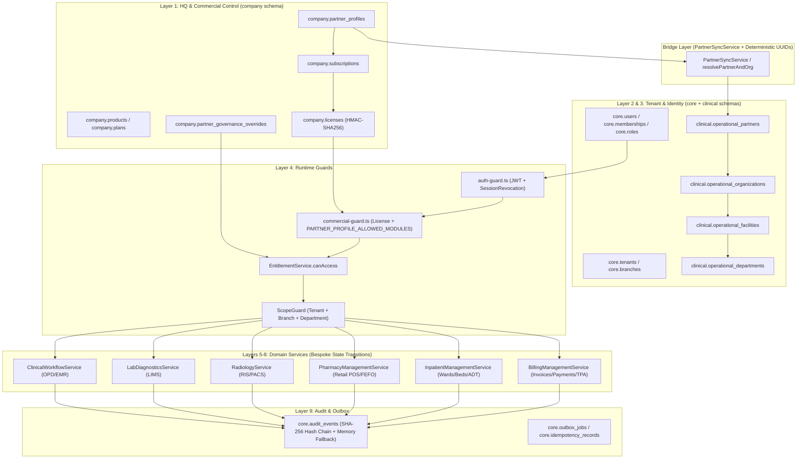
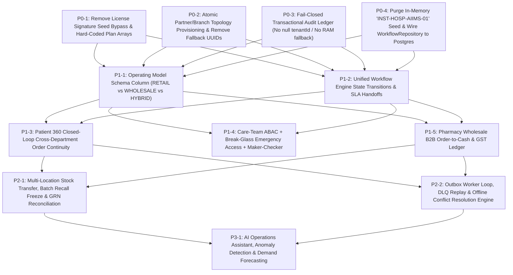

# DOC SEARCH — MASTER DEVELOPMENT BLUEPRINT AUDIT

**Audit Type**: Strict Read-Only Architecture & Development Gap Audit  
**Audit Date**: 2026-09-25  
**Target Architecture**: `HQ → Partner → Industry → Operating Model → Plan → Subscription → License → Entitlement → Capability → Department → Role → Permission → Feature → Workflow → Transaction → Audit`  
**Audit Mode**: `READ-ONLY` (`0` source code modifications, `0` database migrations, `0` route/UI modifications)

---

## A. Executive Summary

This read-only architecture and development blueprint audit evaluates the **DOC SEARCH** enterprise healthcare SaaS monorepo (`packages/database`, `packages/auth`, `packages/shared-core`, `packages/api-contracts`, `apps/api-gateway`, `apps/partner-platform`, `apps/company-platform`, `apps/landing-page`) against the 16-tier canonical target architecture:

```text
HQ → Partner → Industry → Operating Model → Plan → Subscription → License → Entitlement → Capability → Department → Role → Permission → Feature → Workflow → Transaction → Audit
```

### Key Architectural Verdict

1. **Core Multi-Tenant & Commercial Foundations (`VERIFIED`)**:
   - Following the `POST-REM-CAP-01 → CAP-04` remediation cycle, the platform enforces fail-closed multi-tenant isolation (`withSecurityContext` PostgreSQL RLS + `ScopeGuard.resolveEffectiveQueryScope` + `ScopeGuard.filterRecordsByScope` + `ScopeGuard.assertRecordInScope`), cryptographic HMAC-SHA256 license verification ([`LicenseService.ts`](file:///c:/Users/alamr/OneDrive/Desktop/DOC%20SEARCH/apps/api-gateway/src/services/company/LicenseService.ts#L88-L123)), strict retail vs. wholesale pharmacy entitlement separation ([`EntitlementService.ts`](file:///c:/Users/alamr/OneDrive/Desktop/DOC%20SEARCH/apps/api-gateway/src/services/company/EntitlementService.ts#L100-L120)), and server-side `PARTNER_PROFILE_ALLOWED_MODULES` boundary intersection ([`commercial-guard.ts`](file:///c:/Users/alamr/OneDrive/Desktop/DOC%20SEARCH/apps/api-gateway/src/plugins/commercial-guard.ts#L155-L256)).
2. **Primary Structural & Architectural Gaps (`PARTIALLY VERIFIED / CONDITIONAL`)**:
   - **Split Dual-Schema Persistence (`company.*` vs `clinical.*`)**: Commercial HQ entities live in `company.partner_profiles`, `company.subscriptions`, and `company.licenses` ([`packages/database/src/schema/company/index.ts`](file:///c:/Users/alamr/OneDrive/Desktop/DOC%20SEARCH/packages/database/src/schema/company/index.ts#L34-L150)), whereas clinical operations duplicate partner/org/subscription state in `clinical.operational_partners`, `clinical.operational_organizations`, and `clinical.operational_subscriptions` ([`packages/database/src/schema/clinical/index.ts`](file:///c:/Users/alamr/OneDrive/Desktop/DOC%20SEARCH/packages/database/src/schema/clinical/index.ts#L42-L150)), requiring runtime synchronization via `PartnerSyncService` and fallback UUID resolvers (`resolvePartnerAndOrg`, `resolveBranchId`).
   - **Disconnected Generic Workflow Engine**: Although PostgreSQL tables for a reusable workflow engine exist (`workflow_definitions`, `workflow_versions`, `workflow_stages`, `workflow_transitions`, `workflow_instances` in [`workflow-schema.ts`](file:///c:/Users/alamr/OneDrive/Desktop/DOC%20SEARCH/packages/database/src/schema/workflow-schema.ts#L3-L131)), [`WorkflowRepository`](file:///c:/Users/alamr/OneDrive/Desktop/DOC%20SEARCH/packages/database/src/repositories/workflow-repository.ts#L37-L92) runs on an **in-memory array** seeded with `INST-HOSP-AIIMS-01`, and clinical domain services (`ClinicalWorkflowService`, `LabDiagnosticsService`, `RadiologyService`, `PharmacyManagementService`, `InpatientManagementService`) implement ad-hoc status string updates rather than calling a unified state transition & SLA engine.
   - **ABAC Encounter/Doctor/Assignment Granularity & Break-Glass/Maker-Checker**: RBAC (`Role → Permission`) and `ScopeGuard` (`Tenant → Branch → Department`) are enforced, but true **Patient-Doctor Assignment ABAC** (restricting a doctor/nurse to assigned encounters unless **Break-Glass Emergency Access** is invoked with mandatory reason & audit alert) and **Maker-Checker dual-control** for high-value clinical/financial mutations (e.g. wholesale credit note, narcotic Schedule X/H1 write-off, high-value refund) remain partial.
   - **Pharmacy Wholesale B2B Order-to-Cash & Supply Chain**: Retail Pharmacy (`Prescription → Queue → Stock Check → FEFO Dispensing → Invoice → Payment → Stock Deduction`) is backed by PostgreSQL transactions, whereas **Pharmacy Wholesale** (`B2B Customer Master → Credit Limit Check → Sales Order → Pick List → Packing Slip → E-Way Bill / GST Invoice → Dispatch → Delivery → B2B Return`) lacks dedicated backend repository tables and end-to-end persistence.

---

## B. Current Architecture



---

## C. Target Architecture

The target 16-layer architecture requires a strictly linear, normalized, single-source-of-truth dependency chain where each upper layer constrains and parameterizes the layer immediately below it without hard-coded bypasses or dual-table drift:

| Tier | Architectural Layer | Canonical Responsibility | Authoritative Entity / Engine |
| :--- | :--- | :--- | :--- |
| **1** | **HQ** | Platform governance, compliance policy, global kill-switches, dual-control verification | `company.partner_governance_overrides`, `company.partner_lifecycle_transitions` |
| **2** | **Partner** | Legal healthcare entity onboarding, KYC/KYB, verification state, active profile | `company.partner_profiles` (single canonical FK root, eliminating duplicate `operational_partners` drift) |
| **3** | **Industry** | Healthcare vertical classification (`HOSPITAL`, `CLINIC`, `PHARMACY`, `PATHOLOGY`, `DIAGNOSTIC_CENTRE`) | `IndustryMaster` + `PARTNER_PROFILE_ALLOWED_MODULES` |
| **4** | **Operating Model** | Retail vs. Wholesale vs. Franchise vs. Multi-Branch Chain vs. Single-Site | `OperatingModelPolicy` (`RETAIL_B2C`, `WHOLESALE_B2B`, `HYBRID_HOSPITAL`, `HUB_AND_SPOKE_LAB`) |
| **5** | **Plan** | Commercial tier definition, quotas (`maxDoctors`, `maxBeds`, `maxBranches`), base pricing | `company.plans` + `company.plan_entitlements` |
| **6** | **Subscription** | Temporal contract binding Partner to Plan (`TRIAL`, `FREE_YEAR_1`, `ACTIVE`, `PAST_DUE`) | `company.subscriptions` |
| **7** | **License** | Cryptographically signed (HMAC-SHA256) runtime artifact enforcing dates, seats, grace periods | `company.licenses` + `LicenseService` |
| **8** | **Entitlement** | Computed intersection of `Plan × License × Governance Override` | `EntitlementService` |
| **9** | **Capability** | Structural business capability unlocked for the tenant (`PHARMACY_POS`, `PHARMACY_WHOLESALE`, `PATHOLOGY_LIMS`) | `PartnerCapabilityMatrix` |
| **10** | **Department** | Clinical or operational organizational unit within a Facility/Branch (`OPD`, `BIOCHEMISTRY`, `RADIOLOGY`, `IPD_WARD_A`) | `clinical.operational_departments` |
| **11** | **Role** | Functional job title scoped to Industry and Department (`PATHOLOGIST`, `PHLEBOTOMIST`, `PHARMACIST`) | `core.roles` + `PARTNER_ALLOWED_ROLES` |
| **12** | **Permission** | Atomic `resource:action` capability (`lab:results:validate`, `pharmacy:dispense:create`) | `RBACEvaluator` (`packages/auth/src/rbac-evaluator.ts`) |
| **13** | **Feature** | Granular UI/API functional surface gated by `Capability × Department × Permission` | `FeatureCatalogue` + `requireFeatureEntitlement` |
| **14** | **Workflow** | Deterministic state machine, queue routing, SLA timers, escalation, and handoff | Persistent `WorkflowEngine` backed by `workflow_definitions` / `workflow_instances` |
| **15** | **Transaction** | ACID database unit of work with idempotency key and outbox event emission | `withSecurityContext(db, session, tx)` + `core.idempotency_records` + `core.outbox_jobs` |
| **16** | **Audit** | Tamper-evident, append-only SHA-256 hash-chained ledger of every state change | `core.audit_events` (Fail-closed DB persistence without silent memory drop) |

---

## D. Already Implemented

The following capabilities are **implemented, wired to PostgreSQL, and verified via automated test suites**:

1. **Multi-Tenant PostgreSQL Row-Level Security (RLS) & Session Context**:
   - [`packages/database/src/security/engine-rls.ts`](file:///c:/Users/alamr/OneDrive/Desktop/DOC%20SEARCH/packages/database/src/security/engine-rls.ts) sets `app.current_tenant_id`, `app.current_branch_id`, and `app.is_super_admin` inside every transaction via `withSecurityContext`.
2. **Branch & Department Query/Record Scoping (`ScopeGuard`)**:
   - [`packages/auth/src/scope-guard.ts`](file:///c:/Users/alamr/OneDrive/Desktop/DOC%20SEARCH/packages/auth/src/scope-guard.ts#L75-L228) implements `resolveEffectiveQueryScope`, `filterRecordsByScope`, and `assertRecordInScope`, preventing cross-tenant, cross-branch, and cross-department data leakage across Clinical, Lab, Radiology, Pharmacy, Billing, and Inpatient services.
3. **Cryptographic License Lifecycle & Temporal Evaluation**:
   - [`apps/api-gateway/src/services/company/LicenseService.ts`](file:///c:/Users/alamr/OneDrive/Desktop/DOC%20SEARCH/apps/api-gateway/src/services/company/LicenseService.ts#L88-L195) implements HMAC-SHA256 license signing (`signLicensePayload`), `timingSafeEqual` verification (`verifyLicenseSignature`), and temporal state evaluation (`FREE_ACTIVE`, `ACTIVE`, `EXPIRING_SOON`, `GRACE_PERIOD`, `EXPIRED`, `SUSPENDED`, `REVOKED`).
4. **Partner Profile Module Boundary & Retail/Wholesale Entitlement Separation**:
   - [`packages/shared-core/src/workflow/facility-normalizer.ts`](file:///c:/Users/alamr/OneDrive/Desktop/DOC%20SEARCH/packages/shared-core/src/workflow/facility-normalizer.ts#L352-L595) defines `PARTNER_PROFILE_ALLOWED_MODULES` and `isModuleAllowedForPartnerProfile`.
   - [`apps/api-gateway/src/plugins/commercial-guard.ts`](file:///c:/Users/alamr/OneDrive/Desktop/DOC%20SEARCH/apps/api-gateway/src/plugins/commercial-guard.ts#L155-L256) and [`apps/api-gateway/src/services/company/EntitlementService.ts`](file:///c:/Users/alamr/OneDrive/Desktop/DOC%20SEARCH/apps/api-gateway/src/services/company/EntitlementService.ts#L100-L348) block out-of-profile module overrides (`403 PARTNER_PROFILE_MODULE_BOUNDARY_VIOLATION`) and isolate `PHARMACY_WHOLESALE` from retail `PHARMACY_` wildcards.
5. **Account & Profile Safety Invariant**:
   - [`apps/api-gateway/src/routes/partner/account.routes.ts`](file:///c:/Users/alamr/OneDrive/Desktop/DOC%20SEARCH/apps/api-gateway/src/routes/partner/account.routes.ts) uses `[authenticate]` without `requireActiveCommercialAccess`, ensuring partners with `PENDING`, `EXPIRED`, or `SUSPENDED` licenses can always view/edit their profile, compliance documents, and billing/renewal options.
6. **Core Vertical Clinical & Financial Persistence Slices**:
   - **OPD**: Patient registration, encounter check-in, queue token generation, vitals, consultation notes, diagnoses, and prescriptions ([`ClinicalWorkflowRepository.ts`](file:///c:/Users/alamr/OneDrive/Desktop/DOC%20SEARCH/apps/api-gateway/src/repositories/partner/ClinicalWorkflowRepository.ts)).
   - **LIMS**: Investigation order creation, specimen barcode collection, result entry, signatory verification (`PATHOLOGIST`/`LAB_DIRECTOR`), and report release ([`LabDiagnosticsRepository.ts`](file:///c:/Users/alamr/OneDrive/Desktop/DOC%20SEARCH/apps/api-gateway/src/repositories/partner/LabDiagnosticsRepository.ts)).
   - **Radiology**: Modality catalog, radiology orders, study completion, structured reporting, verification, and amendments ([`RadiologyRepository.ts`](file:///c:/Users/alamr/OneDrive/Desktop/DOC%20SEARCH/apps/api-gateway/src/repositories/partner/RadiologyRepository.ts)).
   - **Retail Pharmacy**: Medication catalog, batch GRN stock inward, FEFO dispensing with atomic stock deduction and invoice generation ([`PharmacyManagementRepository.ts`](file:///c:/Users/alamr/OneDrive/Desktop/DOC%20SEARCH/apps/api-gateway/src/repositories/partner/PharmacyManagementRepository.ts)).
   - **IPD & Billing**: Ward/bed creation, admission, bed transfer, nursing notes, discharge, invoice generation, payment collection, and TPA pre-auth recording ([`InpatientManagementRepository.ts`](file:///c:/Users/alamr/OneDrive/Desktop/DOC%20SEARCH/apps/api-gateway/src/repositories/partner/InpatientManagementRepository.ts), [`BillingManagementRepository.ts`](file:///c:/Users/alamr/OneDrive/Desktop/DOC%20SEARCH/apps/api-gateway/src/repositories/partner/BillingManagementRepository.ts)).
7. **AI Permission Firewall (9-Gate Fail-Closed Pipeline)**:
   - [`apps/api-gateway/src/ai/permission-firewall.ts`](file:///c:/Users/alamr/OneDrive/Desktop/DOC%20SEARCH/apps/api-gateway/src/ai/permission-firewall.ts#L18-L280) enforces Identity, Tenant, Branch, Capability, Role Escalation, Patient Isolation, RBAC Role, Granular Permission, and Commercial Entitlement checks before any AI tool/capability executes.

---

## E. Partially Implemented

Every item below has database tables or partial service logic, but is incomplete against the 16-layer target blueprint:

### Finding E-01: Operating Model Dimension (`RETAIL_B2C` vs `WHOLESALE_B2B` vs `HUB_SPOKE_LAB`)
- **Finding**: Operating Model is conflated with Plan codes (`plan-pharma-wholesale-free-yr1`) or inferred from `metadata.registrationSubCategory` rather than persisted as a first-class schema column on `company.partner_profiles` and `clinical.operational_partners`.
- **Evidence**: [`packages/database/src/schema/company/index.ts`](file:///c:/Users/alamr/OneDrive/Desktop/DOC%20SEARCH/packages/database/src/schema/company/index.ts#L34-L60) (`partnerProfiles` has `partnerType` and `metadata`, but no `operatingModel` column) and [`apps/api-gateway/src/services/company/EntitlementService.ts`](file:///c:/Users/alamr/OneDrive/Desktop/DOC%20SEARCH/apps/api-gateway/src/services/company/EntitlementService.ts#L290-L348).
- **Current State**: Wholesale vs. Retail pharmacy distinction relies on plan ID matching (`planPharmaWholesaleIds`) or `metadata.includedModules`.
- **Gap**: No explicit `operating_model` column (`RETAIL`, `WHOLESALE`, `HYBRID`, `FRANCHISE`, `COLLECTION_CENTER`, `REFERENCE_LAB`) governing department templates, tax rules (B2B GSTIN mandatory vs B2C receipt), and workflow routing.
- **Dependency**: Layer 2 (`Partner & Industry Architecture`) and Layer 4 (`Entitlement & Feature Visibility`).
- **Risk**: A `PHARMACY` partner switching plans or having ambiguous `metadata` can experience mismatched B2B vs. B2C workflows.
- **Required Future State**: Add explicit `operating_model` column to `company.partner_profiles` and `clinical.operational_partners`, validated against an `Industry × OperatingModel` matrix.
- **Verification Method**: Schema migration verification + integration test asserting `PHARMACY + WHOLESALE` vs `PHARMACY + RETAIL` operating model provisioning.

### Finding E-02: Patient-Doctor Encounter ABAC & Break-Glass Emergency Access
- **Finding**: `ScopeGuard` enforces `Tenant → Branch → Department` isolation, and `ScopeGuard.enforcePatientScope` exists in [`packages/auth/src/scope-guard.ts`](file:///c:/Users/alamr/OneDrive/Desktop/DOC%20SEARCH/packages/auth/src/scope-guard.ts#L230-L248), but clinical read/write endpoints do not enforce **Attending Doctor / Care Team Assignment ABAC** with a formal **Break-Glass** override workflow.
- **Evidence**: [`apps/api-gateway/src/services/partner/ClinicalWorkflowService.ts`](file:///c:/Users/alamr/OneDrive/Desktop/DOC%20SEARCH/apps/api-gateway/src/services/partner/ClinicalWorkflowService.ts#L83-L125) queries encounters by `tenantId`, `branchId`, and `departmentId`, allowing any doctor in the same department to read/modify another doctor's patient encounter without recording a Break-Glass justification if restricted care-team mode is required.
- **Current State**: Department-level scoping (`dataScope: 'department'`) is enforced, plus `patient_consents` and `emergency_access_logs` tables exist in schema, but runtime `ClinicalWorkflowService` and `InpatientManagementService` do not require care-team membership or break-glass token validation on restricted encounters.
- **Gap**: Missing runtime Care-Team ABAC interceptor and Break-Glass elevation token verification on sensitive clinical records (VIP, psychiatric, HIV/infectious, or cross-care-team patients).
- **Dependency**: Layer 3 (`Identity / RBAC / ABAC`).
- **Risk**: Unauthorized lateral viewing of sensitive patient charts within the same department without triggering a high-priority security alert to the Hospital Medical Director.
- **Required Future State**: Enforce `ScopeGuard.enforceEncounterCareTeamOrBreakGlass(session, encounter)` with mandatory `clinical.emergency_access_logs` persistence and real-time HQ/Medical Director audit alert.
- **Verification Method**: Automated test verifying a non-assigned clinician receives `403 BREAK_GLASS_REQUIRED` on restricted encounters until submitting a signed Break-Glass justification.

### Finding E-03: Outbox Pattern & Idempotency Enforcement Across Domain Mutations
- **Finding**: `core.outbox_jobs` ([`outbox-jobs.ts`](file:///c:/Users/alamr/OneDrive/Desktop/DOC%20SEARCH/packages/database/src/schema/core/outbox-jobs.ts#L4-L29)) and `core.idempotency_records` ([`idempotency-records.ts`](file:///c:/Users/alamr/OneDrive/Desktop/DOC%20SEARCH/packages/database/src/schema/core/idempotency-records.ts#L4-L27)) exist in PostgreSQL, and `idempotency-guard.ts` exists in `apps/api-gateway/src/plugins`, but clinical/financial domain mutations (`dispense`, `collectPayment`, `createOrder`, `createAdmission`) do not atomically write outbox events inside the same DB transaction (`tx`) for downstream department handoffs.
- **Evidence**: [`apps/api-gateway/src/services/partner/PharmacyManagementService.ts`](file:///c:/Users/alamr/OneDrive/Desktop/DOC%20SEARCH/apps/api-gateway/src/services/partner/PharmacyManagementService.ts#L121-L140) and [`apps/api-gateway/src/services/partner/BillingManagementService.ts`](file:///c:/Users/alamr/OneDrive/Desktop/DOC%20SEARCH/apps/api-gateway/src/services/partner/BillingManagementService.ts#L114-L138).
- **Current State**: Services write domain rows and call `auditRepository.recordEvent`, but cross-department notifications and external webhooks (WhatsApp, ABDM, PACS) are not driven by transactional outbox workers.
- **Gap**: Missing transactional outbox emission inside `withSecurityContext` transactions and background outbox relay worker with DLQ retry processing.
- **Dependency**: Layer 5 (`Workflow Engine`) and Layer 9 (`Enterprise Reliability`).
- **Risk**: Network failure after DB commit can drop downstream notifications or cross-department queue triggers.
- **Required Future State**: Emit `outbox_jobs` rows inside the same `tx` for every order/handoff state transition and process via a deterministic worker loop.
- **Verification Method**: Integration test simulating external failure during order creation and verifying `outbox_jobs` retry → `COMPLETED` / `DLQ` transitions.

---

## F. Incorrect Architecture

### Finding F-01: Dual-Schema Entity Duplication (`company.*` vs `clinical.*`) & Silent Placeholder UUID Fallbacks
- **Finding**: Partner, Organization, Facility/Branch, and Subscription entities are duplicated across `company` (`partner_profiles`, `subscriptions`) and `clinical` (`operational_partners`, `operational_organizations`, `operational_facilities`, `operational_subscriptions`), bridged by silent fallback helper functions in every repository (`resolvePartnerAndOrg`, `resolveBranchId`, `resolveDepartmentId`, `resolveDoctorId`).
- **Evidence**:
  - [`apps/api-gateway/src/repositories/partner/PharmacyManagementRepository.ts`](file:///c:/Users/alamr/OneDrive/Desktop/DOC%20SEARCH/apps/api-gateway/src/repositories/partner/PharmacyManagementRepository.ts#L45-L150) (`resolvePartnerAndOrg` falls back to `'00000000-0000-4000-8000-000000000001'`, `resolveBranchId` falls back to `'00000000-0000-4000-8000-000000000003'`, `resolveDoctorId` falls back to `'99999999-9999-4999-8999-999999999999'`).
  - Identical duplicated helper functions exist in [`ClinicalWorkflowRepository.ts`](file:///c:/Users/alamr/OneDrive/Desktop/DOC%20SEARCH/apps/api-gateway/src/repositories/partner/ClinicalWorkflowRepository.ts#L55-L150) and [`LabDiagnosticsRepository.ts`](file:///c:/Users/alamr/OneDrive/Desktop/DOC%20SEARCH/apps/api-gateway/src/repositories/partner/LabDiagnosticsRepository.ts#L40-L128).
- **Current State**: When a foreign key (`partnerId`, `organizationId`, `branchId`, `doctorId`) is missing or not yet synced from `company.partner_profiles` to `clinical.operational_partners`, repositories silently substitute hard-coded placeholder UUIDs (`00000000-0000-4000-8000-000000000001`, `00000000-0000-4000-8000-000000000003`, `99999999-9999-4999-8999-999999999999`).
- **Gap**: Violates strict referential integrity and Zero-State principles; creates a synthetic "default facility/doctor" bucket if provisioning sync lags.
- **Dependency**: Layer 1 (`HQ & Commercial Control`), Layer 2 (`Partner & Industry Architecture`), and Section 6 (`Patient 360 / Universal Data Model`).
- **Risk**: Data lineage corruption (`staffId`/`doctorId` attributed to `99999999-9999-4999-8999-999999999999` instead of the real authenticated practitioner) and code duplication across 6 repositories.
- **Required Future State**:
  1. Unify `partnerId`, `branchId`, and `departmentId` resolution in a single fail-closed `TenantTopologyResolver` service provisioned atomically during partner onboarding.
  2. Remove all `00000000-...` and `99999999-...` fallback UUIDs from production repositories, failing closed (`422 UNPROVISIONED_FACILITY_CONTEXT`) if a tenant lacks a valid facility/department/practitioner record.
- **Verification Method**: Grep/AST check confirming `0` occurrences of `00000000-0000-4000-8000-` or `99999999-9999-4999-8999-` inside `apps/api-gateway/src/repositories/partner/*`.

### Finding F-02: Disconnected In-Memory `WorkflowRepository` vs Bespoke Service State Updates
- **Finding**: The platform defines a full relational workflow schema ([`packages/database/src/schema/workflow-schema.ts`](file:///c:/Users/alamr/OneDrive/Desktop/DOC%20SEARCH/packages/database/src/schema/workflow-schema.ts#L3-L131)), but [`WorkflowRepository`](file:///c:/Users/alamr/OneDrive/Desktop/DOC%20SEARCH/packages/database/src/repositories/workflow-repository.ts#L37-L92) stores instances in an in-memory array (`private instances: WorkflowInstanceDto[] = []`) seeded with `INST-HOSP-AIIMS-01`, while clinical services mutate `status` columns directly without workflow engine validation.
- **Evidence**: [`packages/database/src/repositories/workflow-repository.ts`](file:///c:/Users/alamr/OneDrive/Desktop/DOC%20SEARCH/packages/database/src/repositories/workflow-repository.ts#L37-L92) and [`apps/api-gateway/src/services/partner/ClinicalWorkflowService.ts`](file:///c:/Users/alamr/OneDrive/Desktop/DOC%20SEARCH/apps/api-gateway/src/services/partner/ClinicalWorkflowService.ts#L127-L142) (`updateEncounterStatus` writes arbitrary `targetStatus` string directly to DB).
- **Current State**: Each department (OPD, LIMS, RIS, Pharmacy, IPD) manages its own status strings independently; there is no unified state transition validator, SLA timer, escalation trigger, or cross-department handoff coordinator.
- **Gap**: Layer 5 (`Workflow Engine`) is architecturally disconnected from Layer 7 (`Clinical Development Order`).
- **Dependency**: Layer 5 (`Workflow Engine`).
- **Risk**: Invalid state transitions (e.g., jumping from `ORDERED` to `RELEASED` without `COLLECTED` and `PATHOLOGIST_VALIDATED` if called via direct status update endpoints), lost SLA tracking, and non-persistent workflow instances across server restarts.
- **Required Future State**: Wire `WorkflowRepository` to PostgreSQL Drizzle tables (`workflow_definitions`, `workflow_instances`, `workflow_transition_logs`) and route all clinical/diagnostic/pharmacy order status mutations through a deterministic `WorkflowStateMachineService.transition()`.
- **Verification Method**: Automated state-machine test asserting illegal state jumps (e.g., `REGISTERED -> COMPLETED` skipping `VITALS/CONSULTATION` where required, or `COLLECTED -> DELIVERED` skipping `VALIDATED`) throw `409 INVALID_WORKFLOW_TRANSITION`.

### Finding F-03: AuditRepository Silent Fallback to In-Memory Store & Nullifying Foreign Keys
- **Finding**: When `AuditRepository.recordEvent` encounters a foreign-key constraint error or database error, it catches the error, strips `actorId`, `branchId`, and `tenantId` (`null`ing them out), and if that still fails, pushes the audit event into an ephemeral in-memory array (`memoryAuditStore`) without failing the transaction.
- **Evidence**: [`apps/api-gateway/src/repositories/core/AuditRepository.ts`](file:///c:/Users/alamr/OneDrive/Desktop/DOC%20SEARCH/apps/api-gateway/src/repositories/core/AuditRepository.ts#L93-L142).
- **Current State**: Lines 94–120 nullify `actorId`, `branchId`, and `tenantId` on DB insert failure; lines 124–141 fall back to `memoryAuditStore.push(memoryRecord)`.
- **Gap**: An enterprise healthcare audit ledger (`Layer 16 — Audit`) must be **fail-closed and immutable**; if an audit record cannot be persisted with its `tenantId` inside the transaction, the clinical/financial mutation itself must roll back.
- **Dependency**: Layer 9 (`Enterprise Reliability`) and Layer 16 (`Audit`).
- **Risk**: Orphaned audit rows with `tenantId = NULL` (invisible to tenant audit queries) or lost audit trail upon process restart.
- **Required Future State**: Remove `tenantId: null` stripping and remove `memoryAuditStore` fallback in production mode; execute `auditRepository.recordEvent` strictly inside the caller's PostgreSQL transaction (`tx`) so audit failure rolls back the mutation.
- **Verification Method**: Fault-injection test verifying that if `core.audit_events` insert fails, the parent clinical/financial transaction rolls back atomically.

---

## G. Missing Capabilities & Architectural Dependency Analysis

Per **Section 12**, every missing capability is analyzed across the 11-stage engineering chain (`CAPABILITY → DEPENDENCIES → DATABASE → API → BACKEND → SECURITY → UI → WORKFLOW → TESTS → VERIFICATION → FREEZE`):

### 1. Pharmacy Wholesale B2B Order-to-Cash & Distribution Lifecycle (`P1`)
```text
CAPABILITY: End-to-End B2B Wholesale Pharmacy (Customer Master -> Credit Limit -> Sales Order -> FEFO Pick List -> Packing -> E-Way Bill / GST Tax Invoice -> Dispatch -> Delivery -> B2B Return / Credit Note)
 ↓
DEPENDENCIES: Operating Model ('WHOLESALE' / 'HYBRID'), Wholesale Entitlement ('PHARMACY_WHOLESALE'), Batch Inventory Ledger ('clinical.pharmacy_batches')
 ↓
DATABASE: Create 'clinical.wholesale_customers' (Drug License No, GSTIN, Credit Limit, Payment Terms), 'clinical.wholesale_sales_orders', 'clinical.wholesale_order_items', 'clinical.wholesale_pick_lists', 'clinical.wholesale_dispatches'
 ↓
API: '/api/v1/partner/pharmacy-wholesale/customers', '/orders', '/orders/:id/pick', '/orders/:id/pack', '/orders/:id/invoice', '/orders/:id/dispatch', '/returns'
 ↓
BACKEND: 'PharmacyWholesaleService.ts' + 'PharmacyWholesaleRepository.ts' executing atomic credit-limit reservation, multi-batch FEFO allocation, HSN-wise CGST/SGST/IGST calculation, and stock ledger deduction
 ↓
SECURITY: 'requireModuleCommercialAccess("PHARMACY_WHOLESALE")' + 'RBACEvaluator' ('pharmacy_wholesale:order:create', 'pharmacy_wholesale:dispatch:approve') + 'ScopeGuard' branch isolation
 ↓
UI: Dedicated Wholesale Distributor Workbench in 'PharmacyDomainManager.tsx' (distinct from Retail B2C POS counter)
 ↓
WORKFLOW: 'ORDER_PLACED -> CREDIT_APPROVED -> PICKING -> PACKED -> INVOICED -> DISPATCHED -> DELIVERED -> RETURN_SETTLED'
 ↓
TESTS: Multi-batch FEFO allocation test, credit limit breach rejection test (422), retail-vs-wholesale cross-access block test (403)
 ↓
VERIFICATION: End-to-end PostgreSQL transaction trace from B2B Sales Order to Stock Movement & GST Ledger
 ↓
FREEZE: Schema + API contract freeze once B2B order-to-dispatch integration suite passes 100%
```

### 2. Unified Cross-Department Patient 360 Encounter & Order Continuity Engine (`P1`)
```text
CAPABILITY: Strict Foreign-Key & Workflow Handoff Continuity ('Patient -> Encounter -> Department -> Staff -> Order -> Task -> Result -> Transaction -> Audit') across OPD, LIMS, RIS, Pharmacy, IPD, and Billing
 ↓
DEPENDENCIES: Elimination of placeholder UUID resolvers (Finding F-01), Unified Workflow Engine (Finding F-02)
 ↓
DATABASE: Enforce non-null 'encounter_id', 'ordering_department_id', 'performing_department_id', 'ordering_staff_id', and 'billing_invoice_id' across 'investigation_orders', 'radiology_orders', 'pharmacy_prescriptions', and 'inpatient_admissions'
 ↓
API: '/api/v1/partner/clinical/patients/:patientId/timeline-360' returning unified longitudinal graph with encounter-linked orders, specimens, DICOM studies, dispensed batches, and invoices
 ↓
BACKEND: 'Patient360ContinuityService.ts' orchestrating automatic downstream order creation when a doctor signs an OPD/IPD consultation containing lab tests, imaging procedures, and medications
 ↓
SECURITY: 'ScopeGuard' + Care-Team ABAC + Break-Glass emergency access logging
 ↓
UI: Longitudinal Patient 360 Timeline drawer in 'ClinicalConsultationDomainManager.tsx' and 'InpatientDomainManager.tsx'
 ↓
WORKFLOW: Consultation Sign-off -> Atomic Outbox Handoff -> [LIMS Accession Queue + RIS Scheduling Queue + Pharmacy Dispense Queue + Billing Cashier Queue]
 ↓
TESTS: Closed-loop continuity test verifying 1 Consultation with 1 Lab Test + 1 X-Ray + 1 Rx automatically populates LIMS, RIS, Pharmacy, and Billing queues with identical 'encounterId' and 'patientId'
 ↓
VERIFICATION: SQL join audit verifying 0 orphaned orders without valid 'encounterId' and 'orderingStaffId'
 ↓
FREEZE: Freeze cross-department handoff contract before enabling automated billing/charge capture
```

### 3. Multi-Location Inventory Transfer, Drug Recall & Maker-Checker Write-Off (`P2`)
```text
CAPABILITY: Inter-Branch Stock Transfer (Indent -> Dispatch -> In-Transit -> Receipt), Manufacturer Batch Recall Freeze, and Dual-Control Maker-Checker Inventory Adjustment
 ↓
DEPENDENCIES: Multi-branch topology ('clinical.operational_facilities'), Batch Ledger ('clinical.pharmacy_batches')
 ↓
DATABASE: Create 'clinical.inventory_transfers', 'clinical.inventory_transfer_items', 'clinical.drug_recalls', 'clinical.maker_checker_approvals'
 ↓
API: '/api/v1/partner/pharmacy/transfers', '/api/v1/partner/pharmacy/recalls', '/api/v1/partner/pharmacy/adjustments/:id/approve'
 ↓
BACKEND: Atomic source-branch deduction into 'IN_TRANSIT' virtual bucket and destination-branch GRN increment; global batch freeze on recalled 'batchNumber' blocking all 'dispense()' calls immediately
 ↓
SECURITY: Source branch 'ScopeGuard' on dispatch, destination branch 'ScopeGuard' on receipt; Maker ('actorId') != Checker ('approverId') enforced in 'RBACEvaluator'
 ↓
UI: Inter-Branch Stock Transfer & Batch Recall Alert Console
 ↓
WORKFLOW: 'INDENT_REQUESTED -> APPROVED -> DISPATCHED_IN_TRANSIT -> RECEIVED_FULL / RECEIVED_PARTIAL'
 ↓
TESTS: Recalled batch dispense rejection test (409 BATCH_RECALLED), self-approval rejection test (403 MAKER_CHECKER_VIOLATION)
 ↓
VERIFICATION: Stock conservation invariant check (Source Deducted == In-Transit + Destination Received)
 ↓
FREEZE: Freeze supply-chain ledger schema
```

---

## H. Hard-Coded Logic Findings

| ID | File & Line Reference | Hard-Coded Logic Observed | Architectural Impact & Required Remediation |
| :--- | :--- | :--- | :--- |
| **HC-01** | [`EntitlementService.ts`](file:///c:/Users/alamr/OneDrive/Desktop/DOC%20SEARCH/apps/api-gateway/src/services/company/EntitlementService.ts#L190-L320) | Hard-coded arrays of plan code strings (`planHospIds`, `planClinicIds`, `planPharmIds`, `planPharmaWholesaleIds`, `planPathIds`, `planDiagIds`) inside `EntitlementService.canAccess`. | Adding a new commercial plan in HQ (`company.plans`) requires code changes in `EntitlementService.ts` unless `company.plan_entitlements` is used as the sole authoritative source. **Remediation**: Migrate all plan-to-module mappings into seeded `company.plan_entitlements` rows and query DB/cache dynamically. |
| **HC-02** | [`PartnerGovernanceService.ts`](file:///c:/Users/alamr/OneDrive/Desktop/DOC%20SEARCH/apps/api-gateway/src/services/company/PartnerGovernanceService.ts#L80-L93) | `DEFAULT_CORE_MODULES` array hard-codes 12 modules (`CLINICAL_EMR` through `EXECUTIVE_COMMAND`), omitting `PHARMACY_WHOLESALE`. | HQ Governance console module list should be dynamically hydrated from the canonical `FeatureCatalogue` / `PARTNER_PROFILE_ALLOWED_MODULES` registry. |
| **HC-03** | [`LicenseService.ts`](file:///c:/Users/alamr/OneDrive/Desktop/DOC%20SEARCH/apps/api-gateway/src/services/company/LicenseService.ts#L101-L107) | `verifyLicenseSignature` accepts signatures starting with `'seed_signature'` or `'SIG-PROD-2026-'` as valid bypasses (`return true`). | Allows seeded/static signature prefixes to bypass cryptographic HMAC-SHA256 verification if injected into DB. **Remediation**: Restrict seed signature bypass strictly to `NODE_ENV === 'test'` and sign all seeded licenses with real HMAC-SHA256 digests. |
| **HC-04** | [`scope-guard.ts`](file:///c:/Users/alamr/OneDrive/Desktop/DOC%20SEARCH/packages/auth/src/scope-guard.ts#L158-L165) | `isDefaultSeededFacility` exempts `'00000000-0000-4000-8000-000000000002'` and `'00000000-0000-4000-8000-000000000003'` from branch scope filtering to support legacy test-harness fallback IDs. | Once repository fallback UUIDs (`Finding F-01`) are replaced with real seeded facility UUIDs per test tenant, remove the `isDefaultSeededFacility` exemption so branch filtering has zero magic UUID exceptions. |

---

## I. Mock / Fallback Findings (Zero-State Audit)

Per **Section 11 (Zero-State Requirement)**, every runtime path was audited for fake records, demo data, and silent fallbacks:

| ID | File & Line Reference | Mock / Fallback Behavior | Zero-State Risk & Required Fix |
| :--- | :--- | :--- | :--- |
| **MF-01** | [`workflow-repository.ts`](file:///c:/Users/alamr/OneDrive/Desktop/DOC%20SEARCH/packages/database/src/repositories/workflow-repository.ts#L50-L92) | `WorkflowRepository.seedInitialInstances()` automatically pushes a hard-coded demo instance `INST-HOSP-AIIMS-01` (`'AIIMS Super Speciality Hospital Delhi'`, `admin@aiims.edu`, `07AAAAA0000A1Z5`) into memory on startup. | **Direct Zero-State Violation**: Any query to `/api/v1/company/workflows/instances` returns a fake hospital instance (`AIIMS Super Speciality Hospital Delhi`). **Fix**: Remove `seedInitialInstances()` and query PostgreSQL `workflow_instances` filtered by `tenantId`. |
| **MF-02** | [`PharmacyManagementRepository.ts`](file:///c:/Users/alamr/OneDrive/Desktop/DOC%20SEARCH/apps/api-gateway/src/repositories/partner/PharmacyManagementRepository.ts#L77-L150), [`ClinicalWorkflowRepository.ts`](file:///c:/Users/alamr/OneDrive/Desktop/DOC%20SEARCH/apps/api-gateway/src/repositories/partner/ClinicalWorkflowRepository.ts#L85-L111), [`LabDiagnosticsRepository.ts`](file:///c:/Users/alamr/OneDrive/Desktop/DOC%20SEARCH/apps/api-gateway/src/repositories/partner/LabDiagnosticsRepository.ts#L72-L128) | Silent fallback UUIDs (`00000000-0000-4000-8000-000000000001`, `00000000-0000-4000-8000-000000000003`, `99999999-9999-4999-8999-999999999999`) when partner/branch/doctor rows are absent. | **Silent Fallback Violation**: Masks unprovisioned facility/doctor state by attaching transactions to synthetic UUIDs. **Fix**: Provision operational topology atomically at registration/approval time and fail closed (`422`) if missing. |
| **MF-03** | [`AuditRepository.ts`](file:///c:/Users/alamr/OneDrive/Desktop/DOC%20SEARCH/apps/api-gateway/src/repositories/core/AuditRepository.ts#L8-L27) | `memoryAuditStore` fallback when DB is unreachable or FK fails. | **Silent Persistence Fallback**: Audit events appear succeeded in API response while residing only in RAM. **Fix**: Fail closed (`503` / transaction rollback) if `core.audit_events` write fails. |

---

## J. Security Dependencies

Before expanding clinical or financial workflows, the following security dependencies must hold:

1. **Cryptographic License Integrity (`P0`)**:
   - Remove `'seed_signature'` and `'SIG-PROD-2026-'` prefix bypasses in [`LicenseService.verifyLicenseSignature`](file:///c:/Users/alamr/OneDrive/Desktop/DOC%20SEARCH/apps/api-gateway/src/services/company/LicenseService.ts#L101-L107) outside `NODE_ENV === 'test'`.
2. **Fail-Closed Audit Ledger (`P0`)**:
   - [`AuditRepository.recordEvent`](file:///c:/Users/alamr/OneDrive/Desktop/DOC%20SEARCH/apps/api-gateway/src/repositories/core/AuditRepository.ts#L49-L142) must never strip `tenantId` to `null` or silently fall back to `memoryAuditStore` during production mutations.
3. **Strict Tenant/Branch/Department Topology (`P0`)**:
   - Eliminate synthetic fallback UUIDs (`00000000-...`, `99999999-...`) in repositories (`Finding F-01`) and remove the corresponding `isDefaultSeededFacility` exception in [`ScopeGuard`](file:///c:/Users/alamr/OneDrive/Desktop/DOC%20SEARCH/packages/auth/src/scope-guard.ts#L158-L165).
4. **Care-Team ABAC & Break-Glass Elevation (`P1`)**:
   - Require active Care-Team / Attending Doctor assignment or an audited Break-Glass token (`clinical.emergency_access_logs`) for restricted patient encounters.
5. **Maker-Checker Dual Control (`P1`)**:
   - Enforce `makerUserId !== checkerUserId` at the service and database level for high-risk financial refunds, inventory write-offs, and HQ plan overrides.

---

## K. Data Dependencies

1. **Single Canonical Partner & Facility Topology**:
   - `company.partner_profiles` (`id`, `tenantId`, `partnerType`, `operatingModel`) must deterministically project 1:1 into `clinical.operational_partners` and `clinical.operational_facilities` within the same onboarding transaction (`PartnerOnboardingRepository` + `PartnerSyncService`) so no clinical table ever lacks a valid `partnerId`, `organizationId`, or `branchId`.
2. **Universal Encounter Spine (`encounter_id` Foreign Key Continuity)**:
   - Every clinical action (`consultation_vitals`, `consultation_diagnoses`, `investigation_orders`, `radiology_orders`, `pharmacy_prescriptions`, `billing_invoices`) must carry non-null `tenant_id`, `branch_id`, `department_id`, `patient_id`, `encounter_id`, and `ordering_staff_id`.
3. **Database-Driven Entitlement Matrix (`company.plan_entitlements`)**:
   - Populate `company.plan_entitlements` for all 12+ canonical plans so `EntitlementService.canAccess` resolves entitlements via indexed SQL/cache lookups rather than hard-coded plan ID arrays.

---

## L. Workflow Dependencies

1. **Persistent Workflow State Machine (`workflow_definitions` / `workflow_instances`)**:
   - Replace the in-memory `WorkflowRepository` ([`packages/database/src/repositories/workflow-repository.ts`](file:///c:/Users/alamr/OneDrive/Desktop/DOC%20SEARCH/packages/database/src/repositories/workflow-repository.ts)) with a Drizzle PostgreSQL implementation.
2. **Closed-Loop Order Handoff Orchestration**:
   - Signing a consultation (`ClinicalWorkflowService.saveConsultation`) must atomically emit workflow tasks into:
     - **LIMS Queue** (`investigation_orders` status `ORDERED` → `SAMPLE_PENDING`)
     - **Radiology Queue** (`radiology_orders` status `ORDERED` → `SCHEDULING_PENDING`)
     - **Pharmacy Queue** (`pharmacy_prescriptions` status `ISSUED` → `DISPENSE_PENDING`)
     - **Billing Queue** (`billing_invoices` status `DRAFT` / `PENDING_PAYMENT`)
3. **Departmental SLA & Escalation Timers**:
   - Critical value lab alerts (`investigation_results.is_critical = true`) and STAT radiology alerts (`radiology_critical_alerts`) must track acknowledgment SLA timestamps and escalate unacknowledged alerts after configurable thresholds (e.g., 15 minutes).

---

## M. Development Dependency Graph



---

## N. P0 Development Queue (Security, Tenancy, License, Financial/Clinical Integrity)

| Queue ID | Priority | Target Files | Exact Remediation Scope |
| :--- | :--- | :--- | :--- |
| **`DEV-P0-01`** | `P0` | [`LicenseService.ts`](file:///c:/Users/alamr/OneDrive/Desktop/DOC%20SEARCH/apps/api-gateway/src/services/company/LicenseService.ts#L101-L107) | Remove `'seed_signature'` and `'SIG-PROD-2026-'` bypasses in production (`NODE_ENV !== 'test'`); require strict `crypto.timingSafeEqual` HMAC-SHA256 signature validation on all licenses. |
| **`DEV-P0-02`** | `P0` | [`AuditRepository.ts`](file:///c:/Users/alamr/OneDrive/Desktop/DOC%20SEARCH/apps/api-gateway/src/repositories/core/AuditRepository.ts#L83-L142) | Make `AuditRepository.recordEvent` fail-closed inside caller database transactions (`tx`); remove `tenantId: null` fallback stripping and disable `memoryAuditStore` fallback in production. |
| **`DEV-P0-03`** | `P0` | [`PharmacyManagementRepository.ts`](file:///c:/Users/alamr/OneDrive/Desktop/DOC%20SEARCH/apps/api-gateway/src/repositories/partner/PharmacyManagementRepository.ts#L45-L150), [`ClinicalWorkflowRepository.ts`](file:///c:/Users/alamr/OneDrive/Desktop/DOC%20SEARCH/apps/api-gateway/src/repositories/partner/ClinicalWorkflowRepository.ts#L55-L150), [`LabDiagnosticsRepository.ts`](file:///c:/Users/alamr/OneDrive/Desktop/DOC%20SEARCH/apps/api-gateway/src/repositories/partner/LabDiagnosticsRepository.ts#L40-L128), [`scope-guard.ts`](file:///c:/Users/alamr/OneDrive/Desktop/DOC%20SEARCH/packages/auth/src/scope-guard.ts#L158-L165) | Centralize tenant topology provisioning (`partnerId`, `organizationId`, `branchId`, `departmentId`) on partner onboarding; remove all synthetic fallback UUIDs (`00000000-0000-4000-8000-*`, `99999999-*`) and remove `isDefaultSeededFacility` from `ScopeGuard`. |
| **`DEV-P0-04`** | `P0` | [`workflow-repository.ts`](file:///c:/Users/alamr/OneDrive/Desktop/DOC%20SEARCH/packages/database/src/repositories/workflow-repository.ts#L37-L92) | Remove hard-coded `INST-HOSP-AIIMS-01` (`AIIMS Super Speciality Hospital Delhi`) demo instance seed (`MF-01`) and back `WorkflowRepository` with PostgreSQL `workflow_definitions` and `workflow_instances` tables scoped by `tenantId`. |

---

## O. P1 Development Queue (Core Operating Capabilities for Production Workflows)

| Queue ID | Priority | Target Layer | Exact Development Scope |
| :--- | :--- | :--- | :--- |
| **`DEV-P1-01`** | `P1` | Layer 1 & 2 (`Operating Model & Entitlements`) | Add `operating_model` column (`RETAIL_B2C`, `WHOLESALE_B2B`, `HYBRID_HOSPITAL`, `HUB_SPOKE_LAB`) to `company.partner_profiles` and `clinical.operational_partners`; migrate hard-coded plan arrays (`HC-01`) in `EntitlementService.ts` to `company.plan_entitlements`. |
| **`DEV-P1-02`** | `P1` | Layer 3 (`ABAC, Break-Glass & Maker-Checker`) | Enforce Care-Team / Attending Doctor ABAC on clinical encounters with audited Break-Glass elevation (`clinical.emergency_access_logs`) and Maker-Checker dual control (`makerId !== checkerId`) for high-value refunds and stock write-offs. |
| **`DEV-P1-03`** | `P1` | Layer 5 & 6 (`Workflow Engine & Patient 360 Continuity`) | Route OPD, LIMS, Radiology, Pharmacy, and IPD state changes through `WorkflowStateMachineService` and enforce closed-loop consultation order handoff (`Consultation -> Lab Order + Radiology Order + Pharmacy Rx + Billing Invoice`) sharing a non-null `encounterId`. |
| **`DEV-P1-04`** | `P1` | Layer 7 & 8 (`Pharmacy Wholesale B2B Lifecycle`) | Implement `PharmacyWholesaleService` & `PharmacyWholesaleRepository` (`Customer Master -> Credit Limit Check -> B2B Sales Order -> FEFO Pick/Pack -> GST Tax Invoice / E-Way Bill -> Dispatch -> Delivery -> Return`). |

---

## P. P2 Development Queue (Enterprise Expansion Capabilities)

| Queue ID | Priority | Target Layer | Exact Development Scope |
| :--- | :--- | :--- | :--- |
| **`DEV-P2-01`** | `P2` | Layer 8 (`Supply Chain & Multi-Location Inventory`) | Implement inter-branch stock transfer (`INDENT -> DISPATCH_IN_TRANSIT -> GRN_RECEIPT`), manufacturer batch recall freeze across all branches, and supplier payable/credit-note reconciliation. |
| **`DEV-P2-02`** | `P2` | Layer 9 (`Enterprise Reliability & Offline Conflict Resolution`) | Implement background `OutboxJobProcessor` for `core.outbox_jobs` with exponential backoff and `DLQ` replay UI, plus deterministic vector/version conflict resolution when `pharmacy-offline-storage-service` syncs offline POS queues back to PostgreSQL. |

---

## Q. P3 Development Queue (Advanced Intelligence / Optimization / AI)

| Queue ID | Priority | Target Layer | Exact Development Scope |
| :--- | :--- | :--- | :--- |
| **`DEV-P3-01`** | `P3` | Layer 10 (`AI Governance & Explainability`) | Add structured explainability citations and confidence calibration logs to `AiClinicalCopilotService` (DDI, Sepsis NEWS2, Ambient SOAP) while keeping all clinical mutations strictly doctor-co-signed. |
| **`DEV-P3-02`** | `P3` | Layer 10 (`AI Operations Assistant & Forecasting`) | Build non-authoritative FEFO stock-out demand forecasting, lab turnaround-time (TAT) bottleneck anomaly detection, and `Ewanname` interactive role-based staff onboarding trainer. |

---

## R. Recommended Implementation Sequence

Implementation **must** proceed strictly bottom-up along the dependency graph (`M. Development Dependency Graph`) so no upper workflow is built on unverified persistence or security primitives:

1. **Phase 1 — P0 Integrity & Zero-State Hardening (`DEV-P0-01` → `DEV-P0-04`)**:
   - Purge `INST-HOSP-AIIMS-01` from `WorkflowRepository`, remove `seed_signature` production bypass in `LicenseService`, make `AuditRepository` fail-closed inside `tx`, and replace repository placeholder UUID resolvers (`00000000-...`, `99999999-...`) with atomic onboarding topology provisioning.
2. **Phase 2 — P1 Operating Model, ABAC & Unified Workflow Spine (`DEV-P1-01` → `DEV-P1-03`)**:
   - Add `operating_model` schema column, migrate plan entitlements to DB, wire `WorkflowStateMachineService` to PostgreSQL, enforce Care-Team ABAC + Break-Glass + Maker-Checker, and lock in closed-loop `Patient 360` encounter/order continuity.
3. **Phase 3 — P1 Pharmacy Wholesale B2B & Supply Chain (`DEV-P1-04` → `DEV-P2-01`)**:
   - Build the dedicated B2B Wholesale Pharmacy tables, repository, service, and UI workbench, followed by multi-branch stock transfer and batch recall freeze.
4. **Phase 4 — P2/P3 Enterprise Reliability & AI Optimization (`DEV-P2-02` → `DEV-P3-02`)**:
   - Activate transactional outbox worker + DLQ management, deterministic offline sync conflict resolution, and AI operational forecasting.

---

## S. Test Requirements

Before any phase above is marked complete, automated test suites must verify:

1. **Zero-State & Referential Integrity Suite**:
   - Fresh tenant registration produces `0` demo records (`0` `AIIMS` workflow instances, `0` fake doctors, `0` placeholder `00000000-...` UUID rows) and `1` real provisioned `operational_partners`, `operational_organizations`, `operational_facilities`, and `operational_departments` hierarchy.
2. **Fail-Closed Security & Audit Rollback Suite**:
   - Tampered HMAC license signature returns `403 LICENSE_SIGNATURE_INVALID`.
   - Simulated `core.audit_events` write failure rolls back the parent clinical/financial mutation (`0` uncommitted domain rows persisted).
3. **ABAC Break-Glass & Maker-Checker Suite**:
   - Non-care-team clinician accessing restricted encounter receives `403 BREAK_GLASS_REQUIRED`; submitting valid Break-Glass justification creates `clinical.emergency_access_logs` and grants time-boxed read access.
   - Same user attempting both `createAdjustment` (Maker) and `approveAdjustment` (Checker) receives `403 MAKER_CHECKER_SELF_APPROVAL_FORBIDDEN`.
4. **Cross-Department Patient 360 & Wholesale B2B Suite**:
   - Single OPD consultation sign-off atomically creates linked LIMS, Radiology, Pharmacy, and Billing records with matching `encounterId`.
   - B2B Wholesale Sales Order allocates FEFO batches, enforces customer credit limit, generates GST invoice, and blocks retail-only licenses (`403 COMMERCIAL_ACCESS_DENIED`).

---

## T. Independent Verification Requirements

Every phase requires an independent read-only verification gate prior to proceeding to the next phase:

1. **Static AST / Grep Gate**:
   - `0` occurrences of `'INST-HOSP-AIIMS-01'` in runtime repositories.
   - `0` occurrences of `'00000000-0000-4000-8000-'` or `'99999999-9999-4999-8999-'` in `apps/api-gateway/src/repositories/partner/*`.
   - `0` occurrences of `tenantId: null` fallback stripping in `AuditRepository.ts`.
2. **Database Lineage & Foreign Key Gate**:
   - SQL query verification across `clinical.*` tables confirming `100%` of orders, specimens, studies, dispensings, and invoices reference valid `tenant_id`, `branch_id`, `department_id`, `patient_id`, and `encounter_id`.
3. **Full Regression & Targeted Execution Gate**:
   - `100%` pass rate across existing `107` verification tests plus new P0/P1 suites with `0` TypeScript compilation errors across all monorepo packages.

---

## U. Freeze Gates

| Freeze Gate | Prerequisite Queue Items | What Is Frozen Upon Passing |
| :--- | :--- | :--- |
| **GATE 1 — Security, License & Zero-State Freeze** | `DEV-P0-01`, `DEV-P0-02`, `DEV-P0-03`, `DEV-P0-04` | `LicenseService`, `AuditRepository`, `ScopeGuard`, `TenantTopologyResolver`, and Zero-State repository initialization. |
| **GATE 2 — Identity, Operating Model & ABAC Freeze** | `DEV-P1-01`, `DEV-P1-02` | `partner_profiles` operating model schema, `plan_entitlements` catalog, Care-Team ABAC, Break-Glass, and Maker-Checker middleware. |
| **GATE 3 — Patient 360 & Clinical Workflow Freeze** | `DEV-P1-03`, `DEV-P1-04` | PostgreSQL `WorkflowEngine`, cross-department consultation-to-order handoff spine, and Pharmacy Wholesale B2B order-to-cash lifecycle. |
| **GATE 4 — Enterprise Supply Chain & Reliability Freeze** | `DEV-P2-01`, `DEV-P2-02` | Multi-location inventory transfers, batch recall freeze, transactional Outbox worker, and offline POS conflict resolution. |

---

```text
ARCHITECTURE STATUS:
PARTIALLY VERIFIED / CONDITIONAL

IMPLEMENTATION STATUS:
AUDIT ONLY — NO SOURCE MODIFICATIONS

NEXT SAFE ACTION:
CONTROLLED IMPLEMENTATION ONLY AFTER INDEPENDENT AUDIT REVIEW
```
