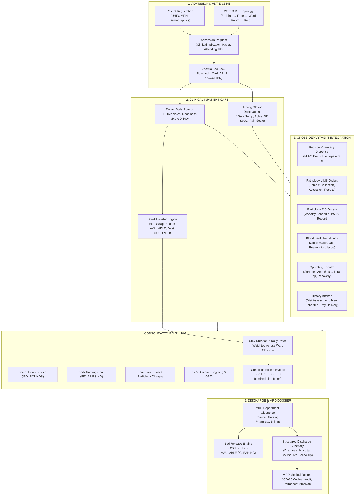
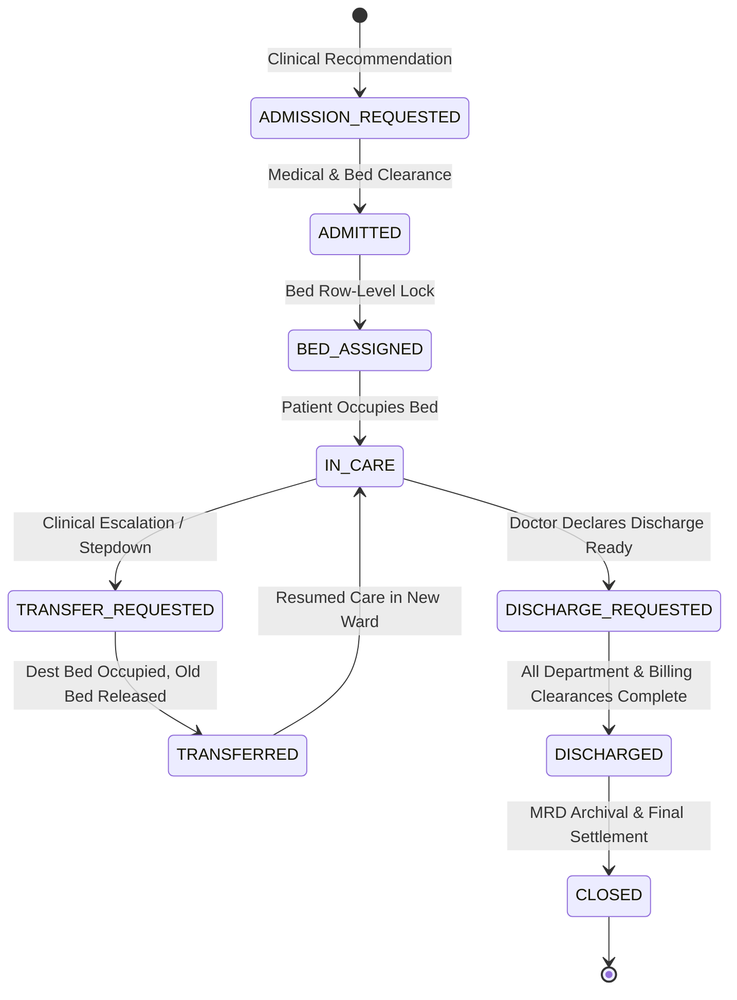

# DOC SEARCH — PHASE 10: HOSPITAL OPERATIONS
## ARCHITECTURE SPECIFICATION REPORT

> **PROTOCOL STEP**: `ARCHITECTURE`  
> **TIMESTAMP**: `2026-09-26T15:47:00+05:30`  
> **SCOPE**: Complete Hospital Operational Topology, Inpatient State Machines, Bed Management, Cross-Department Integration, and Billing Consolidation.

---

## 1. End-to-End Hospital Operations Architecture



---

## 2. Inpatient Admission State Machine

The inpatient admission follows a deterministic, unidirectional lifecycle preventing invalid state skips or regressions:



---

## 3. Bed Management Topology & State Machine

### 3.1 Facility Hierarchy
```text
Hospital Partner (TENANT)
  └── Operational Facility (BRANCH)
        └── Building
              └── Floor
                    └── Ward (ICU, HDU, GENERAL, ISOLATION, SUITE)
                          └── Room
                                └── Bed (dailyChargeRate, bedClass, status)
```

### 3.2 Bed Lifecycle States:
- `AVAILABLE`: Ready for immediate patient admission or transfer allocation.
- `RESERVED`: Temporarily held for incoming emergency or planned surgical admission.
- `OCCUPIED`: Currently housing an active inpatient; protected by unique allocation locks.
- `TRANSFER_PENDING`: Patient scheduled for transfer to another ward/bed.
- `CLEANING`: Released by discharged patient; awaiting housekeeping sanitization.
- `MAINTENANCE`: Out of service for biomedical or facility repairs.
- `BLOCKED`: Temporarily disabled by administrative or infection control policy.

---

## 4. Cross-Department Integration & Encounter Continuity

All department interactions preserve the canonical link:
$$\text{Patient UHID} \longleftrightarrow \text{Admission ID} \longleftrightarrow \text{Encounter ID} \longleftrightarrow \text{Bed ID}$$

1. **Pharmacy (`pharmacyDispensing`)**:
   - Inpatient orders are flagged with `dispensingMode: 'BEDSIDE_IPD'`.
   - FEFO batch deduction occurs automatically.
   - Dispensing metadata captures `encounterId` and `totalAmount` for interim and final bill aggregation.
2. **Pathology LIMS (`investigationOrders`)**:
   - Routine and STAT lab orders are placed by the attending physician.
   - Orders link to `encounterId` and `patientId`.
   - Result verification and panic values trigger notifications to the ward nursing station.
3. **Radiology RIS (`radiologyOrders`)**:
   - Diagnostic imaging (Chest X-Ray, CT, MRI, Ultrasound) orders link to `encounterId`.
   - Radiologist-reported findings are attached to the inpatient clinical timeline.
4. **Blood Bank (`bloodIssues`, `bloodCrossmatches`)**:
   - Transfusion requests require active cross-match against donor unit.
   - Issued units link directly to the recipient encounter with donor-to-patient traceability.
5. **Operating Theatre (`otSchedules`, `otCases`)**:
   - Surgical cases link to admission encounter, assigned surgeon, anesthetist, and OT suite.
   - Intra-operative notes and implant consumables flow to consolidated billing.
6. **Dietary (`dietaryOrders`, `dietaryMealDispatches`)**:
   - Attending doctor or clinical nutritionist prescribes diet type (Diabetic, Renal, NPO, Regular).
   - Kitchen schedules tray assembly, delivery to bed, and nursing confirmation.

---

## 5. Consolidated IPD Billing Aggregation Engine

The billing engine in [`InpatientManagementRepository.ts`](file:///c:/Users/alamr/OneDrive/Desktop/DOC%20SEARCH/apps/api-gateway/src/repositories/partner/InpatientManagementRepository.ts#L1140-L1450) executes a 6-stage aggregation:

$$\text{Subtotal} = \text{Bed Charges} + \text{Rounds Charges} + \text{Nursing Charges} + \text{Pharmacy Charges} + \text{Lab Charges} + \text{Radiology Charges}$$

$$\text{Total Payable} = \text{Subtotal} + \text{Tax (5\% GST)} - \text{Discount}$$

Itemized Service Line Items minted in `billingInvoiceItems`:
1. `IPD_BED`: Days occupied $\times$ Bed Daily Rate (pro-rated across ward transfers).
2. `IPD_NURSING`: Inpatient nursing & station care fees (₹300/day).
3. `IPD_ROUNDS`: Attending physician daily rounds fees (₹500/round).
4. `IPD_PHARMACY`: Inpatient pharmacy bedside dispensations.
5. `IPD_LAB`: Inpatient pathology and laboratory investigations.
6. `IPD_RADIOLOGY`: Inpatient diagnostic imaging and radiology fees.

---

## 6. Multi-Tenant & ScopeGuard Isolation

- **Zero Hardcoded UUID Fallbacks**: Purged all synthetic fallback UUIDs. All database queries resolve context dynamically from authenticated security claims (`tenantId`, `partnerId`, `branchId`).
- **Fail-Closed Gatekeeper**: If context cannot be authoritatively resolved, the system rejects the operation with `400 Bad Request` or `404 Not Found`.
- **Cross-Tenant Boundary**: Tenant B is completely blocked from accessing or mutating Tenant A admissions, beds, rounds, vitals, invoices, or discharge summaries.
