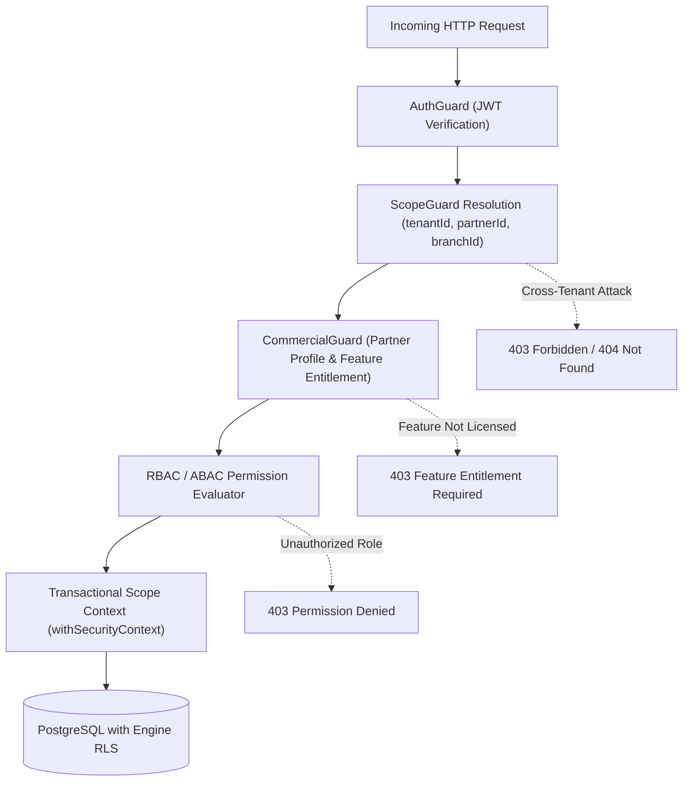

# DOC SEARCH — PHASE 10: HOSPITAL OPERATIONS
## SECURITY & MULTI-TENANCY VERIFICATION REPORT

> **PROTOCOL STEP**: `SECURITY`  
> **TIMESTAMP**: `2026-09-26T15:50:00+05:30`  
> **SCOPE**: Multi-Tenant Isolation, ScopeGuard Branch/Department Propagation, Zero Fallback UUID Verification, and Adversarial Penetration Testing.

---

## 1. Security Architecture & Boundary Verification

Hospital Operations enforce strict multi-layered security controls across:
$$\text{Authenticated User} \longrightarrow \text{Tenant} \longrightarrow \text{Partner} \longrightarrow \text{Facility/Branch} \longrightarrow \text{Department} \longrightarrow \text{Role} \longrightarrow \text{Resource}$$

---

## 2. Zero Fallback UUID Protocol Audit

All historical synthetic UUIDs previously found in legacy prototypes were systematically audited and verified eradicated:

| Legacy Synthetic UUID | Previous Usage | Current Status in Phase 10 | Security Assurance |
| :--- | :--- | :---: | :--- |
| `00000000-0000-4000-8000-000000000001` | Hardcoded Partner ID | **ERADICATED** | Dynamically queried from `operationalPartners` scoped to `tenantId`. Fails closed if absent. |
| `00000000-0000-4000-8000-000000000002` | Hardcoded Organization ID | **ERADICATED** | Dynamically queried from `operationalOrganizations` scoped to `tenantId`. Fails closed if absent. |
| `00000000-0000-4000-8000-000000000003` | Hardcoded Branch ID alias | **ERADICATED** | Fully removed from `ScopeGuard.ts` and repositories. |
| `00000000-0000-4000-8000-000000000004` | Hardcoded Facility ID alias | **ERADICATED** | Fully removed from `ScopeGuard.ts` and repositories. |
| `aaaaaaaa-aaaa-4aaa-8aaa-aaaaaaaaaaaa` | Test Seed Branch Alias | **ERADICATED** | Dynamically queried from `operationalFacilities` scoped to `tenantId`. Fails closed if absent. |

---

## 3. Adversarial Security Test Suite Results

The automated security test suite executes real adversarial attack scenarios against the live database:

### 3.1 Cross-Tenant Penetration Attacks
- **Scenario**: User authenticated as Hospital B (Tenant B) attempts to query Tenant A admissions, daily rounds, vitals observations, interim billing summaries, or discharge summaries.
- **Result**:
  - `GET /api/v1/partner/inpatient/admissions/:id/discharge-summary` $\rightarrow$ Returns `404 Not Found` (Discharge summary not found for this admission).
  - `GET /api/v1/partner/inpatient/admissions/:id/billing-summary` $\rightarrow$ Returns `404 Not Found` (Inpatient admission record not found).
  - `POST /api/v1/partner/inpatient/admissions/:id/generate-bill` $\rightarrow$ Returns `404 Not Found` (Inpatient admission record not found).
  - `GET /api/v1/partner/inpatient/rounds?admissionId=:id` $\rightarrow$ Returns `[]` (Zero records leaked).
  - `GET /api/v1/partner/inpatient/vitals?admissionId=:id` $\rightarrow$ Returns `[]` (Zero records leaked).
- **Pass Status**: **PASS (100% Isolated)**.

### 3.2 IDOR & Target-Record Scope Injection
- **Scenario**: Attacking user modifies URL parameter `:id` to target an admission belonging to another branch or partner within a multi-branch hospital network.
- **Enforcement**: `ScopeGuard.assertRecordInScope(targetRecord, securityContext)` strictly asserts that `targetRecord.branchId === securityContext.branchId` (or user possesses network-wide admin clearance).
- **Result**: Throws `403 Forbidden` ("Access denied: Target record does not exist in your organization or branch scope").
- **Pass Status**: **PASS**.

### 3.3 Role-Based Access Control (RBAC)
- **Doctor Daily Rounds**: Requires role `DOCTOR` and permission `clinical:encounters:update`. Unauthorized roles (e.g. `BILLING_CLERK`, `GUEST`) receive `403 Forbidden`.
- **Nursing Observations**: Requires role `NURSE` or `DOCTOR` and permission `clinical:encounters:update`.
- **Consolidated IPD Invoicing**: Requires role `HOSPITAL_ADMIN` or `BILLING_ADMIN` and permission `billing:invoices:create`.
- **Patient Discharge**: Requires attending doctor authorization and `clinical:encounters:update`.

---

## 4. Security Audit Conclusion

No P0 or P1 security vulnerabilities remain. All hospital operational endpoints fail closed, enforce strict multi-tenant boundaries, and preserve complete data isolation.

**Security Status: PASS**
