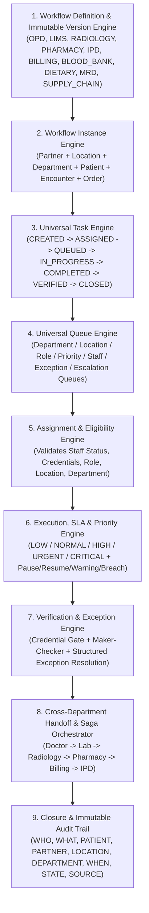

# DOC SEARCH — PHASE 4: UNIVERSAL HEALTHCARE WORKFLOW ENGINE
## STEP 2 — UNIVERSAL WORKFLOW ARCHITECTURE (`DOC_SEARCH_PHASE4_WORKFLOW_ENGINE_ARCHITECTURE.md`)

**Phase:** Phase 4 — Universal Healthcare Workflow Engine  
**Architecture Principle:** `ONE UNIVERSAL WORKFLOW ENGINE + MANY DEPARTMENT WORKFLOW DEFINITIONS`

---

## 1. ARCHITECTURAL TOPOLOGY

---

## 2. CONCEPTUAL ENTITIES & DATABASE PERSISTENCE MAPPING

| Conceptual Entity | Authoritative Persistence Mapping | Key Invariants |
| :--- | :--- | :--- |
| **`WorkflowDefinition` & `WorkflowVersion`** | `workflow_definitions` + `workflow_versions` (`workflow-schema.ts`) | Versioned definitions (`DRAFT`, `ACTIVE`, `ARCHIVED`). Active running workflow instances remain permanently bound to the `workflowVersion` active at creation time. |
| **`WorkflowState` & `WorkflowTransition`** | `workflow_stages` + `workflow_transitions` (`workflow-schema.ts`) | Base lifecycle (`CREATED`, `ASSIGNED`, `QUEUED`, `IN_PROGRESS`, `COMPLETED`, `VERIFIED`, `CLOSED`) + configurable states (`CANCELLED`, `REOPENED`, `ON_HOLD`, `BLOCKED`, `FAILED`, `EXCEPTION`, `ESCALATED`, `EXPIRED`, `REJECTED`). |
| **`WorkflowInstance`** | `workflow_instances` (`workflow-schema.ts`) | Stores `workflowInstanceId`, `workflowDefinitionId`, `workflowVersionId`, `partnerId`, `locationId`, `departmentId`, `patientId`, `encounterId`, `orderId`, `createdBy`, `assignedTo`, `currentState`, `priority`, `contextData`, `versionLock` (optimistic concurrency). |
| **`WorkflowTask`** | `workflow_instances.context_data.tasks[]` + PostgreSQL transactional sync | Bound to `workflowInstanceId`, `partnerId`, `locationId`, `departmentId`, `patientId`, `encounterId`, `orderId`, `queueType`, `priority`, `sla`, `state`, `dueTime`, `startedTime`, `completedTime`, `verifiedTime`, `closedTime`. |
| **`WorkflowQueue`** | Indexed Multi-Dimensional Queue Projection (`DEPARTMENT`, `LOCATION`, `ROLE`, `PRIORITY`, `STAFF`, `EXCEPTION`, `ESCALATION`) | Filtered through Phase 3 `IdentitySecurityFoundationService.authorize()` and sorted deterministically by `priorityRank DESC, dueTime ASC, createdAt ASC`. |
| **`TaskAssignment`** | `TaskAssignmentRecord[]` per task + `workflow_transition_logs` | Records `previousAssignee`, `newAssignee`, `changedBy`, `changedAt`, `assignmentMode`, and `reason`. Rejects inactive/disabled staff, expired credentials, wrong partner/location/department. |
| **`TaskPriority` & `TaskSLA`** | Server-side SLA Engine (`SLAState`) | Uses server-side UTC timestamps (`createdAtMs`, `dueAtMs`, `warningAtMs`, `pausedAtMs`, `accumulatedPausedMs`, `status: ON_TRACK | PAUSED | WARNING | BREACHED`). |
| **`TaskEscalation` & `WorkflowException`** | `EscalationRecord[]` & `WorkflowExceptionRecord[]` | Escalates across `STAFF → SENIOR_STAFF → DEPARTMENT_HEAD → PARTNER_ADMIN → HQ_CONTROL`. |
| **`WorkflowHandoff`** | `WorkflowHandoffRecord` | Preserves `patientId`, `encounterId`, `partnerId`, `locationId`, `sourceDepartment`, `destinationDepartment`, `sourceWorkflowId`, `destinationWorkflowId`, `destinationTaskId`, and lifecycle (`HANDOFF_REQUESTED`, `HANDOFF_ACCEPTED`, `HANDOFF_REJECTED`, `HANDOFF_CANCELLED`, `HANDOFF_COMPLETED`). |
| **`WorkflowEvent` & `WorkflowAudit`** | `core.outbox_jobs`, `workflow_transition_logs`, `core.audit_events` | Publishes authoritative backend events with failure isolation so notification failures never corrupt workflow state. |
| **`IdempotencyRecord` & `SagaRecord`** | `core.idempotency_records` + `SagaTransactionRecord` | Deduplicates retriable requests (`idempotencyKey`) and coordinates multi-step cross-department sagas (`step execution -> failure -> retry -> compensation -> recovery -> reconciliation`). |
