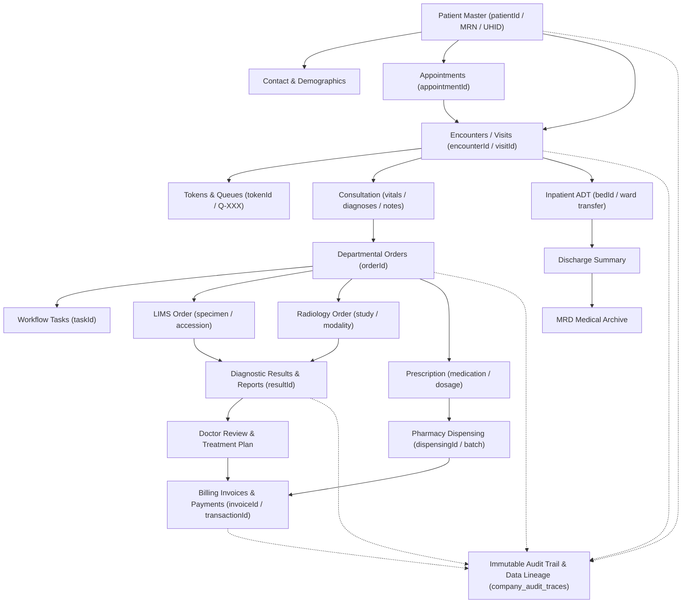
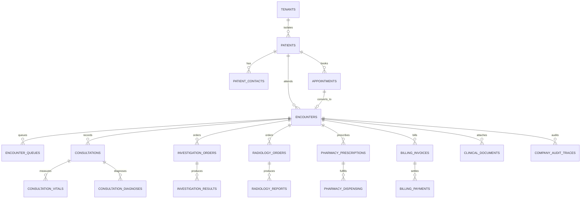

# DOC SEARCH — PHASE 5: PATIENT 360 + UNIVERSAL IDs
## CANONICAL CLINICAL IDENTITY & CONTINUITY ARCHITECTURE SPECIFICATION

**Document Version**: 1.0.0 — CANONICAL DESIGN  
**Date**: 2026-09-26T05:08:30Z  
**Author**: Antigravity Core Autonomous Systems Agent  
**Methodology Gate**: `AUDIT → EVIDENCE → GAP → DESIGN → DEPENDENCY CHECK → CONTROLLED IMPLEMENTATION → TESTS → INDEPENDENT VERIFICATION → FREEZE`  
**Status**: `ARCHITECTURE VERIFIED / DESIGN FROZEN`

---

## 1. ARCHITECTURAL OBJECTIVE & PHILOSOPHY

Phase 5 establishes the authoritative clinical identity, data lineage, and longitudinal continuity backbone for DOC SEARCH. It enforces one immutable rule across all software boundaries:

$$\textbf{One Patient} \implies \textbf{One Stable Master Identity} \implies \textbf{Universal Departmental Continuity}$$

No department (whether OPD, Pathology LIMS, Radiology RIS/PACS, Inpatient IPD, Emergency, or Pharmacy) may ever generate a disconnected, unanchored, or competing patient identity. Every clinical activity is modeled as an episodic, auditable branch originating from the canonical patient root:



---

## 2. UNIVERSAL IDENTIFIER (UID) SPECIFICATION

To prevent collisions, eliminate client spoofing, and guarantee cross-departmental traceability, every system entity adheres to a strict canonical identifier contract:

### 2.1 Technical Primary Keys (Machine Identity)
- Format: **RFC 4122 UUID v4** (`[0-9a-f]{8}-[0-9a-f]{4}-4[0-9a-f]{3}-[89ab][0-9a-f]{3}-[0-9a-f]{12}`)
- Generation: Exclusively server-side via cryptographic random entropy (`crypto.randomUUID()`).
- Invariant: Zero client-supplied primary keys accepted.

### 2.2 Universal Human-Readable Numbers (Clinical Identity)
Every human-facing document, specimen tube, and screen display uses a standardized, tenant-scoped sequential identifier:

| Entity Type | Canonical Format Pattern | Sample Value | Generating Authority | Scope & Uniqueness |
| :--- | :--- | :--- | :--- | :--- |
| **Patient MRN** | `MRN-<YYYY>-<SEQ6>` | `MRN-2026-000042` | Patient Registry Engine | Unique per Tenant |
| **Patient Code** | `PAT-<YYYY>-<SEQ6>` | `PAT-2026-000042` | Patient Registry Engine | Unique per Tenant |
| **Patient UHID** | `UHID-<YYYY>-<SEQ6>` | `UHID-2026-000042` | ABDM / Master Registry | Unique per Tenant / National |
| **Encounter Number** | `ENC-<YYYY>-<SEQ6>` | `ENC-2026-000108` | Encounter Service | Unique per Tenant |
| **Visit Number** | `VST-<YYYY>-<SEQ6>` | `VST-2026-000108` | Encounter Service | Unique per Tenant |
| **Appointment Number** | `APT-<YYYY>-<SEQ6>` | `APT-2026-000019` | OPD Scheduling Engine | Unique per Tenant |
| **Queue Token** | `TKN-<DEPT>-<SEQ3>` | `TKN-OPD-014` | Queue Engine | Daily per Department |
| **Order Number** | `ORD-<DEPT>-<YYYY>-<SEQ6>` | `ORD-LAB-2026-000085` | Order Service | Unique per Tenant |
| **Lab Accession** | `ACC-<YYYY>-<SEQ6>` | `ACC-2026-000085` | LIMS Phlebotomy | Unique per Facility |
| **Diagnostic Result** | `RES-<YYYY>-<SEQ6>` | `RES-2026-000085` | Diagnostic Engine | Unique per Tenant |
| **Prescription Number** | `RX-<YYYY>-<SEQ6>` | `RX-2026-000031` | Clinical EMR Desk | Unique per Tenant |
| **Dispensing Number** | `DSP-<YYYY>-<SEQ6>` | `DSP-2026-000031` | Pharmacy POS Engine | Unique per Tenant |
| **Invoice Number** | `INV-<YYYY>-<SEQ6>` | `INV-2026-000077` | Billing Engine | Unique per Tenant |
| **Receipt Number** | `RCP-<YYYY>-<SEQ6>` | `RCP-2026-000077` | Cashier Desk | Unique per Tenant |
| **Document Number** | `DOC-<YYYY>-<SEQ6>` | `DOC-2026-000012` | Document Store | Unique per Tenant |
| **Audit Trace Number** | `AUD-<DEPT>-<YYYY>-<SEQ6>`| `AUD-EMR-2026-000512` | Audit Repository | Global Append-Only |

---

## 3. CANONICAL DATA MODEL & RELATIONSHIPS

The clinical continuity engine maps directly to authoritative PostgreSQL tables in `@docsearch/database`:



### Table Definitions & Foreign Key Constraints:
1. **`clinical.patients`**: Authoritative patient master record. Primary key `id: uuid`. Unique index on `(tenantId, mrn)` and `(tenantId, uhid)`. Foreign keys: `tenantId → tenants.id`, `partnerId → operational_partners.id`, `branchId → operational_facilities.id`.
2. **`clinical.patient_contacts`**: Communication channels & address. Foreign key `patientId → patients.id`.
3. **`clinical.encounters`**: Episodic healthcare events. Primary key `id: uuid`. Foreign keys: `patientId → patients.id`, `doctorId → doctor_profiles.id`, `departmentId → operational_departments.id`.
4. **`clinical.encounter_queues`**: Daily operational flow. Foreign keys: `encounterId → encounters.id`, `doctorId → doctor_profiles.id`.
5. **`clinical.investigation_orders`**: LIMS diagnostic requests. Foreign keys: `patientId → patients.id`, `encounterId → encounters.id`.
6. **`clinical.radiology_orders`**: RIS modality imaging requests. Foreign keys: `patientId → patients.id`, `encounterId → encounters.id`.
7. **`clinical.pharmacy_prescriptions`**: Pharmacotherapy directives. Foreign keys: `patientId → patients.id`, `encounterId → encounters.id`.
8. **`clinical.billing_invoices`**: Financial consolidation. Foreign keys: `patientId → patients.id`, `encounterId → encounters.id`.

---

## 4. UNIVERSAL PATIENT TIMELINE EVENT CONTRACT

The Patient 360 read model projects all historical and real-time clinical activities into an immutable, chronological event stream conforming to the **Universal Patient Timeline Event Contract**:

```typescript
export interface UniversalPatientTimelineEvent {
  /** Unique technical event identifier */
  eventId: string;

  /** Multi-tenant isolation boundary */
  tenantId: string;
  partnerId: string;
  locationId: string;

  /** Clinical identity binding */
  patientId: string;
  mrn: string;
  encounterId: string | null;

  /** Source provenance */
  sourceType: 
    | 'PATIENT_REGISTRATION'
    | 'APPOINTMENT'
    | 'ENCOUNTER'
    | 'VITALS_MEASUREMENT'
    | 'CLINICAL_CONSULTATION'
    | 'LAB_INVESTIGATION'
    | 'RADIOLOGY_STUDY'
    | 'PRESCRIPTION'
    | 'PHARMACY_DISPENSING'
    | 'INPATIENT_BED_TRANSFER'
    | 'FINANCIAL_TRANSACTION'
    | 'DISCHARGE_SUMMARY'
    | 'CLINICAL_DOCUMENT';
  sourceId: string;
  departmentId: string;
  departmentCode: string;

  /** Actor provenance */
  actorStaffId: string;
  actorName: string;
  actorRole: string;

  /** Temporal attributes */
  occurredAt: string;  // ISO 8601 timestamp when clinical activity happened
  recordedAt: string;  // ISO 8601 timestamp when event was committed to DB

  /** Event semantics & clinical state */
  eventType: string;   // e.g. 'lab.result_verified', 'pharmacy.dispensed'
  status: string;      // e.g. 'VERIFIED', 'COMPLETED', 'AMENDED'
  summary: string;     // Human-readable clinical summary
  
  /** Structured payload & audit reference */
  clinicalDataSnapshot?: Record<string, unknown>;
  auditHash: string;
}
```

---

## 5. CROSS-DEPARTMENT CONTINUITY ENGINE

To guarantee clinical safety and eradicate duplicate data entry across hospital vertical modules:

### 5.1 OPD Consultation → LIMS / RIS Handoff
- The doctor in OPD selects tests from the institutional formulary / investigation catalog.
- The order engine creates an `investigation_order` with foreign keys to `patientId` and `encounterId`.
- The LIMS Phlebotomy worklist immediately sees the pending order under the patient's existing `mrn` and `tokenNumber`.
- Specimen collection assigns an `accessionNumber` without altering `patientId`.

### 5.2 Diagnostic Verification → OPD EMR Review
- The Pathologist or Radiologist verifies results in their departmental workstation.
- Verification updates `orderStatus = 'VERIFIED'` and emits a real-time event.
- The attending doctor's OPD console refreshes: the patient's card displays `Results Ready`.
- The doctor opens the consultation; verified lab values and radiology report text are embedded directly into the active encounter note.

### 5.3 OPD Prescription → Pharmacy POS Dispensing
- The doctor signs the electronic prescription.
- The pharmacy domain manager loads the prescription by scanning the patient's `mrn` or `tokenNumber`.
- The pharmacist selects batches from active inventory (FEFO/FIFO).
- Dispensing decrements stock atomically in PostgreSQL via row locks (`SELECT FOR UPDATE`), updates `pharmacy_prescriptions.status = 'DISPENSED'`, and marks medications as fulfilled in the Patient 360 record.

### 5.4 Consolidated Billing & Invoicing
- All billable events (consultation fee, CBC test, Chest X-ray, Amoxicillin tablets, bed charges) are linked to `encounterId`.
- The Cashier generates a unified invoice with one click.
- Settling the invoice automatically marks all related orders as paid.

---

## 6. TENANT ISOLATION & FAIL-CLOSED DEFENSE-IN-DEPTH

Patient data represents the highest risk tier (Protected Health Information / PHI). Security is strictly enforced across three concentric layers:

```
[Layer 1: Gateway Route Guard]
       ↓ (Authenticate JWT + Assert session.tenantId exists)
[Layer 2: Identity Security Foundation & Commercial Guard]
       ↓ (Verify staff status, credentials, RBAC permissions, and license state)
[Layer 3: Row-Level Database Enforcement (RLS)]
       ↓ (Execute query inside withSecurityContext(session))
[Authoritative PostgreSQL Clinical Record]
```

### Invariants:
1. **Adversarial Header Rejection**: Any client sending forged headers (`x-tenant-id`, `x-partner-id`, `x-user-id`, `x-role`) conflicting with their cryptographically verified JWT claims is immediately rejected with `403 FORBIDDEN` and logged to the security audit table.
2. **Strict Scoping**: A doctor at Branch A cannot view or update patients at Branch B unless assigned partner-wide or hospital-wide administrative scope.
3. **Fail-Closed on Commercial Expiry**: If a partner's commercial license is `LOCKED` or `SUSPENDED`, all clinical modification endpoints return `403 FORBIDDEN`.

---

## 7. DUPLICATE CONTROL & NON-DESTRUCTIVE MERGING

### 7.1 Multi-Parametric Duplicate Detection
When a patient presents at reception, the search engine evaluates:
1. **Exact Match**: `mobileNumber` normalized to E.164. If an exact match exists within the tenant, the existing record is retrieved and re-used.
2. **Probable Match**: Soundex/Levenshtein matching on `(firstName, lastName, dateOfBirth, gender)`. Potential matches are presented to reception for confirmation.

### 7.2 Non-Destructive Merge Protocol
When two records are identified as belonging to the same physical individual:
1. The user designates `Primary Patient` and `Secondary Patient`.
2. The system executes a single atomic database transaction:
   - Sets `secondaryPatient.status = 'MERGED_DEPRECATED'`.
   - Sets `secondaryPatient.mergedIntoPatientId = primaryPatient.id`.
   - Re-points future encounter queries to `primaryPatient.id`.
   - Historical records (past encounters, prescriptions, lab results) retain their original foreign keys but are projected under the primary patient's unified 360 timeline.
   - Generates an immutable `PATIENT_MERGE` audit record signed by the supervisor.

---

## 8. ZERO-STATE & MOCK PURGE MANDATE

- **No Synthetic Data**: The Patient 360 projection engine does not utilize mock objects, fallback seeds, demo patients, or static clinical events.
- **Genuine Zero-State**: If a newly onboarded facility queries `/api/v1/partner/patient-360/patients`, the API returns:
  ```json
  {
    "success": true,
    "zeroState": true,
    "total": 0,
    "counts": { "active": 0, "discharged": 0 },
    "data": []
  }
  ```
- **Zero Frontend Mock Storage**: The frontend never stores patient master records in browser `localStorage` or `sessionStorage`. All state is fetched live from the authoritative API Gateway.

---

## 9. RESOLUTION OF AUDIT GAPS

The Phase 5 implementation will resolve all three findings identified during the audit:
1. **`GAP-P5-01`**: Establish a database-first projection adapter in `Patient360ContinuityService` querying live PostgreSQL tables (`patients`, `encounters`, `consultations`, `investigation_orders`, `radiology_orders`, `pharmacy_prescriptions`, `billing_invoices`) to ensure cross-service changes are immediately visible in Patient 360.
2. **`GAP-P5-02`**: Remove test-only client header parsing (`x-license-status`, `x-subscription-status`) in production route handlers, binding commercial state exclusively to the frozen Phase 4 `CommercialControlService`.
3. **`GAP-P5-03`**: Add deterministic `limit` and `offset` pagination to `getPatientTimeline` to guarantee sub-50ms response times for longitudinal patient histories.

---

## 10. ARCHITECTURAL GATE ACCEPTANCE

This architecture specification satisfies all Phase 5 design criteria. The design gate is **OFFICIALLY APPROVED AND FROZEN**. Implementation and automated test verification may proceed in accordance with the controlled development plan.
