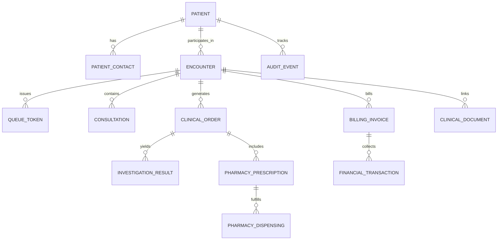
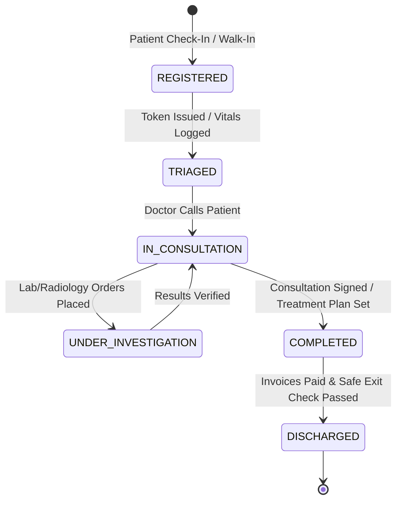
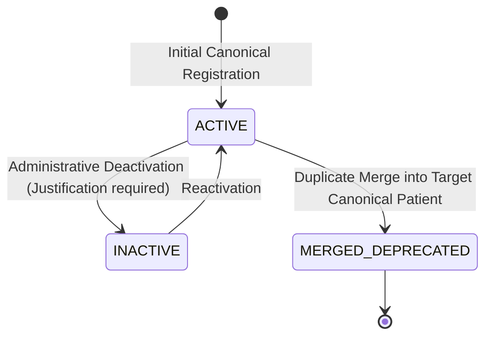

# DOC SEARCH — PHASE 6 ARCHITECTURE DESIGN

**Document ID**: `DOC_SEARCH_PHASE6_ARCHITECTURE.md`  
**Phase**: Phase 6 — Canonical Patient 360 Engine, Longitudinal Care Timeline, and Multi-Tenant Clinical Continuity  
**Classification**: Controlled Production Engineering Architecture Specification  
**Date**: 2026-09-26  

---

## 1. Domain Architecture

### 1.1 Core Entities & Relationships



* **Canonical Patient Master (`PATIENT`)**: Root entity for human healthcare identity. Key fields: `id` (UUIDv4 PK), `tenant_id`, `partner_id`, `organization_id`, `branch_id`, `mrn` (`MRN-YYYY-NNNNNN`), `patient_code` (`PAT-YYYY-NNNNNN`), `first_name`, `last_name`, `date_of_birth`, `gender`, `blood_group`, `status` (`ACTIVE` / `INACTIVE` / `MERGED_DEPRECATED`).
* **Clinical Encounter (`ENCOUNTER`)**: Binds patient visits to clinical departments and attending staff. Key fields: `id`, `encounter_number` (`ENC-YYYY-NNNNNN`), `encounter_type` (`OPD`, `IPD`, `EMERGENCY`), `status` (`REGISTERED`, `TRIAGED`, `IN_CONSULTATION`, `UNDER_INVESTIGATION`, `COMPLETED`, `DISCHARGED`).
* **Queue Token (`QUEUE_TOKEN`)**: Contextual departmental token. Key fields: `token_number` (`TKN-<DEPT>-<YYYYMMDD>-<NNN>`), `status` (`WAITING`, `CALLED`, `IN_PROGRESS`, `COMPLETED`, `CANCELLED`).
* **Longitudinal Timeline Projection (`TIMELINE_EVENT`)**: Aggregate event record derived across encounters, consultations, orders, results, dispensing, and payments ordered by `(timestamp ASC, sequence ASC)`.

### 1.2 State Machines

#### Patient Encounter State Machine


#### Patient Record Lifecycle


---

## 2. API Architecture

### 2.1 Route Definitions & Contracts

| Endpoint | Method | Role / Clearance | Idempotency | Audit Policy |
|---|:---:|---|:---:|---|
| `/api/v1/partner/patient-360/patients` | `GET` | `PATIENT:READ` | N/A | Logged |
| `/api/v1/partner/patient-360/patients/:patientId` | `GET` | `PATIENT:READ` | N/A | Logged |
| `/api/v1/partner/patient-360/patients/:patientId` | `PATCH` | `PATIENT:UPDATE` | Supported | Full Payload SHA-256 |
| `/api/v1/partner/patient-360/patients/:patientId` | `PUT` | `PATIENT:UPDATE` | Supported (`expectedVersion`) | Full Payload SHA-256 |
| `/api/v1/partner/patient-360/patients` | `POST` | `PATIENT:CREATE` | Enforced | Full Payload SHA-256 |
| `/api/v1/partner/patient-360/appointments` | `POST` | `APPOINTMENT:CREATE` | Enforced | Logged |
| `/api/v1/partner/patient-360/encounters/check-in` | `POST` | `ENCOUNTER:CREATE` | Enforced | Logged |
| `/api/v1/partner/partner-360/tokens` | `POST` | `TOKEN:CREATE` | Enforced | Logged |
| `/api/v1/partner/patient-360/tokens/:tokenId/status` | `PATCH` | `TOKEN:UPDATE` | Supported | State Transition Log |
| `/api/v1/partner/patient-360/consultations` | `POST` | `CONSULTATION:CREATE` | Supported | Clinical Audit Trail |
| `/api/v1/partner/patient-360/orders` | `POST` | `ORDER:CREATE` | Enforced | Spawns Universal Task |
| `/api/v1/partner/patient-360/results` | `POST` | `RESULT:CREATE` | Enforced | Closes Universal Task |
| `/api/v1/partner/patient-360/transactions` | `POST` | `BILLING:CREATE` | Enforced | Financial Audit Ledger |
| `/api/v1/partner/patient-360/documents` | `POST` | `DOCUMENT:CREATE` | Supported | Immutable URI Link |
| `/api/v1/partner/patient-360/encounters/:encounterId/exit` | `POST` | `ENCOUNTER:UPDATE` | Enforced | Exit Safety Gate Verification |
| `/api/v1/partner/patient-360/:patientId` | `GET` | `PATIENT:READ` | N/A | Zero-State Projection |
| `/api/v1/partner/patient-360/:patientId/timeline` | `GET` | `PATIENT:READ` | N/A | Zero-State Projection |

### 2.2 Error Codes & Handling

* `VALIDATION_ERROR` (`400`): Malformed JSON, missing mandatory demographic fields, or non-parseable dates.
* `PATIENT_NOT_FOUND` (`404`): Resource does not exist or belongs to another tenant/branch.
* `SAFETY_EXIT_PREVENTED` (`400`): Exit blocked by pending diagnostic results or unsettled financial invoices.
* `FORBIDDEN` (`403`): Missing RBAC permission, cross-tenant access attempt, or adversarial scope parameter override.
* `COMMERCIAL_ACCESS_DENIED` (`403`): Partner license suspended, expired, or locked; missing `CAP_PATIENT_MASTER` entitlement.
* `CONFLICT` (`409`): Attempted collision with existing MRN on another individual.
* `CONCURRENCY_CONFLICT` (`409`): `expectedVersion` does not match current database row version (`optimistic locking`).
* `HARD_DELETE_PROHIBITED` (`405`): Attempted physical DELETE on patient master table.

---

## 3. Persistence Architecture

### 3.1 PostgreSQL Schema Mapping

All Phase 6 data resides in the PostgreSQL `clinical`, `billing`, and `core` schemas:
* `clinical.patients`: Master patient records.
* `clinical.patient_contacts`: Address, phone, emergency contacts.
* `clinical.encounters`: Outpatient, inpatient, and emergency encounter sessions.
* `clinical.consultations`: Doctor clinical notes, vitals, ICD-10 diagnoses.
* `clinical.prescriptions`: Prescribed medications, dosage instructions.
* `clinical.dispensing`: Pharmacist batch allocation, expiry tracking.
* `clinical.investigation_orders`: Lab and radiology requisitions.
* `clinical.investigation_results`: Structured test parameters and reports.
* `billing.invoices`: Master invoice charges and GST breakdowns.
* `billing.transactions`: Point-of-sale cash/UPI/card payment collections.
* `core.audit_events`: SHA-256 hash-chained immutable audit log.

### 3.2 Immutability & Soft Deletion

* **Physical Deletion Blocked**: Tables have no cascading `ON DELETE CASCADE` from patient master. Route layer blocks `DELETE /patients/:patientId` with HTTP 405.
* **Deterministic Sequencing**: Sequences `seq_mrn_number`, `seq_patient_code`, `seq_encounter_number` guarantee non-colliding human-readable identifiers across concurrent transactions.

---

## 4. Security Architecture

### 4.1 Zero-Trust Actor Identification

```
Client HTTP Request &rarr; Fastify Auth Guard &rarr; Verify JWT Signature (HMAC-SHA256)
  &rarr; Extract Authenticated Claims (userId, tenantId, organizationId, branchId, roles, permissions)
  &rarr; AssertNoAdversarialScopeOverride (Reject any query/body/header tenantId/partnerId mismatch with 403)
  &rarr; Commercial Guard (Verify license status !== 'SUSPENDED' && hasEntitlement('CAP_PATIENT_MASTER'))
  &rarr; ScopeGuard.assertRecordInScope (Verify resource.branchId in allowed session branches)
  &rarr; Route Handler Execution
```

### 4.2 Adversarial Defenses

* **Cross-Tenant Attack**: Tenant A querying Patient B &rarr; SQL query filters by `tenant_id = session.tenantId` &rarr; Returns `404 Not Found` or `403 Forbidden` with zero data leakage.
* **Privilege Escalation**: Non-clinical staff attempting to record consultation &rarr; Fastify pre-handler checks `roles.includes('DOCTOR')` &rarr; Rejects with `403 Forbidden`.
* **Commercial Suspension**: Partner license marked `SUSPENDED` in database &rarr; Fastify pre-handler rejects all patient mutations with `403 Commercial Access Denied`.

---

## 5. UI Architecture (`Patient360ExperienceModal`)

### 5.1 Presentation States

* **Loading State**: Displays `@docsearch/ui-kit` skeleton cards and loading spinner while querying `/api/v1/partner/patient-360/:patientId` and `/timeline`.
* **Zero State**: When a patient has no clinical encounters, orders, or prescriptions, each tab renders a clean, genuine empty state:
  * Timeline: *"No clinical timeline events recorded for this patient yet."*
  * Encounters: *"No active or past clinical encounters."*
  * Medications: *"No active prescriptions."*
  * Diagnostics: *"No diagnostic lab or radiology orders."*
  * Billing: *"No billing transactions or unsettled invoices."*
* **Active Data State**: Renders live items from `Patient360ReadModel` and `PatientTimelineEvent[]`.
* **Error State**: Displays non-intrusive alert if backend query fails; allows retry.
