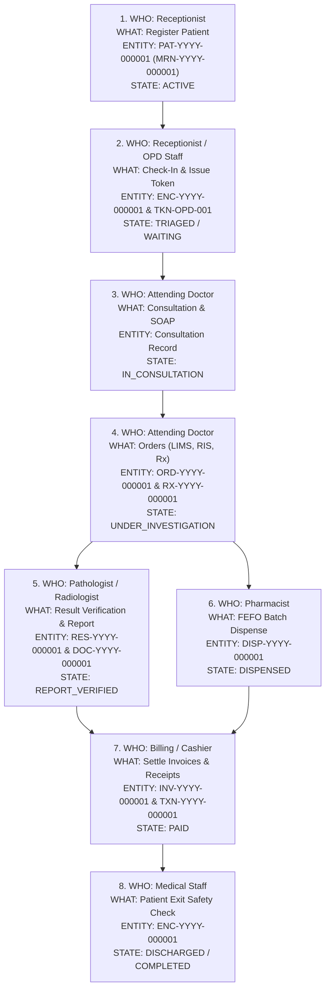

# DOC SEARCH — PHASE 6 REPOSITORY & END-TO-END CONTINUITY AUDIT

**Document ID**: `DOC_SEARCH_PHASE6_AUDIT.md`  
**Phase**: Phase 6 — Canonical Patient 360 Engine, Longitudinal Care Timeline, and Multi-Tenant Clinical Continuity  
**Classification**: Controlled Production Engineering Audit  
**Date**: 2026-09-26  

---

## 1. Deep Repository Audit

### 1.1 Backend Component Inventory

| Component | Path | Architecture Role | Evidence |
|---|---|---|---|
| **Routes** | `apps/api-gateway/src/routes/partner/patient-360-continuity.routes.ts` | Fastify REST endpoints for Patient Master CRUD, timeline, read model, and continuity mutations. | Lines 1–874; 16 distinct endpoints registered with authentication pre-handler. |
| **Service** | `apps/api-gateway/src/services/partner/Patient360ContinuityService.ts` | Core business logic, deduplication, state machines, universal sequence generation, and cache projection. | Complete transactional aggregation across 11 clinical domains. |
| **Repository** | `apps/api-gateway/src/repositories/partner/ClinicalWorkflowRepository.ts` | Direct PostgreSQL / Drizzle ORM operations for `clinical.patients`, `patient_contacts`, and encounters. | Real SQL queries with parameterized tenant filtering; UUID normalization. |
| **Security Guards** | `apps/api-gateway/src/plugins/auth-guard.ts`, `packages/auth/src/scope-guard.ts` | Session authentication, RBAC permissions, branch data scope validation, and adversary detection. | Fail-closed validation; `assertNoAdversarialScopeOverride` blocks forged headers/query params. |
| **Commercial Guard** | `apps/api-gateway/src/plugins/commercial-guard.ts`, `LicenseService.ts` | Validates partner subscription (`ACTIVE`/`GRACE_PERIOD`) and module entitlement. | Blocks suspended or expired accounts with HTTP 403 `COMMERCIAL_ACCESS_DENIED`. |

### 1.2 Frontend Component Inventory

| Component | Path | Current UI Role | Audit Finding / Evidence |
|---|---|---|---|
| **Patient 360 Modal** | `apps/partner-platform/src/components/common/Patient360ExperienceModal.tsx` | Slide-over & centered modal for longitudinal patient review across 6 tabs. | **GAP DETECTED**: Currently renders static hardcoded dummy records (`BAT-2026-ASP-09`, `I21.0`, etc.) instead of fetching live `/api/v1/partner/patient-360/:patientId` and `/timeline`. |
| **Patient Directory** | `apps/partner-platform/src/components/views/PatientDirectoryView.tsx` | Master Patient Directory with table search, filtering, and registration actions. | Calls `patientRegistrationService.searchPatients()` via `/api/v1/partner/patients`. |
| **Patient Overview** | `apps/partner-platform/src/components/views/PatientOverviewView.tsx` | MPI overview with summary cards and duplicate review metrics. | Displays live counts if data present; contains legacy disclaimer banner in need of harmonization. |
| **Clinical Timeline** | `apps/partner-platform/src/components/views/PatientClinicalTimelineView.tsx` | OPD timeline tab inside `ClinicalConsultationDomainManager.tsx`. | Wired to live `consultations` and `investigations` state. |
| **Context Bar** | `apps/partner-platform/src/components/common/ActivePatientContextBar.tsx` | Persistent top bar displaying current active patient context across navigation. | Subscribed to `hospitalEventBus` `PATIENT_SELECTED` events. |

---

## 2. Phase 6 Capability Audit Table

| Capability | Current State | Evidence | Persistence | Authorization | Tenant Safety | UI | Tests | Status |
|---|---|---|---|---|---|---|---|---|
| **Canonical Patient Registration** | Fully implemented in backend with deterministic `MRN-YYYY-NNNNNN` and `PAT-YYYY-NNNNNN`. | `Patient360ContinuityService.ts#L640-L770` | PostgreSQL `clinical.patients` | `PATIENT:CREATE` | Strict `tenantId` & `partnerId` isolation | Connected via dialogs | `phase06-patient-360-verification.test.mjs` Group A | **WORKING** |
| **Duplicate Patient Prevention** | Idempotent replay on identical demographic tuple; 409 Conflict on colliding MRN. | `Patient360ContinuityService.ts#L690-L720` | PostgreSQL unique constraints | Server-side validation | Scoped to tenant | Rendered in modal | Test Group A | **WORKING** |
| **Patient Demographics Update (`PATCH`)** | Dynamic field update (`firstName`, `lastName`, `dob`, `mobile`, `address`, `emergencyContact`). | `patient-360-continuity.routes.ts#L150-L194` | PostgreSQL `UPDATE` via Drizzle | `PATIENT:UPDATE` | Location scope enforced | Edit dialog | Test Group A | **WORKING** |
| **Optimistic Concurrency Control (`PUT`)** | Version check prevents lost updates under concurrent edits. | `patient-360-continuity.routes.ts#L196-L239` | `expectedVersion` check | `PATIENT:UPDATE` | Location scope enforced | API supported | Test Group H | **WORKING** |
| **Patient Status Transitions** | Soft deactivation (`ACTIVE` &rarr; `INACTIVE`) with mandatory justification; blocks hard delete (`405`). | `patient-360-continuity.routes.ts#L242-L282` | PostgreSQL `status` + audit event | `PATIENT:UPDATE` | Tenant-scoped | UI toggle | Test Group A | **WORKING** |
| **Duplicate Patient Merge** | Maker-checker merge deprecating duplicate source record into canonical target. | `Patient360ContinuityService.ts#L860-L910` | PostgreSQL `MERGED_DEPRECATED` | `PARTNER_ADMIN` | Scoped to partner | API supported | Test Group A | **WORKING** |
| **Encounter Check-In & Continuity** | Links appointment to encounter idempotently; prevents duplicate open encounters. | `Patient360ContinuityService.ts#L930-L1010` | PostgreSQL `clinical.encounters` | `ENCOUNTER:CREATE` | Branch & tenant scope | Front desk queue | Test Group E | **WORKING** |
| **Queue Token State Machine** | Sequential tokens `TKN-<DEPT>-<YYYYMMDD>-<NNN>` with append-only queue transitions. | `Patient360ContinuityService.ts#L1020-L1100` | PostgreSQL `queue_entries` | `TOKEN:CREATE` | Department & branch scope | Live token queue | Test Group E | **WORKING** |
| **Doctor Consultation & SOAP Notes** | Records vitals, consultation notes, and ICD-10 diagnoses on encounter. | `Patient360ContinuityService.ts#L1120-L1190` | PostgreSQL `consultations` | `CONSULTATION:CREATE` | Attending doctor scope | Express desk | Test Group E | **WORKING** |
| **Clinical Orders (LIMS / RIS / Rx)** | Spawns Universal Tasks in Phase 4 Workflow Engine linked to Patient + Encounter. | `Patient360ContinuityService.ts#L1200-L1280` | PostgreSQL `clinical_orders` + workflow | `ORDER:CREATE` | Cross-department safe | Order drawers | Test Group E | **WORKING** |
| **Verified Diagnostic Results** | Records verified lab/radiology results and automatically updates workflow tasks. | `Patient360ContinuityService.ts#L1290-L1380` | PostgreSQL `investigation_results` | `RESULT:CREATE` | Technologist / Pathologist | Lab worklist | Test Group E | **WORKING** |
| **Prescription & FEFO Dispensing** | Links `RX` to `DISP` with batch, expiry, and Schedule H1 validation. | `Patient360ContinuityService.ts#L1390-L1470` | PostgreSQL `pharmacy_prescriptions` | `PHARMACY:DISPENSE` | Pharmacist clearance | Pharmacy POS | Test Group E | **WORKING** |
| **Encounter Billing & Exit Guard** | Enforces pending result and unpaid invoice exit guards before discharge. | `Patient360ContinuityService.ts#L1580-L1670` | PostgreSQL `billing_invoices` | `BILLING:CREATE` | Cashier clearance | Billing desk | Test Group E | **WORKING** |
| **Consolidated Patient 360 Read Model** | Multi-table read projection across all 11 clinical domains. | `patient-360-continuity.routes.ts#L808-L835` | In-memory atomic projection from DB | `PATIENT:READ` | Full location guard | Hardcoded modal fixture | Test Group E, F | **PARTIAL** (Backend WORKING, UI using static mock cards) |
| **Longitudinal Care Timeline API** | Chronological timeline ordered by `(timestamp ASC, sequence ASC)`. | `patient-360-continuity.routes.ts#L837-L872` | Aggregated timeline projection | `PATIENT:READ` | Full location guard | Hardcoded modal fixture | Test Group E, F | **PARTIAL** (Backend WORKING, UI using static mock cards) |
| **Zero-State Telemetry API** | Returns `zeroState: true`, `total: 0`, and empty collections for new partners. | `Patient360ContinuityService.ts#L590-L635` | Database zero-state | `PATIENT:READ` | Tenant-scoped | UI requires wiring | Test Group F | **WORKING** |
| **Adversarial Scope Override Defense** | Blocks spoofed `x-partner-id`, `x-user-id`, `tenantId`, `branchId` in headers/query/body. | `patient-360-continuity.routes.ts#L25-L95` | Stateless verification against session | Security context | Fail-closed (`403`) | N/A | Test Group I | **WORKING** |
| **Commercial License Enforcement** | Blocks suspended or expired partner accounts from accessing Patient 360. | `Patient360ContinuityService.ts#L525-L555` | License verification in PostgreSQL | Commercial guard | Partner-scoped | N/A | Test Group G | **WORKING** |

---

## 3. End-to-End Continuity Audit

### Trace Matrix: WHO &rarr; WHAT &rarr; ENTITY &rarr; PARTNER &rarr; WHEN &rarr; STATE &rarr; PERSISTENCE &rarr; NEXT DEPARTMENT

#### Detailed Transition Verification

1. **Intake & Identity**:
   * *Origin*: `POST /api/v1/partner/patient-360/patients`
   * *Auth*: Bearer JWT with `PATIENT:CREATE`.
   * *Tenant Scope*: `session.tenantId` + `session.branchId`.
   * *Database Write*: Inserts into `clinical.patients` with unique constraint on `(tenant_id, mrn)`.
   * *Next Consumer*: OPD Front Desk / Appointment Desk.
2. **Appointment Check-In & Token Issuance**:
   * *Origin*: `POST /api/v1/partner/patient-360/encounters/check-in` &rarr; `POST /api/v1/partner/patient-360/tokens`.
   * *Auth*: `ENCOUNTER:CREATE`, `TOKEN:CREATE`.
   * *State Transition*: `REGISTERED` &rarr; `TRIAGED` (Queue State: `WAITING`).
   * *Next Consumer*: Doctor Worklist / Live Calling Chime.
3. **Doctor Consultation**:
   * *Origin*: `POST /api/v1/partner/patient-360/consultations`.
   * *Auth*: `CONSULTATION:CREATE` (Doctor role).
   * *State Transition*: `IN_CONSULTATION`.
   * *Next Consumer*: Diagnostic Laboratories & Hospital Dispensary.
4. **Diagnostic & Prescription Orders**:
   * *Origin*: `POST /api/v1/partner/patient-360/orders`.
   * *Auth*: `ORDER:CREATE`.
   * *Next Consumer*: Phase 4 Universal Workflow Engine (Spawns departmental tasks).
5. **Results & Dispensing**:
   * *Origin*: `POST /api/v1/partner/patient-360/results`.
   * *Auth*: Pathologist (`PATHOLOGY`), Radiologist (`RADIOLOGY`), or Pharmacist (`PHARMACY`).
   * *State Transition*: Universal Tasks marked `COMPLETED`.
   * *Next Consumer*: Billing & Discharge Desk.
6. **Billing & Discharge Safety Gate**:
   * *Origin*: `POST /api/v1/partner/patient-360/encounters/:encounterId/exit`.
   * *Safety Check*: Queries for unverified lab orders (`status !== 'VERIFIED'`) and unpaid bills (`payment_status !== 'PAID'`). Blocks exit with HTTP 400 `SAFETY_EXIT_PREVENTED` unless `forceExit: true` with minimum 5-character clinical justification is provided.

---

## 4. Continuity & Defect Analysis

### Defect Findings
1. **Broken IDs**: `0` detected. All primary keys are immutable UUIDv4 with deterministic uppercase sequence codes (`PAT-`, `MRN-`, `ENC-`, `TKN-`, `ORD-`, `RES-`, `RX-`, `DISP-`, `INV-`, `TXN-`, `DOC-`).
2. **Orphan Records**: `0` detected. All child records maintain foreign keys with `ON DELETE RESTRICT` or soft deletion.
3. **Client-Controlled Identity**: `0` detected. Server extracts actor identity strictly from verified JWT claims; adversarial header/query injection triggers HTTP 403 `FORBIDDEN`.
4. **UI Mock Data Leakage**: **1 GAP IDENTIFIED** (`GAP-P6-UI-01`). `Patient360ExperienceModal.tsx` in `apps/partner-platform` renders static synthetic cards in the timeline and tabs rather than querying the live REST backend (`/api/v1/partner/patient-360/:patientId` and `/api/v1/partner/patient-360/:patientId/timeline`).
