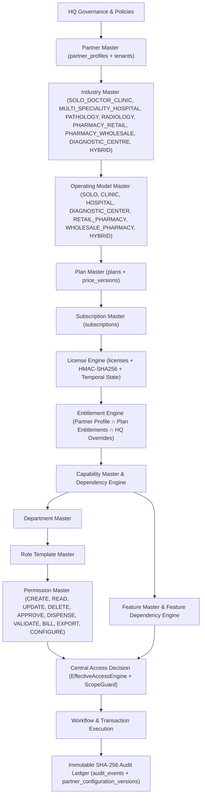

# DOC SEARCH — PHASE 1 MASTER FOUNDATION AUDIT

## 1. Executive Summary

This Read-Only Architecture Audit evaluates the current **DOC SEARCH** implementation against the authoritative **Phase 1 — Master Foundation** control plane hierarchy:

```text
HQ → Partner → Industry → Operating Model → Plan → Subscription → License → Entitlement → Capability → Department → Role → Permission → Feature → Workflow → Transaction → Audit
```

The audit discovered that **DOC SEARCH already possesses rich PostgreSQL schemas (`company.*`, `core.*`, `clinical.*`) and core control-plane services**, including `PartnerSyncService`, `LicenseService`, `SubscriptionService`, `EntitlementService`, `PartnerTemplateService`, `CapabilityAndDependencyEngine`, `EffectiveAccessEngine`, and `ConfigurationVersioningService`.

However, **8 critical/high-priority architectural and security gaps (`PHASE1-AUD-01` through `PHASE1-AUD-08`)** currently prevent the existing control plane from serving as a single, deterministic, fail-closed, data-driven foundation:

1. **`PHASE1-AUD-01` (`EffectiveAccessEngine` Fail-Open Tiers 3, 4, 5, 7, 8)**: `EffectiveAccessEngine.evaluateAccess` passes Tier 3 (`TIER_3_LICENSE_VALIDITY`) when a tenant has **no license record (`licenseFound === false`)**, falsely rejects valid `FREE_ACTIVE` / `EXPIRING_SOON` / `GRACE_PERIOD` licenses (`lic.status !== 'ACTIVE'`), skips HMAC signature verification, and uses hard-coded `PASS` stubs for Tier 4 (`Subscription`), Tier 5 (`Plan Entitlement`), Tier 7 (`Partner Configuration / Industry + Operating Model`), and Tier 8 (`Department Scope`).
2. **`PHASE1-AUD-02` (Conflation of Industry Master & Operating Model Master)**: `partnerProfiles.partnerType` conflates **Industry** (*what type of healthcare business the partner operates*: `SOLO_DOCTOR_CLINIC`, `MULTI_SPECIALITY_HOSPITAL`, `PATHOLOGY`, `RADIOLOGY`, `PHARMACY_RETAIL`, `PHARMACY_WHOLESALE`, `DIAGNOSTIC_CENTRE`, `HYBRID`) with **Operating Model** (*how that business operates*: `SOLO`, `CLINIC`, `HOSPITAL`, `DIAGNOSTIC_CENTER`, `RETAIL_PHARMACY`, `WHOLESALE_PHARMACY`, `HYBRID`), lacking a central compatibility validator and data-driven resolver.
3. **`PHASE1-AUD-03` (`CapabilityAndDependencyEngine` Missing Circular, Transitive, Inactive, Expired, and Multi-Type Dependency Resolution)**: `CapabilityAndDependencyEngine` only checks 1-hop `CAPABILITY` prerequisites, does not detect circular dependency cycles (`A → B → A`), does not check `FEATURE` or `PERMISSION` dependencies, does not check inactive/expired capability states, and in `EffectiveAccessEngine.ts:1083` validates `action` against `[targetCap]` (the capability derived from the action itself rather than the partner's entitled active capabilities).
4. **`PHASE1-AUD-04` (`actionMatches` Overly Permissive Substring & Prefix-Suffix Matching in `EffectiveAccessEngine.ts:749-761`)**: `pNorm.includes(aNorm)` and `pSegments[0] === aSegments[0] && pSegments[last] === aSegments[last]` allow a single permission (e.g., `patient.vitals.view`) to match unrelated actions (`view` or `patient.financial_secrets.view`).
5. **`PHASE1-AUD-05` (Cross-Tenant IDOR in `partner-access-control.routes.ts`)**: Routes `GET /api/v1/company/partners/:partnerId/capabilities`, `GET /api/v1/company/partners/:partnerId/policies`, `POST /api/v1/company/partners/:partnerId/roles`, and `POST /api/v1/company/partners/:partnerId/policies` accept `:partnerId` from `request.params` without enforcing that non-HQ callers (`HOSPITAL_ADMIN`, `CLINIC_ADMIN`, `DOCTOR`) belong to `:partnerId` (`session.tenantId === targetTenantId`).
6. **`PHASE1-AUD-06` (Scattered Hard-Coded Industry/Profile Branching in `PartnerGovernanceService.ts:198` & `StaffAdministrationService.ts`)**: `PartnerGovernanceService.getGovernanceSnapshot` uses `if (normType.includes('HOSPITAL')) ... else if (normType.includes('CLINIC'))` instead of resolving modules, capabilities, departments, and roles from the central Master Foundation configuration catalog.
7. **`PHASE1-AUD-07` (Department & Role Template Masters Not Unified Under Central Master Resolver)**: While `INITIAL_MASTER_TEMPLATES`, `AUTHORITATIVE_ROLES`, and `PROFILE_ALLOWED_ROLES_MAP` exist across separate files, there is no unified **Department Master**, **Role Template Master**, **Permission Master**, and **Feature Master** registry linking `Industry × Operating Model → Capabilities → Departments → Role Templates → Permissions → Features`.
8. **`PHASE1-AUD-08` (Configuration Versioning Lifecycle States)**: `ConfigurationVersioningService` supports snapshot creation, diff, and rollback in `partner_configuration_versions`, but lacks explicit lifecycle status transitions (`DRAFT`, `PUBLISHED` / `EFFECTIVE`, `SUPERSEDED`), `effectiveFrom` / `effectiveTo` temporal metadata, and master-level configuration versioning.

---

## 2. Current Architecture

The current architecture spans three core packages:
* **`@docsearch/database`**: Drizzle ORM PostgreSQL schema across `core` (`tenants`, `branches`, `users`, `roles`, `permissions`, `role_permissions`, `user_roles`, `audit_events`) and `company` (`partner_profiles`, `partner_classifications`, `products`, `plans`, `price_versions`, `features`, `plan_entitlements`, `subscriptions`, `licenses`, `capabilities`, `partner_capabilities`, `partner_templates`, `template_versions`, `permission_packs`, `feature_dependencies`, `access_policies`, `partner_configuration_versions`).
* **`@docsearch/auth` & `@docsearch/shared-core`**: `RBACEvaluator`, `ScopeGuard`, and `facility-normalizer.ts` (`PARTNER_PROFILE_ALLOWED_MODULES`, `normalizeFacilityProfile`).
* **`@docsearch/api-gateway`**:
  * Commercial & Entitlement layer: `PartnerSyncService`, `SubscriptionService`, `LicenseService`, `EntitlementService`, `commercial-guard.ts`.
  * Blueprint & Access layer: `PartnerTemplateService`, `CapabilityAndDependencyEngine`, `EffectiveAccessEngine`, `ConfigurationVersioningService`, `PartnerGovernanceService`.

---

## 3. Existing Master Systems

| Master Component | Existing Schema / Table | Existing Service / Engine | Audit Status |
| :--- | :--- | :--- | :---: |
| **Partner Master** | `company.partner_profiles`, `core.tenants` | `PartnerSyncService`, `PartnerAccountService` | **PARTIAL** |
| **Industry Master** | `company.partner_classifications` | `RegistrationFormPolicyService`, `facility-normalizer.ts` | **PARTIAL** |
| **Operating Model Master** | `partner_profiles.metadata.operatingMode` | Partial normalization in `PartnerSyncService` | **PARTIAL** |
| **Department Master** | `clinical.operational_departments`, `template_versions.departments` | `PartnerTemplateService`, `StaffAdministrationService` | **PARTIAL** |
| **Role Template Master** | `core.roles`, `template_versions.default_roles` | `EffectiveAccessEngine.AUTHORITATIVE_ROLES`, `StaffAdministrationService` | **PARTIAL** |
| **Permission Master** | `core.permissions`, `company.permission_packs` | `RBACEvaluator`, `AUTHORITATIVE_PERMISSION_PACKS` | **PARTIAL** |
| **Capability Master** | `company.capabilities`, `company.partner_capabilities` | `CapabilityAndDependencyEngine` | **PARTIAL** |
| **Feature Master** | `company.features`, `company.plan_entitlements` | `ProductRepository`, `EntitlementService` | **PARTIAL** |
| **Plan Master** | `company.products`, `company.plans`, `company.price_versions` | `PartnerSyncService`, `ProductRepository` | **VERIFIED** |
| **Subscription Master** | `company.subscriptions`, `company.partner_plan_assignments` | `SubscriptionService`, `SubscriptionRepository` | **VERIFIED** |
| **License Engine** | `company.licenses` | `LicenseService`, `commercial-guard.ts` | **VERIFIED** |
| **Entitlement Engine** | `company.plan_entitlements`, `company.partner_governance_overrides` | `EntitlementService` (standalone) vs `EffectiveAccessEngine` (disconnected) | **PARTIAL** |
| **Feature Dependency Engine** | `company.feature_dependencies` | `CapabilityAndDependencyEngine` | **PARTIAL** |
| **Configuration Versioning** | `company.partner_configuration_versions`, `company.template_versions` | `ConfigurationVersioningService` | **PARTIAL** |

---

## 4. Duplicate Systems

1. **Dual Entitlement/Access Evaluators**:
   * `EntitlementService.canAccess` ([EntitlementService.ts](file:///c:/Users/alamr/OneDrive/Desktop/DOC%20SEARCH/apps/api-gateway/src/services/company/EntitlementService.ts#L59-L210)) evaluates `LicenseService` + `PARTNER_PROFILE_ALLOWED_MODULES` + `plan_entitlements` + `PartnerGovernanceService`.
   * `EffectiveAccessEngine.evaluateAccess` ([EffectiveAccessEngine.ts](file:///c:/Users/alamr/OneDrive/Desktop/DOC%20SEARCH/apps/api-gateway/src/services/company/EffectiveAccessEngine.ts#L812-L1250)) evaluates a separate 12-tier pipeline where Tiers 3, 4, 5, 7, and 8 are stubbed or disconnected from `EntitlementService`, `LicenseService`, and `SubscriptionService`.
2. **Dual Role Definitions**:
   * `StaffAdministrationService.ts` (`ROLE_REQUIRED_MODULE_MAP`, `PROFILE_ALLOWED_ROLES_MAP`) vs `EffectiveAccessEngine.ts` (`AUTHORITATIVE_ROLES`).

---

## 5. Missing Systems

1. **Authoritative Industry Master & Operating Model Master Registry (`MasterFoundationCatalog`)**:
   * Distinguishing `Industry` (`SOLO_DOCTOR_CLINIC`, `MULTI_SPECIALITY_HOSPITAL`, `PATHOLOGY`, `RADIOLOGY`, `PHARMACY_RETAIL`, `PHARMACY_WHOLESALE`, `DIAGNOSTIC_CENTRE`, `HYBRID`) from `OperatingModel` (`SOLO`, `CLINIC`, `HOSPITAL`, `DIAGNOSTIC_CENTER`, `RETAIL_PHARMACY`, `WHOLESALE_PHARMACY`, `HYBRID`), with deterministic `(Industry, OperatingModel)` compatibility validation and fail-closed rejection of invalid combinations.
2. **Graph-Based Feature & Capability Dependency Engine**:
   * Cycle detection (`CIRCULAR_DEPENDENCY`), transitive closure validation, inactive/disabled dependency detection (`INACTIVE_DEPENDENCY`), expired capability/entitlement detection (`EXPIRED_DEPENDENCY`), and multi-entity dependency evaluation (`Feature → Capability → Feature → Permission`).

---

## 6. Wrong Architecture

* `EffectiveAccessEngine.evaluateAccess` ([EffectiveAccessEngine.ts](file:///c:/Users/alamr/OneDrive/Desktop/DOC%20SEARCH/apps/api-gateway/src/services/company/EffectiveAccessEngine.ts#L978-L1041)) treats missing licenses as `PASS` (`if (licenseFound && licenseExpired)`), treats `FREE_ACTIVE` and `GRACE_PERIOD` licenses as `EXPIRED`, and hard-codes `TIER_4_SUBSCRIPTION_STATUS` and `TIER_5_PLAN_ENTITLEMENT` to `PASS`.
* `EffectiveAccessEngine.actionMatches` ([EffectiveAccessEngine.ts](file:///c:/Users/alamr/OneDrive/Desktop/DOC%20SEARCH/apps/api-gateway/src/services/company/EffectiveAccessEngine.ts#L749-L761)) uses bidirectional `.includes()` and `first-segment + last-segment` matching, allowing unauthorized permission matches.

---

## 7. Hard-Coded Logic

* [PartnerGovernanceService.ts](file:///c:/Users/alamr/OneDrive/Desktop/DOC%20SEARCH/apps/api-gateway/src/services/company/PartnerGovernanceService.ts#L197-L235): Uses `if (normType.includes('HOSPITAL')) ... else if (normType.includes('CLINIC'))` to initialize module states instead of querying the central Industry/Operating Model Master configuration.
* [partner-access-control.routes.ts](file:///c:/Users/alamr/OneDrive/Desktop/DOC%20SEARCH/apps/api-gateway/src/routes/company/partner-access-control.routes.ts#L342-L392): Hard-codes inline `packs` array in `GET /api/v1/company/permission-packs` instead of returning the central `PermissionMaster` / `AUTHORITATIVE_PERMISSION_PACKS` catalog.

---

## 8. Mock / Fallback Logic

* In `EffectiveAccessEngine.ts:997-1041`, when no license or subscription exists in PostgreSQL for a partner, Tiers 3, 4, and 5 silently fall back to `PASS` (`status: 'PASS'`) instead of failing closed (`DENY_LICENSE_MISSING` / `DENY_SUBSCRIPTION_MISSING` / `DENY_ENTITLEMENT_MISSING`).

---

## 9. Security Risks

* **Cross-Tenant IDOR in `partner-access-control.routes.ts`**:
  * `GET /api/v1/company/partners/:partnerId/capabilities` (line 139)
  * `POST /api/v1/company/partners/:partnerId/roles` (line 397)
  * `GET /api/v1/company/partners/:partnerId/policies` (line 478)
  * `POST /api/v1/company/partners/:partnerId/policies` (line 502)
  do not verify that non-HQ callers belong to `:partnerId`.
* **Permission Matching Escalation in `EffectiveAccessEngine.actionMatches`**:
  * Substring matching (`pNorm.includes(aNorm)`) and 2-segment boundary matching (`patient.vitals.view` matching `patient.billing.view`).

---

## 10. Data Integrity Risks

* **Configuration Snapshot Mutability & Lifecycle**: `partner_configuration_versions` snapshots must track `status` (`DRAFT`, `PUBLISHED`, `SUPERSEDED`), `effectiveFrom`, `effectiveTo`, and `industry` / `operatingModel` metadata so historical configuration versions remain immutable and auditable when new versions are published.

---

## 11. Dependency Blockers

* Before downstream clinical/diagnostic/pharmacy workflows can rely solely on the central access control plane, `EffectiveAccessEngine`, `EntitlementService`, `LicenseService`, `SubscriptionService`, and `CapabilityAndDependencyEngine` must be unified so that `evaluateAccess` enforces the complete 16-link hierarchy (`HQ → Partner → Industry → Operating Model → Plan → Subscription → License → Entitlement → Capability → Department → Role → Permission → Feature → Workflow → Transaction → Audit`) and fails closed on any missing/invalid link.

---

## 12. Existing Migrations

* `@docsearch/database` contains 49 SQL migrations and 442 schema tables in `packages/database/src/schema/`.
* Tables `partner_profiles`, `partner_classifications`, `products`, `plans`, `features`, `plan_entitlements`, `subscriptions`, `licenses`, `capabilities`, `partner_capabilities`, `partner_templates`, `template_versions`, `permission_packs`, `feature_dependencies`, `access_policies`, `partner_configuration_versions`, `roles`, `permissions`, `role_permissions`, `user_roles`, and `operational_departments` already exist in `packages/database/src/schema/company/index.ts` and `packages/database/src/schema/core/roles.ts` with `jsonb` `metadata` columns that support non-destructive extension without breaking existing data.

---

## 13. Existing Tests

* 7 verification test suites (`113` passing tests) in `apps/api-gateway/test/` verify P0/P1 security controls, onboarding, pharmacy vertical slice, and `ScopeGuard`.
* New comprehensive Phase 1 Master Foundation test suite (`apps/api-gateway/test/phase1-master-foundation.test.mjs`) is required to test all 19 master foundation components and security boundaries.

---

## 14. Reusable Components

1. `LicenseService` (`signLicensePayload`, `verifyLicenseSignature`, `evaluateLicenseStatus`) — **REUSE & INTEGRATE** into `EffectiveAccessEngine` Tier 3.
2. `SubscriptionService` (`calculateSubscriptionDates`, `getSubscriptionByPartnerId`) — **REUSE & INTEGRATE** into `EffectiveAccessEngine` Tier 4.
3. `EntitlementService` (`canAccess`, `PARTNER_PROFILE_ALLOWED_MODULES`, `isModuleAllowedForPartnerProfile`) — **REUSE & INTEGRATE** into `EffectiveAccessEngine` Tier 5.
4. `RBACEvaluator` & `ScopeGuard` (`@docsearch/auth`) — **REUSE & INTEGRATE** into `EffectiveAccessEngine` Tiers 8, 9, and 10.
5. `ConfigurationVersioningService` (`partner_configuration_versions`) — **EXTEND** with `DRAFT` / `PUBLISHED` / `SUPERSEDED` lifecycle and master configuration versioning.

---

## 15. Structured Findings Table (`PHASE1-AUD-01` .. `PHASE1-AUD-08`)

| ID | Component | Status | Classification | Evidence | Impact | Dependency | Required Action |
| :--- | :--- | :---: | :---: | :--- | :--- | :--- | :--- |
| **`PHASE1-AUD-01`** | `EffectiveAccessEngine` Tiers 3, 4, 5, 7, 8 | **PARTIAL** | **WRONG ARCHITECTURE / MOCK/FALLBACK / SECURITY RISK** | [EffectiveAccessEngine.ts](file:///c:/Users/alamr/OneDrive/Desktop/DOC%20SEARCH/apps/api-gateway/src/services/company/EffectiveAccessEngine.ts#L978-L1128) | Missing license passes Tier 3; `FREE_ACTIVE`/`GRACE_PERIOD` rejected; Subscription & Entitlement tiers are hard-coded `PASS` stubs; inactive partner passes Tier 7. | `LicenseService`, `SubscriptionService`, `EntitlementService` | Wire Tier 3 to `licenseService.verifyLicenseSignature` + `evaluateLicenseStatus` (fail-closed when missing unless explicit simulation override), Tier 4 to `subscriptions` status, Tier 5 to `EntitlementService` + `Industry/OperatingModel`, Tier 7 to Partner active status, and Tier 8 to Department scope. |
| **`PHASE1-AUD-02`** | Industry Master & Operating Model Master | **PARTIAL** | **HARD-CODED / MISSING** | [facility-normalizer.ts](file:///c:/Users/alamr/OneDrive/Desktop/DOC%20SEARCH/packages/shared-core/src/workflow/facility-normalizer.ts#L40-L276), [PartnerSyncService.ts](file:///c:/Users/alamr/OneDrive/Desktop/DOC%20SEARCH/apps/api-gateway/src/services/company/PartnerSyncService.ts#L737-L783) | Industry and Operating Model are conflated; no central `(Industry, OperatingModel)` compatibility matrix or fail-closed validation. | Shared contracts & `MasterFoundationService` | Establish authoritative `INDUSTRY_MASTER_CATALOG` and `OPERATING_MODEL_MASTER_CATALOG` with explicit compatibility validation, default capabilities/departments/roles/features/plans, and persistence in `partner_classifications` & `partner_profiles`. |
| **`PHASE1-AUD-03`** | `CapabilityAndDependencyEngine` & Feature Dependency Engine | **PARTIAL** | **WRONG ARCHITECTURE / SECURITY RISK** | [CapabilityAndDependencyEngine.ts](file:///c:/Users/alamr/OneDrive/Desktop/DOC%20SEARCH/apps/api-gateway/src/services/company/CapabilityAndDependencyEngine.ts#L310-L360), [EffectiveAccessEngine.ts](file:///c:/Users/alamr/OneDrive/Desktop/DOC%20SEARCH/apps/api-gateway/src/services/company/EffectiveAccessEngine.ts#L1083) | No circular dependency detection (`A → B → A`), no transitive graph resolution, no `FEATURE` or `PERMISSION` dependency evaluation, no inactive/expired dependency rejection. | `CapabilityMaster`, `FeatureMaster`, `PermissionMaster` | Upgrade `CapabilityAndDependencyEngine` with DFS cycle detection (`CIRCULAR_DEPENDENCY`), unknown/inactive/expired dependency rejection, and multi-type (`CAPABILITY`, `FEATURE`, `PERMISSION`) graph evaluation against actual active entitlements & permissions. |
| **`PHASE1-AUD-04`** | `EffectiveAccessEngine.actionMatches` | **PARTIAL** | **SECURITY RISK** | [EffectiveAccessEngine.ts](file:///c:/Users/alamr/OneDrive/Desktop/DOC%20SEARCH/apps/api-gateway/src/services/company/EffectiveAccessEngine.ts#L740-L764) | Substring `pNorm.includes(aNorm)` and 2-segment boundary matching allow unauthorized actions to match unrelated permissions. | `PermissionMaster` & `RBACEvaluator` | Replace substring/segment heuristic with strict hierarchical resource:action matching and governed-action protection (`APPROVE`, `DELETE`, `VALIDATE`, `DISPENSE`, `EXPORT`, `CONFIGURE`, `REFUND`). |
| **`PHASE1-AUD-05`** | `partner-access-control.routes.ts` Tenant Isolation | **PARTIAL** | **SECURITY RISK (IDOR)** | [partner-access-control.routes.ts](file:///c:/Users/alamr/OneDrive/Desktop/DOC%20SEARCH/apps/api-gateway/src/routes/company/partner-access-control.routes.ts#L139-L550) | Non-HQ callers can query/mutate another partner's capabilities, custom roles, or policies by manipulating `:partnerId` in URL params. | `ScopeGuard` / `assertPartnerTenantAccess` | Enforce `assertPartnerTenantScope(request, partnerId)` across all `/api/v1/company/partners/:partnerId/*` and `/api/v1/partner/master-foundation/*` endpoints. |
| **`PHASE1-AUD-06`** | Department, Role Template, Permission & Feature Masters | **PARTIAL** | **HARD-CODED / DUPLICATE** | [PartnerGovernanceService.ts](file:///c:/Users/alamr/OneDrive/Desktop/DOC%20SEARCH/apps/api-gateway/src/services/company/PartnerGovernanceService.ts#L197-L235), [StaffAdministrationService.ts](file:///c:/Users/alamr/OneDrive/Desktop/DOC%20SEARCH/apps/api-gateway/src/services/partner/StaffAdministrationService.ts#L29-L160) | Scattered role/department/feature maps across services. | `MasterFoundationService` | Consolidate authoritative `DEPARTMENT_MASTER_CATALOG`, `ROLE_TEMPLATE_MASTER_CATALOG`, `PERMISSION_MASTER_CATALOG`, and `FEATURE_MASTER_CATALOG` with versioned metadata and industry/operating-model applicability. |
| **`PHASE1-AUD-07`** | Configuration Versioning Lifecycle | **PARTIAL** | **DATA INTEGRITY RISK** | [ConfigurationVersioningService.ts](file:///c:/Users/alamr/OneDrive/Desktop/DOC%20SEARCH/apps/api-gateway/src/services/company/ConfigurationVersioningService.ts#L43-L140) | Snapshots lack explicit `DRAFT` / `PUBLISHED` (`EFFECTIVE`) / `SUPERSEDED` lifecycle states and `effectiveFrom` / `effectiveTo` timestamps. | `partner_configuration_versions` | Extend `ConfigurationVersioningService` so publishing a new configuration version marks the prior `PUBLISHED` version as `SUPERSEDED` with `effectiveTo` timestamp without mutating historical snapshot payloads. |
| **`PHASE1-AUD-08`** | Frontend & Partner Account Effective Foundation Consumption | **PARTIAL** | **HARD-CODED** | [PartnerAccountService.ts](file:///c:/Users/alamr/OneDrive/Desktop/DOC%20SEARCH/apps/api-gateway/src/services/partner/PartnerAccountService.ts#L178-L350) | `GET /api/v1/partner/account/plan-and-features` does not expose the partner's resolved `industry`, `operatingModel`, `effectiveCapabilities`, `effectiveDepartments`, `effectiveRoleTemplates`, and `configurationVersion`. | `PartnerAccountService` & `MasterFoundationService` | Enrich `PartnerAccountService.getPlanAndFeatures` and expose `/api/v1/partner/master-foundation/effective-context` so frontend consumers derive visibility strictly from backend-resolved state. |

---

## 16. Dependency Graph



---

## 17. Risk Classification

* **Critical (`P0`)**: `PHASE1-AUD-01` (`EffectiveAccessEngine` fail-open license/subscription/entitlement tiers), `PHASE1-AUD-03` (`CapabilityAndDependencyEngine` circular/missing/inactive/expired dependency bypass), `PHASE1-AUD-04` (`actionMatches` substring permission escalation), `PHASE1-AUD-05` (`partner-access-control.routes.ts` cross-tenant IDOR).
* **High (`P1`)**: `PHASE1-AUD-02` (`Industry` vs `Operating Model` master separation & validation), `PHASE1-AUD-06` (`Department`, `Role Template`, `Permission`, and `Feature` master consolidation), `PHASE1-AUD-07` (`ConfigurationVersioningService` `DRAFT`/`PUBLISHED`/`SUPERSEDED` lifecycle), `PHASE1-AUD-08` (`PartnerAccountService` & frontend effective foundation exposure).

---

## 18. Recommended Implementation Order

1. Shared identifiers, enums, and contracts (`IndustryCode`, `OperatingModelCode`, `PermissionAction`, `ConfigurationLifecycleStatus`).
2. Partner Master (`resolvePartnerMasterContext`, active status enforcement, tenant-scope lock).
3. Industry Master (`INDUSTRY_MASTER_CATALOG` & DB sync with `partner_classifications`).
4. Operating Model Master (`OPERATING_MODEL_MASTER_CATALOG` & compatibility matrix with Industry).
5. Department Master (`DEPARTMENT_MASTER_CATALOG` mapped to Industry, Operating Model, Capabilities, Roles).
6. Permission Master (`PERMISSION_MASTER_CATALOG` covering `CREATE`, `READ`, `UPDATE`, `DELETE`, `APPROVE`, `DISPENSE`, `VALIDATE`, `BILL`, `EXPORT`, `CONFIGURE`).
7. Role Template Master (`ROLE_TEMPLATE_MASTER_CATALOG` mapped to Industry, Operating Model, Department, Capability, Permission bundles).
8. Capability Master (`MASTER_CAPABILITIES` with dependency & entitlement links).
9. Feature Master (`FEATURE_MASTER_CATALOG` with capability, permission, and feature dependencies).
10. Plan Master (`PLAN_MASTER_CATALOG` linking Industry, Operating Model, Capabilities, Features, and Limits).
11. Subscription Master (`SubscriptionService` historical version & effective configuration linkage).
12. License Engine (`LicenseService` + `EffectiveAccessEngine` Tier 3 fail-closed HMAC & temporal enforcement).
13. Entitlement Engine (`EntitlementService` + `EffectiveAccessEngine` Tier 5 deterministic intersection).
14. Feature Dependency Engine (`CapabilityAndDependencyEngine` cycle detection, missing/inactive/expired dependency fail-closed enforcement).
15. Configuration Versioning (`ConfigurationVersioningService` `DRAFT`, `PUBLISHED`, `SUPERSEDED` lifecycle with immutable history).
16. Central Access Decision & API Enforcement (`EffectiveAccessEngine` + `partner-access-control.routes.ts` tenant isolation + `/api/v1/partner/master-foundation/*`).
17. Frontend Integration (`PartnerAccountService.getPlanAndFeatures` returning authoritative `masterFoundation` effective configuration).
18. Automated Functional, Regression & Security Verification Tests (`phase1-master-foundation.test.mjs`).
