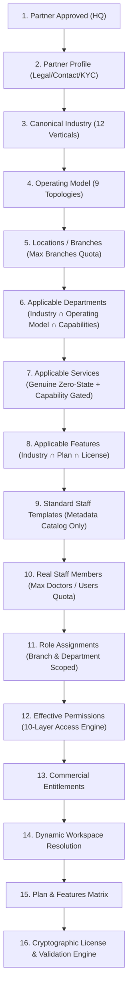

# DOC SEARCH — PHASE 2: PARTNER CONFIGURATION ENGINE
## Architecture Audit, Schema Audit, Dependency Verification & Domain Design (Steps 1–4)

---

## 1. STEP 1 — ARCHITECTURE AUDIT OF CURRENT PARTNER CONFIGURATION STATE

### 1.1 Audited Backend Services, Repositories & Route Plugins

| Domain / Layer | File Path | Existing Implementation State | Classification |
| :--- | :--- | :--- | :--- |
| **Master Taxonomies & Control Plane (Phase 1)** | [`MasterFoundationService.ts`](file:///c:/Users/alamr/OneDrive/Desktop/DOC%20SEARCH/apps/api-gateway/src/services/foundation/MasterFoundationService.ts) | Authoritative catalog of 12 Healthcare Industries, 9 Operating Models, 26 Canonical Capabilities, 33 Standard Departments, and 26 Standard Staff Role Templates. | `VERIFIED` |
| **Capability & Dependency Engine (Phase 1)** | [`CapabilityAndDependencyEngine.ts`](file:///c:/Users/alamr/OneDrive/Desktop/DOC%20SEARCH/apps/api-gateway/src/services/foundation/CapabilityAndDependencyEngine.ts) | Evaluates DAG prerequisites for capabilities (`verifyCapabilityActivation`), filters applicable departments (`resolveApplicableDepartments`) and role templates (`resolveApplicableRoleTemplates`). | `VERIFIED` |
| **Effective Access Engine (Phase 1)** | [`EffectiveAccessEngine.ts`](file:///c:/Users/alamr/OneDrive/Desktop/DOC%20SEARCH/apps/api-gateway/src/services/foundation/EffectiveAccessEngine.ts) | Computes 10-layer intersection (`Tenant ∧ Industry ∧ OperatingModel ∧ Plan ∧ Subscription ∧ License ∧ Governance ∧ Role ∧ Scope ∧ ABAC`) and workspace layout. | `VERIFIED` |
| **Partner Profile & Commercial Overview** | [`PartnerAccountService.ts`](file:///c:/Users/alamr/OneDrive/Desktop/DOC%20SEARCH/apps/api-gateway/src/services/partner/PartnerAccountService.ts) [`account.routes.ts`](file:///c:/Users/alamr/OneDrive/Desktop/DOC%20SEARCH/apps/api-gateway/src/routes/partner/account.routes.ts) | Provides `GET/PUT /api/v1/partner/profile` and `GET /api/v1/partner/account/plan-and-features`. Always accessible regardless of commercial/license suspension (`app.ts` line 222). | `VERIFIED` |
| **Partner Staff, Roles & Departments** | [`StaffAdministrationService.ts`](file:///c:/Users/alamr/OneDrive/Desktop/DOC%20SEARCH/apps/api-gateway/src/services/partner/StaffAdministrationService.ts) [`StaffAdministrationRepository.ts`](file:///c:/Users/alamr/OneDrive/Desktop/DOC%20SEARCH/apps/api-gateway/src/repositories/partner/StaffAdministrationRepository.ts) | Provides `/api/v1/partner/staff/overview`, `/departments`, `/members`, `/roles`, `/credentials`, `/transfers`. Enforces industry/operating-model role & department boundaries. | `PARTIAL` (Needs tenant-specific deterministic facility/org initialization instead of shared fallback UUIDs; needs explicit Phase 2 endpoints) |
| **HQ Approval & Live Partner Hydration** | [`PartnerSyncService.ts`](file:///c:/Users/alamr/OneDrive/Desktop/DOC%20SEARCH/apps/api-gateway/src/services/company/PartnerSyncService.ts) | Hydrates `tenants`, `partnerProfiles`, `products`, `plans`, `subscriptions`, and `licenses`. Does not yet automatically run deterministic operational configuration initialization (`operationalPartners`, `operationalOrganizations`, `operationalFacilities`, `operationalDepartments`) upon approval. | `PARTIAL` |
| **Unified Partner Configuration Engine** | `PartnerConfigurationEngineService.ts` (New in Phase 2) `partner-configuration.routes.ts` (New in Phase 2) | Unified idempotent initialization (`POST /api/v1/partner/configuration/initialize`), 14-domain validation (`GET /api/v1/partner/configuration/validation`), Locations CRUD (`GET/POST/PATCH /api/v1/partner/locations`), Services Catalog CRUD (`GET/POST/PATCH /api/v1/partner/services`), and Staff Templates (`GET /api/v1/partner/staff-templates`). | `GAP → IMPLEMENTED IN PHASE 2` |

---

## 2. STEP 2 — EXISTING DATA & SCHEMA AUDIT

| PostgreSQL Schema & Table | File Location | Purpose in Phase 2 Partner Configuration Engine | Audit Status |
| :--- | :--- | :--- | :--- |
| `core.tenants` | [`tenants.ts`](file:///c:/Users/alamr/OneDrive/Desktop/DOC%20SEARCH/packages/database/src/schema/core/tenants.ts) | Root multi-tenant boundary (`id`, `slug`, `name`, `status`). | `VERIFIED` |
| `core.branches` | [`branches.ts`](file:///c:/Users/alamr/OneDrive/Desktop/DOC%20SEARCH/packages/database/src/schema/core/branches.ts) | Core branch table linked to `tenant_id` (`id`, `tenant_id`, `name`, `code`, `is_main_branch`, `address`, `phone`, `email`, `is_active`). | `VERIFIED` |
| `company.partner_profiles` | [`company/index.ts`](file:///c:/Users/alamr/OneDrive/Desktop/DOC%20SEARCH/packages/database/src/schema/company/index.ts#L16-L36) | Partner commercial & legal profile (`id`, `tenant_id`, `company_name`, `legal_name`, `partner_type`, `registration_number`, `tax_id`, `primary_contact_email`, `primary_contact_phone`, `address`, `kyc_status`, `status`, `metadata`). | `VERIFIED` |
| `company.partner_classifications` | [`company/index.ts`](file:///c:/Users/alamr/OneDrive/Desktop/DOC%20SEARCH/packages/database/src/schema/company/index.ts#L604-L624) | Stores canonical `primary_industry`, `secondary_industries`, `operating_model`, `org_scale`. | `VERIFIED` |
| `company.partner_capabilities` | [`company/index.ts`](file:///c:/Users/alamr/OneDrive/Desktop/DOC%20SEARCH/packages/database/src/schema/company/index.ts#L563-L583) | Stores per-partner enabled/disabled capabilities and configuration metadata (`metadata.operationalServices` for tenant-scoped service definitions). | `VERIFIED` |
| `company.partner_configuration_versions` | [`company/index.ts`](file:///c:/Users/alamr/OneDrive/Desktop/DOC%20SEARCH/packages/database/src/schema/company/index.ts#L586-L601) | Immutable versioned snapshots of partner configuration changes (`version_number`, `change_type`, `previous_state`, `new_state`, `reason`). | `VERIFIED` |
| `company.subscriptions` & `company.licenses` | [`company/index.ts`](file:///c:/Users/alamr/OneDrive/Desktop/DOC%20SEARCH/packages/database/src/schema/company/index.ts#L103-L163) | Commercial subscription & cryptographic license records (`max_concurrent_users`, `max_doctors`, `max_branches`, `status`, `expiry_date`, `grace_period_end`, `signature`). | `VERIFIED` |
| `clinical.operational_partners` | [`clinical/index.ts`](file:///c:/Users/alamr/OneDrive/Desktop/DOC%20SEARCH/packages/database/src/schema/clinical/index.ts#L42-L67) | Top-level operational partner record (`id`, `tenant_id`, `partner_code`, `legal_business_name`, `partner_type`, `status`). | `VERIFIED` |
| `clinical.operational_organizations` | [`clinical/index.ts`](file:///c:/Users/alamr/OneDrive/Desktop/DOC%20SEARCH/packages/database/src/schema/clinical/index.ts#L73-L100) | Operational organization belonging strictly to one Partner (`id`, `tenant_id`, `partner_id`, `organization_code`, `organization_name`, `organization_type`, `status`). | `VERIFIED` |
| `clinical.operational_facilities` | [`clinical/index.ts`](file:///c:/Users/alamr/OneDrive/Desktop/DOC%20SEARCH/packages/database/src/schema/clinical/index.ts#L106-L141) | Physical Locations / Branches (`id`, `tenant_id`, `partner_id`, `organization_id`, `facility_code`, `facility_name`, `facility_type`, `address_*`, `status`, `metadata`). | `VERIFIED` |
| `clinical.operational_departments` | [`clinical/index.ts`](file:///c:/Users/alamr/OneDrive/Desktop/DOC%20SEARCH/packages/database/src/schema/clinical/index.ts#L219-L253) | Operational Departments (`id`, `tenant_id`, `partner_id`, `organization_id`, `branch_id`, `department_code`, `department_name`, `cost_center_code`, `status`, `metadata`). | `VERIFIED` |
| `clinical.operational_staff` | [`clinical/index.ts`](file:///c:/Users/alamr/OneDrive/Desktop/DOC%20SEARCH/packages/database/src/schema/clinical/index.ts#L259-L301) | Real Partner Staff directory (`id`, `tenant_id`, `partner_id`, `organization_id`, `branch_id`, `department_id`, `staff_code`, `fullName`, `work_email`, `staff_type`, `primary_role`, `employment_status`). | `VERIFIED` |
| `clinical.staff_role_assignments` | [`clinical/index.ts`](file:///c:/Users/alamr/OneDrive/Desktop/DOC%20SEARCH/packages/database/src/schema/clinical/index.ts#L307-L341) | Role and hierarchical data scope bindings (`staff_id`, `role_code`, `data_scope`, `branch_id`, `department_id`, `is_primary`). | `VERIFIED` |

---

## 3. STEP 3 — GAP ANALYSIS & DEPENDENCY VERIFICATION

1. **GAP-P2-01 (`StaffAdministrationRepository.ensureDefaults` Shared Fallback UUIDs & Hardcoded `HOSPITAL_SYSTEM`)**:
   - **Evidence**: `StaffAdministrationRepository.ts` lines 54–165 used `DEFAULT_PARTNER_ID = '00000000-0000-4000-8000-000000000001'` and hardcoded `partnerType: 'HOSPITAL_SYSTEM'` and `facilityType: 'HOSPITAL'` when initializing operational rows.
   - **Remediation**: Replace with deterministic tenant-isolated UUID derivation (`toDeterministicUuid(\`${tenantId}:op-partner\`)`, `toDeterministicUuid(\`${tenantId}:op-org\`)`, `toDeterministicUuid(\`${tenantId}:op-facility:main\`)`) and derive `partnerType`, `organizationType`, and `facilityType` directly from the partner's canonical `Industry` and `Operating Model`.
2. **GAP-P2-02 (Idempotent Configuration Initialization Engine)**:
   - **Evidence**: Need a deterministic `initializePartnerConfiguration(tenantId, options)` engine that derives:
     - Partner Profile & Legal Identity
     - Canonical Industry & Operating Model (`company.partner_classifications`)
     - Primary Location (`clinical.operational_facilities` + `core.branches`)
     - Applicable Departments (`clinical.operational_departments` — strictly filtered by `Industry ∩ Operating Model ∩ Active Capabilities`, never blindly creating unrelated departments)
     - Applicable Services Catalog (stored in `operational_departments.metadata.services` / `partner_profiles.metadata.operationalServices` with **genuine zero-state** until configured by the Partner or explicitly enabled)
     - Standard Staff Role Templates (`ROLE_TEMPLATE_MASTER_CATALOG` filtered by `Industry ∩ Operating Model`, never creating fake staff or doctors)
     - Commercial Plan, Entitlements, and License Verification
     - 14-Domain Configuration Validation Report
   - **Idempotency Requirement**: Running `initializePartnerConfiguration` 1, 10, or 100 times must produce the exact same set of records with zero duplicates.
3. **GAP-P2-03 (Unified Phase 2 Partner Configuration APIs)**:
   - Expose all required endpoints in `partner-configuration.routes.ts`:
     - `GET /api/v1/partner/configuration`
     - `POST /api/v1/partner/configuration/initialize`
     - `GET /api/v1/partner/configuration/validation`
     - `GET /api/v1/partner/locations`
     - `POST /api/v1/partner/locations`
     - `PATCH /api/v1/partner/locations/:id`
     - `GET /api/v1/partner/departments`
     - `POST /api/v1/partner/departments`
     - `PATCH /api/v1/partner/departments/:id`
     - `GET /api/v1/partner/services`
     - `POST /api/v1/partner/services`
     - `PATCH /api/v1/partner/services/:id`
     - `GET /api/v1/partner/staff-templates`
     - `GET /api/v1/partner/staff`
     - `POST /api/v1/partner/staff`
     - `PATCH /api/v1/partner/staff/:id`
     - `POST /api/v1/partner/roles/assign`

---

## 4. STEP 4 — PARTNER CONFIGURATION DOMAIN DESIGN

### 4.1 16-Stage Deterministic Derivation Chain

### 4.2 14-Domain Validation Status Model
Every domain (`Profile`, `Industry`, `Operating Model`, `Locations`, `Departments`, `Services`, `Staff Templates`, `Staff`, `Roles`, `Permissions`, `Entitlements`, `Workspace`, `Plan & Features`, `License`) is evaluated deterministically and assigned one of:
- `VERIFIED`
- `PARTIAL`
- `NOT_IMPLEMENTED`
- `INVALID`
- `BLOCKED`
- `UNKNOWN`
