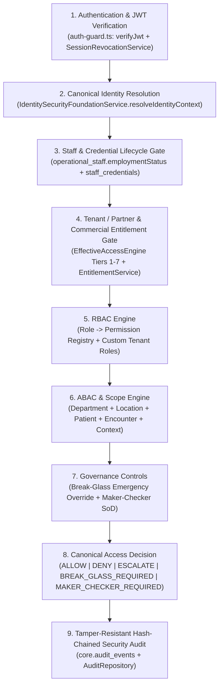

# DOC SEARCH — PHASE 3: IDENTITY + RBAC/ABAC SECURITY FOUNDATION
## READ-ONLY ARCHITECTURE AUDIT, GAP ANALYSIS & CANONICAL DESIGN

**Phase:** Phase 3 — Identity + RBAC/ABAC Security Foundation  
**Methodology:** `AUDIT → EVIDENCE → GAP → DESIGN → CONTROLLED IMPLEMENTATION → TESTS → INDEPENDENT VERIFICATION → FREEZE`  
**Audit Timestamp:** 2026-09-25T22:16:00+05:30

---

## 1. STEP 1 — READ-ONLY CURRENT ARCHITECTURE AUDIT

### 1.1 Runtime Flow Trace (`LOGIN → SESSION → USER → PARTNER → STAFF → ROLE → PERMISSION → DEPARTMENT → LOCATION → RESOURCE → ENTITLEMENT → AUTHORIZATION DECISION → AUDIT`)

### 1.2 Component Classification Matrix

| Component / Domain | Existing Files Inspected | Classification | Evidence & Identified Gaps |
| :--- | :--- | :--- | :--- |
| **Authentication & JWT Claims** | `packages/auth/src/session-context.ts`, `apps/api-gateway/src/plugins/auth-guard.ts` | `PARTIAL` | Validates JWT signature, exp/iat, `sub`, `tenantId`, `roles`, `permissions`, `branchId`, `departmentId`. **Gap:** Does not resolve authoritative `staffId`, `staffStatus`, `credentialStatus`, `departmentIds[]`, `locationIds[]`, `industry`, `operatingModel` from DB on protected requests, nor block client-supplied `staffId`/`userId`/`role`/`permissions` overrides in payloads. |
| **Session & Revocation** | `apps/api-gateway/src/services/core/SessionRevocationService.ts` | `IMPLEMENTED` | Tracks user, tenant, branch, and session revocations in `core.revocations` + memory cache, and enforces global emergency freeze. |
| **Master Identity Model** | `packages/auth/src/types.ts` | `PARTIAL` | `SessionContext` has basic JWT fields. **Gap:** Needs canonical `CanonicalIdentityContext` combining `userId`, `partnerId`, `staffId`, `roleIds`, `permissionIds`, `departmentIds`, `locationIds`, `staffStatus`, `credentialStatus`, `industry`, `operatingModel`, `entitlementContext`, and `sessionState`. |
| **RBAC Engine (`ROLE → PERMISSION`)** | `packages/auth/src/rbac-evaluator.ts`, `apps/api-gateway/src/services/company/EffectiveAccessEngine.ts`, `packages/database/src/schema/core/roles.ts` | `PARTIAL` | Has `core.roles`, `core.permissions`, `core.role_permissions`, `clinical.staff_role_assignments`, and `AUTHORITATIVE_ROLES`. **Gap:** Needs full RBAC management API (`create`, `update`, `disable`, `delete` where safe, `assign/revoke permission`, deterministic `DOMAIN:RESOURCE:ACTION` normalization, and strict anti-privilege-escalation checks). |
| **ABAC Engine & `authorize()`** | `apps/api-gateway/src/services/company/EffectiveAccessEngine.ts` | `PARTIAL` | Evaluates 12 tiers for partner/license/capability/role/branch/dept. **Gap:** Missing unified `authorize(subject, action, resource, context)` evaluating `staffStatus`, `credentialStatus`, `patientScope`, `encounterScope`, `breakGlass`, and `makerChecker` with the 5 canonical decisions (`ALLOW`, `DENY`, `ESCALATE`, `BREAK_GLASS_REQUIRED`, `MAKER_CHECKER_REQUIRED`). |
| **Department Scope** | `packages/auth/src/scope-guard.ts` | `PARTIAL` | `ScopeGuard.enforceDepartmentScope` checks `session.departmentId`. **Gap:** Must validate against authoritative `operational_staff.department_id` and `staff_role_assignments.department_id` and reject URL/query/body `departmentId` manipulation even when `dataScope` was not set to `'department'` in the JWT. |
| **Location Scope** | `packages/auth/src/scope-guard.ts`, `apps/api-gateway/src/plugins/auth-guard.ts` | `PARTIAL` | Checks `branchId` in `auth-guard.ts`. **Gap:** Must also enforce `locationId` / `facilityId` aliases and validate staff location reassignment dynamically from `operational_staff.branch_id`. |
| **Patient Scope** | `apps/api-gateway/src/routes/partner/clinical-workflow.routes.ts` | `PARTIAL` | Searches patients by `tenantId` and `branchId`. **Gap:** Direct `GET /patients/:id` or `PATCH /patients/:id` must enforce context-aware Patient Scope (tenant, location, department/care-relationship, confidentiality flag, and break-glass requirement) to prevent IDOR/enumeration. |
| **Encounter Scope** | `apps/api-gateway/src/routes/partner/clinical-workflow.routes.ts` | `PARTIAL` | Checks tenantId. **Gap:** Must validate encounter's `partner`, `patient`, `department`, `location`, `encounterType`, `encounterStatus`, and `assignedStaff` (`doctorId`) before allowing read/write operations. |
| **Staff Status** | `packages/database/src/schema/clinical/index.ts` (`operationalStaff`) | `PARTIAL` | `operational_staff.employment_status` stores `ACTIVE`, `INACTIVE`, `SUSPENDED`, `DISABLED`, `PENDING`, `TERMINATED`. **Gap:** Backend authorization must dynamically verify `staffStatus === 'ACTIVE'` and fail closed immediately when staff is suspended, inactive, disabled, or pending. |
| **Credential Status** | `packages/database/src/schema/clinical/index.ts` (`staffCredentials`) | `PARTIAL` | `staff_credentials` stores `verification_status` (`VERIFIED`, `PENDING`, `EXPIRED`, `REVOKED`) and `expiry_date`. **Gap:** Authorization engine must evaluate credential validity (`VALID`, `EXPIRED`, `SUSPENDED`, `REVOKED`, `MISSING`, `PENDING_VERIFICATION`) on credential-sensitive actions (`PRESCRIPTION:SIGN`, `LAB:VALIDATE`, `RADIOLOGY:VALIDATE`, `CLINICAL:AUTHORIZE`). |
| **Entitlement Integration** | `apps/api-gateway/src/services/company/EntitlementService.ts`, `LicenseService.ts` | `IMPLEMENTED` | Integrated in `EffectiveAccessEngine` Tiers 3–6 and `commercial-guard.ts`. Will be unified into `authorize()` so `PERMISSION + ENTITLEMENT` is mandatory. |
| **Break-Glass Engine** | `apps/api-gateway/src/routes/company/partner-access-control.routes.ts`, `core.break_glass_access` | `IMPLEMENTED` | Supports explicit activation, mandatory reason (`>= 5` chars), single `patientId` target (no wildcard), duration ceiling (`<= 240` min), revocation, and audit logging. Will be wired directly into `authorize()` and patient/encounter scope checks. |
| **Maker-Checker Engine** | `apps/api-gateway/src/services/company/FounderApprovalService.ts`, `company.founder_approval_requests` | `PARTIAL` | Supports HQ founder approvals. **Gap:** Needs tenant-aware operational Maker-Checker workflow engine (`submit`, `approve`, `reject`) that enforces separation of duties (`makerUserId !== checkerUserId` and `makerStaffId !== checkerStaffId`) and audits `WHO, WHAT, WHEN, RESOURCE, OLD VALUE, NEW VALUE, MAKER, CHECKER, DECISION, REASON, TIMESTAMP`. |
| **"Why Can't I Access This?" Engine** | `apps/api-gateway/src/services/company/EffectiveAccessEngine.ts` | `PARTIAL` | Has tier trace. **Gap:** Needs a structured, permission-controlled Access Diagnostic Engine that evaluates all 16 dimensions without leaking internals to unauthorized callers. |
| **Security Audit Trail** | `apps/api-gateway/src/repositories/core/AuditRepository.ts`, `core.audit_events` | `IMPLEMENTED` | SHA-256 hash-chained append-only audit log. Will be enriched with all 19 Phase 3 audit fields and explicit anti-tamper route guards (`403 FORBIDDEN` on `PUT/PATCH/DELETE`). |
