# DOC SEARCH — PHASE 4: CLINICAL WORKFLOW + PATIENT 360 + UNIVERSAL ID BACKBONE
## AUDIT, EVIDENCE, GAP ANALYSIS & CANONICAL ARCHITECTURE DESIGN

**Program Phase:** Phase 4 — Clinical Workflow + Patient 360 + Universal ID Backbone  
**Prerequisite Frozen Phases:** Phase 0 (`VERIFIED / FROZEN`), Phase 1 (`VERIFIED / FROZEN`), Phase 2 (`VERIFIED / FROZEN`), Phase 3 (`VERIFIED / FROZEN`)  
**Engineering Methodology:** `AUDIT → EVIDENCE → GAP → DESIGN → CONTROLLED IMPLEMENTATION → TESTS → INDEPENDENT VERIFICATION → FREEZE`  

---

## 1. STEP 1 — DEEP REPOSITORY AUDIT & CAPABILITY CLASSIFICATION

An evidence-based inspection was conducted across `packages/database/src/schema`, `apps/api-gateway/src/repositories`, `apps/api-gateway/src/services`, `apps/api-gateway/src/routes`, and existing verification suites.

### 1.1 Component-by-Component Audit Matrix

| Capability / Subsystem | Authoritative Files Inspected | Runtime Behavior & Persistence Evidence | Classification |
| :--- | :--- | :--- | :--- |
| **1. Patient Master & Schema** | `packages/database/src/schema/clinical/patients.ts`, `ClinicalWorkflowRepository.ts:380-520`, `Patient360ContinuityService.ts:805-1305` | Persists patient records to PostgreSQL `patients` & `patient_contacts` with tenant/partner/branch isolation, phone normalization, MRN collision prevention (`409`), and downstream-department anti-parallel-patient guard (`403`). Missing optimistic concurrency `version` field, explicit `mergeDuplicatePatient` workflow, and hard-delete block route (`DELETE /patients/:id`). | **`PARTIAL`** |
| **2. Universal Patient ID / MRN** | `Patient360ContinuityService.ts:389-469` | Generates immutable UUID `patientId`, `PAT-YYYY-XXXXXX` (`patientCode`), and `MRN-YYYY-XXXXXX` (`mrn`). `assertCanonicalTechnicalId` (`lines 440-469`) blocks passing `MRN-`, `TKN-`, `APT-`, phone numbers, or names where technical `patientId` is required. Missing `VISIT` (`VST-YYYY-XXXXXX`) and `QUEUE_ENTRY` (`QUE-DEPT-YYYY-XXXXXX`) number types in `generateUniversalNumber`. | **`PARTIAL`** |
| **3. Encounter & Visit Lifecycle** | `packages/database/src/schema/clinical/encounters.ts`, `Patient360ContinuityService.ts:66-87, 1399-1559` | Links every encounter to `patientId`, `mrn`, `partnerId`, `departmentId`, and `staffId`. Currently supports `REGISTERED`, `CHECKED_IN`, `WAITING`, `IN_CONSULTATION`, `COMPLETED`, `EXITED`, `CANCELLED` and encounter types `OPD`, `WALK_IN`, `APPOINTMENT`, `FOLLOW_UP`, `EMERGENCY`, `IPD`. Missing explicit `visitId` (`vst-<uuid>`) on `CanonicalEncounterRecord`, missing `DIAGNOSTIC` / `FOLLOW-UP` / `OTHER` encounter types, and missing explicit state machine transition endpoint supporting `CREATED → OPEN → IN_PROGRESS → COMPLETED → CLOSED`. | **`PARTIAL`** |
| **4. Appointment Backbone** | `Patient360ContinuityService.ts:48-64, 1311-1397`, `patient-360-continuity.routes.ts:204-231` | Persists appointments with `appointmentId`, `appointmentNumber` (`APT-YYYY-XXXXXX`), `patientId`, `mrn`, `doctorId`, `departmentId`, `slotDate`, `slotTime`, `reason`, `status`, and `encounterId` linkage on check-in. Prevents duplicate slot booking (`idempotentReplay: true`). Missing appointment status transition endpoint (`BOOKED → CHECKED_IN / CANCELLED / NO_SHOW / RESCHEDULED`). | **`PARTIAL`** |
| **5. Token & Queue Backbone** | `packages/database/src/schema/clinical/encounters.ts` (`encounterQueues`), `Patient360ContinuityService.ts:89-115, 1565-1657` | Issues department-scoped tokens (`TKN-DEPT-NNN`) with append-only `history`. Missing distinct `queueEntryId` (`que-<uuid>`) and `queueEntryNumber` (`QUE-DEPT-YYYY-XXXXXX`), and missing deterministic queue state transition method/endpoint (`CREATED → WAITING → CALLED → IN_SERVICE → COMPLETED` or `CANCELLED / NO_SHOW`) with invalid-transition rejection (`409`). | **`PARTIAL`** |
| **6. Order → Task → Result Chain** | `Patient360ContinuityService.ts:117-161, 1724-2014`, `UniversalHealthcareWorkflowEngineService.ts` | `createClinicalOrder` (`lines 1724-1837`) validates `patientId` + `encounterId`, generates `orderId` + `ORD-DEPT-YYYY-XXXXXX` + `ACC-YYYY-XXXXXX`, and spawns a linked `workflowInstanceId` and `taskId` via `universalHealthcareWorkflowEngineService.createWorkflowInstance`. `recordResultOrClinicalAction` (`lines 1878-2014`) links `resultId` to `orderId`, `taskId`, `encounterId`, and `patientId` and transitions the workflow task (`START → COMPLETE → VERIFY`). | **`WORKING`** |
| **7. Transaction / Billing Linkage** | `Patient360ContinuityService.ts:163-183, 2020-2115` | `recordFinancialTransaction` enforces `patientId`, `encounterId`, and `sourceEntityId` (`ENCOUNTER` or `ORDER`), verifies ownership against cross-patient/cross-encounter tampering (`409`), and links `transactionId` (`TXN-YYYY-XXXXXX`) + `invoiceId` (`INV-YYYY-XXXXXX`). | **`WORKING`** |
| **8. Patient Timeline Reconstruction** | `Patient360ContinuityService.ts:232-254, 558-665, 2307-2329` | Records `PatientTimelineEvent` entries on every clinical mutation. However, `getPatientTimeline` (`lines 2307-2329`) reads only from `this.timelineByPatient` rather than dynamically reconstructing and verifying timeline completeness from authoritative source records (`patientsById`, `appointmentsById`, `encountersById`, `tokensById`, `ordersById`, `resultsById`, `transactionsById`, `documentsById`). | **`PARTIAL`** |
| **9. Patient 360 Aggregation** | `Patient360ContinuityService.ts:256-353, 2331-2560` | Aggregates identity, demographics, contacts, active/historical encounters, appointments, vitals, clinical notes, lab/radiology orders & results, prescriptions, pharmacy dispensings, workflow tasks, queue state, financial transactions, documents, timeline, and audit lineage without duplicating clinical records. | **`WORKING`** |
| **10. Phase 3 Security Integration & Anti-Spoofing** | `IdentitySecurityFoundationService.ts`, `patient-360-continuity.routes.ts:13-35`, `Patient360ContinuityService.ts:487-548, 667-799` | `verifyActorAuthorization` calls `identitySecurityFoundationService.authorize(...)`. **GAP FOUND:** `getSessionOrThrow` in `patient-360-continuity.routes.ts:19-21` overwrites `clonedSession['partnerId']` with `headers['x-partner-id']` BEFORE checking whether `headers['x-partner-id']` conflicts with the JWT's `organizationId`/`tenantId`, and does not reject client-supplied `userId`, `staffId`, `role`, or `permission` in request body/query/headers (`GAP-P4-01`). Also, revoked/expired staff credentials (`credentialStatus: 'REVOKED' | 'EXPIRED'`) must be explicitly enforced on clinical actions (`GAP-P4-05`). | **`PARTIAL`** |
| **11. Tamper-Resistant Clinical Audit Linkage** | `Patient360ContinuityService.ts:558-665`, `IdentitySecurityFoundationService.ts:recordSecurityAudit` | Every clinical mutation writes an immutable `DataLineageRecord` (`WHO`, `WHAT`, `PATIENT`, `MRN`, `PARTNER`, `DEPARTMENT`, `WHEN`, `PREVIOUS_STATE`, `NEW_STATE`, `SOURCE`, `CORRELATION`) and chains a hash-linked security audit entry via `identitySecurityFoundationService.recordSecurityAudit`. | **`WORKING`** |

---

## 2. STEP 2 — END-TO-END DATA CONTINUITY AUDIT

We traced the complete clinical object lifecycle (`CREATE → PERSIST → RETRIEVE → UPDATE → LINK → AUTHORIZE → AUDIT → NEXT DEPARTMENT`) across all 14 stages of the patient journey:

```mermaid
flowchart LR
  REG["1. Registration (patientId, MRN)"] --> APT["2. Appointment (appointmentId)"]
  APT --> ENC["3. Encounter + Visit (encounterId, visitId)"]
  ENC --> TKN["4. Token (tokenId)"]
  TKN --> QUE["5. Queue (queueEntryId)"]
  QUE --> CON["6. Consultation (Vitals, Diagnoses)"]
  CON --> ORD["7. Clinical Order (orderId)"]
  ORD --> TSK["8. Department Task (taskId - Lab/Rad)"]
  TSK --> RES["9. Verified Result (resultId)"]
  RES --> REV["10. Doctor Review"]
  REV --> RX["11. Prescription (resultId/RX)"]
  RX --> PHARM["12. Pharmacy Dispensing (DISP)"]
  PHARM --> BILL["13. Billing Transaction (transactionId)"]
  BILL --> EXIT["14. Patient Exit / Closure"]
```

| Stage | Clinical Object | Who (Role) | Department | Authoritative Technical ID | Linked Upstream IDs | State Progression | Next Department |
| :--- | :--- | :--- | :--- | :--- | :--- | :--- | :--- |
| **1** | Patient Master | `RECEPTIONIST` / `PARTNER_ADMIN` | `REGISTRATION` / `FRONT_DESK` | `patientId` (UUID) + `mrn` (`MRN-YYYY-XXXXXX`) | `tenantId`, `partnerId`, `branchId` | `ACTIVE` (`→ INACTIVE` / `MERGED_DEPRECATED`) | `OPD` |
| **2** | Appointment | `RECEPTIONIST` / `DOCTOR` | `OPD` | `appointmentId` (`apt-<uuid>`) + `APT-YYYY-XXXXXX` | `patientId`, `mrn`, `doctorId` | `BOOKED → CHECKED_IN / CANCELLED / NO_SHOW` | `OPD` |
| **3** | Encounter & Visit | `RECEPTIONIST` / `DOCTOR` | `OPD` / `IPD` / `EMERGENCY` / `DIAGNOSTIC` | `encounterId` (`enc-<uuid>`) + `visitId` (`vst-<uuid>`) | `patientId`, `mrn`, `appointmentId`, `staffId` | `CREATED → OPEN → IN_PROGRESS → COMPLETED → CLOSED` | `OPD` / Target Dept |
| **4 & 5** | Token & Queue Entry | `RECEPTIONIST` / `NURSE` / `DOCTOR` | `OPD` / `LIMS` / `RADIOLOGY` | `tokenId` (`tkn-<uuid>`) + `queueEntryId` (`que-<uuid>`) | `patientId`, `mrn`, `encounterId`, `appointmentId` | `CREATED → WAITING → CALLED → IN_SERVICE → COMPLETED` (or `CANCELLED` / `NO_SHOW`) | Assigned Room/Doctor |
| **6** | Consultation | `DOCTOR` (Valid Credential) | `OPD` / `IPD` | `encounterId` + `visitId` | `patientId`, `mrn`, `tokenId` | `IN_PROGRESS` / `IN_CONSULTATION` | `LIMS` / `RADIOLOGY` / `PHARMACY` |
| **7 & 8** | Order & Task | `DOCTOR` | `OPD` → `LIMS` / `RADIOLOGY` / `PHARMACY` | `orderId` (`ord-<uuid>`) + `taskId` (`tsk-<uuid>`) | `patientId`, `mrn`, `encounterId`, `workflowInstanceId` | `ORDERED → IN_PROGRESS → RESULTED → VERIFIED / DISPENSED` | `LIMS` / `RADIOLOGY` / `PHARMACY` |
| **9–12** | Result / Review / Rx / Dispense | `PATHOLOGIST` / `RADIOLOGIST` / `DOCTOR` / `PHARMACIST` | `LIMS` / `RADIOLOGY` / `OPD` / `PHARMACY` | `resultId` (`res-<uuid>`) + `RES/RX/DISP-YYYY-XXXXXX` | `patientId`, `mrn`, `encounterId`, `orderId`, `taskId` | `PRELIMINARY → VERIFIED / DISPENSED / AMENDED` | `OPD` / `PHARMACY` / `BILLING` |
| **13** | Financial Transaction | `BILLING_EXECUTIVE` | `BILLING` | `transactionId` (`txn-<uuid>`) + `invoiceId` (`inv-<uuid>`) | `patientId`, `mrn`, `encounterId`, `sourceEntityId` | `PENDING → PAID / REFUNDED` | `EXIT` |
| **14** | Encounter Closure / Exit | `DOCTOR` / `RECEPTIONIST` | `OPD` / `IPD` | `encounterId` | `patientId`, `mrn`, `orderId`, `transactionId` | `COMPLETED → CLOSED` / `EXITED` (blocks if pending orders or unpaid invoices) | `MRD` / Archive |

---

## 3. STEP 3 — UNIVERSAL CLINICAL IDENTIFIER DESIGN

Every clinical record maintains two distinct, strictly separated identifier classes:
1. **Technical Identifier (Primary / Foreign Key):** Immutable UUID-based identifier (`patientId`, `encounterId`, `visitId`, `appointmentId`, `tokenId`, `queueEntryId`, `orderId`, `taskId`, `resultId`, `transactionId`, `documentId`, `auditId`) used for all internal database joins, foreign keys, and API reference linkages.
2. **Human-Readable Universal Business Identifier:** Deterministic formatted code (`MRN-YYYY-XXXXXX`, `PAT-YYYY-XXXXXX`, `ENC-YYYY-XXXXXX`, `VST-YYYY-XXXXXX`, `APT-YYYY-XXXXXX`, `TKN-DEPT-NNN`, `QUE-DEPT-YYYY-XXXXXX`, `ORD-DEPT-YYYY-XXXXXX`, `TSK-DEPT-YYYY-XXXXXX`, `ACC-YYYY-XXXXXX`, `RES-DEPT-YYYY-XXXXXX`, `RX-YYYY-XXXXXX`, `DISP-YYYY-XXXXXX`, `INV-YYYY-XXXXXX`, `TXN-YYYY-XXXXXX`, `AUD-YYYY-XXXXXX`).

### 3.1 Canonical Universal ID Specification Table

| Identifier | Technical ID Format | Display Code Format | Uniqueness Scope | Mutability | External Display | Internal Reference | Anti-Substitution Rule |
| :--- | :--- | :--- | :--- | :--- | :--- | :--- | :--- |
| **`patientId`** | UUID v4 (`<uuid>`) | `PAT-YYYY-XXXXXX` | Globally Unique (`UUID`), Tenant/Partner Scoped | **Immutable** | `PAT-YYYY-XXXXXX` | Authoritative Primary Key | Rejects MRN, Token, Phone, Email, DOB, or Name passed as `patientId` (`400`) |
| **`MRN`** | N/A (Business Key) | `MRN-YYYY-XXXXXX` | Unique per `(tenantId, partnerId, mrn)` | **Immutable** | Primary Clinical Chart Number | Indexed Lookup Key (`patientIdByTenantMrn`) | Cannot be reassigned to a different demographic patient (`409 CONFLICT`) |
| **`encounterId`** | `enc-<uuid>` / UUID | `ENC-YYYY-XXXXXX` | Globally Unique, Tenant/Partner Scoped | **Immutable** | Visit/Encounter Header | Foreign Key on Orders, Tokens, Results, Bills | Cannot exist without valid `patientId` (`404`/`400`) |
| **`visitId`** | `vst-<uuid>` | `VST-YYYY-XXXXXX` | Globally Unique, Linked 1:1 with `encounterId` | **Immutable** | Outpatient/Inpatient Visit Slip | Encounter/Visit Continuity Reference | Bound to `(patientId, encounterId)` |
| **`appointmentId`** | `apt-<uuid>` | `APT-YYYY-XXXXXX` | Globally Unique, Tenant/Partner/Dept Scoped | **Immutable** | Booking Confirmation | Linked on `Encounter.appointmentId` | Rejects `APT-` display string where `appointmentId` is required |
| **`tokenId`** | `tkn-<uuid>` | `TKN-<DEPT>-<NNN>` | `tokenId` Globally Unique; `tokenNumber` Daily Dept Scoped | **Immutable** | Waiting Room Display | Queue Token Reference | Token number is NEVER used as patient identity |
| **`queueEntryId`** | `que-<uuid>` | `QUE-<DEPT>-YYYY-XXXXXX` | Globally Unique, Dept Scoped | **Immutable** | Queue Console Row | Tracks Queue Lifecycle (`CREATED → COMPLETED`) | Linked to `(patientId, encounterId, tokenId)` |
| **`orderId`** | `ord-<uuid>` | `ORD-<DEPT>-YYYY-XXXXXX` | Globally Unique, Tenant/Partner/Dept Scoped | **Immutable** | Order Requisition | Parent of `taskId` and `resultId` | Requires valid `patientId` and `encounterId` (`400`) |
| **`taskId`** | `tsk-<uuid>` | `TSK-<DEPT>-YYYY-XXXXXX` | Globally Unique, Dept Scoped | **Immutable** | Departmental Worklist | Spawned 1:1 from `orderId` | Transitions synchronously with order/result execution |
| **`resultId`** | `res-<uuid>` | `RES-<DEPT>-YYYY-XXXXXX` | Globally Unique, Dept Scoped | **Immutable** | Diagnostic / Clinical Report | Linked to `(patientId, encounterId, orderId, taskId)` | Rejects mismatched `patientId` or `encounterId` (`409`) |
| **`transactionId`** | `txn-<uuid>` | `TXN-YYYY-XXXXXX` | Globally Unique, Tenant/Partner Scoped | **Immutable** | Receipt / Ledger Entry | Linked to `(patientId, encounterId, sourceEntityId)` | Rejects orphan billing or mismatched encounter (`409`) |
| **`auditId`** | `LIN-<uuid>` | `AUD-YYYY-XXXXXX` | Globally Unique, Append-Only Hash Chain | **Immutable** | Compliance / Forensic Log | Chained to `IdentitySecurityFoundationService` | Mandatory on every state-changing operation |

---

## 4. STEPS 4–13 — IDENTIFIED GAPS & CONTROLLED DESIGN REMEDIATION

### GAP-P4-01 (P0 Security): Strict Rejection of Client-Supplied Identity & Scope Spoofing
- **Evidence:** `patient-360-continuity.routes.ts:19-21` copied `headers['x-partner-id']` onto `clonedSession['partnerId']` before verifying whether `x-partner-id` matched the JWT's authoritative `organizationId` / `tenantId`. Furthermore, client-supplied `userId`, `staffId`, `role`, `roles`, `permission`, or `permissions` in request bodies, query strings, or headers were not explicitly rejected with a spoofing error.
- **Design Fix:**
  1. In `getSessionOrThrow` (`patient-360-continuity.routes.ts`) and `assertNoAdversarialScopeOverride` (`Patient360ContinuityService.ts`), inspect all incoming headers (`x-partner-id`, `x-tenant-id`, `x-user-id`, `x-staff-id`, `x-role`, `x-roles`, `x-permission`, `x-permissions`), query params, and body fields (`partnerId`, `tenantId`, `userId`, `staffId`, `role`, `roles`, `permission`, `permissions`).
  2. If any client-supplied value conflicts with the JWT session (`session.tenantId`, `session.organizationId`, `session.userId`, `session.staffId`, `session.roles`, `session.permissions`), immediately record a tamper-resistant `DENY` audit event (`CLIENT_IDENTITY_SPOOFING_DETECTED`) in `identitySecurityFoundationService` and throw `403 FORBIDDEN`.

### GAP-P4-02 (P1 Workflow): Canonical Encounter + Visit ID (`visitId`) & Deterministic Encounter State Machine
- **Evidence:** `CanonicalEncounterRecord` lacked `visitId` and `visitNumber`, did not include `CREATED`, `OPEN`, `IN_PROGRESS`, `CLOSED` in its primary state transition machine, and lacked `DIAGNOSTIC` / `FOLLOW-UP` / `OTHER` encounter types.
- **Design Fix:**
  1. Add `visitId: string` (`vst-<uuid>`) and `visitNumber: string` (`VST-YYYY-XXXXXX`) to `CanonicalEncounterRecord` and `generateUniversalNumber`.
  2. Support encounter types `OPD`, `IPD`, `EMERGENCY`, `FOLLOW-UP`, `FOLLOW_UP`, `DIAGNOSTIC`, `OTHER`, `WALK_IN`, `APPOINTMENT`.
  3. Support deterministic lifecycle transitions:
     - `CREATED → OPEN | CHECKED_IN | WAITING | IN_PROGRESS | IN_CONSULTATION | CANCELLED`
     - `REGISTERED / CHECKED_IN / OPEN → WAITING | IN_PROGRESS | IN_CONSULTATION | COMPLETED | CANCELLED`
     - `WAITING → IN_PROGRESS | IN_CONSULTATION | COMPLETED | CANCELLED`
     - `IN_PROGRESS / IN_CONSULTATION → COMPLETED | EXITED | CLOSED`
     - `COMPLETED → CLOSED | EXITED`
     - Terminal states (`CLOSED`, `EXITED`, `CANCELLED`) reject any subsequent state mutation (`409 CONFLICT`).
  4. Expose `transitionEncounterStatus` in `Patient360ContinuityService` and `PATCH /api/v1/partner/patient-360/encounters/:encounterId/status`.

### GAP-P4-03 (P1 Workflow): `queueEntryId` & Deterministic Token/Queue Lifecycle State Machine
- **Evidence:** `CanonicalTokenQueueRecord` lacked `queueEntryId` and `queueEntryNumber`, and lacked a dedicated method/endpoint to transition queue entries through `CREATED → WAITING → CALLED → IN_SERVICE → COMPLETED` (or `CANCELLED` / `NO_SHOW`).
- **Design Fix:**
  1. Add `queueEntryId: string` (`que-<uuid>`) and `queueEntryNumber: string` (`QUE-DEPT-YYYY-XXXXXX`) to `CanonicalTokenQueueRecord`.
  2. Support queue statuses `CREATED`, `WAITING`, `CALLED`, `IN_SERVICE`, `IN_PROGRESS`, `COMPLETED`, `CANCELLED`, `NO_SHOW` with strict transition validation (rejecting backward or post-terminal transitions like `COMPLETED → WAITING` or `CANCELLED → IN_SERVICE` with `409 CONFLICT`).
  3. Expose `transitionTokenQueueStatus` and `listDepartmentQueue` in `Patient360ContinuityService`, and `PATCH /api/v1/partner/patient-360/tokens/:tokenId/status` + `GET /api/v1/partner/patient-360/queue` in `patient-360-continuity.routes.ts`.

### GAP-P4-04 (P1 Data Integrity): Patient Master Concurrency Version, Soft-Deactivation, Merge Strategy & Hard-Delete Block
- **Evidence:** `CanonicalPatientRecord` lacked optimistic concurrency `version`, a patient merge method (`mergeDuplicatePatient`), a deactivation method (`updatePatientStatus`), and an explicit route guard blocking hard deletion (`DELETE /api/v1/partner/patient-360/patients/:patientId`).
- **Design Fix:**
  1. Add `version: number` (starting at `1`, incremented on every update) and `mergedIntoPatientId: string | null` to `CanonicalPatientRecord`.
  2. In `updateCanonicalPatient`, if `expectedVersion` is provided and `expectedVersion !== pat.version`, reject with `409 CONFLICT` (`CONCURRENT_MODIFICATION_CONFLICT`).
  3. Implement `mergeDuplicatePatient(session, sourcePatientId, targetPatientId, reason)` (`POST /api/v1/partner/patient-360/patients/:patientId/merge`), transitioning source patient to `MERGED_DEPRECATED`, re-linking encounters/appointments/orders/results/transactions/documents to `targetPatientId`, and recording immutable lineage on both patients.
  4. Implement `DELETE /api/v1/partner/patient-360/patients/:patientId` to always fail closed with `405 METHOD_NOT_ALLOWED` / `403 FORBIDDEN` (`HARD_DELETE_PROHIBITED: Patient records must never silently disappear`).

### GAP-P4-05 (P0 Security): Staff Status & Revoked/Expired Professional Credential Enforcement
- **Evidence:** Clinical actions must enforce both `staffStatus` (`ACTIVE` vs `INACTIVE` / `SUSPENDED` / `DISABLED` / `REVOKED`) and `credentialStatus` (`VALID` vs `REVOKED` / `EXPIRED` / `SUSPENDED`) via Phase 3 `IdentitySecurityFoundationService`.
- **Design Fix:**
  1. In `verifyActorAuthorization`, check `credentialStatusOverride` / `session.credentialStatus` / `identitySecurityFoundationService` staff & credential state. If a staff member's status is not `ACTIVE` or their clinical credential is `REVOKED`, `EXPIRED`, or `SUSPENDED`, record a security `DENY` audit event and throw `403 FORBIDDEN`.

### GAP-P4-06 (P1 Continuity): Source-Reconstructable Longitudinal Patient Timeline
- **Evidence:** `getPatientTimeline` must be deterministically reconstructable from persisted source records (`patients`, `appointments`, `encounters`, `tokens`, `orders`, `results`, `transactions`, `documents`) rather than relying solely on a manually maintained list.
- **Design Fix:**
  1. Implement `reconstructPatientTimelineFromSources(tenantId, patientId)` in `Patient360ContinuityService`, which synthesizes canonical timeline events directly from the authoritative patient, appointment, encounter, token/queue, consultation, order, result/prescription/dispensing, transaction, and document records, merges with recorded lineage events, deduplicates by event key, and orders chronologically.
