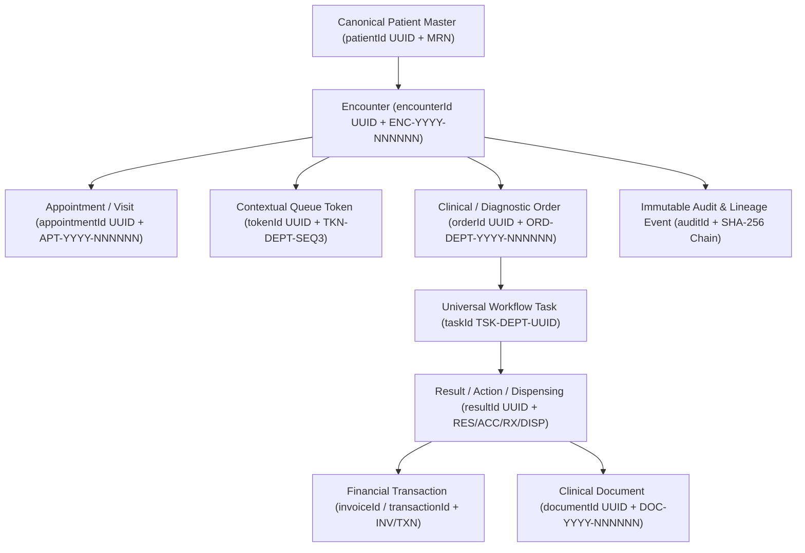

# DOC SEARCH — PHASE 5: PATIENT 360 + UNIVERSAL IDS DESIGN (`DOC_SEARCH_PHASE_5_PATIENT_360_DESIGN.md`)

**Phase:** Phase 5 — Patient 360 + Universal IDs + Clinical Data Continuity
**Status:** `APPROVED DESIGN SPECIFICATION`

---

## 1. Canonical Identity Hierarchy & Data Lineage Backbone

### Core Identity Rules
1. **`patientId` (UUID)** is the **sole canonical technical identity** of a patient across all departments (`OPD`, `LIMS`, `RADIOLOGY`, `PHARMACY`, `IPD`, `BILLING`, `BLOOD_BANK`, `DIETARY`, `MRD`, `SUPPLY_CHAIN`).
2. **`mrn` (`MRN-YYYY-NNNNNN`)** is the **human/business identifier** scoped uniquely to `(tenantId, mrn)`. Two different patients in the same partner/tenant can never share an MRN (`409 DUPLICATE_MRN_COLLISION`), whereas two separate tenants have independent MRN namespaces.
3. **No Departmental Parallel Patients**: Attempting to create a second patient record from `LIMS`, `RADIOLOGY`, `PHARMACY`, or `BILLING` for an existing patient or with `departmentRegistrationFlag` is rejected or resolved to the canonical `patientId`.
4. **No Name / Token / Phone Substitution**: Passing a patient name, phone number, MRN, or token number where `patientId` or `encounterId` is required is rejected (`400 INVALID_CANONICAL_ID_FORMAT`).
