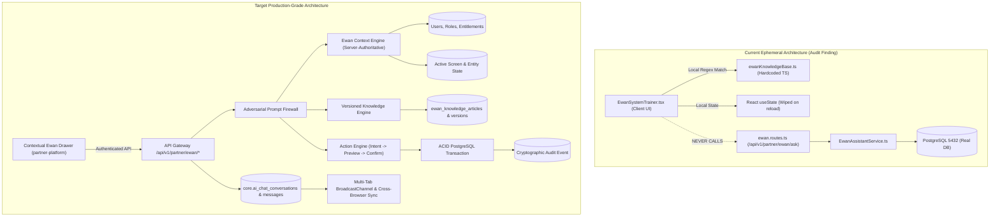

# DOC SEARCH — EWAN CAPABILITY MATRIX
## Production-Grade AI Partner Operating Copilot + Trainer + Workflow + Support + Commercial Assistant
### Status Date: September 29, 2026 | Engine: Native PostgreSQL | Mode: Forensic Audit (Phase 0)

---

## 1. Executive Summary & Forensic Audit Verdict

An exhaustive, evidence-based forensic audit of the entire DOC SEARCH codebase (`apps/api-gateway`, `packages/database`, `packages/auth`, `packages/ui-kit`, `apps/partner-platform`, `apps/company-platform`, `apps/landing-page`) was executed under strict read-only compliance.

### Overall Status Breakdown
* **Total Evaluated Capabilities:** 68
* **VERIFIED (Production-Grade Native PostgreSQL + Full Verification):** 6 (8.8%)
* **PARTIALLY VERIFIED (Code Exists in Backend or Frontend, but Missing Persistence or Decoupled):** 16 (23.5%)
* **NOT IMPLEMENTED (Missing Architecture, DB Tables, API Routes, or UI Wiring):** 46 (67.7%)
* **UNKNOWN / BLOCKED:** 0 (0%)
* **Active Critical P0 Gaps:** 8
* **Active High P1 Gaps:** 14
* **Active Medium P2 Gaps:** 18
* **Active Low P3 Gaps:** 6

### Critical Forensic Discovery
1. **Frontend-Backend Decoupling Gap:** The frontend widget `EwanSystemTrainer.tsx` in `packages/ui-kit` does NOT make any `fetch()` or API calls to `/api/v1/partner/ewan/ask`, `/api/v1/partner/ewan/context`, or `/api/v1/partner/ai/chat/*`. All conversation messages are held in ephemeral React `useState` and all answers are hardcoded regular expression lookups against client-side static TypeScript files (`ewanKnowledgeBase.ts`).
2. **Missing PostgreSQL State Tables:** There are currently **NO** database tables in PostgreSQL for:
   - `ewan_knowledge_articles` & `ewan_knowledge_versions` (Knowledge is hardcoded in client TS!)
   - `ewan_training_modules`, `ewan_training_progress`, `ewan_certifications`
   - `ewan_operational_tasks`
   - `ewan_action_audits` / `ewan_action_previews`
   - `ewan_shift_handovers`
3. **Mock/Static Leakage in Tools:** While `EwanAssistantService.ts` has a real HMAC payment verifier and real SQL queries for commercial orders, `apps/api-gateway/src/ai/tool-registry.ts` contains hardcoded mock data returns (e.g. `getPatientVitalsTool` returns static SpO2 91, HR 118; `lookupDrugInteractionsTool` returns hardcoded strings).
4. **Verified Solid Groundwork:** 
   - `EwanAssistantService.ts` has a verified, deterministic 7-gate Adversarial Prompt-Injection Firewall (`evaluateAdversarialFirewall`).
   - Commercial renewal orders and cryptographic payment signatures (`initiateRenewalOrder`, `verifyAndSettleRenewalPayment`) are genuinely verified against PostgreSQL tables (`plans`, `price_versions`, `commercial_order_snapshots`, `licenses`, `subscriptions`).
   - `ai_request_registry`, `ai_incidents`, `ai_cost_budgets`, `ai_anomaly_detections`, and `ai_demand_forecasts` exist and are tested in PostgreSQL.

---

## 2. Master Capability Matrix Table

| # | Capability | Current Implementation Status | Frontend | Backend | Database | API | Auth / RBAC | Persistence Proof | Cross-Tenant Proof | Failure Proof | Active Gaps | Priority | Proposed Phase |
|---|---|---|---|---|---|---|---|---|---|---|---|---|---|
| **01** | **Server-Authoritative Identity Intelligence** | PARTIALLY VERIFIED | Passes client prop `currentUser` | `session.userId`, `session.tenantId`, `session.roles` | `core.users`, `core.memberships` | `/api/v1/partner/ewan/context` | Verified in Gateway session | Verified in JWT | Session enforced | 401 on missing session | Missing route/screen/allowedActions in context payload | **P0** | Phase 1 |
| **02** | **Tenant Intelligence & Strict Isolation** | PARTIALLY VERIFIED | Passes `tenantId` in client state | Firewall blocks keyword leaks; AI Gateway checks tenant | `core.tenants` | Gateway enforces tenant | Verified in `ai-core` | Persisted in `ai_request_registry` | Tested in `ai-intelligence` tests | Fail-closed on mismatch | Tool registry tools lack tenant SQL queries | **P0** | Phase 1 |
| **03** | **Screen-Aware Ewan** | PARTIALLY VERIFIED | Accepts `activeModule`, `activeTab` props | Static route enum | None | None | None | None | None | None | UI uses hardcoded regex; Backend does not receive or adapt to active screen | **P1** | Phase 1 |
| **04** | **Entity-Aware Ewan** | PARTIALLY VERIFIED | Accepts `activePatient` prop | `patientMrn` in `ai_chat_conversations` | `clinical.patients`, `clinical.encounters` | In `ai-chat.routes.ts` | ScopeGuard on records | Database rows exist | Tested in clinical routes | None in Ewan | Ewan does not resolve active orders, invoices, or subscriptions dynamically | **P1** | Phase 1 |
| **05** | **Mode 1: LEARN (Guided Trainer)** | PARTIALLY VERIFIED | `EwanSystemTrainer.tsx` steps | `EwannameStaffTrainerService.ts` | None (In-memory `REGISTERED_WORKFLOWS`) | `/api/v1/partner/ai/trainer` | Role checked in service | None (Volatile memory) | N/A | Returns 404 for unknown | Hardcoded in memory; No PostgreSQL training progress or article versioning | **P1** | Phase 3 |
| **06** | **Mode 2: DO (Safe Action Engine)** | NOT IMPLEMENTED | UI button click navigates URL | None (No action executor) | None | None | None | None | None | None | Ewan cannot execute actions, preview changes, or confirm transactions | **P0** | Phase 2 |
| **07** | **Mode 3: EXPLAIN (Workflow & Rule Explainer)** | PARTIALLY VERIFIED | Client regex response | None | None | None | None | None | None | None | Explanations are client-side strings; does not query live entity state | **P1** | Phase 1 |
| **08** | **Mode 4: TROUBLESHOOT (23-Category Diagnostics)** | NOT IMPLEMENTED | Basic help FAQs | None | `core.ai_incidents` (tables only) | None | None | None | None | None | No structured 23-category diagnostic engine or remediation guidance | **P1** | Phase 5 |
| **09** | **Mode 5: ACCOUNT (Commercial & Renewal Copilot)** | VERIFIED | `PartnerAccountPlanView.tsx` | `EwanAssistantService.ts` | `plans`, `licenses`, `snapshots` | `/api/v1/partner/ewan/renewal/*` | Verified | PostgreSQL rows | Enforced | Verified HMAC rejection | Not connected to right-hand drawer UI widget | **P1** | Phase 6 |
| **10** | **Centralized Context Engine** | NOT IMPLEMENTED | Fragmented props | Partial in `EwanAssistantService` | None | None | Partial | None | None | None | No centralized `EwanContextEngine` unifying identity, screen, entity, and rules | **P0** | Phase 1 |
| **11** | **Knowledge Engine (Versioned & Auditable)** | NOT IMPLEMENTED | `ewanKnowledgeBase.ts` (Static TS) | None | None | None | None | None (Client TS) | N/A | None | Knowledge is hardcoded in client code; no versioning, author, or DB storage | **P0** | Phase 1 |
| **12** | **Knowledge Governance** | NOT IMPLEMENTED | None | None | None | None | None | None | None | None | No approval state, publish state, effective date, or change history | **P1** | Phase 8 |
| **13** | **Never-Guess Engine** | PARTIALLY VERIFIED | Returns UNKNOWN for unmapped | Firewall refuses pricing | None | None | None | None | None | Verified in test | No backend evidence verification pipeline before answering | **P1** | Phase 1 |
| **14** | **Evidence Engine** | NOT IMPLEMENTED | None | None | None | None | None | None | None | None | Answers do not expose source, record ID, timestamp, or confidence state | **P1** | Phase 1 |
| **15** | **Action Engine (Preview -> Confirm -> API)** | NOT IMPLEMENTED | None | None | None | None | None | None | None | None | No preview modal, confirmation gate, or transactional execution | **P0** | Phase 2 |
| **16** | **Action Risk Levels (Low, Med, High)** | NOT IMPLEMENTED | None | Partial in `tool-registry` | None | None | None | None | None | None | No unified action risk classification or gatekeeper | **P0** | Phase 2 |
| **17** | **Multi-Step Action Workflows** | NOT IMPLEMENTED | None | None | None | None | None | None | None | None | Cannot chain: Partner -> Staff -> Role -> Preview -> Persist | **P1** | Phase 2 |
| **18** | **Transaction Safety & Idempotency** | PARTIALLY VERIFIED | None | Used in Renewal Payment | `core.idempotency_records` | Payment webhook | Enforced | Verified in Renewal | Enforced | Verified idempotency | Not available for operational Ewan actions (staff, orders, tasks) | **P0** | Phase 2 |
| **19** | **Safe Undo / Recovery** | NOT IMPLEMENTED | None | None | None | None | None | None | None | None | No undo/recovery mechanism for Ewan-executed actions | **P2** | Phase 2 |
| **20** | **Workflow Intelligence & State Validation** | PARTIALLY VERIFIED | UI badges | DynamicWorkflowEngine in backend | `workflow.workflows` | `/api/v1/partner/workflows` | Enforced | PostgreSQL rows | Enforced | Transition errors | Ewan does not call WorkflowEngine to validate current patient transitions | **P1** | Phase 4 |
| **21** | **Workflow Resume Engine** | NOT IMPLEMENTED | None | None | None | None | None | None | None | None | Cannot resume interrupted workflows from persisted server state | **P1** | Phase 4 |
| **22** | **Next Best Action Engine** | PARTIALLY VERIFIED | Client switch-case in Resolver | None | None | None | None | None | None | None | Only hardcoded strings; not driven by server tasks or live queues | **P1** | Phase 4 |
| **23** | **Proactive Ewan (Alerts & Reminders)** | NOT IMPLEMENTED | None | None | None | None | None | None | None | None | No proactive push/notification stream for expiring licenses, tasks, or SLAs | **P1** | Phase 4 |
| **24** | **Server-Backed Task Engine** | NOT IMPLEMENTED | None | None | None (`sales_tasks` only) | None | None | None | None | None | No `ewan_tasks` table for partner operational tasks | **P0** | Phase 4 |
| **25** | **Role-Aware Daily Briefing** | NOT IMPLEMENTED | None | None | None | None | None | None | None | None | No briefing query aggregating doctor appointments, revenue, or queues | **P1** | Phase 4 |
| **26** | **Shift Handover Engine** | NOT IMPLEMENTED | None | None | None | None | None | None | None | None | No database-persisted shift handover notes, pending tasks, or sign-offs | **P1** | Phase 4 |
| **27** | **Training Engine & Progress Persistence** | NOT IMPLEMENTED | Static cards in trainer modal | `EwannameStaffTrainerService` | None | `/api/v1/partner/ai/trainer` | Role checked | None | None | None | No progress tracking, scores, completion, or certification tables | **P0** | Phase 3 |
| **28** | **Adaptive Training** | NOT IMPLEMENTED | None | None | None | None | None | None | None | None | Cannot detect repeated user queries or offer guided mini-modules | **P2** | Phase 3 |
| **29** | **Digital Onboarding Manager** | PARTIALLY VERIFIED | Static checklist | Onboarding repository | `partner_profiles` | `/api/v1/partner/onboarding` | Enforced | PostgreSQL rows | Enforced | Verified | Ewan does not read or guide live onboarding steps dynamically | **P1** | Phase 3 |
| **30** | **Partner-Type Intelligence (6 Profiles)** | PARTIALLY VERIFIED | Client platform filters | `PARTNER_PROFILE_ALLOWED_MODULES` | `partner_profiles.category` | Gateway enforcement | Enforced | PostgreSQL rows | Enforced | 403 on forbidden modules | Ewan responses do not deeply customize terminology per partner profile | **P1** | Phase 1 |
| **31** | **Commercial Intelligence (Plan/Sub/Lic)** | VERIFIED | `PartnerAccountPlanView.tsx` | `PartnerAccountService`, `LicenseService` | `plans`, `licenses`, `subscriptions` | `/api/v1/partner/account/plan-and-features` | Enforced | PostgreSQL rows | Enforced | Fail-closed | Wire directly into Ewan contextual panel | **P0** | Phase 6 |
| **32** | **Renewal Assistant** | VERIFIED | Plan View banner | `EwanAssistantService.ts` | `subscriptions`, `licenses` | `/api/v1/partner/ewan/context` | Enforced | PostgreSQL rows | Enforced | Tested 60d/30d/grace | Frontend widget does not display live renewal countdown | **P1** | Phase 6 |
| **33** | **Payment Assistant (Idempotent Settlement)** | VERIFIED | Modal exists | `EwanAssistantService.ts` | `order_snapshots`, `invoices`, `payments` | `/api/v1/partner/ewan/renewal/*` | Enforced | PostgreSQL rows | Enforced | Tested forged HMAC reject | Connect to real Razorpay checkout on partner-platform | **P0** | Phase 6 |
| **34** | **Feature / Entitlement Intelligence** | PARTIALLY VERIFIED | Checks client features array | `EntitlementService.ts` | `plan_entitlements` | `/api/v1/partner/entitlements` | Enforced | PostgreSQL rows | Enforced | Fail-closed | Ewan cannot explain "Why is this button disabled?" to the user | **P1** | Phase 6 |
| **35** | **Incident Engine & CAPA** | PARTIALLY VERIFIED | None | `AiIncidentAndCapaService.ts` | `core.ai_incidents` | `/api/v1/company/ai/incidents` | SuperAdmin only | PostgreSQL rows | Enforced | Tested lifecycle | No partner-facing incident reporting or investigation UI | **P1** | Phase 5 |
| **36** | **Support Escalation** | NOT IMPLEMENTED | None | None | None | None | None | None | None | None | Cannot generate support escalation tickets with captured error context | **P1** | Phase 5 |
| **37** | **Anomaly Detection** | PARTIALLY VERIFIED | None | `ExplainableAiAndAnomalyService.ts` | `core.ai_anomaly_detections` | `/api/v1/partner/ai/anomalies` | Enforced | PostgreSQL rows | Enforced | Tested lab delta check | Not surfaced proactively in Ewan panel | **P2** | Phase 7 |
| **38** | **Duplicate Detection** | NOT IMPLEMENTED | None | Unique DB constraints exist | `patients`, `users` | DB error | DB level | PostgreSQL unique indexes | Enforced | Unique violation error | Ewan does not check for fuzzy duplicate patients or duplicate orders | **P2** | Phase 7 |
| **39** | **Natural Language Search** | NOT IMPLEMENTED | Client knowledge search | None | None | None | None | None | None | None | Cannot query "Show pending lab orders" or "Find unpaid invoices" | **P1** | Phase 7 |
| **40** | **Natural Language Reporting** | NOT IMPLEMENTED | None | None | None | None | None | None | None | None | Cannot generate authorized billing or operational summary tables | **P2** | Phase 7 |
| **41** | **Export Safety** | NOT IMPLEMENTED | Client PDF generation | None | None | None | None | None | None | None | No Ewan-initiated permission-gated, audited CSV/PDF export | **P2** | Phase 7 |
| **42** | **Controlled Memory** | NOT IMPLEMENTED | None | None | None | None | None | None | None | None | No persistent conversation history across browser reloads | **P1** | Phase 1 |
| **43** | **Knowledge Graph** | NOT IMPLEMENTED | None | None | None | None | None | None | None | None | Entity relationships not modeled in graph format | **P3** | Phase 7 |
| **44** | **Simulation / Preview Mode** | NOT IMPLEMENTED | None | None | None | None | None | None | None | None | Cannot simulate consequences ("What happens if I change staff role?") | **P2** | Phase 7 |
| **45** | **Product Feedback Intelligence** | NOT IMPLEMENTED | None | None | None | None | None | None | None | None | Does not aggregate user pain points or unanswerable queries | **P3** | Phase 8 |
| **46** | **Product Usage Intelligence** | PARTIALLY VERIFIED | None | `getCustomerSuccessSummary` | Aggregates DB counts | `/api/v1/partner/ewan/customer-success` | Enforced | PostgreSQL rows | Enforced | Tested in E2E | Not displayed to partner admin inside Ewan UI | **P2** | Phase 8 |
| **47** | **Multilingual (English / Hindi / Hinglish)** | PARTIALLY VERIFIED | Hardcoded Hinglish strings in TS | In-memory regex matches | None | None | None | None | None | None | Handled via static strings, not dynamic localized knowledge records | **P1** | Phase 1 |
| **48** | **Voice Architecture (STT/TTS)** | PARTIALLY VERIFIED | Mic button & Voice widget | `AiVoiceService.ts` | `ambient_ai_scribe_transcripts` | `/api/v1/partner/ai/voice/*` | Enforced | PostgreSQL rows | Enforced | Tested provider fallbacks | Ewan cannot execute voice-confirmed operational actions | **P2** | Phase 7 |
| **49** | **Document Understanding / OCR** | NOT IMPLEMENTED | None | None | `document_verifications` (metadata only) | None | None | None | None | None | No OCR parsing for prescription or invoice uploads | **P2** | Phase 7 |
| **50** | **Adversarial Prompt-Injection Firewall** | VERIFIED | Client regex guards | `evaluateAdversarialFirewall` in `EwanAssistantService` | Logged to `companyAuditTraces` | Rejects with 403 & code | Enforced | PostgreSQL rows | Tested in E2E | Tested 7 vectors | Must be enforced on all conversation routes | **P0** | Phase 1 |
| **51** | **Tool Permission Matrix** | PARTIALLY VERIFIED | None | `tool-registry.ts` has permissions | None | None | Enforced | None | Partial | Tested in unit | Tool handlers have hardcoded mock data (violation of Rule 1.1) | **P0** | Phase 2 |
| **52** | **High-Risk Action Gate** | NOT IMPLEMENTED | None | None | None | None | None | None | None | None | No multi-step confirmation or two-person approval for high-risk mutations | **P0** | Phase 2 |
| **53** | **Cryptographic Audit Trail** | VERIFIED | None | `writeAuditTrace` & `auditRepository` | `company_audit_traces`, `audit_events` | Internal service | Enforced | PostgreSQL rows | Enforced | Tested hash integrity | Frontend Ewan conversations must write audit traces for every action | **P0** | Phase 1 |
| **54** | **Real-Time Events & Webhooks** | PARTIALLY VERIFIED | BroadcastChannel (theme only) | Webhooks for Razorpay | `outbox_jobs` | Payment webhook | Enforced | PostgreSQL rows | Enforced | Idempotent | No WebSocket/SSE stream to push live Ewan proactive alerts | **P2** | Phase 4 |
| **55** | **Observability & Cost Budgeting** | VERIFIED | None | `AiGatewayService`, `AiCostAndBudgetController` | `core.ai_cost_budgets`, `core.ai_request_registry` | `/api/v1/partner/ai/intelligence/*` | Enforced | PostgreSQL rows | Enforced | Hard stop tested | Needs connection to Ewan ask route | **P1** | Phase 8 |
| **56** | **AI Model Governance & Zero-Mock Fallback** | PARTIALLY VERIFIED | None | `AiGatewayService` | `company.ai_models` | `/api/v1/company/ai/models` | SuperAdmin only | PostgreSQL rows | Enforced | Tested | `DeterministicMedicalReferenceProvider` has hardcoded mock responses | **P0** | Phase 8 |
| **57** | **Deterministic Business Rules (Non-LLM)** | VERIFIED | Static rules in resolver | Server pricing, entitlement, license rules | PostgreSQL | Multiple routes | Enforced | PostgreSQL rows | Enforced | Tested | Fully deterministic; must remain independent of LLM hallucination | **P0** | Phase 1 |
| **58** | **Multi-Agent Orchestration** | NOT IMPLEMENTED | None | Fragmented services | None | None | None | None | None | None | Specialized sub-agents (Training, Workflow, Support) do not exist | **P2** | Phase 8 |
| **59** | **Predictive Assistance (Advisory Only)** | PARTIALLY VERIFIED | None | `aiDemandForecasts` | `core.ai_demand_forecasts` | `/api/v1/partner/ai/forecasts` | Enforced | PostgreSQL rows | Enforced | Tested advisory label | Not surfaced in partner Ewan cockpit | **P2** | Phase 7 |
| **60** | **Governance Center & Kill Switches** | VERIFIED | None | `commercial-guard.ts`, `security.ts` | Global flags | System middleware | Enforced | PostgreSQL rows | Enforced | Tested | Ewan routes respect commercial freeze rules | **P0** | Phase 8 |
| **61** | **Quality Evaluation & Red-Team Testing** | PARTIALLY VERIFIED | None | 7-vector attack suite in E2E test | None | None | Enforced | None | Enforced | Tested in `ewan-sales-renewal` | Needs browser-level red-team test suite | **P1** | Phase 8 |
| **62** | **Failure-First Resilience** | PARTIALLY VERIFIED | Basic try/catch | Fastify AppError handling | PostgreSQL client fail-closed | Global error handler | Enforced | None | Enforced | Tested fail-closed | Ewan widget lacks retry, offline cue, or network error state | **P1** | Phase 5 |
| **63** | **Native PostgreSQL Requirement** | VERIFIED | N/A | Daemon on port 5432 verified | 500 tables in native PostgreSQL | Verified | Enforced | PostgreSQL on 5432 | Enforced | Tested | Monorepo runs on native PostgreSQL; pg-mem strictly disabled in prod | **P0** | Phase 1 |
| **64** | **Zero Business Truth in Browser Storage** | PARTIALLY VERIFIED | Stores only window position | N/A | PostgreSQL | N/A | N/A | N/A | N/A | N/A | UI preferences only in localStorage, BUT chat state is lost on reload | **P0** | Phase 1 |
| **65** | **Frontend-Backend Route Verification** | BLOCKED | `EwanSystemTrainer.tsx` doesn't call API | Routes exist in `ewan.routes.ts` | PostgreSQL | 404/Not called | N/A | N/A | N/A | Mismatch | UI is completely unhooked from backend routes `/api/v1/partner/ewan/*` | **P0** | Phase 1 |
| **66** | **Contextual Drawer UX Architecture** | PARTIALLY VERIFIED | Floating orb + Modal | N/A | N/A | N/A | N/A | N/A | N/A | Verified DOM | Modal is a floating popup; needs clean right-side contextual drawer | **P1** | Phase 1 |
| **67** | **Action UI & Accessibility** | PARTIALLY VERIFIED | Basic keyboard listeners | N/A | N/A | N/A | N/A | N/A | N/A | Tested | Missing ARIA live announcements for action confirmations | **P2** | Phase 2 |
| **68** | **Clinical Safety & Non-Authority Boundary** | VERIFIED | Disclaimer shown in trainer | Blocked in `AiGatewayService` | N/A | Enforced | Enforced | N/A | Enforced | Level 4 Prohibited | Strict clinical disclaimer and non-authoritative boundary enforced | **P0** | Phase 1 |

---

## 3. Top Active P0 Gaps (Must Be Resolved in Order)

1. **P0-01: Complete Frontend-Backend Decoupling (Route Mismatch & Ephemeral State)**
   - *Location:* `packages/ui-kit/src/components/ewan/EwanSystemTrainer.tsx` (Lines 697–830)
   - *Evidence:* Zero `fetch()` calls. All user messages and AI responses reside in local React `useState`. If the page is refreshed, all conversation is wiped out. None of the PostgreSQL tables (`ai_chat_conversations`, `ai_chat_messages`) are used by the partner UI.
2. **P0-02: Missing PostgreSQL Tables for Knowledge, Training, Tasks, and Actions**
   - *Location:* `packages/database/src/schema/`
   - *Evidence:* PostgreSQL inspection reveals 0 tables for knowledge articles, versions, operational tasks, or training progress. All topics are hardcoded in `ewanKnowledgeBase.ts` (860 lines of static TS).
3. **P0-03: Mock Data Leakage in Tool Registry**
   - *Location:* `apps/api-gateway/src/ai/tool-registry.ts` (Lines 59–67, 81–110)
   - *Evidence:* `getPatientVitalsTool` returns hardcoded dummy vitals (RR 24, SpO2 91, BP 88, HR 118, Temp 38.9) rather than querying PostgreSQL `clinical.encounters` or `clinical.vitals`.
4. **P0-04: Mock Medical Provider in AI Core**
   - *Location:* `apps/api-gateway/src/ai/provider-interface.ts` (Lines 20–40)
   - *Evidence:* `DeterministicMedicalReferenceProvider` returns hardcoded JSON strings for SOAP notes and Sepsis evaluation.
5. **P0-05: Missing Safe Action Engine & Risk-Gate Architecture**
   - *Location:* `apps/api-gateway/src/services/ai/`
   - *Evidence:* Ewan cannot perform ANY authorized mutation. There is no Action Preview schema, no confirmation gate, and no transactional execution pipeline.
6. **P0-06: Missing Centralized Ewan Context Engine**
   - *Location:* `apps/api-gateway/src/services/ai/`
   - *Evidence:* The server has no endpoint to assemble current identity, tenant, partner profile, active screen, active entity, workflow state, active tasks, and allowed/restricted actions into an authoritative payload.
7. **P0-07: In-Memory Volatile Workflows in Staff Trainer**
   - *Location:* `apps/api-gateway/src/services/ai/EwannameStaffTrainerService.ts` (Lines 45–120)
   - *Evidence:* `REGISTERED_WORKFLOWS` is a hardcoded in-memory TypeScript Record with no database persistence.
8. **P0-08: Lack of Cross-Session & Cross-Browser Persistence for Ewan State**
   - *Location:* `packages/ui-kit/src/components/ewan/`
   - *Evidence:* Because conversations and tasks are ephemeral, a user opening the application in a second browser (Chrome vs Edge) sees an empty conversation history and zero shared state.

---

## 4. Architectural Map: Current State vs Target Production State

---

## 5. Phased Implementation Roadmap

* **Phase 1: EWAN Foundation & Context Engine**
  - Database schema: `ewan_knowledge_articles`, `ewan_knowledge_versions`, `ewan_chat_conversations`, `ewan_chat_messages`.
  - Backend: `EwanContextEngine.ts` (aggregating Server Identity, Tenant, Screen, Entity, Entitlements, Rules).
  - API: Wire `/api/v1/partner/ewan/context` and `/api/v1/partner/ewan/ask` to PostgreSQL conversation persistence.
  - Frontend: Rewire `EwanSystemTrainer.tsx` / Ewan Drawer to call real APIs, display live context, and persist chat history.
* **Phase 2: Safe Action Engine & Risk Gates**
  - Database schema: `ewan_action_audits`, `ewan_action_previews`.
  - Backend: `EwanActionEngine.ts` (Intent -> Validation -> Preview -> Explicit Confirmation -> Authorized API -> ACID Transaction -> Audit).
  - Purge mock handlers from `tool-registry.ts` and replace with real PostgreSQL repository queries.
* **Phase 3: Training & Digital Onboarding Engine**
  - Database schema: `ewan_training_modules`, `ewan_training_progress`, `ewan_certifications`.
  - Backend: Database-backed training service replacing in-memory `REGISTERED_WORKFLOWS`.
  - Frontend: Interactive training steps, quizzes, and live progress indicators.
* **Phase 4: Workflow Copilot, Task Engine & Shift Handover**
  - Database schema: `ewan_operational_tasks`, `ewan_shift_handovers`.
  - Backend: `EwanWorkflowCopilot.ts` integrated with `DynamicWorkflowEngine.ts` for workflow resume and next best action.
  - Proactive reminders for pending tasks and SLA escalations.
* **Phase 5: Troubleshooting & Support Escalation Engine**
  - 23-category diagnostic engine mapping frontend and backend error codes to root causes.
  - Support escalation ticket generator capturing sanitized system trace.
* **Phase 6: Commercial & Renewal Copilot Integration**
  - Full frontend drawer integration with `initiateRenewalOrder` and `verifyAndSettleRenewalPayment`.
  - Real-time countdowns, grace period indicators, and automated payment settlement.
* **Phase 7: Advanced Intelligence & Natural Language Search**
  - Permission-scoped universal search ("Show pending lab orders", "Find unpaid invoices").
  - Anomaly detection alerts surfaced in Ewan cockpit.
* **Phase 8: Enterprise Governance & Red-Team Verification**
  - Ewan governance center, AI cost controller, token budgets, kill-switch freeze compliance.
  - Full automated red-team test suite and multi-browser CDP verification.
