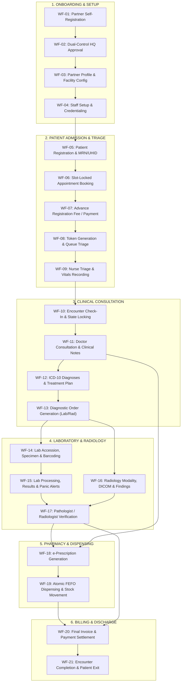

# DOC SEARCH — PHASE 18 ENTERPRISE WORKFLOW & TRANSACTION REGISTER

```
====================================================================================================
PROJECT:             DOC SEARCH Healthcare Enterprise Monorepo
PHASE:               PHASE 18 — PERSISTENT WORKFLOW & TRANSACTION INTEGRITY
ROLE:                Senior Healthcare ERP Workflow Architect, Distributed Transaction Engineer & Auditor
CURRENT STATUS:      PARTIALLY VERIFIED — WORKFLOW REMEDIATION IN PROGRESS
TARGET STATUS:       PERSISTENT WORKFLOW + TRANSACTION INTEGRITY VERIFIED
TOTAL WORKFLOWS:     21 Canonical Clinical & Operational Healthcare Workflows (WF-01 to WF-21)
TOTAL SCHEMAS:       498 Tables (321 Clinical, 133 Company, 35 Core, 9 Workflow)
TOTAL API ROUTES:    1,036 Registered Endpoints (Fastify / Zod / RealAuthService)
====================================================================================================
```

---

## 1. CANONICAL MASTER HEALTHCARE WORKFLOW TOPOLOGY



---

## 2. CANONICAL WORKFLOWS INVENTORY (`WF-01` — `WF-21`)

### WF-01: Partner Self-Registration & Dual-Control Onboarding
* **Applicable Profiles**: All Healthcare Partner Types (Clinic, Hospital, Pathology Lab, Radiology, Retail Pharmacy, Wholesale Pharmacy).
* **Frontend UI**: `apps/landing-page/src/components/FullPageRegistrationView.tsx`
* **API Endpoints**: `POST /api/v1/auth/register-partner`
* **Controller / Service**: `RegistrationFormPolicyService.ts`, `PartnerOnboardingRepository.ts`
* **Repositories**: `PartnerOnboardingRepository.ts`
* **Database Tables**: `operationalPartners`, `operationalSubscriptions`, `partnerProfiles`, `users`, `tenants`
* **Identifiers**: `partnerCode` (`PRT-XXXXXX`), `tenantId` (UUID v4)
* **Initial State**: `ONBOARDING`
* **Valid States**: `ONBOARDING`, `PENDING_APPROVAL`, `ACTIVE`, `REJECTED`
* **Allowed Transitions**: `ONBOARDING -> PENDING_APPROVAL -> ACTIVE` (or `REJECTED`)
* **Transition Authority**: Dual-Control HQ Officer (`SUPER_ADMIN`, `COMPANY_ADMIN`)
* **Transaction Boundary**: Atomic PostgreSQL Transaction (`withSecurityContext`)
* **Idempotency Strategy**: SHA-256 canonicalization of legal business name, tax ID (GST/PAN), and contact phone.
* **Concurrency Control**: Unique constraint on `operationalPartners.partnerCode` and `tenants.id`.
* **Audit Trail**: `REGISTRATION_SUBMITTED` event committed with deterministic SHA-256 hash.
* **Failure / Rollback**: Full rollback on DB failure; no orphan tenant or user created.

---

### WF-02: Dual-Control HQ Approval & License Minting
* **Applicable Profiles**: All Healthcare Partner Types.
* **Frontend UI**: `apps/company-platform/src/components/PartnerVerificationConsole.tsx`
* **API Endpoints**: `POST /api/v1/company/partners/:partnerId/approve`, `POST /api/v1/company/partners/:partnerId/reject`
* **Controller / Service**: `PartnerSyncService.ts`, `LicenseService.ts`, `SubscriptionService.ts`
* **Repositories**: `PartnerRepository.ts`, `LicenseRepository.ts`
* **Database Tables**: `operationalPartners`, `subscriptions`, `licenses`, `licenseEntitlements`, `operationalAuditTraces`
* **Identifiers**: `subscriptionId`, `licenseKey` (HMAC SHA-256 signed token)
* **Initial State**: `PENDING_APPROVAL`
* **Valid States**: `ACTIVE`, `REJECTED`
* **Allowed Transitions**: `PENDING_APPROVAL -> ACTIVE`, `PENDING_APPROVAL -> REJECTED`
* **Transition Authority**: HQ Super Admin (`dualControlApproval` verified)
* **Transaction Boundary**: Atomic Multi-table Transaction
* **Idempotency Strategy**: `approvalNonce` check; re-approving an active partner returns existing active state (no duplicate license).
* **Concurrency Control**: PostgreSQL row lock on `operationalPartners.id`.
* **Audit Trail**: `PARTNER_APPROVED` / `LICENSE_ISSUED` in `operational_audit_traces`.
* **Failure / Rollback**: License and subscription creation atomic with status update; rolls back on crypto signing or persistence failure.

---

### WF-03: Partner Profile & Facility Configuration
* **Applicable Profiles**: All Healthcare Partner Types.
* **Frontend UI**: `apps/partner-platform/src/components/PartnerFoundationDomainManager.tsx`
* **API Endpoints**: `GET /api/v1/partner/account/profile`, `PUT /api/v1/partner/account/profile`, `POST /api/v1/company/partners/:partnerId/branches`
* **Controller / Service**: `PartnerAccountService.ts`, `PartnerConfigurationEngineService.ts`
* **Repositories**: `PartnerFoundationRepository.ts`
* **Database Tables**: `operationalOrganizations`, `operationalFacilities`, `branches`, `operationalDepartments`
* **Identifiers**: `organizationId` (UUID), `facilityId` (UUID), `branchId` (UUID), `departmentId` (UUID)
* **Initial State**: `CONFIGURING`
* **Valid States**: `CONFIGURING`, `OPERATIONAL`, `MAINTENANCE`, `DECOMMISSIONED`
* **Allowed Transitions**: `CONFIGURING -> OPERATIONAL -> MAINTENANCE -> OPERATIONAL`
* **Transition Authority**: `COMPANY_ADMIN`, `PARTNER_ADMIN`
* **Transaction Boundary**: Single PostgreSQL Transaction
* **Idempotency Strategy**: Unique facility code / branch code within tenant scope.
* **Concurrency Control**: Optimistic versioning on facility profile.
* **Audit Trail**: `FACILITY_PROFILE_UPDATED` in `audit_events`.
* **Failure / Rollback**: Transaction rollback; foreign keys enforce valid tenant attachment.

---

### WF-04: Staff Setup, Credentialing & Role Binding
* **Applicable Profiles**: All Healthcare Partner Types.
* **Frontend UI**: `apps/partner-platform/src/components/StaffAdministrationDomainManager.tsx`
* **API Endpoints**: `POST /api/v1/partner/staff`, `PUT /api/v1/partner/staff/:staffId`, `POST /api/v1/partner/staff/:staffId/role`
* **Controller / Service**: `StaffAdministrationService.ts`
* **Repositories**: `StaffAdministrationRepository.ts`
* **Database Tables**: `operationalStaff`, `staffRoleAssignments`, `staffCredentials`, `doctorProfiles`
* **Identifiers**: `staffId` (UUID), `staffCode` (`STF-XXXXXX`), `roleId` (UUID)
* **Initial State**: `INVITED`
* **Valid States**: `INVITED`, `ACTIVE`, `SUSPENDED`, `TERMINATED`
* **Allowed Transitions**: `INVITED -> ACTIVE -> SUSPENDED -> ACTIVE`, `ACTIVE -> TERMINATED`
* **Transition Authority**: `PARTNER_ADMIN`, `HR_MANAGER` (Self-role escalation structurally barred: 403)
* **Transaction Boundary**: `withTenantStaffLock` Transaction Barrier
* **Idempotency Strategy**: Unique `workEmail` and `staffCode` per tenant.
* **Concurrency Control**: Distributed/tenant mutex lock `staff-lock:${tenantId}`.
* **Audit Trail**: `STAFF_CREATED`, `ROLE_ASSIGNED` in `operational_staff_audit_traces`.
* **Failure / Rollback**: Failure to store credentials or role aborts staff creation.

---

### WF-05: Patient Registration & MRN/UHID Master Lineage
* **Applicable Profiles**: Clinic, Hospital, Pathology Lab, Radiology, Integrated Healthcare.
* **Frontend UI**: `apps/partner-platform/src/components/PatientRegistrationDomainManager.tsx`
* **API Endpoints**: `POST /api/v1/partner/clinical/patients`, `GET /api/v1/partner/clinical/patients`
* **Controller / Service**: `ClinicalWorkflowService.ts`, `Patient360ContinuityService.ts`
* **Repositories**: `ClinicalWorkflowRepository.ts`
* **Database Tables**: `patients`, `patientContacts`, `patientAddresses`, `patientIdentifiers`, `patientRegistrationAuditTraces`
* **Identifiers**: `patientId` (UUID), `mrn` (`MRN-XXXXXX`), `nationalHealthId` (ABHA/UHID)
* **Initial State**: `ACTIVE`
* **Valid States**: `ACTIVE`, `MERGED`, `DECEASED`, `INACTIVE`
* **Allowed Transitions**: `ACTIVE -> MERGED`, `ACTIVE -> DECEASED`
* **Transition Authority**: Registration Clerk, Nurse, Doctor, Partner Admin
* **Transaction Boundary**: Atomic Multi-table Transaction (`withSecurityContext`)
* **Idempotency Strategy**:
  - Tier 1: Exact `mrn` matching returns existing patient record if names match (409 Conflict if collision).
  - Tier 2: Normalized primary phone number deduplication.
* **Concurrency Control**: Unique index on `(tenantId, mrn)` and phone number lookup.
* **Audit Trail**: `PATIENT_REGISTERED` committed with SHA-256 hash in `patient_registration_audit_traces`.
* **Failure / Rollback**: Rollback prevents patient created without contact or tenant linkage.

---

### WF-06: Slot-Locked Appointment Scheduling
* **Applicable Profiles**: Clinic, Hospital, Integrated Healthcare.
* **Frontend UI**: `apps/partner-platform/src/components/FastOpdRegistrationDrawer.tsx`
* **API Endpoints**: `POST /api/v1/partner/clinical/appointments`, `GET /api/v1/partner/clinical/appointments`
* **Controller / Service**: `ClinicalWorkflowService.ts`
* **Repositories**: `ClinicalWorkflowRepository.ts`
* **Database Tables**: `appointmentsPartitioned`, `opdSlots`, `doctorSchedules`
* **Identifiers**: `appointmentId` (UUID), `appointmentNumber` (`APT-XXXXXX`), `slotId` (UUID)
* **Initial State**: `SCHEDULED`
* **Valid States**: `SCHEDULED`, `CONFIRMED`, `CHECKED_IN`, `IN_CONSULTATION`, `COMPLETED`, `CANCELLED`, `NO_SHOW`
* **Allowed Transitions**: `SCHEDULED -> CONFIRMED -> CHECKED_IN -> IN_CONSULTATION -> COMPLETED`, `SCHEDULED -> CANCELLED`
* **Transition Authority**: Receptionist, Patient, Doctor
* **Transaction Boundary**: Distributed Slot Lock (`slotLockManager`) + Single DB Transaction
* **Idempotency Strategy**: Distributed mutex on `slot-lock:${doctorId}:${date}:${startTime}`.
* **Concurrency Control**: Distributed slot lock prevents double-booking within identical time window.
* **Audit Trail**: `APPOINTMENT_BOOKED`, `SLOT_RESERVED` in `audit_events`.
* **Failure / Rollback**: If appointment persistence fails, slot lock is automatically released.

---

### WF-07: Advance Registration Fee & Payment Settlement
* **Applicable Profiles**: Clinic, Hospital, Integrated Healthcare.
* **Frontend UI**: `apps/partner-platform/src/components/BillingDomainManager.tsx`
* **API Endpoints**: `POST /api/v1/partner/billing/payments`, `POST /api/v1/partner/billing/invoices`
* **Controller / Service**: `BillingManagementService.ts`
* **Repositories**: `BillingManagementRepository.ts`
* **Database Tables**: `billingInvoices`, `billingInvoiceItems`, `billingPayments`, `financialTransactionsPartitioned`
* **Identifiers**: `invoiceId` (UUID), `invoiceNumber` (`INV-XXXXXX`), `paymentId` (UUID), `receiptNumber` (`REC-XXXXXX`)
* **Initial State**: `PENDING`
* **Valid States**: `PENDING`, `PARTIALLY_PAID`, `PAID`, `VOIDED`, `REFUNDED`
* **Allowed Transitions**: `PENDING -> PARTIALLY_PAID -> PAID`, `PENDING -> VOIDED`, `PAID -> REFUNDED`
* **Transition Authority**: Billing Cashier, Accounts Officer
* **Transaction Boundary**: Atomic PostgreSQL Transaction (`withSecurityContext`)
* **Idempotency Strategy**: SHA-256 fingerprinting of `(invoiceId, amount, transactionRef)`. Replay rejected (409).
* **Concurrency Control**: Pessimistic row lock `SELECT FOR UPDATE` on `billingInvoices`.
* **Audit Trail**: `PAYMENT_COLLECTED`, `RECEIPT_ISSUED` in `audit_events`.
* **Failure / Rollback**: Transaction rolls back if ledger insertion or invoice status update fails.

---

### WF-08: Token Generation & Queue Triage Calling
* **Applicable Profiles**: Clinic, Hospital, Diagnostic Centre.
* **Frontend UI**: `apps/partner-platform/src/components/RoleTailoredSmartDeskView.tsx`
* **API Endpoints**: `POST /api/v1/partner/clinical/queue/token`, `POST /api/v1/partner/clinical/queue/call`
* **Controller / Service**: `ClinicalWorkflowService.ts`, `UniversalHealthcareWorkflowEngineService.ts`
* **Repositories**: `ClinicalWorkflowRepository.ts`
* **Database Tables**: `encounterQueues`, `workflowInstances`
* **Identifiers**: `tokenId` (UUID), `tokenNumber` (Integer / `T-001`), `queueId` (UUID)
* **Initial State**: `QUEUED`
* **Valid States**: `QUEUED`, `CALLED`, `ENGAGED`, `COMPLETED`, `SKIPPED`, `CANCELLED`
* **Allowed Transitions**: `QUEUED -> CALLED -> ENGAGED -> COMPLETED`, `CALLED -> SKIPPED -> QUEUED`
* **Transition Authority**: Triage Nurse, Desk Attendant, Consulting Doctor
* **Transaction Boundary**: Single DB Transaction with optimistic lock
* **Idempotency Strategy**: Daily sequence reset per `(tenantId, branchId, departmentId, date)`.
* **Concurrency Control**: Sequence atomicity prevents duplicate token numbers on same date.
* **Audit Trail**: `TOKEN_ISSUED`, `TOKEN_CALLED` in `encounter_audit_traces`.
* **Failure / Rollback**: Fails closed; client refresh retains assigned token number.

---

### WF-09: Nurse Triage & Clinical Vitals Recording
* **Applicable Profiles**: Clinic, Hospital, Integrated Healthcare.
* **Frontend UI**: `apps/partner-platform/src/components/NurseVitalsTriageStationView.tsx`
* **API Endpoints**: `POST /api/v1/partner/clinical/vitals`, `GET /api/v1/partner/clinical/vitals/:encounterId`
* **Controller / Service**: `ClinicalWorkflowService.ts`
* **Repositories**: `ClinicalWorkflowRepository.ts`
* **Database Tables**: `consultationVitals`, `encounters`, `criticalPanicValueAlerts`
* **Identifiers**: `vitalsId` (UUID), `encounterId` (UUID), `patientId` (UUID)
* **Initial State**: `RECORDED`
* **Valid States**: `RECORDED`, `VERIFIED`, `AMENDED`
* **Allowed Transitions**: `RECORDED -> VERIFIED -> AMENDED`
* **Transition Authority**: Registered Nurse, Triage Officer, Doctor
* **Transaction Boundary**: Single PostgreSQL Transaction
* **Idempotency Strategy**: Duplicate submission within 60s for identical encounter updates existing record.
* **Concurrency Control**: ScopeGuard validates patient/encounter association.
* **Audit Trail**: `VITALS_RECORDED`, `PANIC_ALERT_TRIGGERED` in `audit_events`.
* **Failure / Rollback**: Atomic write ensures vitals and panic alerts are persisted together.

---

### WF-10: Encounter Check-In & Context Locking
* **Applicable Profiles**: Clinic, Hospital, Integrated Healthcare.
* **Frontend UI**: `apps/partner-platform/src/components/EncounterDomainManager.tsx`
* **API Endpoints**: `POST /api/v1/partner/clinical/encounters/check-in`, `PATCH /api/v1/partner/clinical/encounters/:id/status`
* **Controller / Service**: `ClinicalWorkflowService.ts`, `Patient360ContinuityService.ts`
* **Repositories**: `ClinicalWorkflowRepository.ts`
* **Database Tables**: `encounters`, `encounterAuditTraces`
* **Identifiers**: `encounterId` (UUID), `encounterNumber` (`ENC-XXXXXX`), `patientId` (UUID)
* **Initial State**: `PLANNED`
* **Valid States**: `PLANNED`, `ARRIVED`, `TRIAGED`, `IN_PROGRESS`, `ON_HOLD`, `COMPLETED`, `CANCELLED`, `DISCHARGED`
* **Allowed Transitions**: `PLANNED -> ARRIVED -> TRIAGED -> IN_PROGRESS -> COMPLETED -> DISCHARGED`
* **Transition Authority**: Registration Clerk, Nurse, Consulting Doctor
* **Transaction Boundary**: Atomic PostgreSQL Transaction
* **Idempotency Strategy**: `encounterNumber` uniqueness; re-check-in returns existing active encounter.
* **Concurrency Control**: State transition validation; illegal jump throws 409 Conflict.
* **Audit Trail**: `ENCOUNTER_STATE_TRANSITION` in `encounter_audit_traces`.
* **Failure / Rollback**: Rollback on state transition violation.

---

### WF-11: Doctor Consultation & Clinical Examination
* **Applicable Profiles**: Clinic, Hospital, Integrated Healthcare.
* **Frontend UI**: `apps/partner-platform/src/components/ClinicalConsultationDomainManager.tsx`
* **API Endpoints**: `POST /api/v1/partner/clinical/consultations`, `PUT /api/v1/partner/clinical/consultations/:id`
* **Controller / Service**: `ClinicalWorkflowService.ts`
* **Repositories**: `ClinicalWorkflowRepository.ts`
* **Database Tables**: `consultations`, `consultationExaminations`, `consultationsClinicalNotes`
* **Identifiers**: `consultationId` (UUID), `encounterId` (UUID), `doctorId` (UUID)
* **Initial State**: `IN_PROGRESS`
* **Valid States**: `IN_PROGRESS`, `FINALIZED`, `AMENDED`
* **Allowed Transitions**: `IN_PROGRESS -> FINALIZED -> AMENDED`
* **Transition Authority**: Licensed Consulting Physician (`DOCTOR` role)
* **Transaction Boundary**: Atomic PostgreSQL Transaction (`withSecurityContext`)
* **Idempotency Strategy**: Only one draft consultation per encounter allowed.
* **Concurrency Control**: Lock encounter status during active consultation.
* **Audit Trail**: `CONSULTATION_STARTED`, `CONSULTATION_FINALIZED` in `audit_events`.
* **Failure / Rollback**: Finalization is immutable without formal amendment.

---

### WF-12: ICD-10 Diagnoses & Clinical Treatment Plan
* **Applicable Profiles**: Clinic, Hospital, Integrated Healthcare.
* **Frontend UI**: `apps/partner-platform/src/components/ClinicalConsultationDomainManager.tsx`
* **API Endpoints**: `POST /api/v1/partner/clinical/consultations/:id/diagnoses`
* **Controller / Service**: `ClinicalWorkflowService.ts`
* **Repositories**: `ClinicalWorkflowRepository.ts`
* **Database Tables**: `consultationDiagnoses`, `consultationFollowups`
* **Identifiers**: `diagnosisId` (UUID), `consultationId` (UUID), `icd10Code` (`A00.0` - `Z99.9`)
* **Initial State**: `PROVISIONAL`
* **Valid States**: `PROVISIONAL`, `CONFIRMED`, `DIFFERENTIAL`, `RULED_OUT`
* **Allowed Transitions**: `PROVISIONAL -> CONFIRMED`, `PROVISIONAL -> RULED_OUT`
* **Transition Authority**: Consulting Doctor
* **Transaction Boundary**: Atomic Multi-record Transaction
* **Idempotency Strategy**: Unique `(consultationId, icd10Code)` prevents duplicate diagnosis entries.
* **Concurrency Control**: Validates consultation is not in `FINALIZED` state before adding diagnoses.
* **Audit Trail**: `DIAGNOSIS_RECORDED` in `audit_events`.
* **Failure / Rollback**: Database rollback on foreign key or validation error.

---

### WF-13: Diagnostic Order Generation (Lab & Radiology)
* **Applicable Profiles**: Clinic, Hospital, Diagnostic Centre.
* **Frontend UI**: `apps/partner-platform/src/components/InvestigationProcessingView.tsx`
* **API Endpoints**: `POST /api/v1/partner/diagnostics/orders`, `POST /api/v1/partner/radiology/orders`
* **Controller / Service**: `LabDiagnosticsService.ts`, `RadiologyService.ts`
* **Repositories**: `LabDiagnosticsRepository.ts`, `RadiologyRepository.ts`
* **Database Tables**: `investigationOrders`, `investigationOrderItems`, `radiologyOrders`
* **Identifiers**: `orderId` (UUID), `orderNumber` (`LAB-ORD-XXXXXX` / `RAD-ORD-XXXXXX`)
* **Initial State**: `ORDERED`
* **Valid States**: `ORDERED`, `SCHEDULED`, `COLLECTED`, `PROCESSING`, `RESULTED`, `VERIFIED`, `COMPLETED`, `CANCELLED`
* **Allowed Transitions**: `ORDERED -> COLLECTED -> PROCESSING -> RESULTED -> VERIFIED -> COMPLETED`, `ORDERED -> CANCELLED`
* **Transition Authority**: Doctor, Medical Officer
* **Transaction Boundary**: Single PostgreSQL Transaction (`withSecurityContext`)
* **Idempotency Strategy**: `clientOrderRef` / Idempotency Key deduplication.
* **Concurrency Control**: `ScopeGuard.assertRecordInScope` verifies branch & tenant isolation.
* **Audit Trail**: `DIAGNOSTIC_ORDER_CREATED` with deterministic SHA-256 hash.
* **Failure / Rollback**: Full rollback; order items must successfully bind to parent order.

---

### WF-14: Lab Accession, Specimen Collection & Barcoding
* **Applicable Profiles**: Pathology Lab, Hospital, Integrated Healthcare.
* **Frontend UI**: `apps/partner-platform/src/components/InvestigationProcessingView.tsx`
* **API Endpoints**: `POST /api/v1/partner/diagnostics/specimens/collect`, `POST /api/v1/partner/diagnostics/specimens/accession`
* **Controller / Service**: `LabDiagnosticsService.ts`
* **Repositories**: `LabDiagnosticsRepository.ts`
* **Database Tables**: `investigationSpecimens`, `investigationOrders`
* **Identifiers**: `specimenId` (UUID), `barcode` (`BC-XXXXXX`), `accessionNumber` (`ACC-XXXXXX`)
* **Initial State**: `PENDING_COLLECTION`
* **Valid States**: `PENDING_COLLECTION`, `COLLECTED`, `RECEIVED_IN_LAB`, `ACCESSIONED`, `REJECTED`
* **Allowed Transitions**: `PENDING_COLLECTION -> COLLECTED -> RECEIVED_IN_LAB -> ACCESSIONED`, `COLLECTED -> REJECTED`
* **Transition Authority**: Phlebotomist, Lab Technician
* **Transaction Boundary**: Atomic PostgreSQL Transaction
* **Idempotency Strategy**: Unique `barcode` constraint per tenant.
* **Concurrency Control**: Target order scope validation (`requireOrderInScope`).
* **Audit Trail**: `SAMPLE_COLLECTED`, `SPECIMEN_ACCESSIONED` in `audit_events`.
* **Failure / Rollback**: Rejected sample marks state `REJECTED` with required clinical reason; prevents downstream analyzer execution.

---

### WF-15: Lab Processing, Result Entry & Panic Alerts
* **Applicable Profiles**: Pathology Lab, Hospital, Integrated Healthcare.
* **Frontend UI**: `apps/partner-platform/src/components/DirectLabBillingModal.tsx`
* **API Endpoints**: `POST /api/v1/partner/diagnostics/results/enter`, `POST /api/v1/partner/diagnostics/results/panic-alert`
* **Controller / Service**: `LabDiagnosticsService.ts`
* **Repositories**: `LabDiagnosticsRepository.ts`
* **Database Tables**: `investigationResults`, `investigationResultItems`, `criticalPanicValueAlerts`
* **Identifiers**: `resultId` (UUID), `panicAlertId` (UUID)
* **Initial State**: `ENTERED`
* **Valid States**: `ENTERED`, `PRELIMINARY`, `VERIFIED`, `CRITICAL_PANIC`
* **Allowed Transitions**: `ENTERED -> PRELIMINARY -> VERIFIED`
* **Transition Authority**: Lab Technician, Biochemist
* **Transaction Boundary**: Atomic PostgreSQL Transaction
* **Idempotency Strategy**: Re-submitting results for identical test item creates audited version increment.
* **Concurrency Control**: Row-level validation of target specimen & order scope.
* **Audit Trail**: `RESULT_ENTERED`, `CRITICAL_PANIC_INTIMATED` in `audit_events`.
* **Failure / Rollback**: If critical panic alert fails to persist, result commit is rolled back to prevent silent un-alerted panic values.

---

### WF-16: Radiology Modality Study, DICOM & Findings
* **Applicable Profiles**: Radiology Centre, Hospital, Integrated Healthcare.
* **Frontend UI**: `apps/partner-platform/src/components/RadiologyDomainManager.tsx`
* **API Endpoints**: `POST /api/v1/partner/radiology/studies`, `POST /api/v1/partner/radiology/findings`
* **Controller / Service**: `RadiologyService.ts`
* **Repositories**: `RadiologyRepository.ts`
* **Database Tables**: `radiologyOrders`, `radiologyStudies`, `radiologyFindings`
* **Identifiers**: `studyId` (UUID), `accessionNumber`, `dicomStudyInstanceUid`
* **Initial State**: `SCHEDULED`
* **Valid States**: `SCHEDULED`, `IN_PROGRESS`, `ACQUIRED`, `REPORTED`, `VERIFIED`
* **Allowed Transitions**: `SCHEDULED -> IN_PROGRESS -> ACQUIRED -> REPORTED -> VERIFIED`
* **Transition Authority**: Radiologic Technologist, Radiologist
* **Transaction Boundary**: Single PostgreSQL Transaction
* **Idempotency Strategy**: Unique DICOM Study Instance UID prevents duplicate study ingestion.
* **Concurrency Control**: `requireRadiologyOrderInScope` verifies tenant & branch.
* **Audit Trail**: `RADIOLOGY_STUDY_ACQUIRED`, `FINDING_LOGGED` in `audit_events`.
* **Failure / Rollback**: Transaction rollback prevents orphan DICOM references without order link.

---

### WF-17: Pathologist / Radiologist Report Finalization
* **Applicable Profiles**: Pathology Lab, Radiology Centre, Hospital.
* **Frontend UI**: `apps/partner-platform/src/components/PrintablePathologyReportModal.tsx`
* **API Endpoints**: `POST /api/v1/partner/diagnostics/reports/finalize`, `POST /api/v1/partner/radiology/reports/finalize`
* **Controller / Service**: `LabDiagnosticsService.ts`, `RadiologyService.ts`, `PathologyPdfGenerator.ts`
* **Repositories**: `LabDiagnosticsRepository.ts`, `RadiologyRepository.ts`
* **Database Tables**: `investigationReports`, `radiologyReports`
* **Identifiers**: `reportId` (UUID), `reportNumber` (`REP-XXXXXX`), `hashSha256`
* **Initial State**: `DRAFT`
* **Valid States**: `DRAFT`, `FINALIZED`, `AMENDED`
* **Allowed Transitions**: `DRAFT -> FINALIZED -> AMENDED`
* **Transition Authority**: Verified Pathologist / Radiologist (`DOCTOR` with diagnostic credentials)
* **Transaction Boundary**: Atomic PostgreSQL Transaction
* **Idempotency Strategy**: Finalized report is cryptographically sealed; subsequent edits require `AMENDED` status with justification.
* **Concurrency Control**: State barrier blocks mutation on `FINALIZED` reports.
* **Audit Trail**: `REPORT_FINALIZED`, `PDF_REPORT_GENERATED` with SHA-256 seal.
* **Failure / Rollback**: Rollback on cryptographic signature or audit failure.

---

### WF-18: e-Prescription Generation
* **Applicable Profiles**: Clinic, Hospital, Integrated Healthcare.
* **Frontend UI**: `apps/partner-platform/src/components/PrintableDoctorPrescriptionModal.tsx`
* **API Endpoints**: `POST /api/v1/partner/clinical/prescriptions`
* **Controller / Service**: `ClinicalWorkflowService.ts`, `PrescriptionPdfGenerator.ts`
* **Repositories**: `ClinicalWorkflowRepository.ts`
* **Database Tables**: `pharmacyPrescriptions`, `pharmacyPrescriptionItems`
* **Identifiers**: `prescriptionId` (UUID), `prescriptionNumber` (`RX-XXXXXX`)
* **Initial State**: `ACTIVE`
* **Valid States**: `ACTIVE`, `PARTIALLY_DISPENSED`, `FULLY_DISPENSED`, `CANCELLED`, `EXPIRED`
* **Allowed Transitions**: `ACTIVE -> PARTIALLY_DISPENSED -> FULLY_DISPENSED`, `ACTIVE -> CANCELLED`
* **Transition Authority**: Prescribing Doctor
* **Transaction Boundary**: Multi-table Atomic Transaction (`withSecurityContext`)
* **Idempotency Strategy**: Unique `prescriptionNumber`; deduplication by encounter.
* **Concurrency Control**: Validates encounter is active and uncancelled.
* **Audit Trail**: `PRESCRIPTION_ISSUED` in `audit_events`.
* **Failure / Rollback**: Transaction rollback if medication items fail schema validation.

---

### WF-19: Atomic FEFO Pharmacy Dispensing & Stock Movement
* **Applicable Profiles**: Retail Pharmacy, Hospital Pharmacy, Integrated Healthcare.
* **Frontend UI**: `apps/partner-platform/src/components/FastPharmacyPosCounterView.tsx`
* **API Endpoints**: `POST /api/v1/partner/pharmacy/dispense`
* **Controller / Service**: `PharmacyManagementService.ts`
* **Repositories**: `PharmacyManagementRepository.ts`
* **Database Tables**: `pharmacyDispensing`, `supplyChainBatches`, `supplyChainStockLedger`, `inventoryStock`
* **Identifiers**: `dispenseId` (UUID), `batchId` (UUID), `movementId` (UUID)
* **Initial State**: `PENDING`
* **Valid States**: `PENDING`, `DISPENSED`, `REVERSED`
* **Allowed Transitions**: `PENDING -> DISPENSED -> REVERSED`
* **Transition Authority**: Registered Pharmacist (`PHARMACIST` role)
* **Transaction Boundary**: Strict Multi-Table PostgreSQL Transaction (`BEGIN ... COMMIT`)
* **Idempotency Strategy**: Idempotency key per dispensing request; duplicate submission rejected (409).
* **Concurrency Control**: Pessimistic row lock `SELECT FOR UPDATE` on `supplyChainBatches`. Negative stock strictly barred.
* **Audit Trail**: `MEDICATION_DISPENSED`, `STOCK_DECREMENTED` in `audit_events`.
* **Failure / Rollback**: Full rollback if stock is insufficient; no partial decrement or phantom dispense.

---

### WF-20: Final Patient Invoicing & Payment Settlement
* **Applicable Profiles**: All Healthcare Partner Types.
* **Frontend UI**: `apps/partner-platform/src/components/BillingDomainManager.tsx`
* **API Endpoints**: `POST /api/v1/partner/billing/invoices`, `POST /api/v1/partner/billing/invoices/:id/pay`
* **Controller / Service**: `BillingManagementService.ts`, `ReconciliationEngineService.ts`
* **Repositories**: `BillingManagementRepository.ts`
* **Database Tables**: `billingInvoices`, `billingInvoiceItems`, `billingPayments`, `financialTransactionsPartitioned`
* **Identifiers**: `invoiceId` (UUID), `invoiceNumber` (`INV-XXXXXX`), `transactionId` (UUID)
* **Initial State**: `DRAFT`
* **Valid States**: `DRAFT`, `PENDING`, `PAID`, `CANCELLED`, `REFUNDED`
* **Allowed Transitions**: `DRAFT -> PENDING -> PAID`, `PENDING -> CANCELLED`, `PAID -> REFUNDED`
* **Transition Authority**: Billing Cashier, Hospital Administrator
* **Transaction Boundary**: Atomic PostgreSQL Transaction (`withSecurityContext`)
* **Idempotency Strategy**: SHA-256 fingerprinting of billing items and payment transaction IDs.
* **Concurrency Control**: Row-level locking on invoice record; duplicate payment attempt throws 409.
* **Audit Trail**: `INVOICE_GENERATED`, `PAYMENT_COMPLETED` in `audit_events`.
* **Failure / Rollback**: Rollback on receipt generation failure or payment gateway verification mismatch.

---

### WF-21: Encounter Completion & Patient Exit / Discharge
* **Applicable Profiles**: Clinic, Hospital, Integrated Healthcare.
* **Frontend UI**: `apps/partner-platform/src/components/MRDDomainManager.tsx`
* **API Endpoints**: `POST /api/v1/partner/clinical/encounters/:id/discharge`, `PATCH /api/v1/partner/clinical/encounters/:id/status`
* **Controller / Service**: `ClinicalWorkflowService.ts`, `Patient360ContinuityService.ts`
* **Repositories**: `ClinicalWorkflowRepository.ts`
* **Database Tables**: `encounters`, `dischargeSummaries`, `encounterAuditTraces`
* **Identifiers**: `dischargeId` (UUID), `encounterId` (UUID), `patientId` (UUID)
* **Initial State**: `IN_PROGRESS`
* **Valid States**: `COMPLETED`, `DISCHARGED`
* **Allowed Transitions**: `IN_PROGRESS -> COMPLETED -> DISCHARGED`
* **Transition Authority**: Attending Physician, Medical Records Officer
* **Transaction Boundary**: Single PostgreSQL Transaction
* **Idempotency Strategy**: Re-discharging an already discharged encounter is a no-op / returns existing summary.
* **Concurrency Control**: Checks pending open orders/unpaid mandatory bills before allowing discharge.
* **Audit Trail**: `ENCOUNTER_DISCHARGED`, `PATIENT_EXIT_RECORDED` in `encounter_audit_traces`.
* **Failure / Rollback**: Rollback on validation failure; patient record remains in active encounter.

---

## 3. UNIVERSAL IDENTIFIER LINEAGE & DATA CONTINUITY DICTIONARY

Every healthcare transaction in DOC SEARCH maintains an unbreakable parent-child identifier lineage:

```
[PATIENT: patientId, mrn, uhid]
   │
   ├─► [APPOINTMENT: appointmentId, slotId]
   │      │
   │      └─► [ENCOUNTER: encounterId, encounterNumber] ◄── [TOKEN: tokenId, tokenNumber]
   │             │
   │             ├─► [VITALS: vitalsId]
   │             │
   │             ├─► [CONSULTATION: consultationId]
   │             │      ├─► [DIAGNOSIS: diagnosisId, icd10Code]
   │             │      │
   │             │      └─► [PRESCRIPTION: prescriptionId, rxNumber]
   │             │             │
   │             │             └─► [DISPENSING: dispenseId] ◄── [STOCK: batchId, movementId]
   │             │
   │             ├─► [DIAGNOSTIC ORDER: orderId, orderNumber]
   │             │      │
   │             │      ├─► [SPECIMEN: specimenId, barcode, accessionNumber]
   │             │      │      │
   │             │      │      └─► [RESULT: resultId] ◄── [PANIC ALERT: panicAlertId]
   │             │      │
   │             │      └─► [REPORT: reportId, reportNumber, sha256Seal]
   │             │
   │             ├─► [INVOICE: invoiceId, invoiceNumber]
   │             │      │
   │             │      └─► [PAYMENT: paymentId, transactionRef, receiptNumber]
   │             │
   │             └─► [DISCHARGE: dischargeId, dischargeSummary]
```

---

## 4. CROSS-DEPARTMENT HANDOFF MATRIX

| Origin Department | Destination Department | Forward Artifact | Continuity Keys Passed | Handoff State | Failure Policy |
| :--- | :--- | :--- | :--- | :--- | :--- |
| **OPD Registration** | **Triage / Nursing** | Queue Token & Appointment | `patientId`, `mrn`, `encounterId`, `tokenNumber` | `QUEUED` | Fail closed (no orphan token) |
| **Nursing Station** | **Doctor OPD** | Triage Vitals Record | `patientId`, `encounterId`, `vitalsId` | `TRIAGED` | Rollback vitals on fail |
| **Doctor OPD** | **Pathology LIMS** | Lab Order | `patientId`, `encounterId`, `orderId`, `testCodes` | `ORDERED` | Rollback order on validation fail |
| **Doctor OPD** | **Radiology RIS/PACS**| Radiology Order | `patientId`, `encounterId`, `orderId`, `modality` | `SCHEDULED` | Rollback order on validation fail |
| **Doctor OPD** | **Hospital Pharmacy** | e-Prescription | `patientId`, `encounterId`, `prescriptionId`, `items` | `ACTIVE` | Rollback prescription on fail |
| **Pathology LIMS** | **Doctor Review** | Verified Lab Report | `orderId`, `specimenId`, `resultId`, `reportId` | `VERIFIED` | Critical panic alert intimation |
| **Radiology PACS** | **Doctor Review** | Radiologist Report | `orderId`, `studyId`, `reportId` | `VERIFIED` | Retain audit trail of report |
| **Hospital Pharmacy**| **Billing / Cashier** | Dispensed Rx Line Items | `prescriptionId`, `dispenseId`, `batchId`, `amount` | `DISPENSED` | Rollback stock decrement on error |
| **Doctor OPD / IPD** | **Billing / Discharge**| Discharge Clearance | `encounterId`, `patientId`, `invoiceId` | `PENDING_BILL`| Block exit if balance uncleared |

---

## 5. AUDIT & RECONCILIATION INTEGRITY REGISTER

1. **Deterministic SHA-256 Audit Chaining (`AuditRepository.ts`)**:
   - Every state transition across clinical, financial, and inventory domains produces a cryptographically sealed audit row.
   - The SHA-256 hash incorporates `(tenantId, eventType, entityId, actorId, timestamp, previousHash, payload)`.
   - Modifying any historical database row breaks the cryptographic chain and triggers an immediate compliance alert.

2. **Automated Enterprise Reconciliation Engine (`ReconciliationEngineService.ts`)**:
   - `FINANCIAL_PAYMENTS`: Compares `billingInvoices.balanceDue` against `financialTransactionsPartitioned` sum.
   - `INVENTORY_STOCK`: Reconciles `supplyChainBatches.currentStock` against `supplyChainStockLedger` movements.
   - `CLINICAL_ORDERS`: Verifies that every fulfilled `investigationOrders` has matching validated `investigationReports`.
   - `SUBSCRIPTION_LICENSES`: Confirms operational partner subscription status matches cryptographic license HMAC signature.

3. **Multi-Domain Data Lineage Reconstruction (`DataLineageService.ts`)**:
   - Traverses foreign key relationships to reconstruct full end-to-end directed acyclic graphs (DAG) for any patient, encounter, or order.
   - Flags orphaned records (missing parent patient, orphan order items, or unlinked financial transactions) with zero production data corruption.

---

## 6. PHASE 18 EXECUTION STATUS

```
====================================================================================================
STATUS LANGUAGE: PARTIALLY VERIFIED — WORKFLOW REMEDIATION IN PROGRESS
====================================================================================================
```
