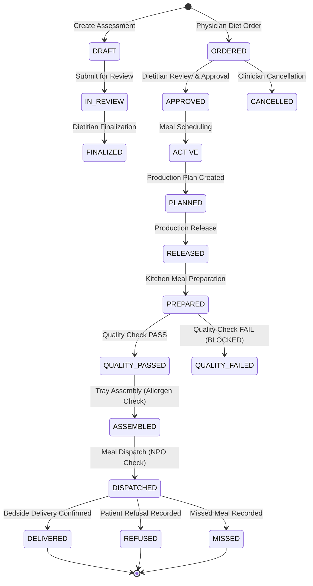

# DOC SEARCH — Phase 2.18 Dietary State Machine & Safety Gates

### Safety Gates:
1. **Clinical Allergen Safety Gate**: Incompatible diet containing known patient allergens is rejected immediately at order creation.
2. **Quality Inspection Gate**: Meals that fail temperature, texture, or visual quality checks are blocked from tray assembly.
3. **NPO Safety Gate**: Patients with active Nil Per Os orders are blocked at dispatch from receiving oral meal trays.
