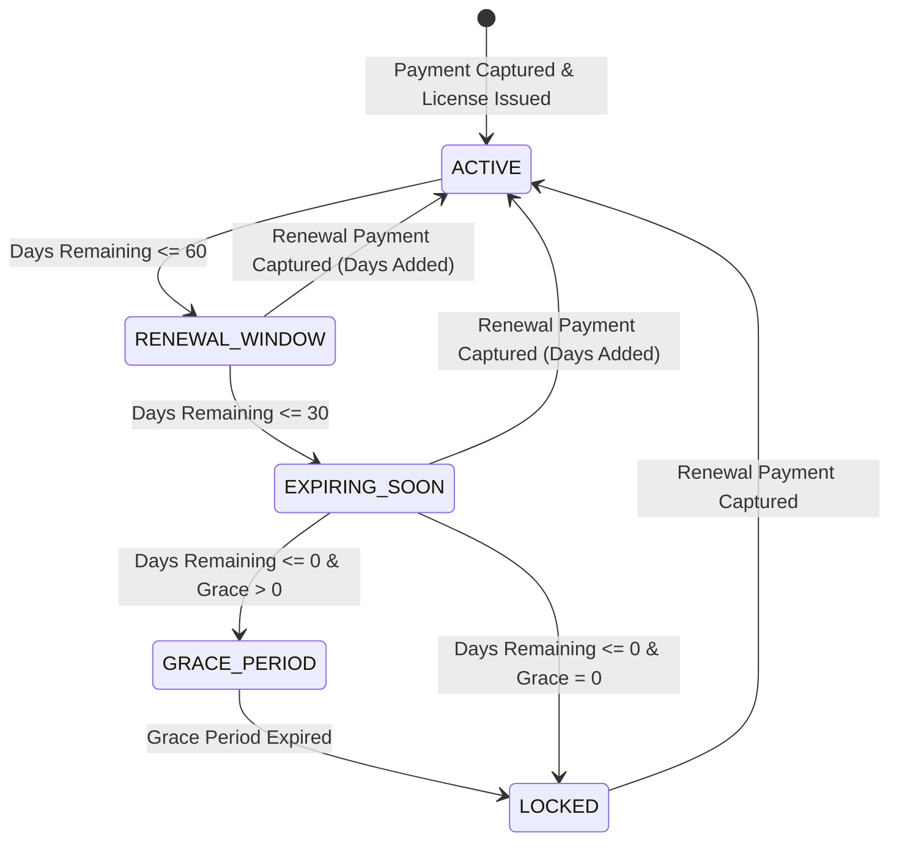

# DOC SEARCH Commercial, Partner, Plan, Subscription & License Business Rules Specification

## Document Status: AUTHORITATIVE & FROZEN
- **Version**: 1.0.0
- **Jurisdiction**: Republic of India (GST / SAC 998313 compliant)
- **Currency**: INR (₹)
- **Architecture Level**: Monorepo Core Standards & Enterprise Invariants

---

## 1. Executive Overview & Multi-Tenant Core Principles

DOC SEARCH is a unified, multi-tenant **Healthcare Operating System (Healthcare OS)** serving clinics, diagnostic centers, retail pharmacies, and multi-speciality hospital networks.

### Core Architectural Invariants:
1. **Isolated Multi-Tenancy**: Every partner facility operates within a strictly partitioned tenant boundary secured via PostgreSQL Row-Level Security (RLS) and schema isolation.
2. **Authoritative Server-Side Pricing**: Client applications (web/mobile) are strictly presentation layers. All pricing, discount schedules, backward GST derivations, and invoice calculations are computed server-side from immutable price version catalogs.
3. **Locked ≠ Deleted Invariant**: Subscription expiration or licensing suspension never deletes, purges, or degrades clinical, diagnostic, pharmacy, billing, or audit log records. Data remains 100% intact, read-only accessible under designated compliance conditions, and immediately restorable upon renewal.
4. **Active License Extension Invariant**: License renewals do NOT truncate, forfeit, or reset active unused days. If a license with 45 remaining days is renewed for 1 Year (365 days), the new expiration is exactly $45 + 365 = 410$ days from renewal date.
5. **Zero 1-Click Upgrade Bypasses**: Bypasses (e.g. unverified promotional plan switching) are permanently decommissioned with fail-closed HTTP 403 Forbidden. Commercial transitions require server-verified payment gateways (Razorpay) with HMAC-SHA256 signature verification.

---

## 2. Partner Types & Standard Commercial Plan Matrix

DOC SEARCH supports four primary partner categories under standardized annual plans:

| Partner Type | Plan Code | Product Tier | Standard Base Price (Annual, GST-Inclusive) | SAC Code | Primary Included Entitlements |
| :--- | :--- | :--- | :--- | :--- | :--- |
| **Pathology Lab** | `PLAN_PATHOLOGY_ANNUAL` | LIMS Standard | **₹6,000 / year** | 998313 | LIMS Analyzer Interfacing, Barcode Specimen Tracking, NABL Formats, Patient Portal, Up to 3 Analyzers |
| **Pharmacy** | `PLAN_PHARMACY_ANNUAL` | POS Standard | **₹6,000 / year** | 998313 | FEFO/Batch Inventory, Schedule H1/X Registers, Point of Sale, Barcode Billing, Supplier POs |
| **Solo Doctor / OPD Clinic** | `PLAN_CLINIC_ANNUAL` | Clinical Standard | **₹6,000 / year** | 998313 | Digital Rx, Appointment Scheduler, Patient EMR, OPD Billing, WhatsApp Notifications |
| **Multi-Speciality Hospital** | `PLAN_HOSPITAL_ANNUAL` | Enterprise Hospital | **₹20,000 / year** | 998313 | Full Hospital OS: IPD, OPD, OT, ICU, Nursing Stations, ER Triage, Emergency, Pharmacy, Lab, Radiology, Exit Hub, Cross-Department Billing |

> [!NOTE]
> All commercial base prices shown above are strictly **GST-inclusive** (18% GST).

---

## 3. Statutory GST Breakdown & Backward Calculation Engine

Under Indian GST regulations for cloud software as a service (SaaS), software hosting and IT infrastructure fall under Service Accounting Code **SAC 998313** at an 18% tax rate.

### 3.1 Mathematical Formulation
Because published commercial prices are inclusive of taxes, the backward calculation is computed as follows:

$$\text{Final Payable Amount} = \text{Annual Base Price} \times \text{Tenure (Years)} \times (1 - \text{Discount Rate})$$

$$\text{Taxable Base Amount} = \text{round}\left(\frac{\text{Final Payable Amount}}{1 + \text{Tax Rate}}\right) = \text{round}\left(\frac{\text{Final Payable Amount}}{1.18}\right)$$

$$\text{Total GST Amount} = \text{Final Payable Amount} - \text{Taxable Base Amount}$$

### 3.2 Place of Supply (POS) & Tax Split Rules
- **Intra-State Supply** ($\text{Partner State} = \text{Company State}$):
  $$\text{CGST} = \text{round}\left(\frac{\text{Total GST}}{2}\right), \quad \text{SGST} = \text{Total GST} - \text{CGST}, \quad \text{IGST} = 0$$
- **Inter-State Supply** ($\text{Partner State} \neq \text{Company State}$):
  $$\text{IGST} = \text{Total GST}, \quad \text{CGST} = 0, \quad \text{SGST} = 0$$

### 3.3 Reference Tax Schedules for Standard Plans (1-Year Tenure)

| Plan / Category | Gross Final (₹) | Taxable Base (₹) | CGST 9% (₹) | SGST 9% (₹) | IGST 18% (₹) |
| :--- | :--- | :--- | :--- | :--- | :--- |
| **Pathology (₹6,000)** | ₹6,000.00 | ₹5,084.75 | ₹457.63 | ₹457.62 | ₹915.25 |
| **Pharmacy (₹6,000)** | ₹6,000.00 | ₹5,084.75 | ₹457.63 | ₹457.62 | ₹915.25 |
| **Solo Doctor (₹6,000)** | ₹6,000.00 | ₹5,084.75 | ₹457.63 | ₹457.62 | ₹915.25 |
| **Hospital (₹20,000)** | ₹20,000.00 | ₹16,949.15 | ₹1,525.43 | ₹1,525.42 | ₹3,050.85 |

---

## 4. Approved Multi-Year Tenure Discounts

Partners selecting multi-year commitments receive approved tenure-based discounts:

| Tenure Commitment | Approved Discount % | Formula Factor | Example Hospital Plan (Gross ₹20,000/yr) | Example Standard Plan (Gross ₹6,000/yr) |
| :--- | :--- | :--- | :--- | :--- |
| **1 Year** | **0%** | $1.00$ | ₹20,000.00 | ₹6,000.00 |
| **2 Years** | **2%** | $0.98$ | ₹39,200.00 (Save ₹800) | ₹11,760.00 (Save ₹240) |
| **3 Years** | **10%** | $0.90$ | ₹54,000.00 (Save ₹6,000) | ₹16,200.00 (Save ₹1,800) |
| **5 Years** | **20%** | $0.80$ | ₹80,000.00 (Save ₹20,000) | ₹24,000.00 (Save ₹6,000) |

### Anti-Tamper Security Enforcement:
- Unlisted tenure durations (e.g. 0, 4, 6, 10 years) are strictly rejected with HTTP 400 Bad Request.
- `customDiscountPercent` parameters submitted by self-service partner checkouts are zeroed out by default. Only authenticated calls with `SUPER_ADMIN` or `COMPANY_ADMIN` roles can apply manual discretionary discounts.

---

## 5. Subscription Lifecycle, Renewal Windows & Expiry State Machine

### 5.1 License Lifecycle States


1. **`ACTIVE` ($> 60\text{ days remaining}$)**: Normal operational access across all provisioned modules.
2. **`RENEWAL_WINDOW` ($\le 60\text{ days remaining}$)**: System displays contextual renewal banner in partner portal. All operational features remain 100% active.
3. **`EXPIRING_SOON` ($\le 30\text{ days remaining}$)**: Critical daily countdown badge displayed in navigation bar and administrative dashboards.
4. **`GRACE_PERIOD`**: Optional configurable buffer (default: 0 to 7 days). System warns administrator on every session start.
5. **`LOCKED`**: Operational access suspended. Non-administrative staff cannot access OPD/IPD/Billing/Pharmacy/LIMS. Administrator sees full-screen Renewal Lockout Modal with 1-click Razorpay payment gateway checkout.

### 5.2 Preservation of Existing Days (Extension Invariant)
```
Case 1: Renewal while ACTIVE / RENEWAL_WINDOW / EXPIRING_SOON (e.g., Expiry = Dec 31, Today = Nov 15)
  Duration = 365 Days
  New Expiry Date = Existing Expiry Date + 365 Days (e.g., Dec 31 of following year)
  Unused Days Preserved: 100%

Case 2: Renewal while LOCKED (e.g., Expiry was Oct 1, Today = Nov 15)
  Duration = 365 Days
  New Expiry Date = Payment Capture Date + 365 Days (e.g., Nov 15 of following year)
  Status: Restored to ACTIVE immediately
```

---

## 6. Payment Processing, Webhooks & Idempotency Pipeline

1. **Order Creation**:
   - Partner initiates checkout via `POST /api/v1/commercial/create-checkout-order`.
   - Backend freezes an authoritative `commercial_order_snapshots` record in PostgreSQL with an immutable SHA-256 calculation hash.
   - Razorpay Order is created using server-verified amount in paisa (`amountInPaisa = finalAmount * 100`).
2. **Server-Side Webhook Verification**:
   - Webhook received at `POST /api/v1/webhooks/razorpay/b2b-subscription`.
   - Validates `x-razorpay-signature` against `RAZORPAY_WEBHOOK_SECRET` using HMAC-SHA256 (`crypto.timingSafeEqual`).
   - Rejects unverified requests with HTTP 401 Unauthorized.
3. **Atomic Settlement & Idempotency Guarantee**:
   - Checks if `commercial_order_snapshots.status == 'PAID'`.
   - If already `PAID`, returns HTTP 200 with `{ isDuplicate: true }` and aborts further execution to prevent double-extending licenses.
   - If `PENDING`, inside a serializable PostgreSQL transaction:
     - Marks snapshot `PAID`.
     - Records payment in `company.payments`.
     - Issues B2B tax invoice in `company.invoices` with SAC 998313 line items.
     - Extends `company.subscriptions.endDate` and `renewalDate`.
     - Extends `company.licenses.expiryDate` and sets `status = 'ACTIVE'`.

---

## 7. Business Decisions Pending Approval

The following items are flagged for executive business review:

> [!IMPORTANT]
> - `BUSINESS RULE PENDING APPROVAL`: **Custom Partner Tiers** (e.g. Combined Pharmacy + Diagnostic Labs) currently require provisioning two distinct organization modules or onboarding under the Multi-Speciality Hospital tier. A future bundled "Diagnostic + Pharmacy Center" tier is pending product management pricing approval.
> - `BUSINESS RULE PENDING APPROVAL`: **Grace Period Duration**. Default grace period is currently set to 0 days (immediate lock at expiration), with optional manual override up to 7 days by Company Admins. Formal policy for automatic grace periods across specific tiers is pending commercial leadership sign-off.
