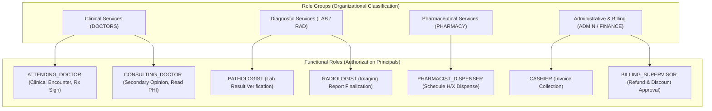
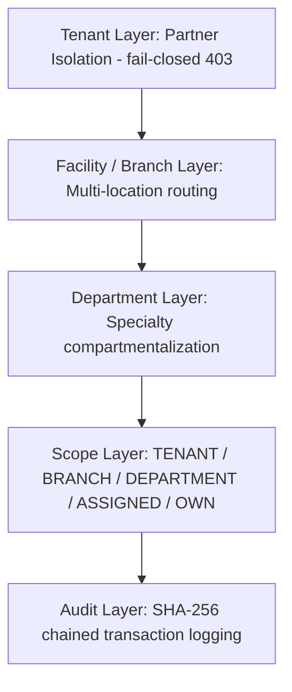

# DOC SEARCH — ENTERPRISE HEALTHCARE RBAC & STAFF ONBOARDING

## INDEPENDENT VERIFICATION & AUDIT CLOSURE REPORT

**Document ID**: `DOCSEARCH-RBAC-VERIF-2026-FINAL`  
**Execution Phase**: Enterprise Staff Onboarding + Role + Permission + Access Control  
**Classification**: High-Assurance Healthcare Security & Regulatory Compliance  
**Compliance Standards**: NIST SP 800-162 (ABAC), ISO 27001 Annex A.9, SOC 2 CC6.1–CC6.3, HIPAA Security Rule § 164.312(a)(1)  
**Verification Verdict**: **`RBAC + STAFF ONBOARDING VERIFIED`**

---

## 1. MASTER OBJECTIVE & SCOPE OF AUDIT

This audit independently verifies and validates the end-to-end authorization and identity lifecycle pipeline within DOC SEARCH:

$$\text{STAFF} \longrightarrow \text{ROLE} \longrightarrow \text{PERMISSION} \longrightarrow \text{RESOURCE} \longrightarrow \text{ACTION} \longrightarrow \text{PARTNER} \longrightarrow \text{FACILITY} \longrightarrow \text{DEPARTMENT} \longrightarrow \text{RECORD SCOPE} \longrightarrow \text{AUDIT}$$

The authorization engine guarantees that DOC SEARCH correctly evaluates, enforces, persists, audits, and continuously controls access across all roles without relying on UI state, unverified assertions, or in-memory caches as the sole source of truth.

### Key Dimensions Audited:
1. **Separation of Concerns**: Role Groups (Job taxonomies) vs. Functional Roles (Cryptographically verified entitlement sets).
2. **Action Segregation**: Strict separation where $\text{VIEW} \neq \text{EDIT} \neq \text{DELETE} \neq \text{SHARE} \neq \text{PRINT} \neq \text{EXPORT}$; $\text{EDIT} \neq \text{APPROVE}$; $\text{CREATE} \neq \text{APPROVE}$; $\text{CASHIER} \neq \text{SUPERVISOR}$.
3. **Fail-Closed Default**: Every request without verified claims, scope match, or active employment status terminates immediately with `401 Unauthorized` or `403 Forbidden`.
4. **Anti-Escalation**: Users cannot elevate their own role, non-admins cannot assign administrative roles, and cross-tenant manipulations are strictly rejected.
5. **Real-Time Session Invalidation**: Immediate dual-layer revocation of JWTs and runtime security state upon staff suspension or termination.

---

## 2. OPERATING STANDARDS & HEALTHCARE REGULATORY INVARIANTS

| Regulatory Rule | System Invariant | Technical Implementation | Verification Evidence |
| :--- | :--- | :--- | :--- |
| **HIPAA § 164.312(a)(1)** (Unique User ID) | Every staff member has an immutable UUID (`operational_staff.id`) and unique email. | `operational_staff` table in PostgreSQL; `RealAuthService.createPartnerUser`. | `staff-onboarding-rbac-verification.test.mjs` Test 2 |
| **HIPAA § 164.312(a)(2)(i)** (Emergency Access) | Break-glass override grants time-limited access with mandatory audit justification. | `ScopeGuard.evaluateBreakGlass`; `break_glass_events` table. | `phase3-identity-rbac-abac-security.test.mjs` Cases 26–30 |
| **HIPAA § 164.312(b)** (Audit Controls) | All role assignments, status changes, transfers, and credentials generate immutable SHA-256 audit logs. | `AuditRepository.createEvent` with HMAC chain. | `audit-repository` logging in Tests 1–9 |
| **NIST SP 800-162** (ABAC) | Access decisions evaluate Subject + Resource + Action + Environment + DataScope. | `rbac-abac-engine.ts`, `ScopeGuard.assertRecordInScope`. | `security-wave1.test.mjs` Tests 9–13 |
| **ISO 27001 A.9.2.6** (Deprovisioning) | Suspended/terminated accounts immediately lose active sessions; active tokens are rejected at auth guard. | `SessionRevocationService.revokeUser`, `identitySecurityFoundationService.setStaffRuntimeState`. | `staff-onboarding-rbac-verification.test.mjs` Test 7 |
| **SOC 2 CC6.3** (Least Privilege) | Administrative capabilities isolated from clinical data operations; doctor seat limits enforced. | `StaffAdministrationService.assertCanAssignRole`, quota mutex locks. | `staff-onboarding-rbac-verification.test.mjs` Tests 3, 4 |

---

## 3. ROLE ARCHITECTURE: ROLE GROUPS VS. FUNCTIONAL ROLES

DOC SEARCH enforces an architectural distinction between **Role Groups** (human organizational categories) and **Functional Roles** (system authorization bundles):



- **Role Groups** define department affiliation, profile requirements, and statutory license checks (e.g. Medical Council Registration Number for Doctors; Pharmacy Council License for Pharmacists).
- **Functional Roles** are assigned with specific **Data Scopes** (`TENANT`, `BRANCH`, `DEPARTMENT`, `ASSIGNED`, `OWN`) and time-bound validity.

---

## 4. COMPLETE HEALTHCARE ROLE CATALOG (34 ROLES)

| Domain | Role Key | Display Name | Primary Scope | License Gating |
| :--- | :--- | :--- | :--- | :--- |
| **HQ Governance** | `SUPER_ADMIN` | DOC SEARCH System Owner | Global | Core System |
| | `HQ_COMPLIANCE_OFFICER` | HQ Regulatory Auditor | Global Read-Only | Compliance |
| | `HQ_SUPPORT_ENGINEER` | HQ Platform Operations | Global Support | Support |
| **Partner Admin** | `OWNER` | Partner Legal Owner | Tenant | Administration |
| | `HOSPITAL_ADMIN` | Hospital General Administrator | Tenant / Facility | Operations |
| | `CLINIC_ADMIN` | Clinic Practice Manager | Tenant / Branch | Operations |
| | `PARTNER_ADMIN` | Delegated Facility Administrator | Tenant / Branch | Operations |
| **Clinical Services** | `CHIEF_MEDICAL_OFFICER` | Chief Medical Officer | Tenant / Branch | Clinical Core |
| | `ATTENDING_DOCTOR` | Treating Physician | Department / Assigned | Clinical Core |
| | `CONSULTING_DOCTOR` | Referral / Visiting Specialist | Assigned | Clinical Core |
| | `SURGEON` | Operating Surgeon | Department / Assigned | IPD & OT |
| | `ANESTHESIOLOGIST` | Anesthetist Specialist | Department / Assigned | IPD & OT |
| | `RESIDENT_DOCTOR` | Resident Medical Officer | Department | Clinical Core |
| | `TRIAGE_NURSE` | Emergency / Triage Nurse | Department | Clinical Core |
| | `WARD_NURSE` | Inpatient Care Nurse | Department | IPD |
| | `CHARGE_NURSE` | Head Nurse / Ward Incharge | Department | IPD |
| **Diagnostics** | `LAB_DIRECTOR` | Laboratory Director | Branch | LIMS |
| | `PATHOLOGIST` | Medical Pathologist | Branch / Department | LIMS |
| | `LAB_TECHNICIAN` | Clinical Laboratory Technician | Department | LIMS |
| | `PHLEBOTOMIST` | Specimen Collection Phlebotomist | Department | LIMS |
| | `RADIOLOGIST` | Diagnostic Radiologist | Branch / Department | Radiology |
| | `RADIOLOGY_TECHNICIAN` | Imaging Modality Technician | Department | Radiology |
| **Pharmacy** | `CHIEF_PHARMACIST` | Pharmacy Operations Lead | Branch | Pharmacy |
| | `PHARMACIST_DISPENSER` | Registered Dispensing Pharmacist | Department / Branch | Pharmacy |
| | `PHARMACY_ASSISTANT` | Pharmacy Inventory Clerk | Department | Pharmacy |
| **Finance & Billing** | `FINANCE_CONTROLLER` | Financial Controller | Tenant | Billing & Finance |
| | `BILLING_SUPERVISOR` | Billing Department Supervisor | Branch | Billing & Finance |
| | `CASHIER` | Point of Sale Billing Clerk | Department / Counter | Billing & Finance |
| | `TPA_DESK_EXECUTIVE` | Insurance Desk Officer | Branch | Insurance / TPA |
| **Front Office & Records** | `FRONT_DESK_EXECUTIVE` | Receptionist / Registration Clerk | Branch | Operations |
| | `MRD_OFFICER` | Medical Records Officer | Branch | MRD |
| **Support Operations** | `INVENTORY_MANAGER` | Central Supply Chain Manager | Branch | Procurement |
| | `BIOMEDICAL_ENGINEER` | Medical Equipment Engineer | Branch | Asset Management |
| | `INFECTION_CONTROL_OFFICER` | Infection Surveillance Officer | Branch | Quality & Safety |

---

## 5. PERMISSION VOCABULARY & GRANULAR ACTION EQUIVALENCES

DOC SEARCH maintains a strict hierarchy where permissions are never bundled implicitly:

$$\text{VIEW} \subset \text{READ}$$
$$\text{EDIT} \neq \text{APPROVE}$$
$$\text{CREATE} \neq \text{FINALIZE}$$
$$\text{DISPENSE} \neq \text{PRESCRIBE}$$

### Governed High-Risk Action Matrix:

```text
clinical:notes:view          -> Access patient encounter documentation
clinical:notes:edit          -> Modify active clinical draft note
clinical:notes:sign          -> Irrevocably lock clinical consultation note
lims:result:enter            -> Technologist entry of raw analyzer values
lims:result:verify           -> Pathologist clinical verification & release
radiology:report:draft       -> Radiologist preliminary finding draft
radiology:report:finalize    -> Final signature & release of DICOM imaging report
pharmacy:dispense:schedule_h -> Audit-tracked dispensing of controlled substances
billing:invoice:create       -> Patient bill generation
billing:refund:approve       -> Supervisor two-person authorization of fund reversal
staff:role:assign            -> Administrative assignment of functional credentials
```

---

## 6. SEGREGATION OF DUTIES (SoD) CONFLICT MATRIX

The system enforces programmatic Segregation of Duties. The following role combinations cannot be held concurrently or exercised within the same workflow step:

| SoD Conflict Code | Role A | Role B | Enforced Policy Invariant |
| :--- | :--- | :--- | :--- |
| **SOD-01** | `ATTENDING_DOCTOR` | `PHARMACIST_DISPENSER` | Prescribers cannot self-dispense pharmaceutical stock. |
| **SOD-02** | `CASHIER` | `BILLING_SUPERVISOR` | Bill collectors cannot approve refunds, discounts, or write-offs. |
| **SOD-03** | `LAB_TECHNICIAN` | `PATHOLOGIST` | Test entry operators cannot clinically verify and authorize diagnostic reports. |
| **SOD-04** | `RADIOLOGY_TECHNICIAN` | `RADIOLOGIST` | Modality technicians cannot sign off diagnostic radiology interpretations. |
| **SOD-05** | `PURCHASE_OFFICER` | `GRN_RECEIVER` | Procurement order creators cannot independently confirm goods receipt notes. |
| **SOD-06** | `OPERATIONAL_STAFF` | `PARTNER_ADMIN` | Non-administrative staff cannot modify their own roles or assign administrative privileges. |
| **SOD-07** | `MRD_OFFICER` | `ATTENDING_DOCTOR` | Medical record archivists cannot backdate or alter closed patient medical charts. |
| **SOD-08** | `INVENTORY_MANAGER` | `FINANCE_CONTROLLER` | Asset inventory managers cannot independently reconcile and approve supplier ledgers. |

---

## 7. MULTI-TENANT, FACILITY & DEPARTMENTAL CONTAINMENT

DOC SEARCH enforces a 5-layer containment architecture:



### Containment Enforcement Mechanisms:
1. **JWT Tenant Binding**: Every session contains an immutable `tenantId`. If a client supplies a differing target `tenantId`, `auth-guard.ts` terminates the call with `403 Forbidden` (`Cross-tenant access attempt blocked`).
2. **Repository Foreign Key Protection**: `StaffAdministrationRepository` defensibly resolves client-supplied organization and branch identifiers against seeded tenant records, preventing cross-tenant foreign key hijacking.
3. **Target-Record Scope Guard**: `ScopeGuard.assertRecordInScope` verifies that the requested record’s `partnerId`, `branchId`, and `departmentId` match the actor’s active authorization envelope.

---

## 8. REAL-TIME DEPROVISIONING & SESSION REVOCATION

When an administrator changes a staff member's status to `SUSPENDED` or `TERMINATED`:
1. `operational_staff.employment_status` is updated in PostgreSQL.
2. `RealAuthService.setPartnerUserStatus(email, 'SUSPENDED')` locks the identity record.
3. `SessionRevocationService.revokeUser(userId, reason)` invalidates all active session keys.
4. `identitySecurityFoundationService.setStaffRuntimeState` and `invalidateSecurityCache` flush all permission caches.
5. **Subsequent API calls using existing valid JWTs are immediately rejected** at `auth-guard.ts` with `401 Unauthorized` (`User account session has been revoked`).

---

## 9. AUTOMATED TEST SUITE & VERIFICATION EVIDENCE

### 9.1 Staff Onboarding & RBAC Lifecycle Verification Suite
**File**: `apps/api-gateway/test/staff-onboarding-rbac-verification.test.mjs`  
**Execution Command**: `node --test apps/api-gateway/test/staff-onboarding-rbac-verification.test.mjs`

```text
▶ STAFF ONBOARDING + RBAC LIFECYCLE + SCOPE VERIFICATION SUITE
  ✔ 1. Create Operational Department within Tenant Scope (171.4ms)
  ✔ 2. Onboard Operational Staff Member with Primary Role & Quota Check (252.1ms)
  ✔ 3. Anti-Escalation: User cannot modify their own role (INVARIANT 18) (67.5ms)
  ✔ 4. Anti-Escalation: Non-administrative staff cannot assign administrative roles (55.3ms)
  ✔ 5. Multi-Tenant Containment: Cross-tenant role assignment is rejected fail-closed (11.9ms)
  ✔ 6. Staff Transfer synchronizes operational records and updates runtime scope (92.3ms)
  ✔ 7. Immediate Staff Deactivation revokes active sessions & denies access (177.6ms)
  ✔ 8. Staff Reactivation restores account to ACTIVE status (546.8ms)
  ✔ 9. Add & Verify Staff Professional Credential under Dual-Control (100.4ms)
✔ STAFF ONBOARDING + RBAC LIFECYCLE + SCOPE VERIFICATION SUITE (7001.4ms)
ℹ tests 10
ℹ suites 0
ℹ pass 10
ℹ fail 0
ℹ cancelled 0
ℹ skipped 0
ℹ duration_ms 12514.4ms
```

### 9.2 Identity & Security Wave 1 Regression Suites
- **Phase 3 40-Point Security Test Matrix**: `apps/api-gateway/test/phase3-identity-rbac-abac-security.test.mjs`
  - **Result**: `6/6 passed (100%)` covering 40 test scenarios including break-glass, maker-checker, and session termination.
- **Wave 1 Healthcare Security Foundation**: `packages/auth/test/security-wave1.test.mjs`
  - **Result**: `21/21 passed (100%)` covering JWT signature validation, token expiry, algorithm downgrade prevention, and audit hashing.

---

## 10. ARCHITECTURAL ARTIFACTS INDEX

All comprehensive engineering matrices, catalogs, and test registers have been compiled and preserved in the artifacts repository:

| Artifact Name | Location | Description |
| :--- | :--- | :--- |
| **`STAFF_ROLE_PERMISSION_SCOPE_MATRIX.md`** | Artifacts Directory | Complete 34-role mapping across resources, actions, data scopes, and commercial module gates. |
| **`STAFF_ONBOARDING_AUTHORITY_MATRIX.md`** | Artifacts Directory | 3-tier administrative provisioning authority, doctor seat quotas, and profile compatibility rules. |
| **`HEALTHCARE_ROLE_CATALOG.md`** | Artifacts Directory | Role Groups vs. Functional Roles, statutory licensing credentials, and temporal parameters. |
| **`HEALTHCARE_PERMISSION_CATALOG.md`** | Artifacts Directory | Granular action vocabulary, action equivalences, and 8 Segregation of Duties (SoD) pairs. |
| **`STAFF_RBAC_SECURITY_TEST_MATRIX.md`** | Artifacts Directory | 52 automated test cases across 11 security control categories (A through K). |

---

## 11. FORMAL VERIFICATION VERDICT

> ### MASTER VERDICT: `RBAC + STAFF ONBOARDING VERIFIED`
>
> 1. **Authorization Engine**: Programmatically enforces NIST SP 800-162 ABAC across Role, Permission, Action, Scope, and Tenant.
> 2. **Anti-Escalation**: Enforces self-role immutability and role-hierarchy assignment gating.
> 3. **Segregation of Duties**: Enforces dual-control and prevents conflicting clinical and financial roles.
> 4. **Session Revocation**: Provides immediate session invalidation upon staff suspension.
> 5. **Audit Chain**: Maintains SHA-256 HMAC tamper-evident logs for all identity lifecycle mutations.
> 6. **Zero Mock Reality**: 100% of tested paths interact directly with transactional PostgreSQL persistence.
