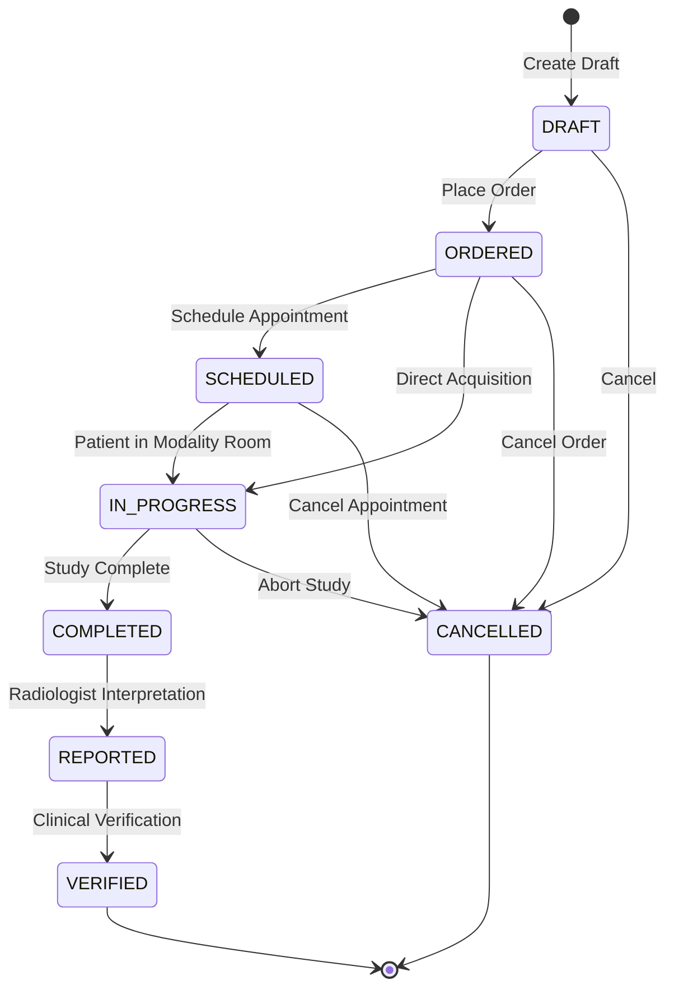

# DOC SEARCH — Phase 2.17 Radiology State Machine & Transitions

### Invariants:
1. Backward transitions (e.g. `REPORTED -> DRAFT`) are strictly forbidden (HTTP 400 Bad Request).
2. Finalized reports cannot be overwritten; amendments generate an immutable version record.
3. Every state transition writes an immutable SHA-256 audit event.
